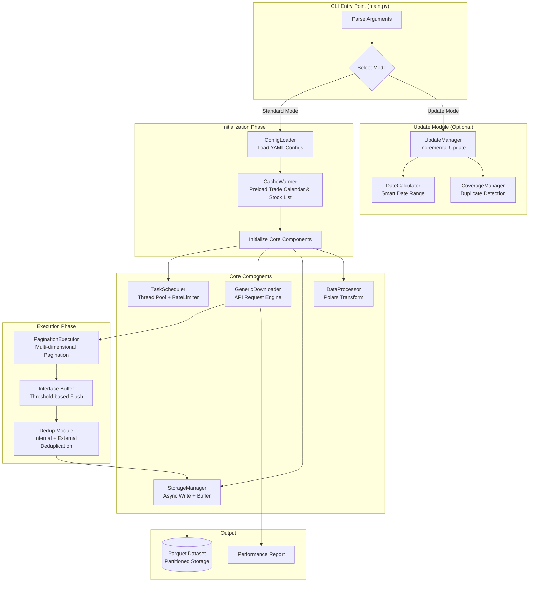
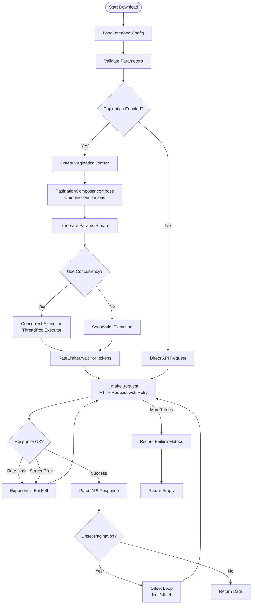
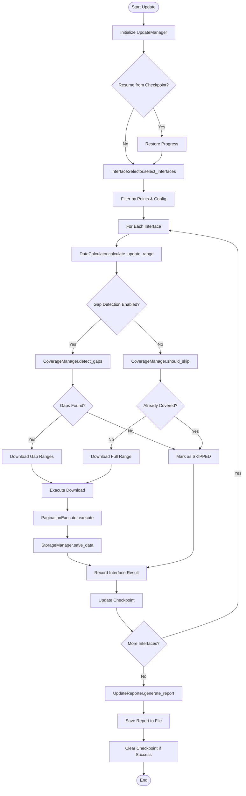
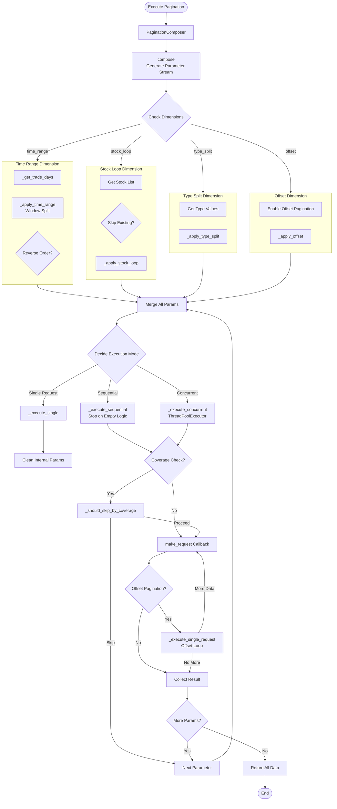
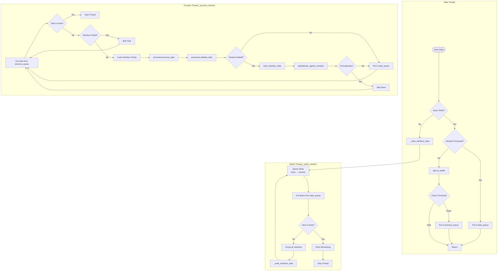
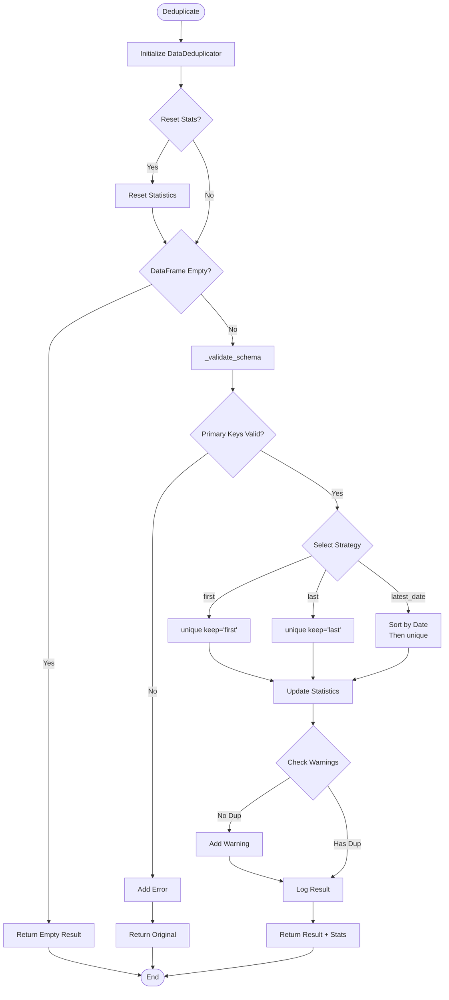
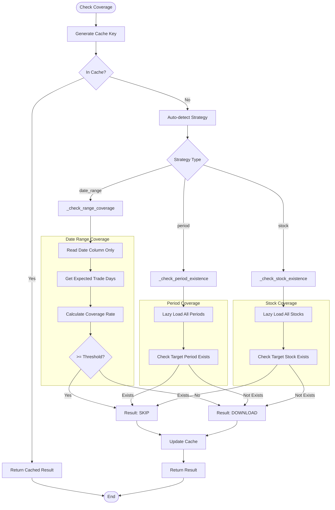

# CLAUDE.md

This file provides guidance to Claude Code (claude.ai/code) when working with code in this repository.

## Project Overview

aspipe_v4 is a comprehensive financial data pipeline system that downloads stock market data from TuShare API and stores it in Parquet format. The system now uses a modern configuration-driven architecture in the app4 directory:

**App4 Architecture (app4/)**: Modern configuration-driven approach with zero-code interface addition capability

The App4 architecture represents a paradigm shift from code-driven to configuration-driven data downloading, offering higher flexibility, stronger performance, and better maintainability.

## App4 Configuration-Driven Architecture

### Core Components

1. **Configuration Loader** (`app4/core/config_loader.py`)
   - Loads global settings and interface configurations from YAML files
   - Supports environment variable substitution with `${VAR}` syntax
   - Performs configuration validation and integrity checks

2. **Generic Downloader** (`app4/core/downloader.py`)
   - Universal download engine that processes any interface based on configuration
   - Implements multiple pagination strategies (offset, date_range, stock_loop, period_range, quarterly_range, periodic_range)
   - Features intelligent caching with trade calendar derivation strategy
   - Monitors performance metrics (request time, data size, retry count)
   - Includes performance monitoring system with request time, data size, and retry count tracking

3. **Task Scheduler** (`app4/core/scheduler.py`)
   - Manages thread pool for concurrent task execution
   - Implements token bucket algorithm for API rate limiting
   - Supports batch task submission with randomized delays

4. **Storage Manager** (`app4/core/storage.py`)
   - Asynchronous data persistence using producer-consumer pattern
   - Batch processing and append operations to existing parquet files
   - Thread-safe operations with queue management
   - Dataset-mode storage for efficient data access

5. **Data Processor** (`app4/core/processor.py`)
   - High-performance data validation and transformation using Polars
   - Primary key processing and deduplication
   - Data quality checks and type conversion

6. **Schema Manager** (`app4/core/schema_manager.py`)
   - Pre-defined data type schemas to avoid runtime inference overhead
   - Optimized schemas for high-frequency financial data interfaces

7. **Coverage Manager** (`app4/core/coverage_manager.py`)
   - Implements duplicate detection to avoid redundant downloads
   - Supports multiple strategies: date_range, period, and stock-based detection
   - Uses memory caching for efficient coverage checks

8. **Performance Monitor** (`app4/core/performance_monitor.py`)
   - Tracks key metrics like request time, record count, success rate
   - Provides P50/P90/P99 percentiles for performance analysis
   - Generates detailed performance reports

### Configuration Structure

#### Global Configuration (`app4/config/settings.yaml`)
```yaml
app:
  name: "aspipe_v4"
  version: "4.0.0"

tushare:
  token: "${TUSHARE_TOKEN}"
  base_url: "http://api.tushare.pro"
  points_thresholds: # 积分权限映射
    basic: 120
    standard: 2000
    advanced: 5000
    professional: 8000

concurrency:
  max_workers: 4  # [修改] 从 8 改为 4
  max_queue_size: 1000

request:
  max_retries: 3
  retry_delay: 1.0
  timeout: 30

cache:
  directory: "cache"
  ttl_hours: 24
  max_size_gb: 10

storage:
  base_dir: "../data"  # [修改] 从 "data" 改为 "../data"
  format: "parquet"
  batch_size: 10000  # [优化] 从 1000 增大到 10000

logging:
  level: "INFO"
  file: "log/app4.log"
  max_size_mb: 100
  backup_count: 5

groups:
  tscode_historical:
    - "stk_rewards"
    - "top10_holders"
    - "pledge_detail"
    - "fina_audit"
    - "top10_floatholders"
    - "stk_holdertrade"
  holders:
    - "top10_holders"
    - "top10_floatholders"
    - "stk_rewards"
    - "pledge_detail"
    - "fina_audit"
    - "stk_holdertrade"
  daily:
    - "daily"
    - "daily_basic"
    - "adj_factor"
    - "moneyflow"
  financial:
    - "income"
    - "balancesheet"
    - "cashflow"
    - "fina_indicator"
    - "fina_audit"
    - "fina_mainbz"
  basic:
    - "stock_basic"
    - "trade_cal"
    - "namechange"
    - "stock_company"
```

#### Interface Configuration (`app4/config/interfaces/*.yaml`)
Each interface has its own YAML configuration defining:
- API metadata (name, description, permissions)
- Request parameters and validation rules
- Pagination strategy and parameters
- Output schema and primary keys
- Rate limiting and caching settings
- Data type optimizations using derived fields

Example interface configuration:
```yaml
name: daily
api_name: daily
description: "日线行情"

permissions:
  min_points: 0
  rate_limit: 500  # [修改] 提高速率限制
  query_limit: 5000

pagination:
  enabled: true
  mode: "date_range"
  window_size_days: 365

parameters:
  ts_code:
    type: string
    required: false
    description: "证券代码"
  start_date:
    type: string
    required: true
    description: "开始日期"
  end_date:
    type: string
    required: true
    description: "结束日期"

output:
  primary_key: ["ts_code", "trade_date"]
  sort_by: ["trade_date"]

# 统一的去重配置
dedup_enabled: true

# 新增：衍生字段配置
derived_fields:
  trade_date_dt:    # 衍生字段名称
    source: trade_date    # 源字段
    type: date    # 转换类型
    format: '%Y%m%d'    # 日期格式
    description: "日期类型的trade_date"
```

### Key Features

1. **Zero-Code Interface Addition**: New interfaces can be added by simply creating YAML configuration files
2. **Declarative Configuration**: All interface behavior defined in configuration files
3. **Flexible Pagination**: Multiple pagination modes to handle different API behaviors
4. **Asynchronous Storage**: Non-blocking I/O operations for improved throughput
5. **Intelligent Caching**: Trade calendar derivation strategy for optimal cache utilization
6. **Performance Monitoring**: Real-time tracking of key metrics with detailed reporting
7. **Backward Compatibility**: Maintains compatibility with legacy CLI parameters
8. **High Concurrency**: Thread-pool based concurrent processing
9. **Rate Limit Protection**: Token bucket algorithm prevents API throttling
10. **Type Safety**: Comprehensive parameter validation and type checking
11. **Coverage Management**: Intelligent duplicate detection to avoid redundant downloads
12. **Memory-Efficient Caching**: Runtime cache for frequently accessed data
13. **Dataset-Mode Storage**: Efficient storage using Parquet dataset format
14. **Quarterly and Periodic Range Pagination**: Support for financial data with period_range, quarterly_range, and periodic_range pagination modes
15. **Broker Recommendation Handling**: Special handling for broker_recommend interface with month-based requests
16. **Unified De-duplication**: Consistent de-duplication using primary_key and dedup_enabled configuration

### System Architecture Flow



### Data Download Flow



### Incremental Update Flow



### Pagination Execution Flow



### Storage Management Flow



### Data Deduplication Flow



### Coverage Detection Flow



### Interface Groups

App4 organizes interfaces into logical groups for easier management:
- **daily**: Daily market data (daily, daily_basic, adj_factor, moneyflow)
- **financial**: Financial statements (income, balancesheet, cashflow, fina_indicator, fina_audit, fina_mainbz)
- **holders**: Shareholder data (top10_holders, top10_floatholders, stk_rewards, pledge_detail, stk_holdertrade)
- **market**: Market indicators (moneyflow, cyq_chips, stk_factor, moneyflow_ind_dc, moneyflow_cnt_ths)
- **basic**: Basic information (stock_basic, trade_cal, namechange, stock_company)
- **tscode_historical**: Interfaces requiring stock code loops (stk_rewards, top10_holders, pledge_detail, fina_audit, top10_floatholders, stk_holdertrade)

## Development Commands

### Environment Setup
```bash
# Install dependencies
pip install -r requirements.txt

# Set up environment variables in .env file:
# tushare_token=your_token
# tushare_points=your_points
# tushare2_token=secondary_token (optional)
# tushare2_points=secondary_points (optional)
```

### Running the System

#### App4 (Recommended - Configuration-Driven)
```bash
# Basic usage - download all available interfaces
python app4/main.py --start_date 20230101 --end_date 20231231

# Download specific interface
python app4/main.py --start_date 20230101 --end_date 20231231 --interface daily

# Download interface group
python app4/main.py --start_date 20230101 --end_date 20231231 --group financial

# Set concurrency level
python app4/main.py --concurrency 4  # [修改] 默认并发数从 8 改为 4

# Set log level
python app4/main.py --log-level DEBUG

# List available interfaces
python app4/main.py --list-interfaces

# Check interface configuration
python app4/main.py --show-config daily

# Download with ts_code specified
python app4/main.py --start_date 20230101 --end_date 20231231 --interface daily --ts_code 000001.SZ

# Download stock loop interfaces (holders data)
python app4/main.py --holders-data

# Download pro_bar data only
python app4/main.py --pro-bar-only

# Download full historical data for stock loop interfaces
python app4/main.py --tscode-historical

# Force overwrite existing data
python app4/main.py --start_date 20230101 --end_date 20231231 --interface daily --force

# Incremental mode - only download missing time periods
python app4/main.py --start_date 20230101 --end_date 20231231 --interface daily --incremental
```

### Development Tasks
```bash
# To check available interfaces for your score level:
python -c "from score_config import get_available_data_types; from config import TUSHARE_POINTS; print(get_available_data_types(TUSHARE_POINTS))"

# Generate performance report
python -m pytest test/test_app4_integration.py

# Add new interface (create new YAML in app4/config/interfaces/)
```

### Testing Commands
```bash
# App4 specific tests
python -m pytest test/test_app4_config_loader.py -v
python -m pytest test/test_app4_downloader.py -v
python -m pytest test/test_app4_integration.py -v

# All tests
python -m pytest test/ -v
```

## File Structure

```
aspipe_v4/
├── app4/                  # Modern configuration-driven architecture (Recommended)
│   ├── __init__.py        # Package initialization with version info
│   ├── README.md          # Detailed App4 design documentation
│   ├── main.py            # CLI entry point with enhanced features
│   ├── core/              # Core components
│   │   ├── __init__.py
│   │   ├── config_loader.py    # YAML configuration loader
│   │   ├── downloader.py       # Universal download engine with performance monitoring
│   │   ├── processor.py        # Data processing with Polars
│   │   ├── storage.py          # Asynchronous storage manager with dataset mode
│   │   ├── cache_manager.py    # Intelligent cache management
│   │   ├── scheduler.py        # Task scheduler with rate limiting
│   │   ├── schema_manager.py   # Pre-defined data schemas
│   │   ├── coverage_manager.py # Duplicate detection and coverage management
│   │   └── performance_monitor.py # Performance tracking and reporting
│   ├── config/            # Configuration files
│   │   ├── settings.yaml  # Global settings and defaults
│   │   └── interfaces/    # Interface definitions (40+ YAML files)
│   │       ├── daily.yaml
│   │       ├── stock_basic.yaml
│   │       ├── income.yaml
│   │       ├── balancesheet.yaml
│   │       ├── cashflow.yaml
│   │       ├── top10_holders.yaml
│   │       ├── stk_rewards.yaml
│   │       ├── pledge_detail.yaml
│   │       ├── fina_audit.yaml
│   │       ├── moneyflow.yaml
│   │       ├── trade_cal.yaml
│   │       ├── pro_bar.yaml
│   │       └── ... (30+ more interfaces)
│   ├── requirements.txt   # App4 specific dependencies
│   └── utils/             # Utility functions (currently empty)
├── test/                  # Test scripts
├── data/                  # Output directory for downloaded data
├── cache/                 # Temporary cache files
├── log/                   # Log files
├── requirements.txt       # Main dependencies
├── .env                   # Environment variables
└── p/                     # Documentation
```

## Data Categories by Score Level

- **120+ points**: Basic info (trade_cal) - now with HIGH priority and batch download strategy
- **2000+ points**: Stock basics, daily data, financial statements, holders, events, moneyflow - HIGH priority interfaces
- **3000+ points**: ST stock lists and additional holder data - MEDIUM priority interfaces
- **5000+ points**: Advanced data (cyq_chips, cyq_perf, stk_factor), advanced funds flow, and all financial VIP APIs - MEDIUM to LOW priority
- **8000+ points**: Advanced research data - LOW priority interfaces

## Development Notes

### App4 Architecture Benefits
- **Zero-code extensibility**: Add interfaces without writing code
- **Declarative configuration**: All behavior defined in YAML files
- **Type safety**: Comprehensive parameter validation
- **High performance**: Polars for data processing, async I/O
- **Intelligent caching**: Trade calendar derivation strategy
- **Production ready**: Comprehensive error handling and monitoring
- **Coverage management**: Avoid redundant downloads with duplicate detection
- **Memory-efficient**: Runtime caching for frequently accessed data
- **Dataset storage**: Efficient data access using Parquet dataset format
- **Unified de-duplication**: Consistent de-duplication using primary_key configuration
- **Performance reporting**: Detailed metrics and performance analysis

## Key Features

1. **Token Management**: Automatic token switching between primary and secondary tokens when rate limits are reached
2. **Rate Limiting**: Smart rate limiting with randomization to avoid API detection using token bucket algorithm
3. **Retry Mechanisms**: Comprehensive retry logic with configurable retry counts and exponential backoff
4. **Pagination**: Automatic pagination for large datasets with configurable batch sizes
5. **Data Validation**: Basic data validation and cleaning
6. **Caching**: Data caching with freshness checks and configurable TTL (Time To Live)
7. **Logging**: Comprehensive logging in Chinese with detailed progress tracking
8. **Parallel Processing**: Production-ready parallel download capabilities with task scheduling
9. **Producer-Consumer Pattern**: Efficient data pipeline with separate download and storage workers
10. **Enhanced Configuration**: Detailed interface settings including priority, retries, rate limits, concurrency, and caching
11. **Config Adapter Pattern**: Maintains compatibility between old and new configuration formats
12. **Concurrency Control**: Configurable concurrency levels per interface to optimize throughput within API limits
13. **API Parameter Configuration**: Interface-specific API parameters can be set in configuration
14. **Full History Download**: Specialized downloader for interfaces that require ts_code parameters, enabling bulk downloads of all historical data for all stocks
15. **Advanced Caching System**: Multi-layer caching with intelligent cache key generation, TTL management, and cache warming capabilities
16. **Enhanced Error Handling**: Improved retry mechanisms with exponential backoff and adaptive rate limiting
17. **Intelligent Cache Matching**: Can extract specific data from more general caches (e.g., single stock data from all-stock cache)
18. **Cache Preheating**: Proactive cache warming for frequently accessed data ranges
19. **Cache Monitoring**: Real-time tracking of cache hit rates and performance metrics
20. **Date Range Optimization**: Smart date range handling with overlap detection and merging
21. **Parameter Validation Framework**: Comprehensive parameter validation and normalization for all interfaces
22. **Configuration Backward Compatibility**: Seamless integration between old boolean config and new detailed interface config
23. **Historical Download Tracking**: Tracks completed historical downloads to avoid redundant processing
24. **Conditional Interface Management**: Automatically disables ts_code-dependent interfaces during date range downloads to prevent conflicts
25. **Parameter Adaptation System**: Interface-specific parameter validation and standardization through adapter pattern
26. **Batch Processing for TSCODE interfaces**: Efficient batch processing of ts_code-dependent interfaces for better performance
27. **Asynchronous Storage Operations**: Storage operations handled asynchronously to avoid blocking download threads
28. **Enhanced Interface Configuration**: Detailed settings for cache, API parameters, and concurrency controls
29. **App4 Configuration-Driven Architecture**: New architecture using configuration files for interface definitions, global settings, and performance parameters
30. **Advanced Data Validation**: Comprehensive data validation and deduplication with automatic detection and removal of duplicate records using (ts_code, trade_date) as unique keys
31. **Enhanced Network Retry Mechanism**: Smart retry strategy using HTTPAdapter with connection pooling, exponential backoff, and status-specific error handling (429, 500, 502, 503, 504)
32. **Optimized Cache Strategy**: Intelligent cache derivation system that preloads global trade calendars and derives date-range subsets to improve cache hit rates significantly
33. **Thread-Safe Operations**: Thread-safe cache operations with atomic writes to prevent data corruption during concurrent access
34. **Enhanced Error Handling**: Comprehensive error handling with graceful degradation and isolated failure handling for individual stock downloads
35. **Coverage Management**: Intelligent duplicate detection to avoid redundant downloads with multiple strategies (date_range, period, stock)
36. **Memory-Efficient Caching**: Runtime cache for frequently accessed data with thread-safe operations
37. **Dataset-Mode Storage**: Efficient storage using Parquet dataset format for better performance
38. **Quarterly and Periodic Range Pagination**: Support for financial data with period_range, quarterly_range, and periodic_range pagination modes
39. **Broker Recommendation Handling**: Special handling for broker recommendation data with month-based requests
40. **Unified Deduplication Configuration**: Consistent deduplication using primary_key + dedup_enabled configuration
41. **Performance Monitoring and Reporting**: Detailed metrics collection and reporting for system optimization