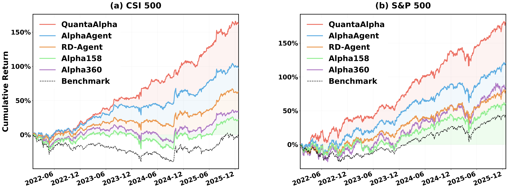
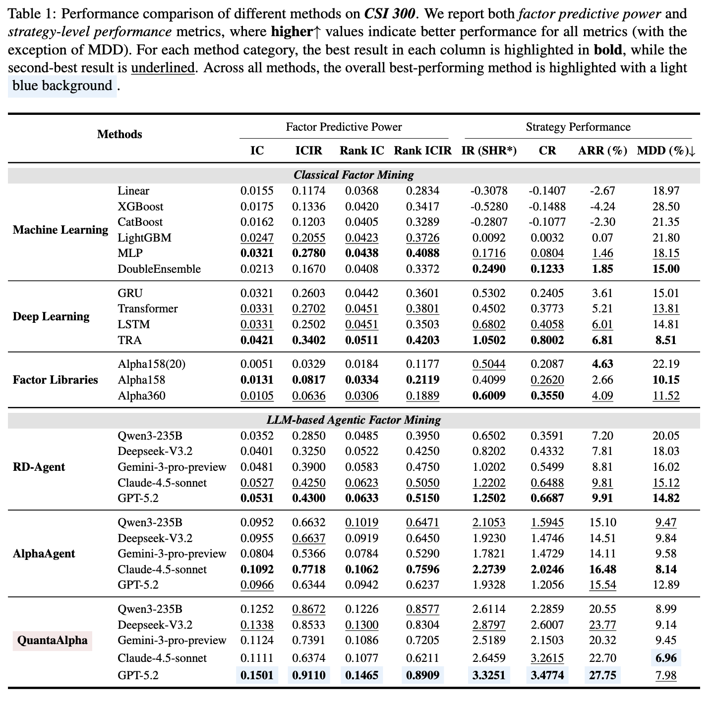

🌟 QuantaAlpha: LLM-Driven Self-Evolving Framework for Factor Mining

🧬 Achieving superior quantitative alpha through trajectory-based self-evolution with diversified planning initialization, trajectory-level evolution, and structured hypothesis-code constraint

---

## 🎯 Overview

**QuantaAlpha** transforms how you discover quantitative alpha factors by combining LLM intelligence with evolutionary strategies. Just describe your research direction, and watch as factors are automatically mined, evolved, and validated through self-evolving trajectories.

💬 Research Direction → 🧩 Diversified Planning → 🔄 Trajectory → ✅ Validated Alpha Factors

**Demo**: Below is a short demo of the full flow from research direction to factor mining and backtesting UI.

Your browser does not support the video tag.
[Watch the demo video](https://github.com/user-attachments/assets/726511ce-a384-4727-a7be-948a2cf05e4b).

▶ Click to play the QuantaAlpha end-to-end workflow demo.

---

## 📊 Performance

### 1. Factor Performance


CSI 300 factors transferred to CSI 500/S&P 500

### 2. Key Results

| Dimension | Metric | Performance |
| :---: | :---: | :---: |
| **Predictive Power** | Information Coefficient (IC) | **0.1501** |
| | Rank IC | **0.1465** |
| **Strategy Return** | Annualized Excess Return (ARR) | **27.75%** |
| | Max Drawdown (MDD) | **7.98%** |
| | Calmar Ratio (CR) | **3.4774** |



---

## 🚀 Quick Start

🔬 Experiments: paper reproduction settings & metric definitions — [English](experiment/README_EXPERIMENT.md) · [中文](experiment/README_EXPERIMENT_CN.md)

This repository is already vendored into `aspipe_v4`. The practical entrypoints in this workspace are:

- `quantaalpha mine` - Run factor mining experiments
- `quantaalpha backtest` - Run independent backtests
- `quantaalpha revalidate` - Revalidate existing factor libraries
- `quantaalpha health_check` - Environment health check
- `python -m quantaalpha.backtest.run_backtest` - Advanced backtest runner

The examples below assume you are inside `/home/quan/testdata/aspipe_v4/third_party/quantaalpha` and use the existing Conda environment:

```bash
conda activate mining
```

### 1. Install / Verify Environment

```bash
cd /home/quan/testdata/aspipe_v4/third_party/quantaalpha
SETUPTOOLS_SCM_PRETEND_VERSION=0.1.0 pip install -e .
pip install -r requirements.txt
```

Quick verification:

```bash
quantaalpha health_check
python -m compileall quantaalpha
```

### 2. Configure Environment

```bash
cp configs/.env.example .env
```

Edit `.env` with your settings:

```bash
# === Required: Data Paths ===
QLIB_DATA_DIR=/path/to/your/qlib/cn_data      # Qlib data directory
DATA_RESULTS_DIR=/path/to/your/results         # Output directory

# === Required: LLM API ===
OPENAI_API_KEY=your-api-key
OPENAI_BASE_URL=https://your-llm-provider/v1   # e.g. DashScope, OpenAI
CHAT_MODEL=deepseek-v3                         # or gpt-4, qwen-max, etc.
REASONING_MODEL=deepseek-v3
```

### 3. Prepare Data

QuantaAlpha requires two types of data: **Qlib market data** (for backtesting) and **pre-computed price-volume HDF5 files** (for factor mining). We provide all of them on HuggingFace for convenience.

> **Dataset**: [https://huggingface.co/datasets/QuantaAlpha/qlib_csi300](https://huggingface.co/datasets/QuantaAlpha/qlib_csi300)

| File | Description | Size | Usage |
| :--- | :--- | :--- | :--- |
| `cn_data.zip` | Qlib raw market data (A-share, 2016–2025) | 493 MB | Required for Qlib initialization & backtesting |
| `daily_pv.h5` | Pre-computed full price-volume data | 398 MB | Required for factor mining |
| `daily_pv_debug.h5` | Pre-computed debug subset (smaller) | 1.41 MB | Required for factor mining (debug/validation) |

> **Why provide HDF5 files?** The system can auto-generate `daily_pv.h5` from Qlib data on first run, but this process is very slow. Downloading pre-built HDF5 files saves significant time.

#### Step 1: Download

```bash
# Option A: Using huggingface-cli (recommended)
pip install huggingface_hub
huggingface-cli download QuantaAlpha/qlib_csi300 --repo-type dataset --local-dir ./hf_data

# Option B: Using wget
mkdir -p hf_data
wget -P hf_data https://huggingface.co/datasets/QuantaAlpha/qlib_csi300/resolve/main/cn_data.zip
wget -P hf_data https://huggingface.co/datasets/QuantaAlpha/qlib_csi300/resolve/main/daily_pv.h5
wget -P hf_data https://huggingface.co/datasets/QuantaAlpha/qlib_csi300/resolve/main/daily_pv_debug.h5
```

#### Step 2: Extract & Place Files

```bash
# 1. Extract Qlib data
unzip hf_data/cn_data.zip -d ./data/qlib

# 2. Place HDF5 files into the default data directories
mkdir -p git_ignore_folder/factor_implementation_source_data
mkdir -p git_ignore_folder/factor_implementation_source_data_debug

cp hf_data/daily_pv.h5       git_ignore_folder/factor_implementation_source_data/daily_pv.h5
cp hf_data/daily_pv_debug.h5  git_ignore_folder/factor_implementation_source_data_debug/daily_pv.h5
```

> **Note**: `daily_pv_debug.h5` must be renamed to `daily_pv.h5` when placed in the debug directory.

#### Step 3: Configure Paths in `.env`

```bash
# Point to the extracted Qlib data directory (must contain calendars/, features/, instruments/)
QLIB_DATA_DIR=./data/qlib/cn_data

# Output directory for experiment results
DATA_RESULTS_DIR=./data/results
```

The HDF5 data directories can also be customized via environment variables if you prefer a different location:

```bash
# Optional: override default HDF5 data paths
FACTOR_CoSTEER_DATA_FOLDER=/your/custom/path/factor_source_data
FACTOR_CoSTEER_DATA_FOLDER_DEBUG=/your/custom/path/factor_source_data_debug
```

### 4. Run Factor Mining

```bash
quantaalpha mine --help
./run.sh ""

# Example: Run with a research direction
./run.sh "Price-Volume Factor Mining"

# Example: Run with custom factor library suffix
./run.sh "Microstructure Factors" "exp_micro"
```

The experiment will automatically mine, evolve, and validate alpha factors, and save all discovered factors to `all_factors_library*.json`.

Common outputs:

- factor library JSON: `data/factorlib/all_factors_library*.json`
- backtest metrics: `data/results/backtest_v2_results/*_backtest_metrics.json`
- backtest summary: `data/results/backtest_v2_results/batch_summary.json`

### 5. Independent Backtesting

After mining, combine factors from the library for a full-period backtest:

```bash
# Backtest with custom factors only
python -m quantaalpha.backtest.run_backtest \
-c configs/backtest.yaml \
--factor-source custom \
--factor-json all_factors_library.json

# Combine with Alpha158(20) baseline factors
python -m quantaalpha.backtest.run_backtest \
-c configs/backtest.yaml \
--factor-source combined \
--factor-json all_factors_library.json

# Dry run (load factors only, skip backtest)
python -m quantaalpha.backtest.run_backtest \
-c configs/backtest.yaml \
--factor-source custom \
--factor-json all_factors_library.json \
--dry-run -v
```

Results are saved to the directory specified in `configs/backtest.yaml` (`experiment.output_dir`).

### 6. New Backtest Options In This Workspace

`configs/backtest.yaml` now supports two practical  for continuous factor research.

Stock universe filtering:

```yaml
data:
stock_filter:
enabled: true
exclude_markets: ["bj"]
exclude_st: true
min_list_days: 60
```

Multi-period validation:

```yaml
multi_period_validation:
enabled: true
fail_fast: true
periods:
- name: recent
train: ["2022-01-01", "2023-12-31"]
valid: ["2024-01-01", "2024-06-30"]
test: ["2024-07-01", "2025-03-13"]
- name: historical
train: ["2017-01-01", "2019-12-31"]
valid: ["2020-01-01", "2020-12-31"]
test: ["2021-01-01", "2021-12-31"]
```

When enabled, the runner writes:

- `metrics.multi_period_validation.period_results`
- `metrics.multi_period_validation.summary`
- `universe` metadata with filter rules and instrument counts

### 7. Revalidate Existing Factors

This workspace adds a lightweight `revalidate` CLI over the factor library schema.

```bash
quantaalpha revalidate data/factorlib/all_factors_library.json --dry_run
quantaalpha revalidate data/factorlib/all_factors_library.json --status active --no_write
quantaalpha revalidate data/factorlib/all_factors_library.json --days 30
quantaalpha revalidate data/factorlib/all_factors_library.json --factor_ids f1,f2
```

Current behavior is intentionally minimal:

- select candidates from the factor library
- reuse existing evaluation payloads
- update `evaluation.status`, `stability_score`, and related fields
- optionally skip writes with `--no_write`

### 8. Factor Library Schema

New factor entries and normalized legacy entries now expose:

```json
{
"evaluation": {
"status": "pending_validation",
"last_validated": null,
"stability_score": null,
"period_results": [],
"validation_summary": "",
"consecutive_failures": 0
},
"data_requirements": {
"dimensions": ["price_volume"],
"fields": ["$close", "$volume"]
}
}
```

This schema is consumed by:

- `quantaalpha.factors.library.FactorLibraryManager`
- `quantaalpha revalidate`
- evolution parent selection / routing helpers

> 📘 Need help? Check our comprehensive **[User Guide](docs/user_guide.md)** for advanced configuration, experiment reproduction, and detailed usage examples.

---

## 🏗️ Architecture Deep Dive

### Core Components

```
QuantaAlpha/
quantaalpha/
├── pipeline/                    # Main experiment workflow
│   ├── factor_mining.py         # Entry point for factor mining with evolution support
│   ├── loop.py                  # AlphaAgentLoop: Main experiment loop (5 steps)
│   ├── planning.py              # Diversified direction planning with LLM
│   ├── factor_backtest.py       # Integrated backtest within mining loop
│   └── evolution/               # Evolutionary exploration operators
│       ├── controller.py        # EvolutionController: orchestrates rounds
│       ├── trajectory.py        # StrategyTrajectory & TrajectoryPool
│       ├── mutation.py          # MutationOperator: orthogonal exploration
│       └── crossover.py         # CrossoverOperator: hybrid strategies
├── factors/                     # Factor lifecycle management
│   ├── coder/                   # Factor code generation & AST parsing
│   │   ├── factor.py            # Factor class definition
│   │   ├── expr_parser.py       # Expression parser for factor formulas
│   │   └── evaluators.py        # Factor evaluation utilities
│   ├── library.py               # FactorLibraryManager: unified JSON storage
│   ├── proposal.py              # Hypothesis proposal generation
│   ├── experiment.py            # QlibFactorExperiment orchestration
│   ├── feedback.py              # Feedback summarization
│   ├── runner.py                # Factor backtest runner
│   ├── status_rules.py          # Factor status management rules
│   └── regulator/               # Factor quality regulation
│       ├── consistency_checker.py
│       └── factor_regulator.py
├── backtest/                    # Independent backtest module (V2)
│   ├── run_backtest.py          # CLI entry point
│   ├── runner.py                # BacktestRunner with Qlib integration
│   ├── factor_loader.py         # Factor loading & preprocessing
│   ├── factor_calculator.py     # Factor value computation
│   ├── validation.py            # Multi-period validation
│   └── universe.py              # Stock universe filtering
├── llm/                         # LLM API client & configuration
│   ├── client.py                # LLM client with caching & retry logic
│   └── config.py                # LLM settings & timeout configuration
├── core/                        # Core abstractions
│   ├── developer.py             # Developer base class
│   ├── proposal.py              # Hypothesis & experiment classes
│   ├── evaluation.py            # Evaluation framework
│   └── scenario.py              # Scenario definition
├── app/                         # Application utilities
│   ├── utils/health_check.py    # Environment health checks
│   └── benchmark/               # Benchmark evaluation tools
└── cli.py                       # CLI entry point (fire-based)
configs/                         # Centralized configuration
├── experiment.yaml              # Main experiment parameters
├── backtest.yaml                # Backtest configuration
└── .env.example                 # Environment template
frontend-v2/                     # Web dashboard (React + FastAPI)
├── backend/app.py               # FastAPI backend server
└── src/                         # React frontend source
```

### Evolution Workflow

The evolution mechanism follows a structured cycle:

1. **Original Round**: Initial exploration in each planning direction
2. **Mutation Round**: Orthogonal exploration from parent trajectories
3. **Crossover Round**: Hybrid strategies combining multiple parents
4. **Repeat**: Continue mutation → crossover cycles

```yaml
# Evolution configuration (configs/experiment.yaml)
evolution:
enabled: true
mutation_enabled: true
crossover_enabled: true
max_rounds: 3
crossover_size: 2
crossover_n: 2
parent_selection_strategy: best  # best | random | weighted | top_percent_plus_random
```

### Factor Mining Loop

Each trajectory executes a 5-step loop:

1. **Propose**: Generate hypothesis based on research direction
2. **Construct**: Convert hypothesis to factor code
3. **Calculate**: Compute factor values
4. **Backtest**: Evaluate factor performance
5. **Feedback**: Summarize results and guide next iteration

### Quality Gates

The system includes multiple quality control mechanisms:

- **Consistency Check**: LLM verifies hypothesis-description-formula-expression alignment
- **Complexity Check**: Limits expression length and over-parameterization
- **Redundancy Check**: Prevents high correlation with existing factors

---

## 🖥️ Web Dashboard

QuantaAlpha provides a web-based dashboard where you can complete the entire workflow through a visual interface — no command line needed.

```bash
conda activate quantaalpha
cd frontend-v2
bash start.sh
# Visit http://localhost:3000
```

- **⚙️ Settings**: Configure LLM API, data paths, and experiment parameters directly in the UI
- **⛏️ Factor Mining**: Start experiments with natural language input and monitor progress in real-time
- **📚 Factor Library**: Browse, search, and filter all discovered factors with quality classifications
- **📈 Independent Backtest**: Select a factor library and run full-period backtests with visual results

---

## 🪟 Windows Deployment

QuantaAlpha is natively developed for Linux. Below is a guide to run it on **Windows 10/11**.

> For technical details, see [`docs/WINDOWS_COMPAT.md`](docs/WINDOWS_COMPAT.md).

### Key Differences from Linux

| Feature | Linux | Windows |
| :--- | :--- | :--- |
| Start mining | `./run.sh "direction"` | `python launcher.py mine --direction "direction"` |
| Start frontend | `bash start.sh` | Start backend & frontend separately (see below) |
| `.env` path format | `/home/user/data` | `C:/Users/user/data` (use forward slashes) |
| Extra config | None | Must set `CONDA_DEFAULT_ENV` (see below) |
| rdagent patches | None | Auto-applied (`quantaalpha/compat/rdagent_patches.py`) |

### Installation

```powershell
# 1. Install Miniconda (check "Add to PATH" during setup)
# 2. Create conda environment
conda create -n quantaalpha python=3.11 -y
conda activate quantaalpha

# 3. Clone and install
git clone https://github.com/QuantaAlpha/QuantaAlpha.git
cd QuantaAlpha
set SETUPTOOLS_SCM_PRETEND_VERSION=0.1.0
pip install -e .
```

### Configure `.env`

```powershell
copy configs\.env.example .env
```

Edit `.env` — use **forward slashes** for paths:

```bash
QLIB_DATA_DIR=C:/Users/yourname/path/to/cn_data
DATA_RESULTS_DIR=C:/Users/yourname/path/to/results
CONDA_ENV_NAME=quantaalpha
CONDA_DEFAULT_ENV=quantaalpha    # ← Required on Windows
```

### Run

```powershell
# Factor mining
python launcher.py mine --direction "price-volume factor mining"

# Standalone backtest
python -m quantaalpha.backtest.run_backtest -c configs/backtest.yaml --factor-source custom --factor-json data/factorlib/all_factors_library.json -v
```

### Web Frontend (Optional)

Requires Node.js (v18+). Start in two terminals:

```powershell
# Terminal 1 — Backend API
cd frontend-v2 && python backend/app.py

# Terminal 2 — Frontend
cd frontend-v2 && npm install && npm run dev
```

Visit http://localhost:3000.

### Troubleshooting

| Error | Fix |
| :--- | :--- |
| `CondaConf conda_env_name: Input should be a valid string` | Add `CONDA_DEFAULT_ENV=quantaalpha` to `.env` |
| `UnicodeEncodeError: 'gbk'` | Run `chcp 65001` or set `PYTHONIOENCODING=utf-8` |
| `Failed to resolve import "@radix-ui/react-hover-card"` | `cd frontend-v2 && npm install` |

---

## 📚 API Reference

### CLI Commands

| Command | Description | Example |
|---------|-------------|---------|
| `quantaalpha mine` | Run factor mining experiment | `quantaalpha mine --direction "momentum factors"` |
| `quantaalpha backtest` | Run independent backtest | `quantaalpha backtest -c configs/backtest.yaml` |
| `quantaalpha revalidate` | Revalidate factor library | `quantaalpha revalidate path/to/library.json` |
| `quantaalpha health_check` | Check environment | `quantaalpha health_check` |
| `quantaalpha collect_info` | Collect system info | `quantaalpha collect_info` |

### Python API

```python
from quantaalpha.factors.library import FactorLibraryManager
from quantaalpha.backtest.runner import BacktestRunner

# Load factor library
manager = FactorLibraryManager("path/to/library.json")
factors = manager.data["factors"]

# Run backtest
runner = BacktestRunner("configs/backtest.yaml")
runner.run(factor_source="custom", factor_json=["factors.json"])
```

---

## 💬 User Community

| WeChat Group |
| :---: |
|  |

---

## 🤝 Contributing

We welcome all forms of contributions to make QuantaAlpha better! Here's how you can get involved:

- **🐛 Bug Reports**: Found a bug? [Open an issue](https://github.com/QuantaAlpha/QuantaAlpha/issues) to help us fix it.
- **💡 Feature Requests**: Have a great idea? [Start a discussion](https://github.com/QuantaAlpha/QuantaAlpha/discussions) to suggest new features.
- **📝 Docs & Tutorials**: Improve documentation, add usage examples, or write tutorials.
- **🔧 Code Contributions**: Submit PRs for bug fixes, performance improvements, or new functionality.
- **🧬 New Factors**: Share high-quality factors discovered in your own runs to benefit the community.

---

## 🙏 Acknowledgments

Special thanks to:
- [Qlib](https://github.com/microsoft/qlib) - Quantitative investment platform by Microsoft
- [RD-Agent](https://github.com/microsoft/RD-Agent) - An automated R&D framework by Microsoft (NeurIPS 2025)
- [AlphaAgent](https://github.com/RndmVariableQ/AlphaAgent) - Multi-agent alpha factor mining framework (KDD 2025)

---

## 🌐 About QuantaAlpha
- QuantaAlpha was founded in **April 2025** by a team of professors, postdocs, PhDs, and master's students from **Tsinghua University, Peking University, CAS, CMU, HKUST**, and more.

In **2026**, we will continue to produce high-quality research in the following directions:

- **CodeAgent**: End-to-end autonomous execution of real-world tasks

- **DeepResearch**: Deep reasoning and retrieval-augmented intelligence

- **Agentic Reasoning / Agentic RL**: Agent-based reasoning and reinforcement learning

- **Self-evolution and collaborative learning**: Evolution and coordination of multi-agent systems

## 🌐 About AIFin Lab

Initiated by Professor Liwen Zhang from Shanghai University of Finance and Economics (SUFE), **AIFin Lab** is deeply rooted in the interdisciplinary fields of **AI + Finance, Statistics, and Data Science**. The team brings together cutting-edge scholars from top institutions such as SUFE, FDU, SEU, CMU, and CUHK. We are dedicated to building a comprehensive "full-link" system covering data, models, benchmarks, and intelligent prompting.

We look forward to hearing from you!

---

## 📖 Citation

If you find QuantaAlpha useful in your research, please cite our work:

```bibtex
@misc{han2026quantaalphaevolutionaryframeworkllmdriven,
title={QuantaAlpha: An Evolutionary Framework for LLM-Driven Alpha Mining},
author={Jun Han and Shuo Zhang and Wei Li and Zhi Yang and Yifan Dong and Tu Hu and Jialuo Yuan and Xiaomin Yu and Yumo Zhu and Fangqi Lou and Xin Guo and Zhaowei Liu and Tianyi Jiang and Ruichuan An and Jingping Liu and Biao Wu and Rongze Chen and Kunyi Wang and Yifan Wang and Sen Hu and Xinbing Kong and Liwen Zhang and Ronghao Chen and Huacan Wang},
year={2026},
eprint={2602.07085},
archivePrefix={arXiv},
primaryClass={q-fin.ST},
url={https://arxiv.org/abs/2602.07085},
}
```

---

## ⭐ Star History

[](https://www.star-history.com/#QuantaAlpha/QuantaAlpha&type=date&legend=top-left)

---

**⭐ If QuantaAlpha helps you, please give us a star!**

Made with ❤️ by the QuantaAlpha Team

