# App4 配置驱动架构 - 完整调用流程和设计文档

## 概述

App4 是 aspipe_v4 的配置驱动重构版本，采用基于 YAML 的接口定义系统。所有接口逻辑都在 YAML 配置文件中定义，由通用下载器根据配置执行下载任务。

## 完整调用流程架构

```mermaid
flowchart TD
    A[main.py CLI 入口点] --> B[解析 CLI 参数]
    B --> C[ConfigLoader 初始化]
    C --> D[加载全局配置 settings.yaml]
    C --> E[加载接口配置 config/interfaces/*.yaml]

    D --> F[初始化核心组件]
    E --> F

    F --> G[CacheManager 初始化]
    F --> H[TaskScheduler 初始化]
    F --> I[StorageManager 初始化]
    F --> J[DataProcessor 初始化]
    F --> K[GenericDownloader 初始化]

    G --> L[启动调度器]
    H --> L
    L --> M[启动存储写入线程]

    M --> N{确定要运行的接口}

    N --> O[CLI 参数映射]
    O --> O1[--pro-bar-only 接口='pro_bar']
    O --> O2[--holders-data 持有者组]
    O --> O3[--interface 特定接口]
    O --> O4[--group 特定组]
    O --> O5[默认所有可用接口]

    N --> P{检查下载模式}

    P --> Q[TSCODE 历史模式]
    P --> R[日期范围模式]

    Q --> S[包含 ts_code 依赖接口]
    S --> S1[stk_rewards, top10_holders, pledge_detail, fina_audit]

    R --> T[过滤 ts_code 依赖接口]
    T --> T1[日期范围下载时排除这些接口]

    O1 --> U[接口选择]
    O2 --> U
    O3 --> U
    O4 --> U
    O5 --> U
    S1 --> U
    T1 --> U

    U --> V[循环遍历每个接口]

    V --> W[从 ConfigLoader 获取接口配置]
    W --> X[检查 min_points 积分要求]
    X --> X1{积分充足?}
    X1 -->|否| Y[跳过接口]
    X1 -->|是| Z[准备请求参数]

    Z --> AA{检查分页模式}

    AA --> AB[stock_loop 模式]
    AA --> AC[date_range 模式]
    AA --> AD[offset 模式]
    AA --> AE[none 模式]

    AB --> AF[并发股票下载]
    AC --> AG[日期范围分页]
    AD --> AH[Offset 分页]
    AE --> AI[直接单次请求]

    AF --> AJ[从缓存获取股票列表]
    AJ --> AJ1{缓存命中?}
    AJ1 -->|否| AK[从 API 下载 stock_basic]
    AK --> AL[设置股票列表到缓存]
    AJ1 -->|是| AL

    AL --> AM[为每只股票构建任务列表]
    AM --> AN[run_concurrent_stock_download 函数]

    AN --> AO[TaskScheduler.submit_tasks 批量提交]
    AO --> AP[ThreadPoolExecutor 并行执行]
    AP --> AQ[每只股票的 download_single_stock]

    AQ --> AR[设置 stock_params 包含 ts_code]
    AR --> AS[设置日期范围 list_date 到当前日期]
    AS --> AT[download_single_stock 调用]

    AT --> AU[_execute_date_range_pagination]
    AU --> AV[获取交易日历]
    AV --> AV1[过滤交易日 is_open=1]
    AV1 --> AV2[分割为窗口 window_size_days]
    AV2 --> AV3[每个窗口下载数据]

    AV3 --> AW[每个窗口的 _make_request]
    AW --> AX[返回该股票的所有数据]

    AG --> AY[获取交易日历]
    AY --> AZ[过滤交易日 is_open=1]
    AZ --> BA[分割为窗口 window_size_days]
    BA --> BB[每个窗口下载数据]
    BB --> BC[每个窗口的 _make_request]
    BC --> BD[返回所有数据]

    AH --> BE[Offset=0]
    BE --> BF[使用 limit 和 offset 请求]
    BF --> BG{返回数 < limit?}
    BG -->|否| BH[Offset += limit]
    BH --> BF
    BG -->|是| BI[返回所有数据]

    AI --> BJ[_make_request 单次调用]
    BJ --> BK[返回数据]

    AX --> BL[收集所有股票的结果]
    BL --> BM[processor.process_data]
    BK --> BM
    BD --> BM
    BI --> BM

    BM --> BN[应用类型转换]
    BN --> BO[处理主键]
    BO --> BP[去重]
    BP --> BQ[数据清洗]

    BQ --> BR[验证数据质量]
    BR --> BR1[检查必填字段]
    BR1 --> BR2[检查主键重复]

    BQ --> BS[storage_manager.save_data async_write=true]
    BS --> BT[将数据排队异步写入]
    BT --> BU[存储写入线程消费队列]
    BU --> BV[_write_batch 按接口分组]
    BV --> BW[Polars DataFrame 创建]
    BW --> BX[追加到现有 Parquet 文件]
    BX --> BY[基于主键去重]

    Y --> V
    BY --> V

    subgraph "主入口点"
        A
        B
        C
        D
        E
    end

    subgraph "核心组件初始化"
        F
        G
        H
        I
        J
        K
        L
        M
    end

    subgraph "接口选择逻辑"
        N
        O
        P
        Q
        R
        S
        S1
        T
        T1
    end

    subgraph "下载执行循环"
        V
        W
        X
        X1
        Z
        AA
    end

    subgraph "分页策略"
        AB
        AC
        AD
        AE
    end

    subgraph "股票循环并发下载"
        AF
        AJ
        AJ1
        AK
        AL
        AM
        AN
        AO
        AP
        AQ
        AR
        AS
        AT
    end

    subgraph "日期范围分页"
        AU
        AV
        AV1
        AV2
        AV3
        AW
    end

    subgraph "Offset 分页"
        AH
        BE
        BF
        BG
        BH
        BI
    end

    subgraph "直接请求"
        AI
        BJ
        BK
    end

    subgraph "数据处理流水线"
        BM
        BN
        BO
        BP
        BQ
        BR
        BR1
        BR2
    end

    subgraph "异步存储系统"
        BS
        BT
        BU
        BV
        BW
        BX
        BY
    end
```



## 调用流程说明

### 初始化阶段

1. **main.py** 入口点从 `.env` 文件加载环境变量
2. 解析 CLI 参数，保持向后兼容性：
   - 传统参数：`--start_date`, `--end_date`, `--holders-data`, `--pro-bar-only`, `--tscode-historical`
   - 新参数：`--interface`, `--group`, `--concurrency`, `--log-level`
3. 设置日志配置（文件和控制台处理器）
4. 初始化 **ConfigLoader**：
   - 从 `config/settings.yaml` 加载全局设置
   - 从 `config/interfaces/*.yaml` 加载所有接口配置
   - 替换环境变量占位符（`${TUSHARE_TOKEN}` 等）
   - 验证配置完整性
5. 初始化 **CacheManager**：
   - 从全局配置设置缓存目录
   - 配置默认 TTL 和清理间隔
6. 初始化 **TaskScheduler**：
   - 使用配置中的 max_workers 创建 ThreadPoolExecutor
   - 设置任务队列和 max_queue_size
7. 初始化 **StorageManager**：
   - 设置存储目录和格式（parquet/csv）
   - 配置异步写入的批量大小
   - 启动写入线程进行异步存储
8. 初始化 **DataProcessor** 用于类型转换和验证
9. 初始化 **GenericDownloader**，传入 config_loader 和 cache_manager

### 接口选择阶段

1. **CLI 参数映射** 确定要运行的接口：
   - `--pro-bar-only`：设置 interfaces_to_run = `['pro_bar']`
   - `--holders-data`：从 settings.yaml 加载持有者组
   - `--interface`：使用特定接口名称
   - `--group`：从 settings.yaml 加载指定组
   - 默认：所有可用接口
2. **模式过滤** 基于下载类型：
   - `--tscode-historical`：包含 ts_code 依赖接口
   - 日期范围模式：排除需要 ts_code 参数的接口

### 下载执行阶段

对于选定列表中的每个接口：

1. **获取接口配置** 从 ConfigLoader
2. **检查积分要求**：
   - 比较配置中的 min_points 和实际用户积分（从环境变量）
   - 积分不足则跳过
3. **准备请求参数**：
   - 从 CLI 或默认值设置起始日期和结束日期
   - 特殊处理 `pro_bar`，根据股票列表日期自动设置日期范围
4. **确定分页模式**：
   - 从接口配置读取 `pagination.mode`
   - 选项：`stock_loop`, `date_range`, `offset`, `none`

#### Stock Loop 模式（并发逐股票下载）

1. **获取股票列表**：
   - 检查 cache_manager.get_stock_list()
   - 缓存未命中时从 `stock_basic` API 下载
   - 缓存股票列表
2. **构建任务列表**：
   - 为每只股票创建任务字典：
     ```python
     {
         'func': downloader.download_single_stock,
         'args': (interface_config, stock, base_params),
         'kwargs': {}
     }
     ```
3. **批量提交**：
   - 每次最多提交 100 个任务以避免内存问题
   - 使用 TaskScheduler.submit_tasks() 进行并行执行
4. **每股票执行**（download_single_stock）：
   - 将 ts_code 添加到参数
   - 设置日期范围：start_date = stock.list_date, end_date = 当前日期
   - 为该股票调用 _execute_date_range_pagination
5. **每股票的日期范围分页**：
   - 获取日期范围的交易日历
   - 过滤交易日（is_open=1）
   - 分割为窗口（默认 6000 天）
   - 每个窗口：使用窗口开始/结束日期发起 API 请求
   - 收集该股票的所有数据

#### Date Range 模式（单接口，基于日期的分页）

1. 获取请求日期范围的交易日历
2. 过滤交易日（is_open=1）
3. 分割为窗口（从配置读取 window_size_days）
4. 每个窗口：
   - 使用窗口开始/结束日期发起 API 请求
   - 累积所有数据

#### Offset 模式（传统的基于 offset 的分页）

1. 从 offset=0 开始
2. 使用 limit（从配置）和 offset 请求
3. 检查返回数量 < limit
   - 是：完成
   - 否：增加 offset 并重复

#### None 模式（单次请求）

1. 使用所有参数发起单次 API 请求
2. 直接返回数据

### 数据处理阶段

成功下载后（所有模式）：

1. **processor.process_data()**：
   - 将字典列表转换为 Pandas DataFrame
   - 基于 output.columns 配置应用类型转换：
     - date 字段：使用格式转换为 datetime
     - int 字段：转换为 Int64
     - float 字段：转换为 float
     - string 字段：转换为 string
   - 处理主键：检查存在性和唯一性
   - 基于主键去重（保留最后一条）
   - 数据清洗：填充 NaN，删除空行/列
2. **validate_data()**：
   - 检查缺失的必填字段
   - 基于主键统计重复记录数
   - 返回验证统计信息

### 存储阶段

1. **storage_manager.save_data()**：
   - 将 DataFrame 转换为字典列表
   - 如果 async_write=true，排队异步写入
2. **存储写入线程**（后台运行）：
   - 从队列消费数据
   - 批量聚合最多 batch_size 个项目
   - 按接口名称分组
   - 展平数据列表
   - 转换为 Polars DataFrame
   - 检查文件是否存在：
     - 是：读取现有数据，与新数据合并，基于主键去重
     - 否：创建新文件
   - 写入 parquet 文件

### 关闭阶段

1. 停止 TaskScheduler（关闭执行器，等待完成）
2. 停止 StorageManager（停止写入线程）
3. 记录完成消息

## 应用结构和核心组件

### 目录结构

```
app4/
├── config/
│   ├── settings.yaml           # 全局配置
│   └── interfaces/             # 接口定义
│       ├── daily.yaml         # 日线行情
│       ├── pro_bar.yaml       # 复权行情
│       ├── stock_basic.yaml   # 股票列表
│       ├── income.yaml        # 利润表
│       ├── balancesheet.yaml  # 资产负债表
│       ├── cashflow.yaml      # 现金流量表
│       └── ... (40+ 接口)
├── core/
│   ├── __init__.py
│   ├── config_loader.py       # YAML 配置加载
│   ├── downloader.py          # 通用下载引擎
│   ├── processor.py           # 数据处理和验证
│   ├── storage.py             # 异步存储管理
│   ├── cache_manager.py       # 缓存管理
│   └── scheduler.py           # 任务调度和限流
├── utils/                      # 工具函数
├── main.py                    # CLI 入口
├── requirements.txt
└── README.md
```

### 核心设计模式

#### 1. 配置驱动架构

- **文件**：`core/config_loader.py`
- **实现**：所有接口行为在 YAML 中定义
- **优势**：添加新接口无需代码更改，声明式配置

**配置结构**：
```yaml
# 1. 基础元数据
name: daily
api_name: daily
description: "日线行情"

# 2. 权限和限制
permissions:
  min_points: 0
  rate_limit: 120
  query_limit: 10000

# 3. 请求配置
request:
  method: POST
  extra_path: ""
  timeout: 30

# 4. 输入参数
parameters:
  ts_code:
    type: string
    required: false
  start_date:
    type: string
    required: false

# 5. 分页策略
pagination:
  enabled: true
  mode: "date_range"
  window_size_days: 365

# 6. 输出配置
output:
  primary_key: ["ts_code", "trade_date"]
  sort_by: ["trade_date"]
  columns:
    ts_code: {type: string, required: true}
    trade_date: {type: date, format: "%Y%m%d", required: true}
    open: {type: float}
```

#### 2. 通用下载器模式

- **文件**：`core/downloader.py`
- **实现**：单个下载器类基于配置处理所有接口
- **优势**：代码复用，行为一致，无需特定接口类

**下载流程**：
```python
def download(self, interface_name: str, params: Dict[str, Any]):
    # 1. 获取接口配置
    interface_config = config_loader.get_interface_config(interface_name)

    # 2. 检查缓存
    cache_key = _generate_cache_key(interface_name, params)
    cached_data = cache_manager.get(cache_key)
    if cached_data:
        return cached_data

    # 3. 验证参数
    validated_params = _validate_parameters(interface_config, params)

    # 4. 执行分页/循环
    all_data = _execute_pagination(interface_config, validated_params)

    # 5. 写入缓存
    if all_data:
        cache_manager.set(cache_key, all_data)

    return all_data
```

#### 3. 多策略分页系统

- **文件**：`core/downloader.py`
- **实现**：基于配置的四种分页模式
- **优势**：灵活处理不同的 API 行为

**分页模式**：

1. **stock_loop**：通过股票列表循环，并发执行
   - 用于：pro_bar, stk_rewards, top10_holders 等
   - 多只股票并行处理
   - 每只股票的日期范围分页

2. **date_range**：将日期范围分割为窗口
   - 用于：daily, trade_cal 等
   - 基于交易日历的窗口化
   - 窗口大小从配置读取

3. **offset**：传统的 offset/limit 分页
   - 用于：stock_basic, stock_company 等
   - 请求直到返回数 < limit

4. **none**：单次请求
   - 用于：静态数据查询

#### 4. 生产者-消费者存储模式

- **文件**：`core/storage.py`, `main.py`
- **实现**：使用专用写入线程的异步存储
- **优势**：下载和存储解耦，非阻塞下载

**存储流程**：
```python
# 生产者（在 main.py 中）
storage_manager.save_data(interface_name, df.to_dict('records'), async_write=True)

# 队列
data_queue = queue.Queue()

# 消费者（在 storage.py 中 - 写入线程）
def _writer_worker(self):
    while self.running:
        batch_data = []
        # 从队列获取最多 batch_size 个项目
        while len(batch_data) < self.batch_size:
            item = self.data_queue.get_nowait()
            batch_data.append(item)

        # 处理批次
        self._write_batch(batch_data)
```

#### 5. 线程池执行器模式

- **文件**：`core/scheduler.py`
- **实现**：用于并发任务执行的线程池
- **优势**：高效并行处理，受控并发

**任务提交**：
```python
# 单个任务
future = scheduler.submit_task(func, *args, **kwargs)

# 批量任务
futures = []
for task in tasks:
    future = executor.submit(func, args, kwargs)
    futures.append(future)

# 等待完成
results = [future.result() for future in as_completed(futures)]
```

#### 6. 限流器模式

- **文件**：`core/scheduler.py`
- **实现**：令牌桶算法
- **优势**：API 限流，防止节流

**令牌桶**：
```python
class RateLimiter:
    def __init__(self, rate_limit: int, time_window: int = 60):
        self.rate_limit = rate_limit
        self.tokens = rate_limit
        self.last_refill = time.time()

    def acquire(self, tokens: int = 1) -> bool:
        # 计算补充令牌
        elapsed = now - self.last_refill
        refill_tokens = int(elapsed * rate_limit / time_window)
        self.tokens = min(rate_limit, self.tokens + refill_tokens)

        # 检查可用性
        if self.tokens >= tokens:
            self.tokens -= tokens
            return True
        return False
```

#### 7. 数据处理流水线模式

- **文件**：`core/processor.py`
- **实现**：顺序处理阶段
- **优势**：一致的数据质量，类型安全

**处理阶段**：
1. 类型转换（date, int, float, string）
2. 主键处理
3. 去重
4. 数据清洗
5. 验证

#### 8. 环境变量替换模式

- **文件**：`core/config_loader.py`
- **实现**：配置中的递归变量替换
- **优势**：安全的凭据管理，部署灵活性

**变量替换**：
```python
pattern = r'\$\{([^}]+)\}'
def replacer(match):
    env_var = match.group(1)
    env_value = os.getenv(env_var)
    if env_value:
        return env_value
    return match.group(0)
```

### 核心类和职责

| 类 | 职责 |
|-------|----------------|
| `ConfigLoader` | 加载和验证 YAML 配置，环境变量替换 |
| `GenericDownloader` | 基于配置执行 API 请求，处理分页 |
| `CacheManager` | 带有 TTL 的缓存下载的数据，股票列表缓存 |
| `TaskScheduler` | 线程池管理，并发任务执行 |
| `RateLimiter` | 令牌桶限流 |
| `StorageManager` | 带有写入线程的异步存储，批量写入 |
| `DataProcessor` | 类型转换，验证，去重 |
| `main.py` | CLI 接口，组件编排 |

### 数据流架构

#### 完整数据流

```
CLI 参数
    ↓
ConfigLoader (加载 YAML)
    ↓
初始化组件
    ↓
确定接口
    ↓
[每个接口]
    ↓
检查权限
    ↓
选择分页策略
    ↓
执行下载
    ├── Stock Loop: 并发股票 → 每股票日期范围
    ├── Date Range: 交易日历 → 窗口 → 请求
    ├── Offset: 递增请求直到完成
    └── None: 单次请求
    ↓
收集结果
    ↓
DataProcessor
    ├── 类型转换
    ├── 主键处理
    ├── 去重
    ├── 数据清洗
    └── 验证
    ↓
StorageManager (异步队列)
    ↓
写入线程
    ├── 批次聚合
    ├── Polars DataFrame
    ├── 追加到现有文件
    └── 基于主键去重
```

### 配置系统

#### 全局配置 (settings.yaml)

- **app**：应用名称和版本
- **tushare**：API 令牌，URL，积分阈值
- **concurrency**：max_workers，max_queue_size
- **cache**：enabled，base_dir，default_ttl，max_size_gb
- **storage**：base_dir，format（parquet/csv），batch_size，async_write
- **logging**：level，file，max_size_mb，backup_count
- **groups**：接口组（holders，daily，financial，market_data 等）

#### 接口配置结构

`config/interfaces/` 中的每个 YAML 文件定义：

1. **基础元数据**：name，api_name，description
2. **权限**：min_points，rate_limit，query_limit
3. **请求配置**：method，extra_path，timeout
4. **输入参数**：type，required，default，options
5. **分页策略**：mode，window_size_days，limit_key，offset_key，default_limit
6. **输出配置**：primary_key，sort_by，columns（带类型和格式）

### 接口组

Settings.yaml 定义接口的逻辑组：

- **holders**：前十大股东、流通股东、股票奖励等
- **daily**：日线行情、pro_bar、交易日历
- **financial**：利润表、资产负债表、现金流量表、财务指标
- **market_data**：股票基础信息、公司信息、资金流向数据
- **analysis_factors**：股票因子、筹码分布、券商推荐
- **corporate_actions**：回购、分红

### 使用示例

#### CLI 使用

```bash
# 下载所有接口（日期范围模式）
python app4/main.py --start_date 20230101 --end_date 20231231

# 仅下载 pro_bar
python app4/main.py --start_date 20230101 --end_date 20231231 --pro-bar-only

# 下载持有者数据组
python app4/main.py --start_date 20230101 --end_date 20231231 --holders-data

# 下载特定接口
python app4/main.py --interface pro_bar --start_date 20230101 --end_date 20231231

# 下载接口组
python app4/main.py --group daily --start_date 20230101 --end_date 20231231

# 历史下载模式（包含 ts_code 依赖接口）
python app4/main.py --start_date 20230101 --end_date 20231231 --tscode-historical

# 自定义并发数
python app4/main.py --concurrency 16 --start_date 20230101 --end_date 20231231
```

#### 添加新接口

1. 在 `config/interfaces/` 中创建 YAML 文件（如 `new_interface.yaml`）
2. 按照模板定义接口结构
3. 无需 Python 代码更改
4. 立即可用 `--interface new_interface` 或添加到组中

### 核心特性和优势

#### 1. 零代码接口添加

只需创建 YAML 配置文件即可添加新接口。无需 Python 类或代码修改。

#### 2. 声明式配置

所有接口行为（参数、分页、输出模式、速率限制）都在 YAML 中声明，使其自文档化且易于维护。

#### 3. 灵活的分页策略

支持多种分页模式，可以在不更改代码的情况下处理不同的 API 行为：
- 逐股票并发处理
- 日期范围窗口化
- 传统 offset/limit
- 单次请求

#### 4. 异步存储

生产者-消费者模式确保下载不被 I/O 操作阻塞，提高吞吐量。

#### 5. 缓存系统

两级缓存：
- 带有 TTL 的 API 响应缓存
- 股票列表缓存（单例模式）

#### 6. 限流

令牌桶算法防止 API 节流，同时最大化吞吐量。

#### 7. 数据处理流水线

自动类型转换、验证和去重确保数据质量。

#### 8. 环境变量支持

配置中的环境变量替换实现安全的凭据管理。

#### 9. 向后兼容

保持与原始 aspipe_v4 CLI 参数的兼容性。

#### 10. 基于组的组织

接口可以逻辑分组用于批量操作。

### 性能优化

#### 1. 并发股票处理

对于 stock_loop 模式，多只股票使用 ThreadPoolExecutor 并行下载。

#### 2. 批量存储

存储操作批量化以最小化 I/O 开销。

#### 3. 智能缓存

通过缓存响应和股票列表避免冗余 API 调用。

#### 4. 速率感知下载

内置限流防止 API 节流，同时最大化利用率。

#### 5. 窗口化日期范围

大日期范围分割为可管理的窗口以优化 API 性能。

### 错误处理

- 优雅处理缺失的配置
- 失败请求的缓存回退
- 类型转换错误日志
- 重复记录检测和报告
- API 错误码检查

### 日志和监控

- 文件和控制台双重日志
- 可配置的日志级别
- 详细的进度报告（如 "Processed stock XXX (100/5000)"）
- 验证结果报告
- 存储统计信息

### 兼容性

- **Python 版本**：3.7+
- **存储格式**：Parquet（默认）、CSV
- **API**：TuShare Pro API
- **数据格式**：Pandas/Polars DataFrame

### 未来增强

潜在的改进领域：

1. **配置验证**：更全面的 YAML 配置架构验证
2. **动态限流**：基于 API 响应时间的自适应限流
3. **指标仪表板**：下载进度和统计信息的实时监控
4. **恢复能力**：从检查点恢复中断的下载
5. **多 API 支持**：扩展框架以支持除 TuShare 之外的其他数据提供商
6. **流式存储**：直接流式存储到存储，无需中间 DataFrame
7. **压缩**：压缩缓存数据的选项

### 总结

App4 代表了从代码驱动到配置驱动数据下载架构的范式转变。通过利用基于 YAML 的接口定义和具有多种分页策略的通用下载器，它实现了：

- **简单性**：添加接口只需要 YAML 文件
- **灵活性**：多种分页模式处理不同的 API 行为
- **性能**：并发处理、异步存储、智能缓存
- **可维护性**：声明式配置是自文档化的
- **可扩展性**：轻松扩展到新的数据源和接口

该架构在保持与原始 aspipe_v4 CLI 完全向后兼容的同时，为未来开发提供了更可维护和可扩展的基础。
