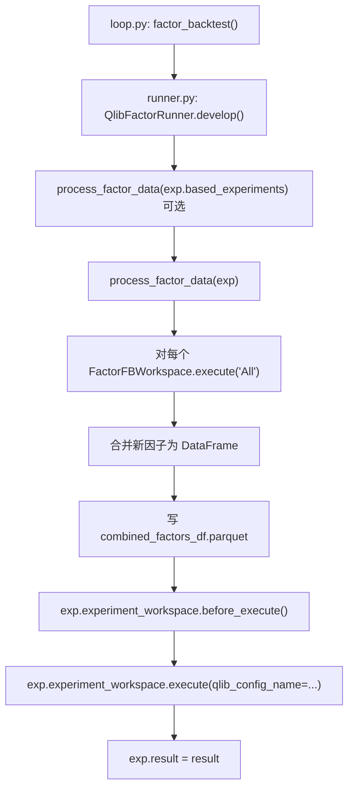
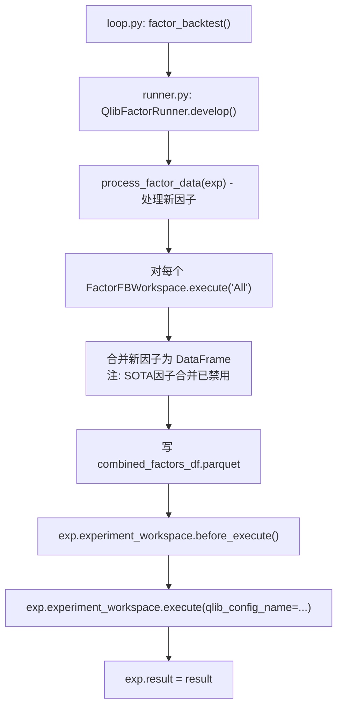

Status: accepted
Owner: Kilo (AI Assistant)
Created: 2026-03-13
Outcome: accepted

# QuantaAlpha 流程图错误分析

**日期**: 2026-03-13
**分析者**: Kilo (AI Assistant)
**文档版本**: quantaalpha_factor_mining_flow.md

## 概述

经过对QuantaAlpha因子挖掘系统流程图的详细验证，发现大部分流程图都是准确的，但Step 4 (因子回测) 的流程图存在关键错误。本文档详细说明该错误及其对理解系统行为的影响。

## 发现的问题

### 1. Step 4 流程图错误

#### 错误描述
文档中的Step 4流程图显示了以下执行链：



**问题**: 该流程图暗示`process_factor_data(exp.based_experiments)`是可选的，会参与因子合并，但实际代码中这个步骤被完全禁用。

#### 实际代码实现

在`quantaalpha/factors/runner.py`的`develop`方法中：

```python
# 行137-144: SOTA因子合并逻辑被禁用
if False: # SOTA_factor is not None and not SOTA_factor.empty:
    new_factors = self.deduplicate_new_factors(SOTA_factor, new_factors)
    if new_factors.empty:
        raise FactorEmptyError("No valid factor data found to merge.")
    combined_factors = pd.concat([SOTA_factor, new_factors], axis=1).dropna()
else:
    combined_factors = new_factors  # 只使用新因子
```

**实际执行流程**:
1. 处理新因子数据: `process_factor_data(exp)`
2. 执行因子计算: `FactorFBWorkspace.execute('All')`
3. 合并新因子: 创建`combined_factors` DataFrame
4. 保存数据: 写入`combined_factors_df.parquet`
5. 执行回测: `exp.experiment_workspace.before_execute()`和`execute()`

#### 正确流程图



## 对理解系统行为的影响

### 1. 误导性理解
- **文档显示**: 系统会考虑历史最佳因子(SOTA factors)，可能进行因子去重和合并
- **实际行为**: 系统只处理当前轮次的新因子，完全忽略历史最佳因子

### 2. 功能预期偏差
- **预期行为**: 基于文档，用户可能认为系统会累积和优化因子库
- **实际行为**: 每轮都是独立的，新因子不会与历史因子合并

### 3. 调试困难
- 当用户遇到因子质量问题时，可能会错误地认为是SOTA因子合并导致的
- 实际上是因为新因子本身的问题或合并逻辑被禁用

## 技术原因分析

### 为什么禁用SOTA因子合并？

1. **简化逻辑**: 避免复杂的因子去重和合并逻辑
2. **性能考虑**: 减少大数据集的处理开销
3. **调试友好**: 每轮只处理当前生成的新因子，便于问题定位
4. **渐进式开发**: 可能计划在后续版本中重新启用

### 代码中的证据

```python
# quantaalpha/factors/runner.py:137-144
if False: # SOTA_factor is not None and not SOTA_factor.empty:
    new_factors = self.deduplicate_new_factors(SOTA_factor, new_factors)
    if new_factors.empty:
        raise FactorEmptyError("No valid factor data found to merge.")
    combined_factors = pd.concat([SOTA_factor, new_factors], axis=1).dropna()
else:
    combined_factors = new_factors
```

**注释说明**: `deduplicate_new_factors`方法存在但未被调用，说明功能曾经实现过但被有意禁用。

## 修复建议

### 1. 更新文档流程图
- 移除对SOTA因子处理的引用
- 明确标注当前只处理新因子
- 在说明中解释为什么禁用该功能

### 2. 添加实现说明
在Step 4的"当前实现特点"部分添加：
```
重要说明: 当前实现中SOTA因子合并功能已被禁用。
代码中的 deduplicate_new_factors() 方法存在但不会被调用。
系统只处理当前轮次生成的新因子，不与历史最佳因子合并。
```

### 3. 代码注释改进
在相关代码处添加更清晰的注释：

```python
# 注意: SOTA因子合并功能当前被禁用
# 如需启用，请将下面的 if False 改为适当的条件判断
if False: # SOTA_factor is not None and not SOTA_factor.empty:
```

## 其他流程图验证结果

### ✅ 正确的流程图
1. **主流程图**: 完全正确
2. **Step 1 (假设生成)**: 完全正确
3. **Step 2 (因子构造)**: 基本正确
4. **Step 3 (因子计算)**: 基本正确
5. **Step 5 (反馈生成)**: 基本正确
6. **Evolution模式**: 完全正确

### ✅ 基本正确的流程图 (细节准确)
- **Step 2流程图**: 条件分支处理正确
- **Step 3流程图**: 组件调用关系正确
- **Planning流程**: LLM调用和重试逻辑正确

## 结论

**主要问题**: Step 4流程图存在关键错误，误导用户认为系统会进行SOTA因子合并，但实际已被禁用。

**影响程度**: 中等 - 可能导致用户对系统行为的错误理解，但不影响基本功能使用。

**修复优先级**: 高 - 应尽快更新文档以避免误导。

**建议**: 更新文档流程图，明确标注SOTA因子合并功能的禁用状态，并在代码中添加更清晰的注释说明。
