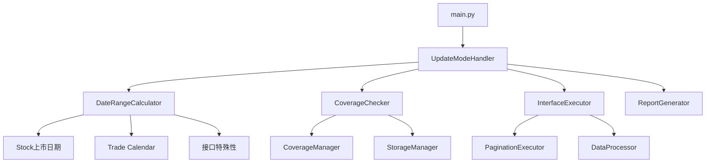

# `--update` 参数方案优化分析

## 一、现有代码与方案对比分析

### 1.1 已存在功能复用

| 方案设计 | 现有实现 | 状态 |
|---------|---------|------|
| `--update` 参数 | `--incremental` + `--force` 已存在 | ⚠️ 可复用 |
| 日期范围计算 | `_calculate_smart_start_date` 需新增 | 🔄 部分实现 |
| 现有数据检测 | `CoverageManager._check_range_coverage` | ✅ 已实现 |
| 覆盖管理集成 | `CoverageManager` | ✅ 已实现 |
| 报告生成 | `print_performance_report` | ⚠️ 可扩展 |

### 1.2 核心冲突点

```python
# main.py 第197-198行
parser.add_argument('--incremental', action='store_true',
                   help='增量模式 - 只下载缺失的时间段')
parser.add_argument('--force', action='store_true',
                   help='强制覆盖已存在的数据')
```

**问题**：`--update` 与 `--incremental` 功能重叠，需要统一语义。

---

## 二、优化建议

### 2.1 参数整合优化

**方案A：废弃 `--incremental`，统一使用 `--update`**

```python
# 建议的参数字典
args = {
    'update': False,           # 增量更新模式开关
    'force': False,            # 强制覆盖模式
    'start_date': None,        # 自动计算
    'end_date': None,          # 自动计算
    'interfaces': None,        # 指定接口
    'dry_run': False,          # 预览模式
}
```

**方案B：保留 `--incremental`，增强其功能**

```
python app4/main.py --incremental --dry-run  # 预览
python app4/main.py --incremental --force     # 强制更新
```

**推荐**：方案A，更符合直觉。

### 2.2 架构优化：分离关注点



**优化点**：
1. 将 `--update` 逻辑封装到独立类 `UpdateModeHandler`
2. 复用 `CoverageManager` 而非重新实现
3. 复用 `PaginationExecutor` 而非重新实现分页逻辑

### 2.3 性能优化建议

#### 2.3.1 并行接口处理

```python
# 优化：多接口并行执行
from concurrent.futures import ThreadPoolExecutor

def run_update_mode_parallel(interfaces, config, max_workers=4):
    with ThreadPoolExecutor(max_workers=max_workers) as executor:
        futures = {
            executor.submit(process_interface, iface): iface 
            for iface in interfaces
        }
        results = {}
        for future in concurrent.futures.as_completed(futures):
            iface = futures[future]
            results[iface] = future.result()
    return results
```

#### 2.3.2 缓存优化

```python
# 优化：减少重复的日期范围查询
class DateRangeCache:
    def __init__(self):
        self._cache = {}
    
    def get_date_range(self, interface_name):
        if interface_name not in self._cache:
            self._cache[interface_name] = self._calculate(interface_name)
        return self._cache[interface_name]
```

#### 2.3.3 批量覆盖率检查

```python
# 优化：一次查询多个接口的覆盖率
def batch_check_coverage(interfaces, start_date, end_date):
    query = """
        SELECT interface_name, COUNT(*) as record_count
        FROM combined_data
        WHERE trade_date BETWEEN ? AND ?
        GROUP BY interface_name
    """
    # 一次性获取所有接口的覆盖情况
```

### 2.4 智能日期范围计算增强

**现有问题**：方案中的 `_calculate_smart_start_date` 使用硬编码的特殊日期映射。

**优化方案**：

```python
class SmartDateCalculator:
    def __init__(self, storage_manager, config.storage = storage_manager_loader):
        self
        self.config = config_loader
    
    def calculate_start_date(self, interface_name):
        config = self.config.get_interface_config(interface_name)
        pagination_mode = config.get('pagination', {}).get('mode', 'none')
        
        if pagination_mode == 'period_range':
            # 财务数据：从最早财报期开始
            return self._get_earliest_period(interface_name)
        elif pagination_mode == 'stock_loop':
            # 股票循环：从最早上市日期开始
            return self._get_earliest_list_date()
        elif pagination_mode == 'date_range':
            # 日期范围：从最早交易日历开始
            return self._get_earliest_trade_date()
        else:
            # 默认策略
            return self._get_default_start()
```

### 2.5 容错处理增强

**现有问题**：方案中对异常的处理过于简单。

**优化方案**：

```python
class UpdateErrorHandler:
    RETRY_STRATEGIES = {
        'rate_limit': ExponentialBackoff(max_retries=3),
        'network_error': LinearBackoff(max_retries=2),
        'data_quality': SkipAndLog(),
    }
    
    def handle_error(self, interface_name, error, context):
        error_type = classify_error(error)
        strategy = self.RETRY_STRATEGIES[error_type]
        return strategy.execute(interface_name, error, context)
```

---

## 三、具体实现建议

### 3.1 推荐的文件结构

```
app4/
├── core/
│   ├── update_mode_handler.py  # 新增：增量更新处理器
│   ├── smart_date_calculator.py  # 新增：智能日期计算器
│   └── batch_coverage_checker.py  # 新增：批量覆盖率检查
├── main.py  # 修改：添加 --update 参数
└── ...
```

### 3.2 核心类设计

```python
# app4/core/update_mode_handler.py

class UpdateModeHandler:
    """增量更新模式处理器"""
    
    def __init__(self, config_loader, downloader, storage_manager, 
                 processor, coverage_manager):
        self.config = config_loader
        self.downloader = downloader
        self.storage = storage_manager
        self.processor = processor
        self.coverage = coverage_manager
        self.date_calculator = SmartDateCalculator(storage_manager, config_loader)
    
    def run(self, args):
        """执行增量更新"""
        interfaces = self._get_target_interfaces(args)
        results = {}
        
        for interface_name in interfaces:
            try:
                result = self._update_single_interface(interface_name, args)
                results[interface_name] = result
            except UpdateError as e:
                results[interface_name] = {'status': 'failed', 'error': str(e)}
        
        return UpdateReport(results)
    
    def _update_single_interface(self, interface_name, args):
        """更新单个接口"""
        config = self.config.get_interface_config(interface_name)
        
        # 1. 计算日期范围
        start_date, end_date = self.date_calculator.calculate(
            interface_name, args
        )
        
        # 2. 检查覆盖率
        coverage = self.coverage.get_coverage_status(
            interface_name, start_date, end_date
        )
        
        if coverage['covered']:
            return {'status': 'skipped', 'reason': 'already_covered'}
        
        # 3. 执行下载（复用现有逻辑）
        return self._execute_download(interface_name, config, start_date, end_date)
```

### 3.3 配置文件增强

```yaml
# app4/config/interfaces/cyq_perf.yaml 新增配置
update_config:
  # 增量更新策略
  strategy: 
    - date_range  # 日期范围策略
    - period_range  # 报告期策略
  # 最小间隔天数（避免频繁更新）
  min_interval_days: 1  
  # 是否支持断点续传
  checkpoint_enabled: true
```

---

## 四、优先级建议

| 优先级 | 功能 | 原因 |
|--------|------|------|
| P0 | 参数整合 | 解决与 `--incremental` 的冲突 |
| P0 | 复用 CoverageManager | 避免重复实现 |
| P1 | 智能日期计算器 | 核心功能 |
| P1 | 并行处理 | 性能提升 |
| P2 | 批量覆盖率检查 | 性能优化 |
| P2 | 断点续传 | 容错增强 |
| P3 | 预览模式 | 用户体验 |

---

## 五、风险评估

1. **兼容性风险**：`--incremental` 参数废弃可能影响现有用户
   - **缓解**：保留别名，向用户推荐新参数
   
2. **性能风险**：全接口更新可能导致系统负载过高
   - **缓解**：添加 `--max-interfaces` 参数限制并发数

3. **数据风险**：增量更新可能遗漏数据
   - **缓解**：添加 `--verify` 参数进行数据校验

---

## 六、总结

### 核心优化点

1. **复用现有组件**：避免重复造轮子，复用 `CoverageManager`、`PaginationExecutor` 等
2. **统一参数字典**：整合 `--update`、`--incremental`、`--force` 为一致的参数体系
3. **模块化设计**：将更新逻辑封装到独立类，便于测试和维护
4. **性能优化**：添加并行处理和批量查询支持
5. **增强容错**：实现更完善的错误处理和恢复机制

### 与现有代码的关系

```
现有代码 → 复用/增强 → 新功能
─────────────────────────────────
CoverageManager → 完全复用
PaginationExecutor → 完全复用
StorageManager → 完全复用
DataProcessor → 完全复用
main.py → 增强参数处理
```

**结论**：该方案框架良好，但需要与现有代码进行更多整合，避免重复实现。建议采用渐进式重构策略，先实现核心功能，再逐步优化性能。
