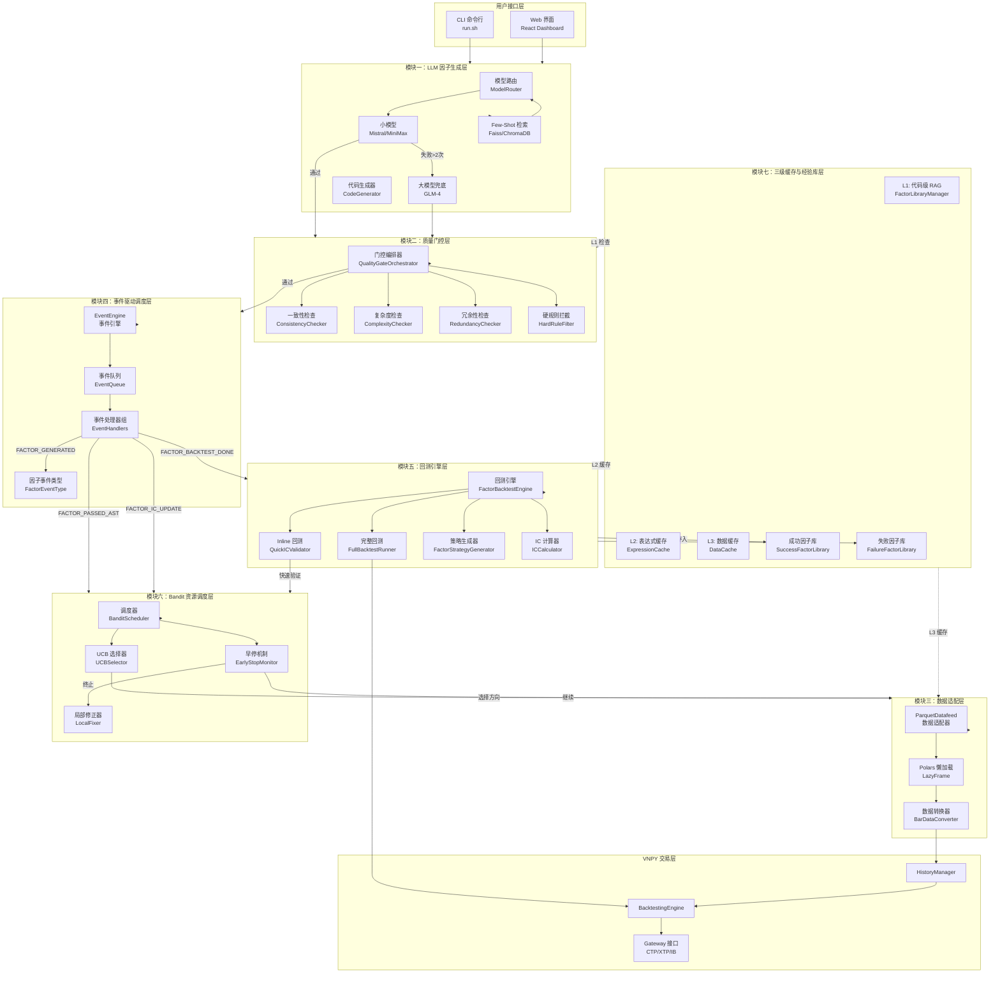
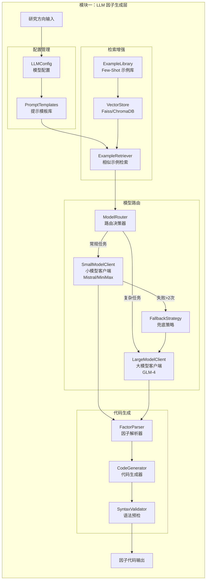
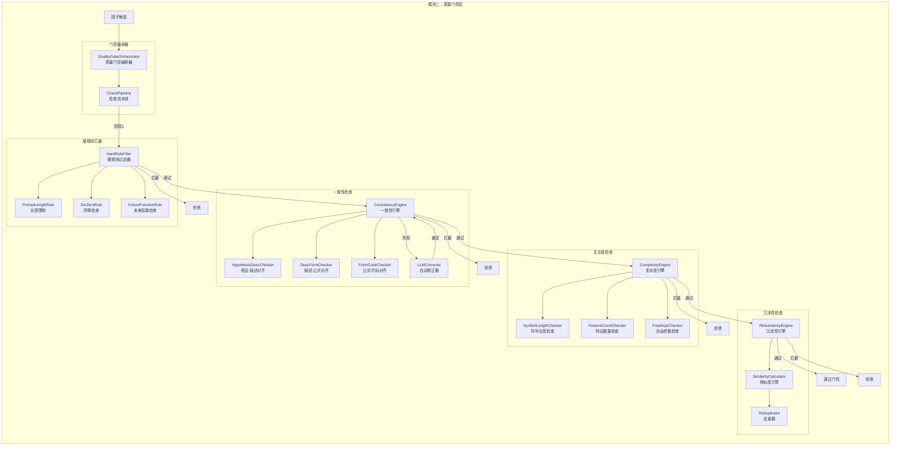
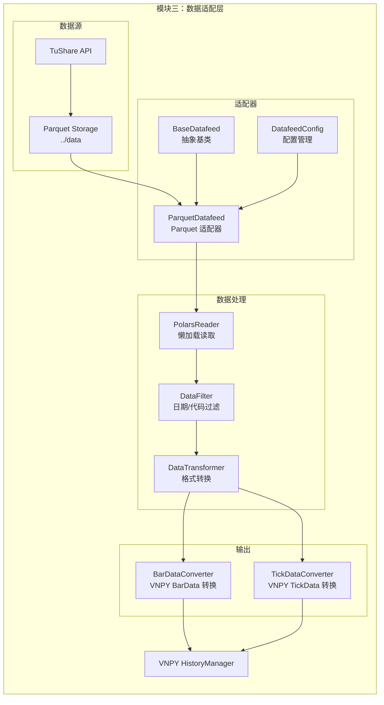
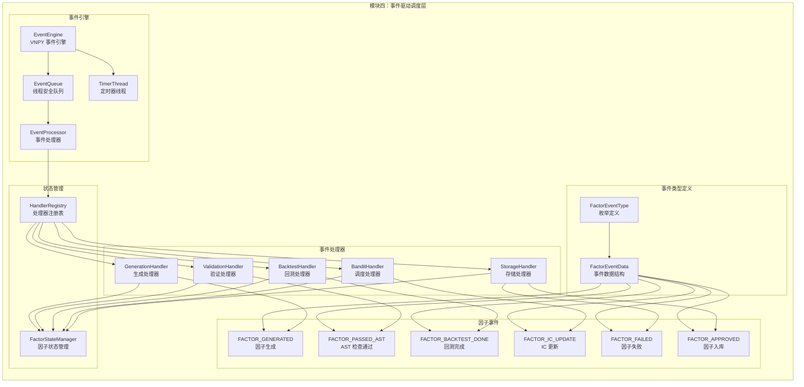
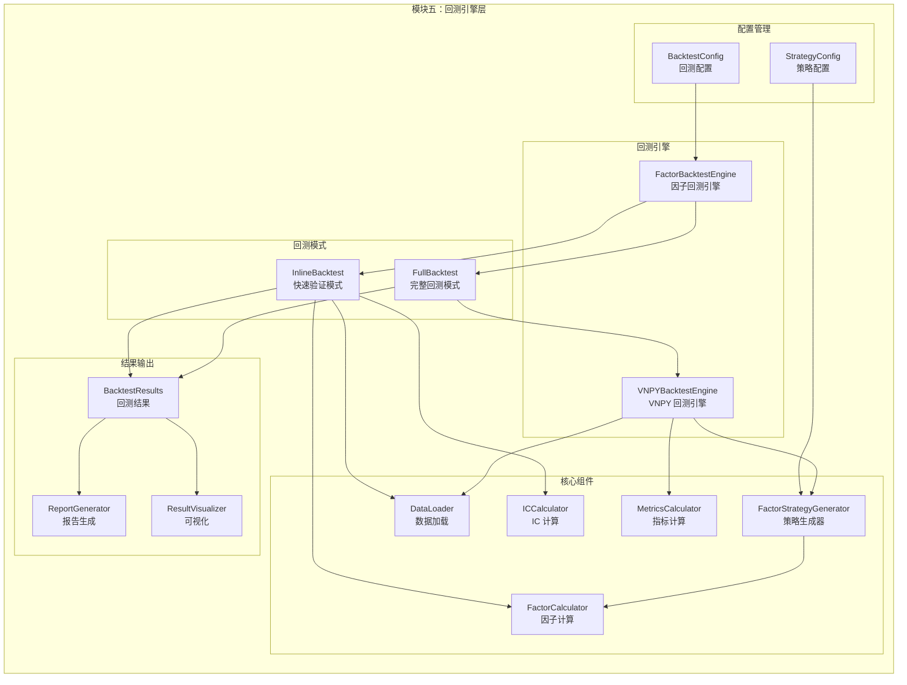
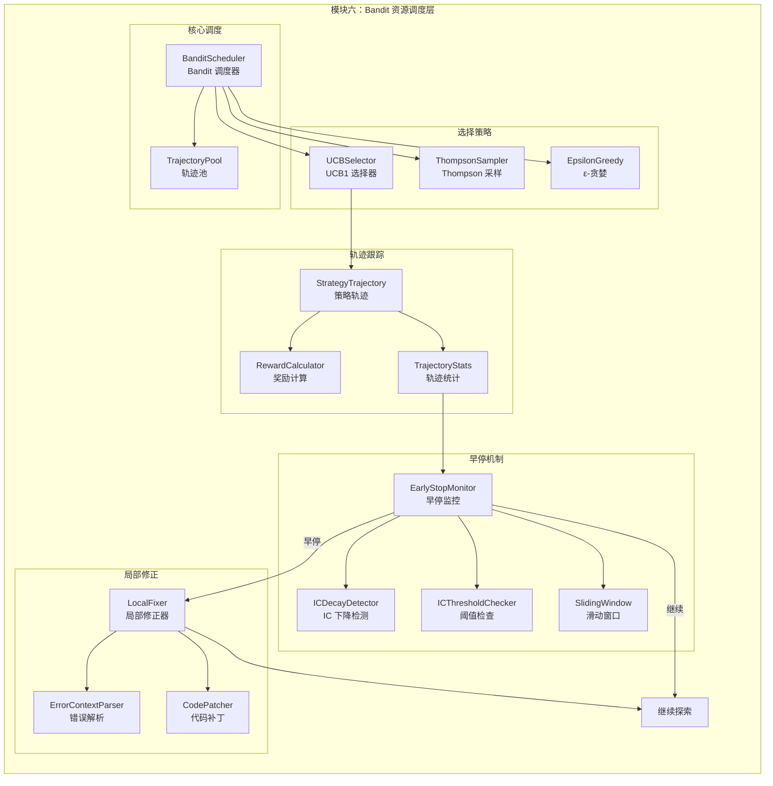
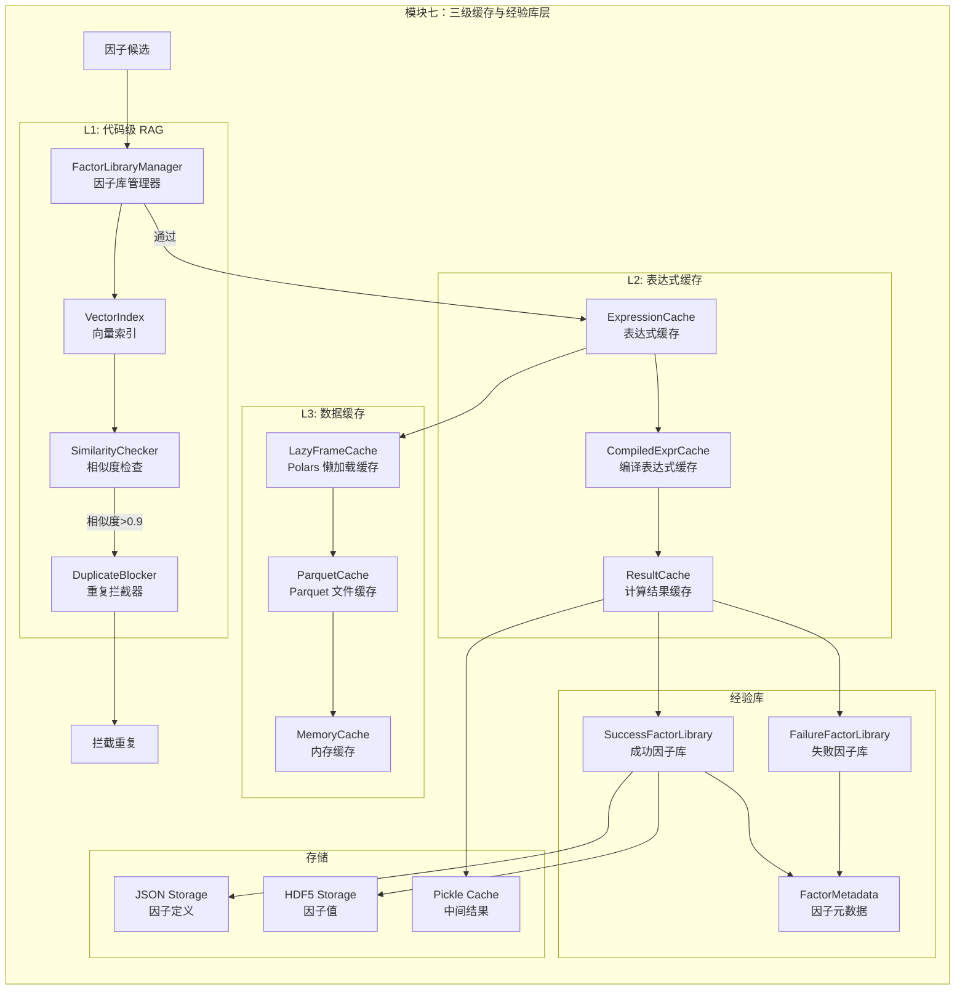
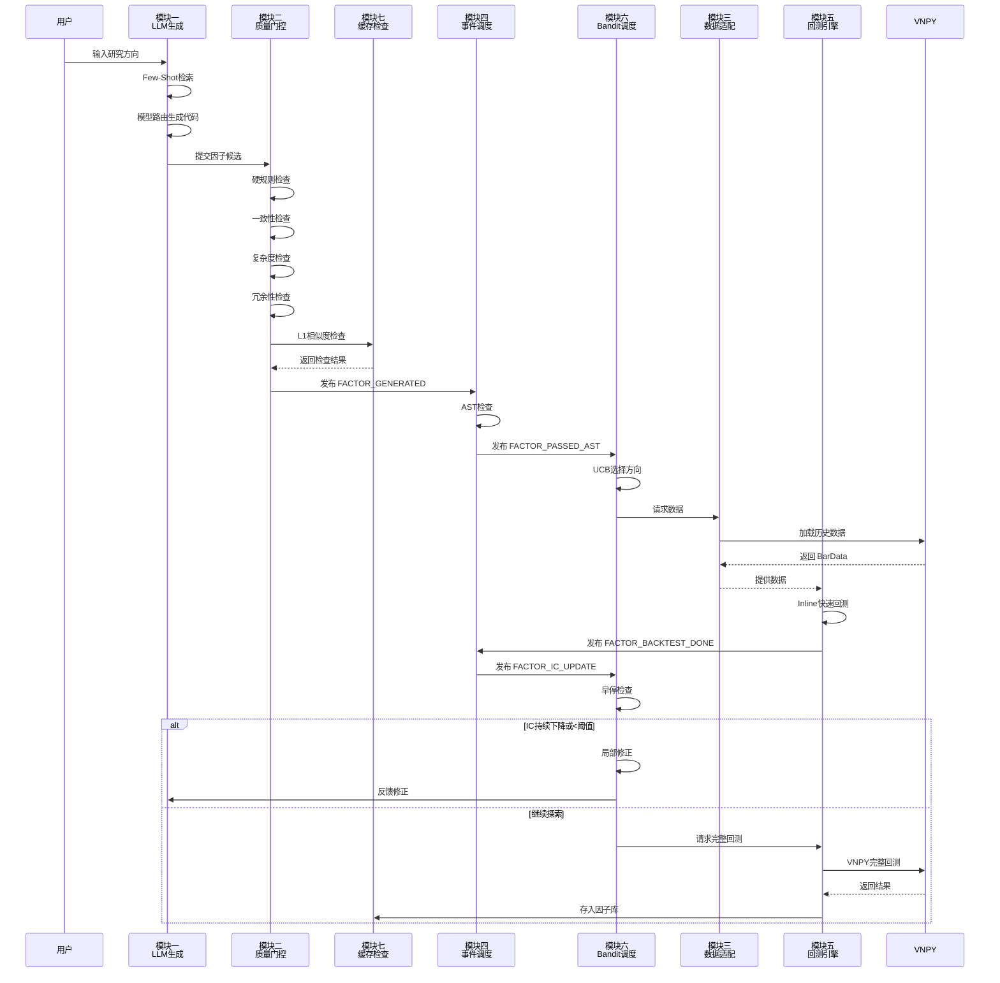
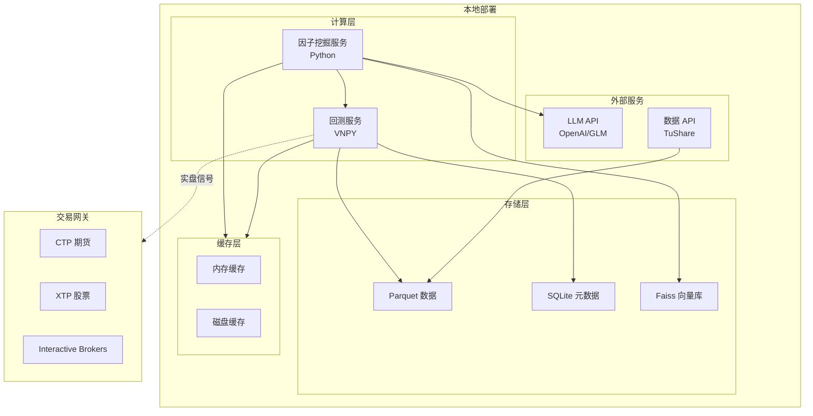

# 因子挖掘系统架构设计文档

## 概述

本文档描述了基于 QuantaAlpha 和 VNPY 的因子挖掘系统架构设计，采用 7 大模块分层架构，实现从 LLM 因子生成到实盘交易的完整闭环。

---

## 整体架构图



---

## 模块详细设计

### 模块一：LLM 因子生成层 (Factor Generation Layer)

#### 职责
负责因子的智能生成与代码转换，实现大小模型协同路由。

#### 子模块结构



#### 核心类设计

| 类名 | 职责 | 关键方法 |
|------|------|---------|
| `ModelRouter` | 路由决策 | `route(task_complexity) -> ModelType` |
| `SmallModelClient` | 小模型调用 | `generate(prompt) -> CodeSnippet` |
| `LargeModelClient` | 大模型调用 | `generate(prompt) -> CodeSnippet` |
| `ExampleRetriever` | 示例检索 | `retrieve(query, top_k=2) -> Examples` |
| `CodeGenerator` | 代码生成 | `generate_vnpy_expression(desc) -> Expression` |

#### 与 VNPY 集成

生成 `vnpy.alpha` 兼容的表达式：

```python
# 时间序列函数
"ts_delay(close, 5) / close - 1"
"ts_mean(volume, 20) / volume"
"ts_corr(close, volume, 10)"

# 截面函数
"cs_rank(ts_returns(close, 5))"
"cs_mean(volatility)"

# 技术分析函数
"ta_rsi(close, 14)"
"ta_macd(close)"
```

---

### 模块二：质量门控层 (Quality Gate Layer)

#### 职责
多级质量检查，拦截低质量因子，降低 API 成本。

#### 子模块结构



#### 检查阈值配置

| 检查类型 | 指标 | 阈值 | 说明 |
|---------|------|------|------|
| **硬规则** | Prompt 长度 | <= 500 字符 | 超长截断 |
| **硬规则** | 除零风险 | 无 | AST 静态检查 |
| **硬规则** | 未来函数 | 无 | 检查 `shift(-1)` |
| **一致性** | 语义对齐 | Pass/Fail | LLM 判断，3次重试 |
| **复杂度** | 符号长度 | <= 250 | 防止过复杂表达式 |
| **复杂度** | 基础特征数 | <= 6 | 限制特征维度 |
| **复杂度** | 自由参数比例 | <= 0.5 | 控制参数空间 |
| **冗余性** | 相似因子数 | < 5 | 避免因子库重复 |

---

### 模块三：数据适配层 (Data Adaptation Layer)

#### 职责
桥接现有 Parquet 数据与 VNPY 数据体系。

#### 子模块结构



#### 核心类设计

```python
class ParquetDatafeed(BaseDatafeed):
    """Parquet 数据适配器"""

    def __init__(self, setting: dict):
        self.base_dir = Path(setting.get("base_dir", "../data"))
        self.polars_config = setting.get("polars", {})

    def query_bar_history(self, req: HistoryRequest) -> list[BarData]:
        """从 Parquet 加载 K 线数据"""
        # 1. 路径映射
        # 2. Polars 懒加载
        # 3. 过滤条件
        # 4. 转换为 BarData
        pass

    def query_tick_history(self, req: HistoryRequest) -> list[TickData]:
        """从 Parquet 加载 Tick 数据"""
        pass
```

---

### 模块四：事件驱动调度层 (Event-Driven Orchestration Layer)

#### 职责
基于 VNPY EventEngine 实现异步流水线，解耦各模块。

#### 子模块结构



#### 事件类型定义

```python
from enum import Enum
from dataclasses import dataclass
from vnpy.event import EventEngine, Event

class FactorEventType(Enum):
    """因子事件类型"""
    FACTOR_GENERATED = "eFactorGenerated"      # LLM 生成了新因子
    FACTOR_PASSED_AST = "eFactorPassedAST"     # 通过 AST 检查
    FACTOR_BACKTEST_DONE = "eFactorBacktest"   # 回测完成
    FACTOR_IC_UPDATE = "eFactorIC"             # IC 更新
    FACTOR_FAILED = "eFactorFailed"            # 因子失败
    FACTOR_APPROVED = "eFactorApproved"        # 因子入库

@dataclass
class FactorEventData:
    """因子事件数据"""
    factor_id: str
    factor_code: str
    factor_name: str
    direction: str           # 研究方向
    ic_value: float = 0.0
    sharpe_ratio: float = 0.0
    error_msg: str = ""
    metadata: dict = None
```

---

### 模块五：回测引擎层 (Backtesting Engine Layer)

#### 职责
因子计算与策略回测，支持快速验证和完整回测两种模式。

#### 子模块结构



#### 双模式对比

| 特性 | Inline 回测 | Full 回测 |
|------|------------|-----------|
| **用途** | 挖矿时快速验证 | 最终评估 |
| **周期** | 有限周期（如最近1年） | 完整历史 |
| **速度** | 快（秒级） | 慢（分钟级） |
| **指标** | IC/Rank IC | IC + 策略收益 + 风险指标 |
| **技术** | Polars 直接计算 | VNPY BacktestingEngine |

#### 动态策略生成

```python
class FactorStrategyGenerator:
    """根据因子代码动态生成 VNPY 策略"""

    def generate(self, factor_code: str) -> Type[CtaTemplate]:
        """生成策略类"""

        class FactorStrategy(CtaTemplate):
            author = "FactorMining"
            factor_code = factor_code

            def on_bar(self, bar):
                # 计算因子信号
                signal = self._evaluate_factor(bar)

                # 交易逻辑
                if signal > 0.02 and self.pos == 0:
                    self.buy(bar.close_price * 1.01, 100)
                elif signal < -0.02 and self.pos > 0:
                    self.sell(bar.close_price * 0.99, abs(self.pos))

        return FactorStrategy
```

---

### 模块六：Bandit 资源调度层 (Bandit Resource Scheduling Layer)

#### 职责
智能分配计算资源，优化探索效率，实现早停机制。

#### 子模块结构



#### 核心算法

```python
import numpy as np
from dataclasses import dataclass
from typing import List, Dict

@dataclass
class Trajectory:
    """策略轨迹"""
    direction: str           # 研究方向
    params: Dict             # 参数配置
    n_pulls: int = 0         # 尝试次数
    total_reward: float = 0.0 # 累计奖励
    ic_history: List[float] = None  # IC 历史

    @property
    def avg_reward(self) -> float:
        return self.total_reward / max(self.n_pulls, 1)

    def ucb_score(self, total_trials: int, c: float = 1.414) -> float:
        """UCB1 公式"""
        if self.n_pulls == 0:
            return float('inf')
        exploitation = self.avg_reward
        exploration = c * np.sqrt(np.log(total_trials) / self.n_pulls)
        return exploitation + exploration

class BanditScheduler:
    """Bandit 资源调度器"""

    def __init__(self, directions: List[str], c: float = 1.414):
        self.trajectories = {
            d: Trajectory(direction=d, params={}, ic_history=[])
            for d in directions
        }
        self.total_trials = 0
        self.c = c

    def select_direction(self) -> str:
        """UCB 选择最有希望的方向"""
        scores = {
            name: traj.ucb_score(self.total_trials, self.c)
            for name, traj in self.trajectories.items()
        }
        return max(scores, key=scores.get)

    def update(self, direction: str, ic: float):
        """更新轨迹奖励"""
        traj = self.trajectories[direction]
        traj.n_pulls += 1
        traj.total_reward += ic
        traj.ic_history.append(ic)
        self.total_trials += 1

    def should_early_stop(self, direction: str,
                         window: int = 3,
                         threshold: float = 0.02) -> bool:
        """早停检查"""
        traj = self.trajectories[direction]
        if len(traj.ic_history) < window:
            return False

        recent_ics = traj.ic_history[-window:]
        # IC 持续下降
        decreasing = all(recent_ics[i] > recent_ics[i+1]
                         for i in range(len(recent_ics)-1))
        # IC 始终低于阈值
        always_low = all(ic < threshold for ic in recent_ics)

        return decreasing or always_low
```

#### 早停配置

| 参数 | 默认值 | 说明 |
|------|--------|------|
| `window` | 3 | IC 监控窗口大小 |
| `threshold` | 0.02 | IC 低阈值 |
| `c` | 1.414 | UCB 探索参数 |

---

### 模块七：三级缓存与经验库层 (Caching & Experience Layer)

#### 职责
最大化复用，避免重复计算，积累成功/失败经验。

#### 子模块结构



#### 缓存层级对比

| 层级 | 类型 | 技术 | 作用 | 命中率目标 |
|------|------|------|------|-----------|
| **L1** | 代码级 RAG | FactorLibraryManager + Faiss | 避免重复失败因子 | 60%-80% |
| **L2** | 表达式缓存 | LRU Cache + 编译缓存 | 中间计算结果复用 | 70%-90% |
| **L3** | 数据缓存 | Polars LazyFrame + Parquet | 内存占用优化 | 80%-95% |

#### 经验库结构

```python
# 成功因子库示例
{
    "factor_id": "f_20240309_001",
    "factor_name": "Momentum_5D",
    "expression": "ts_delay(close, 5) / close - 1",
    "category": "momentum",
    "ic_mean": 0.045,
    "ic_ir": 0.35,
    "sharpe_ratio": 1.2,
    "created_at": "2024-03-09T10:30:00",
    "metadata": {
        "direction": "momentum",
        "complexity_score": 0.3,
        "stability": "high"
    }
}

# 失败因子库示例
{
    "factor_id": "f_20240309_002",
    "expression": "ts_mean(close, 500) / close",
    "failure_reason": "IC consistently below threshold",
    "ic_history": [0.01, 0.005, -0.002],
    "error_type": "low_predictive_power",
    "created_at": "2024-03-09T10:35:00"
}
```

---

## 模块间交互流程

### 完整因子挖掘流程



---

## 技术栈汇总

| 模块 | 核心技术 | 开源依赖 |
|------|---------|---------|
| 模块一 | LLM 路由、向量检索 | openai, faiss-cpu, chromadb |
| 模块二 | AST 分析、语义检查 | ast, tree-sitter |
| 模块三 | 数据适配、懒加载 | polars, pyarrow |
| 模块四 | 事件驱动 | vnpy.event |
| 模块五 | 回测引擎 | vnpy, backtesting |
| 模块六 | Bandit 算法 | 自研 / optuna |
| 模块七 | 缓存、向量库 | faiss, redis(可选) |

---

## 部署架构



---

## 总结

本架构设计采用 7 大模块分层架构，实现：

1. **模块化**：各模块职责清晰，便于独立开发和测试
2. **可扩展**：事件驱动架构支持灵活扩展新功能
3. **高性能**：三级缓存 + Bandit 调度优化资源利用
4. **可落地**：基于 VNPY 成熟框架，支持实盘交易

后续开发建议按模块优先级逐步实现：
1. P0：模块三（数据）、模块四（事件）、模块五（回测）
2. P1：模块一（LLM）、模块二（门控）
3. P2：模块六（Bandit）、模块七（缓存）
