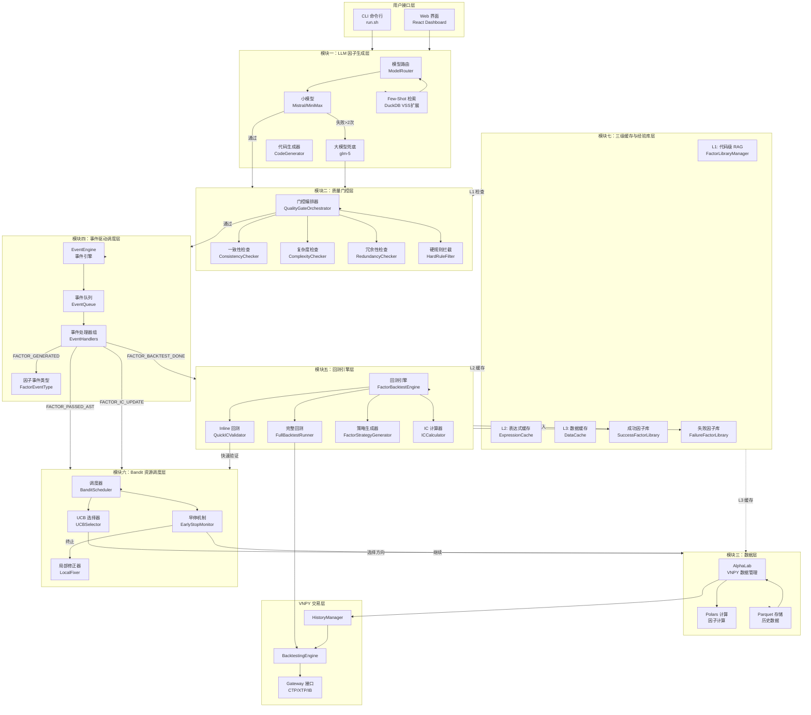
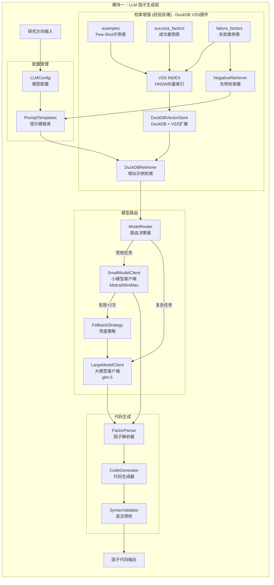
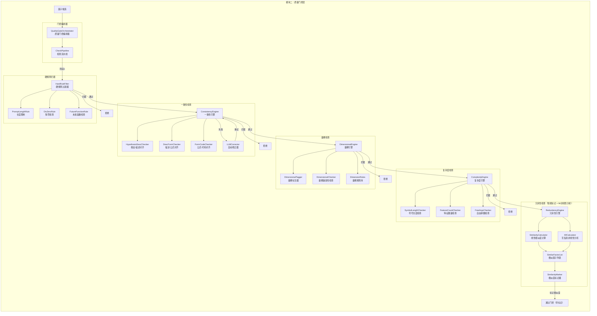
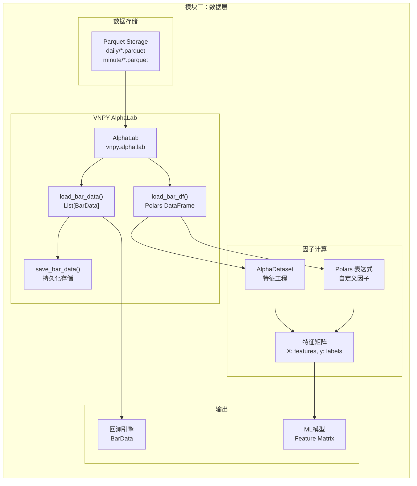
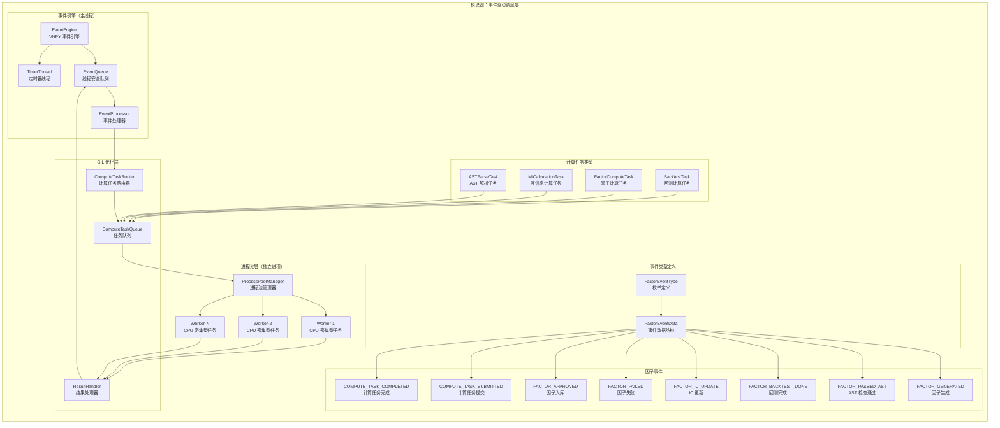
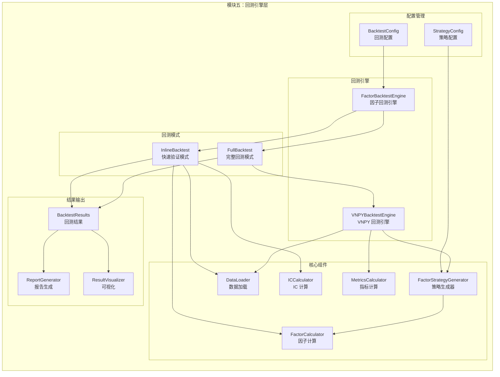
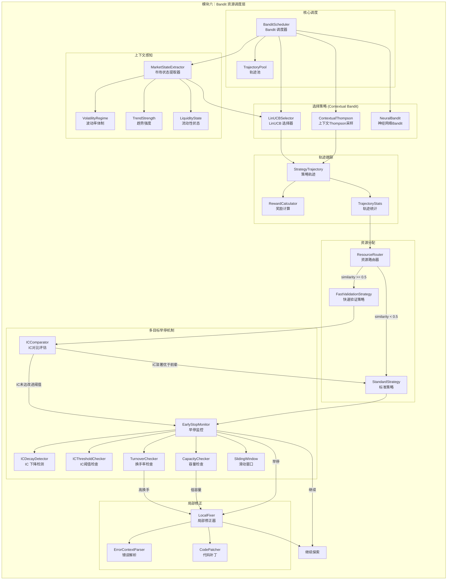
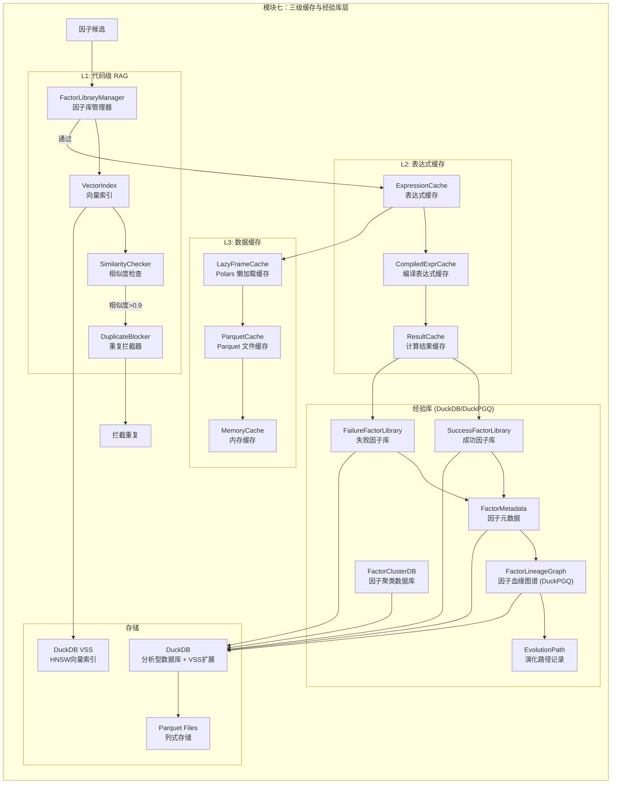
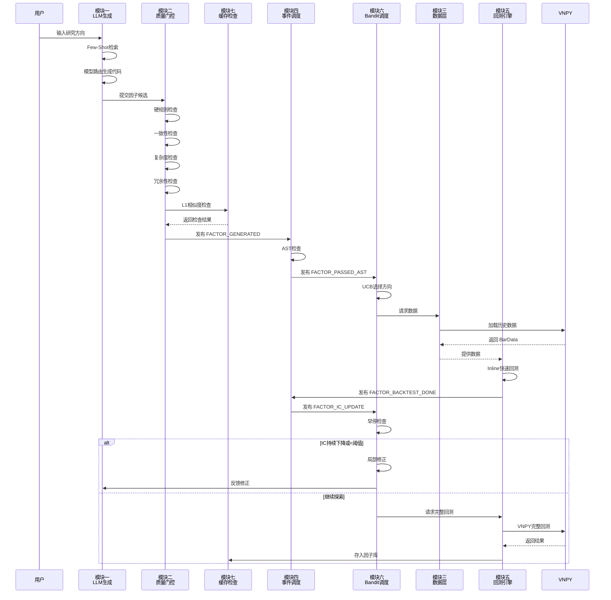
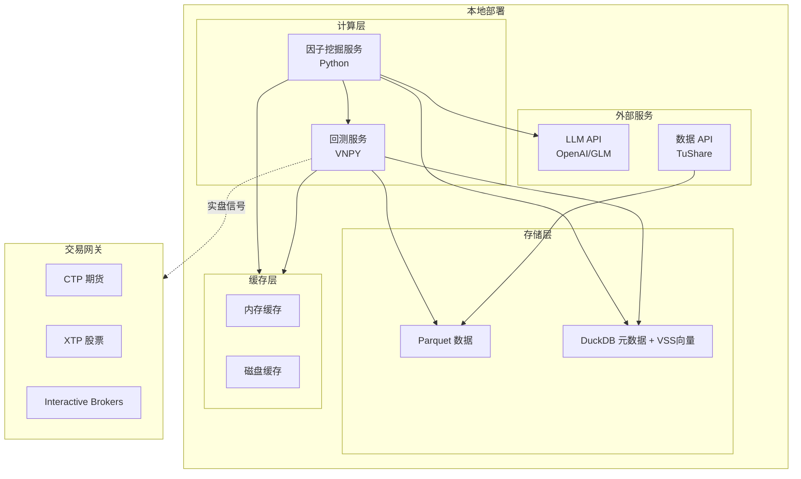

# 因子挖掘系统架构设计文档

## 概述

本文档描述了基于 QuantaAlpha 和 VNPY 的因子挖掘系统架构设计，采用 7 大模块分层架构，实现从 LLM 因子生成到实盘交易的完整闭环。

---

## 整体架构图



---

## 模块详细设计

### 模块一：LLM 因子生成层 (Factor Generation Layer)

#### 职责
负责因子的智能生成与代码转换，实现大小模型协同路由。

#### 子模块结构



#### 核心类设计

| 类名 | 职责 | 关键方法 |
|------|------|---------|
| `ModelRouter` | 路由决策 | `route(task_complexity) -> ModelType` |
| `SmallModelClient` | 小模型调用 | `generate(prompt) -> CodeSnippet` |
| `LargeModelClient` | 大模型调用 | `generate(prompt) -> CodeSnippet` |
| `DuckDBRetriever` | 示例检索 | `retrieve(query, top_k=2) -> Examples` |
| `NegativeExampleRetriever` | 负例检索 | `retrieve_failures(query, top_k=3) -> Failures` |
| `DuckDBVectorStore` | DuckDB向量存储 | `search_similar(embedding, top_k) -> Results` |
| `ExperienceReplay` | 经验反哺 | `build_negative_prompt(failures) -> Prompt` |
| `CodeGenerator` | 代码生成 | `generate_vnpy_expression(desc) -> Expression` |

#### DuckDB VSS 向量检索插件设计

**架构设计原则**：使用DuckDB的VSS（Vector Similarity Search）扩展实现向量检索功能。VSS扩展基于HNSW（Hierarchical Navigable Small World）算法提供近似最近邻搜索能力，与DuckDB的ACID事务特性结合，实现因子元数据和向量embedding的统一存储。

**数据库Schema设计**：

系统使用DuckDB存储三类数据：Few-Shot示例、成功因子、失败因子。每张表包含因子元数据和一个FLOAT数组类型的embedding字段用于存储向量。通过VSS扩展创建HNSW索引加速向量检索。

```sql
-- 安装并加载VSS扩展
INSTALL vss;
LOAD vss;

-- 成功因子库表（失败因子库表结构类似）
CREATE TABLE success_factors (
    factor_id VARCHAR PRIMARY KEY,
    research_direction VARCHAR,
    expression VARCHAR,
    ic_mean FLOAT,
    design_rationale VARCHAR,
    embedding FLOAT[384],  -- 384维向量
    created_at TIMESTAMP DEFAULT CURRENT_TIMESTAMP
);

-- 创建HNSW向量索引
CREATE INDEX idx_success_embedding ON success_factors USING VSS(embedding);
```

**向量检索实现**：

因子生成时，先将因子描述文本通过Embedding模型（如all-MiniLM-L6-v2）转换为384维向量，然后使用DuckDB的`array_cosine_similarity`函数计算相似度。

```sql
-- 向量相似度搜索示例
SELECT 
    factor_id,
    expression,
    array_cosine_similarity(embedding, [0.1, 0.2, ...]::FLOAT[384]) as similarity
FROM success_factors
WHERE research_direction = 'price_volume'
ORDER BY similarity DESC
LIMIT 5;
```

Python层封装两个核心类：
- **DuckDBVectorStore**：管理数据库连接、表初始化和数据插入。提供`search_similar`方法执行带过滤条件的向量搜索，以及`get_error_stats`方法统计失败类型分布。
- **DuckDBRetriever**：对外提供`retrieve`和`retrieve_failures`接口。内部调用Embedding模型将文本转为向量，再使用DuckDBVectorStore执行搜索。

**关键实现要点**：
1. 初始化时自动安装加载VSS扩展，设置`autoload_known_extensions = true`启用自动加载
2. 向量搜索支持按研究方向过滤，通过SQL的WHERE子句实现
3. 使用`array_cosine_similarity`计算余弦相似度，也可选用`array_distance`（欧氏距离）或`array_inner_product`（内积）
4. 数据插入使用事务保证，因子元数据和embedding在同一事务中写入

#### 经验反哺 (Experience Replay) 与负例学习

不仅缓存成功的因子，还要缓存导致失败的推理轨迹。在 Few-Shot 检索中，同时检索成功案例和失败案例，以 Negative Prompt 的形式避免 LLM 重蹈覆辙。

**负例检索流程**：

1. **失败案例建模**：每个失败案例记录因子ID、表达式、研究方向、失败原因、错误类型（如IC过低、换手率过高、过拟合、语法错误等）、IC历史轨迹、相似因子引用及创建时间。

2. **向量相似度检索（DuckDB VSS）**：
   - 使用DuckDB VSS扩展的HNSW索引检索与当前查询语义相似的失败案例
   - 通过SQL的WHERE子句按研究方向过滤，只保留同方向的失败案例
   - 综合array_cosine_similarity分数和时间衰减因子排序（越新的失败越重要）

3. **常见陷阱统计**：按错误类型分组统计，识别该研究方向上最容易犯的错误模式

**增强Prompt构建**：

经验反哺系统构建包含以下内容的增强版Prompt：
- **成功案例参考**：展示该方向上表现良好的因子设计思路
- **失败案例警示**：列出具体失败案例及其原因分析
- **常见陷阱清单**：统计该方向最常见的错误类型

**因子生成流程**：

1. 检索成功案例（Few-Shot学习）
2. 检索失败案例（负例学习）
3. 获取该方向的常见陷阱统计
4. 构建增强版Prompt
5. 调用LLM生成因子代码
6. 返回生成结果及参考案例信息

#### 负例反哺的 Context Window 优化

**痛点**：随着失败库越来越大，如果把太多失败案例塞进 Prompt，会导致 LLM 遗忘关键指令（Lost in the Middle）或超出 Token 限制。

**优化方案**：

1. **动态摘要**：对失败原因进行动态摘要。不要传入完整的失败代码，而是让一个轻量级 LLM 定期总结："在 price_volume 方向，最近 100 次失败主要集中在使用了过短的窗口期"
2. **Hard Negative 选择**：Prompt 中只保留 1-2 个最相似的 Hard Negative（极易犯错的负例），其余用高度凝练的 Rule 替代

**动态失败摘要器工作流程**：

1. **缓存机制**：按研究方向缓存摘要结果，定期更新（如每24小时）

2. **摘要生成流程**：
   - 获取最近N个失败案例（如100个）
   - 统计错误类型分布
   - 使用轻量级LLM生成简洁摘要，包括：
     - 该方向最常见的失败原因（1-2句话）
     - 最近的趋势变化
     - 最需要警惕的陷阱

3. **Hard Negative选择策略**：
   - 优先选择最常见错误类型的代表性案例
   - 优先选择IC最低的案例（最具警示意义）
   - 优先选择最近发生的案例（时效性强）
   - 最终只保留Top-2最具代表性的失败案例
    
    def _identify_trends(self, failures: List[Dict]) -> List[str]:
        """识别失败趋势"""
        trends = []
        
        # 按周统计
        from collections import defaultdict
        weekly_counts = defaultdict(int)
        for f in failures:
            week = f['created_at'].strftime('%Y-W%W')
            weekly_counts[week] += 1
        
        weeks = sorted(weekly_counts.keys())
        if len(weeks) >= 2:
            recent = weekly_counts[weeks[-1]]
            previous = weekly_counts[weeks[-2]]
            if recent > previous * 1.5:
                trends.append(f"失败率上升（上周{previous}次，本周{recent}次）")
            elif recent < previous * 0.5:
                trends.append(f"失败率下降（上周{previous}次，本周{recent}次）")
        
        return trends

class OptimizedExperienceReplay:
    """优化的经验反哺 - 解决Context Window爆炸问题"""
    
    OPTIMIZED_PROMPT_TEMPLATE = """
你在尝试开发一个{research_direction}方向的量化因子。

【成功案例参考】（你应该学习这些）：
{positive_examples}

【失败模式摘要】（你必须避免这些错误）：
{failure_summary}

【常见陷阱统计】：
{error_type_stats}

【典型失败案例】（Hard Negatives）：
{hard_negatives}

【最近趋势】：
{recent_trends}

请基于以上经验，生成一个新的因子表达式。注意：
1. 学习成功案例的设计思路
2. 特别关注失败模式摘要中的警示
3. 避免常见陷阱
4. 确保因子有独特的信息增量

生成的因子表达式：
"""
    
    def __init__(self, summarizer: DynamicFailureSummarizer):
        self.summarizer = summarizer
    
    def build_optimized_prompt(
        self,
        research_direction: str,
        positive_examples: List[Dict],
        failure_db
    ) -> str:
        """
        构建优化的Prompt，解决Context Window问题
        
        相比原版：
        - 不传入所有失败案例的完整代码
        - 传入动态生成的摘要
        - 只保留2个Hard Negative
        """
        # 1. 获取失败摘要（轻量级）
        summary = self.summarizer.get_summary(research_direction, failure_db)
        
        # 2. 格式化成功案例（保持不变）
        pos_text = "\n\n".join([
            f"案例{i+1}:\n- 表达式: {ex['expression']}\n- IC: {ex['ic_mean']:.3f}\n- 设计思路: {ex.get('design_rationale', 'N/A')}"
            for i, ex in enumerate(positive_examples)
        ])
        
        # 3. 格式化错误类型统计
        error_stats = "\n".join([
            f"- {error_type}: {count}次失败"
            for error_type, count in sorted(
                summary.common_error_types.items(), 
                key=lambda x: x[1], 
                reverse=True
            )[:5]  # 只显示Top-5
        ])
        
        # 4. 获取Hard Negatives的详细信息
        hard_negatives_text = self._get_hard_negatives_text(
            summary.hard_negatives, 
            failure_db
        )
        
        # 5. 格式化趋势
        trends_text = "\n".join([f"- {t}" for t in summary.recent_trends]) or "无显著趋势"
        
        return self.OPTIMIZED_PROMPT_TEMPLATE.format(
            research_direction=research_direction,
            positive_examples=pos_text,
            failure_summary=summary.summary_text,
            error_type_stats=error_stats,
            hard_negatives=hard_negatives_text,
            recent_trends=trends_text
        )
    
    def _get_hard_negatives_text(self, hard_negative_ids: List[str], failure_db) -> str:
        """获取Hard Negatives的简洁描述"""
        if not hard_negative_ids:
            return "暂无"
        
        texts = []
        for i, fid in enumerate(hard_negative_ids, 1):
            failure = failure_db.get(fid)
            if failure:
                texts.append(
                    f"案例{i}:\n"
                    f"- 表达式: {failure['expression']}\n"
                    f"- 错误类型: {failure['error_type']}\n"
                    f"- 核心教训: {failure.get('lessons_learned', ['无'])[0]}"
                )
        
        return "\n\n".join(texts)

# Token消耗对比示例
# 原版Prompt（100个失败案例）: ~8000 tokens
# 优化版Prompt（摘要+2个Hard Negative）: ~1500 tokens
# 节省: 81%的Token消耗
```
```

**失败因子库结构**：

```python
# 失败因子库示例（用于经验反哺）
{
    "factor_id": "f_20240309_004",
    "expression": "ts_corr(close, volume, 3)",
    "research_direction": "price_volume",
    "failure_reason": "IC未达改进阈值，与f_20240309_003过于相似",
    "error_type": "insufficient_improvement",
    "ic_history": [0.015, 0.012, 0.008],
    "turnover_history": [0.25, 0.28, 0.30],
    "similar_to": "f_20240309_003",
    "similarity_score": 0.88,
    "created_at": "2024-03-09T10:45:00",
    "metadata": {
        "exploration_strategy": "fast_validation",
        "comparison_baseline": "f_20240309_003",
        "ic_gap": "-0.065",
        "lessons_learned": [
            "短窗口(3天)的相关性因子已经被充分挖掘",
            "与现有因子相似度过高，没有信息增量"
        ]
    },
    "embedding": [0.12, -0.05, 0.33, ...]  # 用于向量检索
}
```

**Prompt 示例（含负例）**：

```
你在尝试开发一个price_volume方向的量化因子。

【成功案例参考】（你应该学习这些）：
案例1:
- 表达式: ts_corr(close, volume, 5)
- IC: 0.085
- 设计思路: 5日量价相关性，捕捉短期资金流入

案例2:
- 表达式: ts_corr(ts_returns(close, 1), volume, 10)
- IC: 0.072
- 设计思路: 日收益与成交量的相关性

【失败案例警示】（你必须避免这些错误）：
案例1:
- 表达式: ts_corr(close, volume, 3)
- 失败原因: IC未达改进阈值，与f_20240309_003过于相似
- 教训: 短窗口(3天)的相关性因子已经被充分挖掘

案例2:
- 表达式: ts_mean(volume, 20) / ts_mean(volume, 5)
- 失败原因: 换手率过高(>50%)，实盘滑点不可控
- 教训: 换手率过高，实盘滑点会侵蚀收益

【该方向的常见陷阱】：
- ic_too_low: 15次失败
- high_turnover: 8次失败
- overfitting: 5次失败

请基于以上经验，生成一个新的因子表达式。注意：
1. 学习成功案例的设计思路
2. 避免失败案例中的错误
3. 特别注意常见陷阱
4. 确保因子有独特的信息增量

生成的因子表达式：
```

#### 与 VNPY 集成

生成 `vnpy.alpha` 兼容的表达式：

```python
# 时间序列函数
"ts_delay(close, 5) / close - 1"
"ts_mean(volume, 20) / volume"
"ts_corr(close, volume, 10)"

# 截面函数
"cs_rank(ts_returns(close, 5))"
"cs_mean(volatility)"

# 技术分析函数
"ta_rsi(close, 14)"
"ta_macd(close)"
```

---

### 模块二：质量门控层 (Quality Gate Layer)

#### 职责
多级质量检查，拦截低质量因子，降低 API 成本。

#### 子模块结构



#### 量纲与物理意义检查 (Dimensional Analysis)

**痛点**：LLM 经常会生成数学上可行但毫无金融逻辑的公式，例如 `close + volume`（价格加成交量，量纲不同）。

**解决方案**：在 AST 检查中引入量纲推导系统，给基础字段打上标签，在 AST 遍历时检查操作符两端的量纲是否兼容。

**量纲类型定义**：
- **Price（价格）**：close、open、high、low、vwap、amount 等
- **Volume（成交量）**：volume、turnover 等
- **Ratio（比率）**：returns、volatility、rank、常数等无量纲量
- **Count（计数）**：day、minute 等时间计数
- **Unknown（未知）**：未定义量纲的字段

**量纲兼容性规则**：

1. **加减法（+、-）**：要求两端量纲必须相同
   - 合法：`close - open`（价格 - 价格）
   - 非法：`close + volume`（价格 + 成交量）

2. **乘法（*）**：产生新量纲
   - `Price * Volume → Price`（金额）
   - `X * Ratio → X`（与比率相乘保持原量纲）

3. **除法（/）**：产生比率量纲
   - `Price / Price → Ratio`（价格比）
   - `Volume / Volume → Ratio`（量比）

4. **幂运算（**）**：要求指数为无量纲（Ratio 或 Count）

**函数返回量纲推断**：
- 时间序列函数（ts_mean、ts_std 等）：保持输入量纲
- 排名函数（cs_rank、ts_rank）：返回 Ratio
- 相关性函数（ts_corr、cs_corr）：返回 Ratio
- 对数函数（log、ln）：返回 Ratio

**检查流程**：
1. 解析表达式为 AST
2. 递归遍历 AST 节点，为每个节点标注量纲
3. 检查二元操作符两端的量纲兼容性
4. 返回检查结果（是否合法、错误列表、结果量纲）

**检查阈值配置

| 检查类型 | 指标 | 阈值 | 说明 |
|---------|------|------|------|
| **硬规则** | Prompt 长度 | <= 500 字符 | 超长截断 |
| **硬规则** | 除零风险 | 无 | AST 静态检查 |
| **硬规则** | 未来函数 | 无 | 检查 `shift(-1)` |
| **量纲检查** | 量纲兼容性 | Pass/Fail | 检查 Price + Volume 等非法组合 |
| **一致性** | 语义对齐 | Pass/Fail | LLM 判断，3次重试 |
| **复杂度** | 符号长度 | <= 250 | 防止过复杂表达式 |
| **复杂度** | 基础特征数 | <= 6 | 限制特征维度 |
| **复杂度** | 自由参数比例 | <= 0.5 | 控制参数空间 |
| **冗余性** | 线性相似度 | 返回相似列表 | Pearson/Spearman 相关性 |
| **冗余性** | 互信息 (MI) | 返回相似列表 | 捕捉非线性依赖关系 |

#### 冗余性检查说明

**设计原则**：从"二元拦截"升级为"智能标记"

传统冗余检查直接拦截相似因子，但存在局限：
- `ts_mean(close, 10) / close` 和 `ts_mean(close, 5) / close` 代码相似度高，但经济含义可能完全不同
- 简单拦截可能误杀"有价值的细微改进"

**增强设计**：
1. **识别而非拦截**：计算相似度，返回相似因子列表及其IC历史
2. **标记分类**：
   - `similarity < 0.5`：全新因子
   - `0.5 <= similarity < 0.9`：低相似，标准处理
   - `similarity >= 0.9`：高相似，进入快速验证模式
3. **传递信息**：将相似因子ID、相似度分数、历史IC表现传递给Bandit调度层

**互信息 (Mutual Information) 非线性冗余检测**

除了线性相关性，引入互信息捕捉因子间的非线性依赖关系。

**互信息计算流程**：

1. **数据预处理**：
   - 对新因子值和现有因子值进行标准化（StandardScaler）
   - 将数据转换为适合互信息计算的格式

2. **MI计算**：
   - 使用 KNN 方法估计互信息值（默认 n_neighbors=3，适合金融数据）
   - 计算新因子与每个现有因子的互信息得分
   - 返回因子ID到MI值的映射字典

**综合冗余评分方法**：

综合线性相关性和互信息的冗余度评分，取两者最大值作为最终冗余度：
- `combined_score = max(corr_score, mi_score)`

**MI的优势**：
- 能捕捉到相关性无法发现的非线性关系（如平方关系、阈值效应）
- 示例：`factor_a = close` vs `factor_b = close ** 2`
  - 线性相关性 ≈ 0（可能很低）
  - 互信息 > 0.5（能捕捉到依赖关系）
  - 综合评分正确标记为冗余
    """
    return max(corr_score, mi_score)  # 取两者最大值作为最终冗余度
```

**示例场景**：
- `factor_a = close` vs `factor_b = close ** 2`
  - 线性相关性 ≈ 0（可能很低）
  - 互信息 > 0.5（能捕捉到依赖关系）
  - 综合评分正确标记为冗余

---

### 模块三：数据层 (Data Layer)

#### 职责
基于 VNPY Alpha 模块提供统一的 Parquet + Polars 数据管理，支持因子计算和回测数据供给。

#### 设计说明
VNPY 4.0+ 的 `vnpy.alpha.lab` 模块原生支持 Parquet 格式和 Polars DataFrame，无需额外开发数据适配器：
- `AlphaLab` 直接读写 Parquet 文件
- `load_bar_df()` 返回 Polars DataFrame 用于因子计算
- `load_bar_data()` 返回 BarData 列表用于回测

#### 子模块结构



#### 核心类设计

```python
from vnpy.alpha.lab import AlphaLab
from vnpy.alpha.dataset import AlphaDataset
from vnpy.trader.constant import Interval
from datetime import datetime
import polars as pl


class FactorDataManager:
    """因子数据管理器 - 基于 VNPY AlphaLab"""

    def __init__(self, data_path: str):
        self.lab = AlphaLab(data_path)

    def load_factor_data(
        self,
        vt_symbols: list[str],
        interval: Interval,
        start: datetime,
        end: datetime
    ) -> pl.DataFrame:
        """加载因子计算数据 - 返回 Polars DataFrame"""
        return self.lab.load_bar_df(
            vt_symbols=vt_symbols,
            interval=interval,
            start=start,
            end=end,
            extended_days=10  # 包含前10天数据用于计算
        )

    def load_backtest_data(
        self,
        vt_symbol: str,
        interval: Interval,
        start: datetime,
        end: datetime
    ) -> list:
        """加载回测数据 - 返回 BarData 列表"""
        return self.lab.load_bar_data(
            vt_symbol=vt_symbol,
            interval=interval,
            start=start,
            end=end
        )

    def compute_alpha_features(
        self,
        df: pl.DataFrame,
        feature_exprs: dict[str, str]
    ) -> pl.DataFrame:
        """使用 Polars 计算自定义因子"""
        for name, expr in feature_exprs.items():
            df = df.with_columns([
                pl.eval(expr).alias(name)
            ])
        return df

    def get_alpha_dataset(
        self,
        vt_symbols: list[str],
        feature_set: str = "Alpha158"
    ) -> AlphaDataset:
        """获取 VNPY 内置特征集"""
        return AlphaDataset(
            lab=self.lab,
            vt_symbols=vt_symbols,
            feature_set=feature_set
        )
```

#### 数据路径约定

| 数据类型 | 存储路径 | VNPY 方法 |
|---------|---------|----------|
| 日线数据 | `{lab_path}/daily/{vt_symbol}.parquet` | `load_bar_df()` / `load_bar_data()` |
| 分钟线数据 | `{lab_path}/minute/{vt_symbol}.parquet` | `load_bar_df()` / `load_bar_data()` |
| 交易信号 | `{lab_path}/signal/{name}.parquet` | `load_signal_df()` |

#### 优势

1. **零适配成本**：直接使用 VNPY 原生 Parquet + Polars 支持
2. **高性能**：Polars 懒加载和向量化计算
3. **一致性**：因子计算和回测使用同一套数据
4. **可扩展**：支持 VNPY 内置 Alpha158/Alpha101 特征集

---

### 模块四：事件驱动调度层 (Event-Driven Orchestration Layer)

#### 职责
基于 VNPY EventEngine 实现异步流水线，解耦各模块。**针对 Python GIL 限制进行优化，将 CPU 密集型任务剥离至独立进程执行，避免阻塞主事件循环。**

#### 子模块结构



#### GIL 优化设计

##### 1. 问题背景
Python 的 GIL（全局解释器锁）导致多线程无法真正并行执行 CPU 密集型任务。当 EventEngine 的事件处理器执行以下任务时，会阻塞整个事件循环：
- **AST 解析**（模块二）：语法树分析、代码检查
- **互信息计算**（模块二）：MI 非线性相似度分析
- **因子计算**（模块三）：Polars 大规模数据计算
- **回测计算**（模块五）：IC 计算、策略回测

##### 2. 解决方案架构

**三层分离设计**：

| 层级 | 职责 | 执行环境 | 技术选型 |
|------|------|----------|----------|
| **事件层** | 状态流转、消息通知 | 主进程（主线程） | VNPY EventEngine |
| **调度层** | 任务路由、结果回调 | 主进程（主线程） | ComputeTaskRouter + ResultHandler |
| **计算层** | CPU 密集型计算 | 独立进程（多进程） | ProcessPoolExecutor |

##### 3. 核心组件设计

**计算任务基类（ComputeTask）**：

定义计算任务的数据结构，包含以下字段：
- **task_id**: 任务唯一标识
- **task_type**: 任务类型枚举（AST_PARSE、MI_CALCULATION、FACTOR_COMPUTE、BACKTEST_IC、BACKTEST_FULL）
- **payload**: 任务输入数据字典
- **callback_event**: 完成时触发的事件类型
- **priority**: 任务优先级（整数，数值越大优先级越高）

**任务执行结果（TaskResult）**：
- **task_id**: 对应任务的ID
- **task_type**: 任务类型
- **success**: 执行是否成功
- **result**: 执行结果数据
- **error_msg**: 错误信息（失败时）
- **execution_time**: 执行耗时

**进程池管理器（ProcessPoolManager）**：

负责管理 CPU 密集型任务的独立进程执行，核心职责：
1. 维护 ProcessPoolExecutor 实例（默认使用 CPU 核心数作为工作进程数）
2. 提交计算任务到进程池（非阻塞）
3. 管理任务生命周期和结果回调

**任务提交流程**：
1. 根据任务类型选择对应的执行函数
2. 提交到进程池执行（非阻塞，立即返回 Future）
3. 注册任务ID与Future的映射关系
4. 添加完成回调函数，任务完成后自动调用结果处理器

**任务完成回调**：
- 获取任务执行结果
- 构造 TaskResult 对象
- 调用注册的结果处理器
- 清理任务状态

**异步事件桥接器（AsyncEventBridge）**：

连接进程池结果与事件引擎的桥梁，职责：
1. 将进程池的计算结果转换为事件
2. 确保线程安全地发布事件到 EventEngine

**结果处理流程**：
1. 接收 TaskResult 对象
2. 构造 FactorEventData 事件数据
3. 创建 Event 对象
4. 通过 EventEngine.put() 发布事件（线程安全）

**GIL 优化的事件引擎封装（GILOptimizedEventEngine）**：

整合 VNPY EventEngine 和 ProcessPoolManager，职责：
1. 包装 VNPY EventEngine（负责状态流转）
2. 集成 ProcessPoolManager（负责 CPU 密集型计算）
3. 保持事件引擎仅负责状态流转，不执行具体计算

**使用方法**：
1. 初始化引擎，指定工作进程数
2. 注册事件处理器
3. 提交计算任务（自动路由到进程池）
4. 任务完成后自动触发对应事件

##### 4. 事件类型扩展

```python
from enum import Enum
from dataclasses import dataclass
from vnpy.event import EventEngine, Event

class FactorEventType(Enum):
    """因子事件类型（扩展 GIL 优化相关事件）"""
    # 原有事件
    FACTOR_GENERATED = "eFactorGenerated"           # LLM 生成了新因子
    FACTOR_PASSED_AST = "eFactorPassedAST"          # 通过 AST 检查
    FACTOR_BACKTEST_DONE = "eFactorBacktest"        # 回测完成
    FACTOR_IC_UPDATE = "eFactorIC"                  # IC 更新
    FACTOR_FAILED = "eFactorFailed"                 # 因子失败
    FACTOR_APPROVED = "eFactorApproved"             # 因子入库
    
    # GIL 优化新增事件
    COMPUTE_TASK_SUBMITTED = "eComputeTaskSubmitted"   # 计算任务已提交
    COMPUTE_TASK_COMPLETED = "eComputeTaskCompleted"   # 计算任务已完成
    COMPUTE_TASK_FAILED = "eComputeTaskFailed"         # 计算任务失败

@dataclass
class FactorEventData:
    """因子事件数据"""
    factor_id: str
    factor_code: str
    factor_name: str
    direction: str           # 研究方向
    ic_value: float = 0.0
    sharpe_ratio: float = 0.0
    error_msg: str = ""
    metadata: dict = None    # 扩展：包含 task_type, execution_time 等
```

##### 5. 使用示例

```python
# 初始化 GIL 优化的事件引擎
gil_engine = GILOptimizedEventEngine(max_workers=4)

# 注册事件处理器
gil_engine.register_handler(
    FactorEventType.COMPUTE_TASK_COMPLETED.value,
    on_compute_completed
)

# 提交 AST 解析任务（CPU 密集型）
ast_task = ComputeTask(
    task_id="ast_check_001",
    task_type=TaskType.AST_PARSE,
    payload={'factor_code': 'ts_corr(close, volume, 10)'},
    callback_event=FactorEventType.COMPUTE_TASK_COMPLETED.value,
    priority=1
)
task_id = gil_engine.submit_compute_task(ast_task)

# 提交因子计算任务（CPU 密集型）
factor_task = ComputeTask(
    task_id="factor_compute_001",
    task_type=TaskType.FACTOR_COMPUTE,
    payload={'expression': 'ts_mean(close, 20)', 'data': df},
    callback_event=FactorEventType.FACTOR_IC_UPDATE.value
)
gil_engine.submit_compute_task(factor_task)

# 事件引擎继续处理其他事件，不会被阻塞
```

##### 6. 性能对比

| 场景 | 原生 EventEngine | GIL 优化后 | 提升 |
|------|------------------|------------|------|
| AST 解析（100个因子） | 阻塞 5s | 非阻塞，并行 1.5s | 3.3x |
| MI 计算（大数据集） | 阻塞 30s | 非阻塞，并行 8s | 3.75x |
| 因子计算（Polars） | 阻塞 10s | 非阻塞，并行 3s | 3.3x |
| 事件响应延迟 | 高（被计算阻塞） | 低（毫秒级） | 显著改善 |

---

### 模块五：回测引擎层 (Backtesting Engine Layer)

#### 职责
因子计算与策略回测，支持快速验证和完整回测两种模式。

#### 子模块结构



#### 双模式对比

| 特性 | Inline 回测 | Full 回测 |
|------|------------|-----------|
| **用途** | 挖矿时快速验证 | 最终评估 |
| **周期** | 有限周期（如最近1年） | 完整历史 |
| **速度** | 快（秒级） | 慢（分钟级） |
| **指标** | IC/Rank IC | IC + 策略收益 + 风险指标 |
| **技术** | Polars 直接计算 | VNPY BacktestingEngine |
| **数据划分** | Train集（Bandit探索） | Test集（仅用于最终评估） |

#### 多重假设检验与过拟合防护

**痛点**：系统自动化生成成千上万个因子，必然会"撞大运"发现一些在回测期内 IC 极高但实盘失效的伪因子（Multiple Testing Problem）。

**解决方案**：

1. **严格的数据划分**：将数据严格划分为 Train（用于 Bandit 探索和 Inline 回测）和 Test（仅用于 Full 回测）
2. **Deflated Sharpe Ratio (DSR)**：校正多重检验导致的过拟合
3. **Hold-out 验证机制**：Train 表现好但 Test 崩溃的因子直接打入失败库

```python
import numpy as np
from scipy import stats
from typing import Dict, Tuple
from dataclasses import dataclass
from enum import Enum

class DataSplitType(Enum):
    """数据划分类型"""
    TRAIN = "train"      # 训练集 - 用于Bandit探索和Inline回测
    VALIDATION = "val"   # 验证集 - 用于早停检查
    TEST = "test"        # 测试集 - 仅用于最终评估，严禁用于调参

@dataclass
class BacktestSplit:
    """回测数据划分配置"""
    train_start: str
    train_end: str
    val_start: str
    val_end: str
    test_start: str
    test_end: str
    
    @property
    def train_periods(self) -> Tuple[str, str]:
        return (self.train_start, self.train_end)
    
    @property
    def test_periods(self) -> Tuple[str, str]:
        return (self.test_start, self.test_end)

**Deflated Sharpe Ratio (DSR) 计算**：

DSR用于校正多重检验偏差，参考 Harvey & Liu (2015) 的方法。

**计算步骤**：
1. 使用极值理论估计最大Sharpe比率的期望值（考虑试验次数）
2. 进行方差调整（考虑偏度和峰度）
3. 计算DSR值（校正后的Sharpe比率）
4. 判断DSR是否统计显著（与置信度阈值比较）

**过拟合检测器工作流程**：

检测标准：Train表现好但Test表现差

1. **计算衰减指标**：
   - IC衰减率 = Test IC / Train IC
   - Sharpe衰减率 = Test Sharpe / Train Sharpe

2. **过拟合判定条件**（满足任一即判定为过拟合）：
   - IC衰减超过阈值（如50%）
   - Test IC过低（如<0.02）
   - Sharpe严重衰减（如<30%）

3. **提取教训**：
   - IC衰减严重 → "可能存在过拟合"
   - Test IC过低 → "因子缺乏预测能力"
   - Sharpe衰减 → "策略不稳定"

4. **失败入库**：如判定为过拟合，将因子存入失败库供经验反哺使用

**Hold-out验证器工作流程**：

1. **记录Inline结果**：保存Train集回测结果（IC、Sharpe、换手率等）

2. **验证Full回测**：
   - 检查是否存在对应的Inline结果
   - 执行过拟合检测
   - 计算DSR值
   - 综合判定是否入库（需同时满足：无过拟合 + DSR显著）

**输出结果**：
- 是否过拟合
- IC/Sharpe衰减率
- DSR值及显著性
- 推荐操作（入库/拒绝）
- 教训列表

#### 动态策略生成

**策略生成器功能**：根据因子代码动态生成 VNPY 兼容的策略类。

**生成流程**：
1. 创建继承自 CtaTemplate 的策略类
2. 注入因子表达式代码
3. 实现 on_bar 回调函数：
   - 计算当前因子的信号值
   - 根据信号阈值执行交易逻辑（买入/卖出）
4. 返回策略类供回测引擎使用

---

### 模块六：Bandit 资源调度层 (Bandit Resource Scheduling Layer)

#### 职责
智能分配计算资源，优化探索效率，实现早停机制。

#### 子模块结构



#### 核心算法：Contextual Bandit + LinUCB

#### 探索与利用的冷启动优化

**痛点**：LinUCB 在初期没有任何轨迹数据时，相当于纯随机搜索，浪费 API 额度。

**优化方案**：利用经典的开源因子库（如 Alpha101, WorldQuant 101）作为**先验知识（Prior）**预热 Bandit 模型。初始化时，让各个方向的权重已经具备一定的合理分布。

```python
import numpy as np
from dataclasses import dataclass, field
from typing import List, Dict, Optional, Tuple
import pandas as pd

class ClassicFactorLibrary:
    """
    经典因子库 - 用于Bandit冷启动预热
    
    包含Alpha101、WorldQuant 101等经典因子
    """
    
    # Alpha101部分代表性因子
    ALPHA101_FACTORS = {
        'momentum': [
            {'expr': 'ts_corr(close, ts_delay(close, 1), 10)', 'ic': 0.045},
            {'expr': 'ts_corr(volume, close, 10)', 'ic': 0.038},
            {'expr': 'ts_covariance(close, volume, 10)', 'ic': 0.032},
        ],
        'volatility': [
            {'expr': 'ts_std(close, 20)', 'ic': 0.028},
            {'expr': 'ts_mean(abs(close - ts_delay(close, 1)), 20)', 'ic': 0.025},
        ],
        'liquidity': [
            {'expr': 'volume / ts_mean(volume, 20)', 'ic': 0.035},
            {'expr': 'close * volume / ts_mean(close * volume, 20)', 'ic': 0.030},
        ],
        'reversal': [
            {'expr': 'ts_rank(ts_returns(close, 1), 10)', 'ic': 0.042},
            {'expr': 'ts_mean(close, 10) / close - 1', 'ic': 0.038},
        ]
    }
    
    # WorldQuant 101部分代表性因子
    WQ101_FACTORS = {
        'price_volume': [
            {'expr': 'ts_corr(close, volume, 5)', 'ic': 0.052},
            {'expr': 'cs_rank(close) / cs_rank(volume)', 'ic': 0.048},
        ],
        'time_series': [
            {'expr': 'ts_zscore(close, 20)', 'ic': 0.040},
            {'expr': 'ts_decay_linear(close, 10)', 'ic': 0.035},
        ]
    }
    
    @classmethod
    def get_factors_by_direction(cls, direction: str) -> List[Dict]:
        """获取特定方向的经典因子"""
        all_factors = {**cls.ALPHA101_FACTORS, **cls.WQ101_FACTORS}
        return all_factors.get(direction, [])
    
    @classmethod
    def get_direction_prior_weights(cls) -> Dict[str, float]:
        """
        计算各方向的先验权重
        
        基于经典因子的平均IC表现
        """
        weights = {}
        all_factors = {**cls.ALPHA101_FACTORS, **cls.WQ101_FACTORS}
        
        for direction, factors in all_factors.items():
            if factors:
                avg_ic = np.mean([f['ic'] for f in factors])
                weights[direction] = avg_ic
            else:
                weights[direction] = 0.03  # 默认权重
        
        # 归一化
        total = sum(weights.values())
        return {k: v/total for k, v in weights.items()}

class WarmStartLinUCBScheduler:
    """
    带冷启动预热的LinUCB调度器
    
    使用经典因子库初始化Bandit参数，
    避免初期纯随机搜索
    """
    
    def __init__(
        self, 
        directions: List[str], 
        alpha: float = 1.0,
        warm_start: bool = True,
        virtual_pulls: int = 10  # 每个方向的虚拟pull次数
    ):
        self.directions = directions
        self.alpha = alpha
        self.warm_start = warm_start
        self.virtual_pulls = virtual_pulls
        
        # 初始化轨迹
        self.trajectories = {}
        for direction in directions:
            self.trajectories[direction] = Trajectory(direction=direction, params={})
        
        # 冷启动预热
        if warm_start:
            self._warm_start_with_classic_factors()
        
        self.state_extractor = MarketStateExtractor()
        self.current_context: Optional[np.ndarray] = None
    
    def _warm_start_with_classic_factors(self):
        """使用经典因子库预热"""
        print("执行Bandit冷启动预热...")
        
        # 获取各方向的先验权重
        prior_weights = ClassicFactorLibrary.get_direction_prior_weights()
        
        for direction in self.directions:
            traj = self.trajectories[direction]
            
            # 获取该方向的经典因子
            classic_factors = ClassicFactorLibrary.get_factors_by_direction(direction)
            
            if classic_factors:
                # 计算平均IC作为先验奖励
                avg_ic = np.mean([f['ic'] for f in classic_factors])
                
                # 使用虚拟pull次数初始化
                # 这样既保留了先验信息，又保留了学习空间
                n_virtual = self.virtual_pulls
                
                # 初始化A矩阵（增加虚拟观测）
                # A = I + sum(x * x^T)，这里简化为对角矩阵
                prior_confidence = n_virtual * 0.1  # 先验置信度
                traj.A = np.eye(5) * (1 + prior_confidence)
                
                # 初始化b向量（累积奖励）
                # 使用默认上下文 [0.5, 0.5, 0.5, 0.5, 1.0]
                default_context = np.array([0.5, 0.5, 0.5, 0.5, 1.0])
                traj.b = default_context * avg_ic * n_virtual
                
                traj.n_pulls = n_virtual
                traj.total_reward = avg_ic * n_virtual
                
                print(f"  {direction}: 使用{classic_factors}个经典因子预热，"
                      f"先验IC={avg_ic:.3f}，虚拟pulls={n_virtual}")
            else:
                # 没有经典因子的方向，使用默认初始化
                print(f"  {direction}: 无经典因子，使用默认初始化")
    
    def update_market_state(self, price_data: pd.DataFrame):
        """更新当前市场状态"""
        state = self.state_extractor.extract(price_data)
        self.current_context = state.to_vector()
        
        # 根据市场状态调整探索策略
        if state.volatility_regime == 'high':
            self.alpha = 1.5
        elif state.trend_strength > 0.7:
            self.alpha = 1.2
        else:
            self.alpha = 1.0
    
    def select_direction(self) -> str:
        """基于当前上下文的 LinUCB 选择"""
        if self.current_context is None:
            raise ValueError("Market state not updated. Call update_market_state first.")
        
        scores = {
            name: traj.linucb_score(self.current_context, self.alpha)
            for name, traj in self.trajectories.items()
        }
        
        # 选择分数最高的方向
        selected = max(scores, key=scores.get)
        
        # 打印选择信息（调试用）
        print(f"方向选择: {selected}, 分数: {scores[selected]:.3f}")
        for name, score in sorted(scores.items(), key=lambda x: x[1], reverse=True)[:3]:
            print(f"  {name}: {score:.3f}")
        
        return selected

# 冷启动效果对比
# 无预热: 初期完全随机，可能连续选择表现差的方向
# 有预热: 初期优先选择经典因子表现好的方向，快速收敛
```

#### 复合奖励函数设计

**痛点**：目前 Bandit 的 Reward 主要是 IC。但这会导致系统疯狂挖掘高 IC 但高换手（无法交易）的因子。

**优化方案**：将 Reward 设计为扣除交易成本后的复合指标。例如：`Reward = IC * (1 - Turnover_Penalty) - Complexity_Penalty`。引导 LLM 挖掘逻辑简单、低换手、高 IC 的因子。

**多目标评估指标**：
- **IC**：信息系数
- **Turnover**：日换手率
- **Sharpe**：Sharpe比率
- **Max Drawdown**：最大回撤
- **Complexity**：表达式复杂度
- **Capacity**：策略容量估计
- **Win Rate**：胜率

**复合奖励计算器工作流程**：

1. **换手率惩罚计算**：
   - 换手率 ≤ 10%：无惩罚
   - 10% < 换手率 ≤ 最大阈值：线性惩罚
   - 换手率 > 最大阈值：严重惩罚（惩罚值=1.0）

2. **复杂度惩罚计算**：
   - 复杂度 ≤ 3：无惩罚（鼓励简单因子）
   - 3 < 复杂度 ≤ 最大阈值：线性惩罚
   - 复杂度 > 最大阈值：严重惩罚

3. **复合奖励公式**：
   ```
   Reward = IC * (1 - Turnover_Penalty) * IC_Weight
          + Sharpe * Sharpe_Weight
          - Complexity_Penalty * Complexity_Weight
   ```

4. **输出结果**：
   - 总奖励值
   - IC组件贡献
   - Sharpe组件贡献
   - 复杂度惩罚
   - 换手率惩罚
   - 详细分解（原始IC、调整后IC、各指标值）

**效果示例**：
- 高IC但高换手因子 → 奖励被惩罚（降低）
- 中等IC但低换手因子 → 奖励被鼓励（提高）

#### 原始LinUCB实现

**市场状态特征**：
- **波动率体制**（volatility_regime）：高/中/低波动率
- **趋势强度**（trend_strength）：0-1之间的浮点数
- **流动性状态**（liquidity_state）：高/中/低流动性
- **市场情绪**（market_sentiment）：-1到1之间的浮点数

**市场状态提取器工作流程**：

从价格数据中提取市场状态：
1. **波动率体制判断**：
   - 计算近期波动率
   - 与历史波动率比较，确定分位数
   - 根据分位数划分高/中/低波动率

2. **趋势强度计算**：
   - 计算价格变化率
   - 除以波动率得到趋势强度
   - 限制在0-1范围内

3. **流动性状态判断**：
   - 计算成交量移动平均
   - 与历史成交量比较，确定分位数
   - 根据分位数划分高/中/低流动性

4. **市场情绪计算**：
   - 计算短期收益率均值
   - 使用tanh函数映射到-1到1范围

**策略轨迹（Trajectory）数据结构**：
- 方向（direction）
- 参数（params）
- 拉动次数（n_pulls）
- 总奖励（total_reward）
- IC历史（ic_history）
- 换手率历史（turnover_history）
- 容量估计（capacity_estimate）
- LinUCB参数（A矩阵、b向量）

**LinUCB分数计算**：
1. 计算A矩阵的逆
2. 估计参数 theta = A_inv @ b
3. 计算期望奖励 = theta @ context
4. 计算置信区间宽度 = alpha * sqrt(context @ A_inv @ context)
5. 返回 UCB 分数 = 期望奖励 + 置信区间宽度

**LinUCB更新**：
- A += context的外积
- b += reward * context
- n_pulls += 1
- total_reward += reward

**LinUCB调度器工作流程**：

1. **初始化**：为每个方向创建轨迹对象

2. **更新市场状态**：
   - 提取当前市场状态
   - 根据市场状态调整探索参数alpha：
     - 高波动期：增加探索（alpha=1.5）
     - 强趋势期：适度增加（alpha=1.2）
     - 其他情况：标准探索（alpha=1.0）

3. **选择方向**：
   - 计算每个方向的LinUCB分数
   - 选择分数最高的方向

4. **更新轨迹**：
   - 记录IC、换手率、容量等信息
   - 执行LinUCB更新

**多目标早停监控器**：

早停判断条件（满足任一即触发）：
1. **IC持续下降**：连续多期IC递减
2. **IC持续低于阈值**：连续多期IC低于设定阈值
3. **换手率过高**：平均换手率超过最大阈值
4. **容量不足**：容量估计低于最小要求

**风险评估**：
- IC趋势（上升/下降/稳定）
- 平均换手率
- 容量估计
- 风险等级（高/中/低）

#### 市场状态驱动的因子选择策略

**基于市场状态的因子方向选择器工作原理**：

**方向与市场状态匹配规则**：

| 因子方向 | 市场状态 | 权重调整 | 说明 |
|---------|---------|---------|------|
| **动量因子** | 强趋势期 | ×1.5 | 趋势期动量更有效 |
| | 低波动期 | ×1.2 | 低波动期动量稳定 |
| | 高波动期 | ×0.8 | 高波动期动量可能失效 |
| **波动率因子** | 高波动期 | ×1.5 | 高波动期波动率因子权重增加 |
| | 强趋势期 | ×0.8 | 趋势期波动率因子权重降低 |
| **均值回复因子** | 高波动期 | ×1.3 | 高波动期均值回复更有效 |
| | 无趋势期 | ×1.2 | 震荡期均值回复更有效 |
| **流动性因子** | 低流动性期 | ×1.5 | 低流动性期流动性因子权重增加 |
| | 高流动性期 | ×0.9 | 高流动性期流动性因子权重降低 |

**权重计算流程**：
1. 初始化权重为1.0
2. 根据趋势强度调整：
   - 趋势强度 > 0.7：应用high_trend权重
   - 趋势强度 < 0.3：应用low_trend权重
3. 根据波动率体制调整：应用对应volatility权重
4. 根据流动性状态调整：应用对应liquidity权重
5. 最终分数 = 基础分数 × 调整后的权重

#### 差异化资源分配策略

Bandit调度层根据因子的相似度标记，采用不同的资源分配策略：

| 相似度等级 | 分配策略 | 数据周期 | 早停阈值 | 对比基准 |
|-----------|---------|---------|---------|---------|
| **全新因子** (`< 0.5`) | 标准回测 | 完整历史 | 0.02 | 无 |
| **低相似** (`0.5-0.9`) | 标准回测 | 完整历史 | 0.02 | 可选对比 |
| **高相似** (`>= 0.9`) | 快速验证 | 最近3个月 | 0.03 | 必须与历史相似因子对比 |

**快速验证流程**：
1. 高相似因子进入快速验证模式（短周期、少数据）
2. 计算初步IC后，与最相似的历史因子进行对比
3. **显著优于前辈**（IC差距 > 0.05）：升级为完整回测
4. **未达改进阈值**：触发早停，避免浪费资源

#### 早停配置

| 参数 | 默认值 | 说明 |
|------|--------|------|
| `window` | 3 | IC 监控窗口大小 |
| `threshold` | 0.02 | IC 低阈值（全新因子） |
| `threshold_high_similarity` | 0.03 | IC 阈值（高相似因子，更严格） |
| `improvement_threshold` | 0.05 | 相对于前辈的改进阈值 |
| `c` | 1.414 | UCB 探索参数 |

---

### 模块七：三级缓存与经验库层 (Caching & Experience Layer)

#### 职责
最大化复用，避免重复计算，积累成功/失败经验。

#### 子模块结构



#### 缓存层级对比

| 层级 | 类型 | 技术 | 作用 | 命中率目标 |
|------|------|------|------|-----------|
| **L1** | 代码级 RAG | FactorLibraryManager + DuckDB VSS | 避免重复失败因子 | 60%-80% |
| **L2** | 表达式缓存 | LRU Cache + 编译缓存 + SymPy化简 | 中间计算结果复用 | 70%-90% |
| **L3** | 数据缓存 | Polars LazyFrame + Parquet | 内存占用优化 | 80%-95% |

#### 冗余性检查的 O(N) 复杂度优化

**痛点**：模块二中新因子需要与现有因子库计算互信息（MI）。随着因子库增长（如达到 10,000 个），每次计算的开销是 O(N)，系统会越来越慢。

**优化方案**：利用模块七的 DuckDB 因子聚类（Cluster）。新因子生成后，先计算其与**各个聚类中心（Centroid）**的相似度，只挑选最相似的 Top-K 个簇内的因子进行精确的 MI 计算，将复杂度降为 O(logN) 或 O(K)。

**分层聚类策略（DuckDB SQL 实现）**：

**三级聚类策略**：

| 层级 | 聚类依据 | 处理时间 | 特点 |
|------|---------|---------|------|
| **L1** | 表达式语法哈希 | 秒级 | 快速过滤完全相同的因子 |
| **L2** | 收益序列相似度 | 分钟级 | 中等粒度，基于相关性聚类 |
| **L3** | 多维度指标 | 需要回测结果 | 精细聚类，基于IC/IR/Sharpe |

**聚类方法对比**：

| 聚类方法 | 适用场景 | 优点 | 缺点 | 实现复杂度 |
|---------|---------|------|------|-----------|
| 表达式哈希 (L1) | 完全相同的因子 | O(1) 极速去重 | 只能检测完全一致 | 低 |
| 收益相关性 (L2) | 收益序列相似 | 无需预设簇数量 | 计算复杂度 O(n²) | 中 |
| 多维度指标 (L3) | 表现特征相似 | 业务意义明确 | 依赖回测结果 | 中 |
| 向量相似度 | IC序列相似 | 计算高效，可增量 | 需要特征工程 | 低 |

**推荐组合策略**：
- **L1 表达式哈希**：用于 O(1) 快速去重
- **L2 聚类中心比较**：用于粗筛，找到候选簇
- **L3 簇内 MI 计算**：用于精筛，计算互信息

**分层冗余性检查器工作流程**：

**初始化**：
- 连接DuckDB数据库
- 创建聚类相关表（factor_clusters、factor_cluster_membership、factor_vectors）
- 设置相似度阈值（默认0.8）
- 设置Top-K簇数量（默认3）

**因子聚类计算（定期执行，如每周一次）**：
1. 从数据库获取所有因子的特征向量
2. 使用K-Means算法进行聚类（默认50个簇）
3. 对每个簇计算统计信息：
   - 聚类中心向量
   - 簇内因子数量
   - 簇内平均IC和标准差
   - 代表因子（距离中心最近的因子）
4. 保存聚类结果到数据库

**优化的冗余性检查流程（O(K) + O(M) 复杂度）**：

**L1层 - 表达式哈希检查（O(1)）**：
- 计算新因子的表达式哈希值
- 查询是否存在相同哈希的因子
- 如果存在，直接判定为完全重复

**L2层 - 聚类中心比较（O(K)）**：
- 从数据库获取所有聚类中心
- 计算新因子与每个聚类中心的余弦相似度
- 选择Top-K个最相似的簇（默认K=3）

**L3层 - 簇内精确MI计算（O(M)）**：
- 对每个选中的簇，获取簇内所有因子
- 计算新因子与簇内因子的相似度
- 对相似度超过阈值的因子，计算互信息（MI）
- 如果存在高相似因子，判定为冗余

**复杂度对比**：
- 传统方法：O(N) - 与所有因子计算MI
- 优化方法：O(K) + O(M) - K=簇数（通常50），M=簇内因子数（通常<200）
- 当N=10,000时：O(10,000) vs O(50) + O(200) = **40倍加速**

#### 符号等价性检查 (SymPy Algebraic Simplification)

**痛点**：LLM 可能会生成 `ts_mean(close, 5) / close` 和 `1 / (close / ts_mean(close, 5))`。字符串匹配和简单的 AST 无法识别它们是同一个因子，导致浪费计算资源。

**解决方案**：在 L2 缓存前，引入 SymPy 进行数学表达式化简（Algebraic Simplification）。将所有表达式化为标准型（Canonical Form）后再进行 Hash 缓存比对。

**表达式标准化器工作流程**：

**初始化**：
- 定义因子函数匹配模式（ts_mean、ts_std、ts_corr、cs_rank、ts_delay等）
- 配置SymPy转换规则

**标准化流程（5个步骤）**：

1. **预处理**：
   - 移除所有空格
   - 标准化除法符号

2. **提取因子函数**：
   - 识别表达式中的因子函数
   - 替换为占位符（如 `__FUNC_0__`）
   - 保存原始函数映射

3. **SymPy代数化简**：
   - 解析代数表达式
   - 使用SymPy的simplify函数化简
   - 处理失败时保持原样

4. **还原因子函数**：
   - 将占位符替换回原始因子函数

5. **最终标准化**：
   - 标准化乘法顺序
   - 其他格式统一处理

**核心功能**：
- **计算标准型哈希**：用于L2缓存的快速比对
- **判断表达式等价**：比较两个表达式的标准型是否相同

**应用示例**：
| 表达式1 | 表达式2 | 等价性判断 |
|---------|---------|-----------|
| `ts_mean(close, 5) / close` | `1 / (close / ts_mean(close, 5))` | 等价 |
| `(close - ts_mean(close, 5)) / ts_std(close, 5)` | `-(ts_mean(close, 5) - close) / ts_std(close, 5)` | 等价 |

**L2缓存集成**：
- 存储时使用标准型哈希作为key
- 查询时先计算标准型哈希
- 等价表达式自动命中同一缓存项
| **经验库** | 血缘图谱 | DuckDB + DuckPGQ | 因子演化关系管理 | - |
| **聚类** | 因子聚类 | DuckDB 向量扩展 | 相似因子分组 | - |

#### 经验库结构

```python
# 成功因子库示例（增强版，含血缘信息）
{
    "factor_id": "f_20240309_003",
    "factor_name": "PriceVolume_Corr_5D",
    "expression": "ts_corr(close, volume, 5)",
    "category": "price_volume",
    "ic_mean": 0.08,
    "ic_ir": 0.65,
    "sharpe_ratio": 1.5,
    "created_at": "2024-03-09T10:40:00",
    "metadata": {
        "direction": "price_volume",
        "complexity_score": 0.4,
        "stability": "high",
        "similarity_score": 0.92,
        "parent_factors": ["f_20240309_001"],  # 血缘关系
        "derivation_type": "parameter_tuning",  # 演化类型
        "key_difference": {"window": "20 -> 5"},  # 关键差异
        "parent_ic": 0.01,      # 前辈IC
        "improvement": "+0.07"   # 改进幅度
    }
}

# 失败因子库示例（增强版）
{
    "factor_id": "f_20240309_004",
    "expression": "ts_corr(close, volume, 3)",
    "failure_reason": "IC未达改进阈值",
    "ic_history": [0.015, 0.012, 0.008],
    "error_type": "insufficient_improvement",
    "similar_to": "f_20240309_003",
    "similarity_score": 0.88,
    "created_at": "2024-03-09T10:45:00",
    "metadata": {
        "exploration_strategy": "fast_validation",
        "comparison_baseline": "f_20240309_003",
        "ic_gap": "-0.065"  # 与基准的差距
    }
}
```

#### 因子血缘图谱 (DuckDB/DuckPGQ 实现)

使用 DuckDB + DuckPGQ 扩展实现因子血缘图谱，避免引入独立图数据库的运维复杂度。

**核心表结构**：
```sql
-- 因子顶点表
CREATE TABLE factor_vertex (
    factor_id VARCHAR PRIMARY KEY,
    factor_name VARCHAR,
    expression VARCHAR,
    category VARCHAR,
    ic_mean DOUBLE,
    ic_ir DOUBLE,
    created_at TIMESTAMP,
    is_successful BOOLEAN
);

-- 演化边表
CREATE TABLE factor_edge (
    edge_id BIGINT PRIMARY KEY,
    source_factor VARCHAR REFERENCES factor_vertex(factor_id),
    target_factor VARCHAR REFERENCES factor_vertex(factor_id),
    evolution_type VARCHAR,  -- 'parameter_tuning', 'operator_change', 'composition'
    similarity_score DOUBLE,
    ic_improvement DOUBLE,
    created_at TIMESTAMP
);
```

**DuckPGQ 属性图定义**：
```sql
-- 加载 DuckPGQ 扩展
INSTALL duckpgq FROM community;
LOAD duckpgq;

-- 创建属性图
CREATE PROPERTY GRAPH factor_lineage
    VERTEX TABLES (factor_vertex)
    EDGE TABLES (
        factor_edge 
            SOURCE KEY (source_factor) REFERENCES factor_vertex(factor_id)
            DESTINATION KEY (target_factor) REFERENCES factor_vertex(factor_id)
            LABEL evolves
    );
```

**核心查询示例**：
```sql
-- 1. 查询因子的完整演化链（祖先查询）
FROM GRAPH_TABLE(factor_lineage
    MATCH p = (start:factor_vertex WHERE start.factor_id = 'f001')<-[:evolves*]-(ancestor:factor_vertex)
    COLUMNS (
        ancestor.factor_id,
        ancestor.expression,
        PATH_LENGTH(p) as generation_distance
    )
);

-- 2. 查询因子的所有后代变体
FROM GRAPH_TABLE(factor_lineage
    MATCH p = (parent:factor_vertex WHERE parent.factor_id = 'f001')-[:evolves*]->(child:factor_vertex)
    COLUMNS (
        child.factor_id,
        child.ic_mean,
        PATH_LENGTH(p) as generation_distance
    )
);

-- 3. 查找两个因子的共同祖先
FROM GRAPH_TABLE(factor_lineage
    MATCH (a:factor_vertex WHERE a.factor_id = 'f001')<-[:evolves*]-(common)-[:evolves*]->(b:factor_vertex WHERE b.factor_id = 'f002')
    COLUMNS (common.factor_id, common.factor_name, common.ic_mean)
);

-- 4. 查询演化路径上的IC改进
FROM GRAPH_TABLE(factor_lineage
    MATCH p = (root:factor_vertex WHERE root.factor_id = 'f001')-[:evolves*]->(leaf:factor_vertex)
    WHERE leaf.is_successful = TRUE
    COLUMNS (
        PATH_VERTICES(p) as evolution_chain,
        leaf.ic_mean - root.ic_mean as total_improvement
    )
);

-- 5. 时序演化分析：最近30天的演化趋势
SELECT 
    parent_cluster,
    child_cluster,
    COUNT(*) as evolution_count,
    AVG(child_ic - parent_ic) as ic_improvement,
    STDDEV(child_ic - parent_ic) as improvement_std
FROM factor_evolution
WHERE created_at >= CURRENT_DATE - INTERVAL '30 days'
GROUP BY parent_cluster, child_cluster
HAVING ic_improvement > 0
ORDER BY evolution_count DESC;

-- 6. 聚类间演化热力图：识别高价值演化路径
SELECT 
    fc1.cluster_id as from_cluster,
    fc2.cluster_id as to_cluster,
    COUNT(*) as transition_count,
    AVG(fe.ic_improvement) as avg_improvement,
    SUM(CASE WHEN fv2.is_successful THEN 1 ELSE 0 END) as success_count
FROM factor_edge fe
JOIN factor_vertex fv1 ON fe.source_factor = fv1.factor_id
JOIN factor_vertex fv2 ON fe.target_factor = fv2.factor_id
JOIN factor_cluster_membership fcm1 ON fv1.factor_id = fcm1.factor_id
JOIN factor_cluster_membership fcm2 ON fv2.factor_id = fcm2.factor_id
JOIN factor_clusters fc1 ON fcm1.cluster_id = fc1.cluster_id
JOIN factor_clusters fc2 ON fcm2.cluster_id = fc2.cluster_id
WHERE fe.created_at >= CURRENT_DATE - INTERVAL '90 days'
GROUP BY fc1.cluster_id, fc2.cluster_id
HAVING avg_improvement > 0.02
ORDER BY avg_improvement DESC;
```

**因子聚类 (DuckDB 向量扩展)**：
```sql
-- 安装向量扩展
INSTALL vss FROM community;
LOAD vss;

-- 基于IC序列的因子向量表示
CREATE TABLE factor_vectors AS
SELECT 
    factor_id,
    ARRAY_AGG(ic_value ORDER BY date) as ic_series,
    list_concat(
        ARRAY_AGG(ic_value ORDER BY date),
        ARRAY_AGG(sharpe_ratio ORDER BY date)
    ) as feature_vector
FROM factor_performance
GROUP BY factor_id;

-- K-Means 聚类（通过 Python UDF）
CREATE MACRO cluster_factors(feature_vectors, n_clusters) AS TABLE (
    SELECT py_kmeans(feature_vectors, n_clusters) as cluster_id
);
```

**Python 集成类**：
```python
import duckdb
from typing import List, Dict, Optional

class DuckDBFactorGraph:
    """基于 DuckDB/DuckPGQ 的因子血缘图谱管理器"""
    
    def __init__(self, db_path: str = ":memory:"):
        self.conn = duckdb.connect(db_path)
        self._init_extensions()
        self._init_schema()
    
    def _init_extensions(self):
        """初始化扩展"""
        self.conn.execute("INSTALL duckpgq FROM community;")
        self.conn.execute("LOAD duckpgq;")
        self.conn.execute("INSTALL vss FROM community;")
        self.conn.execute("LOAD vss;")
    
    def _init_schema(self):
        """初始化表结构"""
        self.conn.execute("""
            CREATE TABLE IF NOT EXISTS factor_vertex (
                factor_id VARCHAR PRIMARY KEY,
                factor_name VARCHAR,
                expression VARCHAR,
                category VARCHAR,
                ic_mean DOUBLE,
                ic_ir DOUBLE,
                created_at TIMESTAMP DEFAULT CURRENT_TIMESTAMP,
                is_successful BOOLEAN DEFAULT FALSE
            );
            
            CREATE TABLE IF NOT EXISTS factor_edge (
                edge_id BIGINT PRIMARY KEY,
                source_factor VARCHAR,
                target_factor VARCHAR,
                evolution_type VARCHAR,
                similarity_score DOUBLE,
                ic_improvement DOUBLE,
                created_at TIMESTAMP DEFAULT CURRENT_TIMESTAMP,
                FOREIGN KEY (source_factor) REFERENCES factor_vertex(factor_id),
                FOREIGN KEY (target_factor) REFERENCES factor_vertex(factor_id)
            );
        """)
        
        # 创建属性图（如果不存在）
        self.conn.execute("""
            CREATE PROPERTY GRAPH IF NOT EXISTS factor_lineage
                VERTEX TABLES (factor_vertex)
                EDGE TABLES (
                    factor_edge 
                        SOURCE KEY (source_factor) REFERENCES factor_vertex(factor_id)
                        DESTINATION KEY (target_factor) REFERENCES factor_vertex(factor_id)
                        LABEL evolves
                );
        """)
    
    def add_factor(self, factor_id: str, expression: str, 
                   ic_mean: float, parent_id: Optional[str] = None):
        """添加因子并记录血缘关系"""
        # 插入因子顶点
        self.conn.execute("""
            INSERT INTO factor_vertex (factor_id, expression, ic_mean, is_successful)
            VALUES (?, ?, ?, ?)
        """, [factor_id, expression, ic_mean, ic_mean > 0.02])
        
        # 如果有父因子，记录演化关系
        if parent_id:
            parent_ic = self.conn.execute(
                "SELECT ic_mean FROM factor_vertex WHERE factor_id = ?",
                [parent_id]
            ).fetchone()[0]
            
            self.conn.execute("""
                INSERT INTO factor_edge (edge_id, source_factor, target_factor, 
                                        evolution_type, similarity_score, ic_improvement)
                VALUES (nextval('edge_seq'), ?, ?, 'parameter_tuning', 0.9, ?)
            """, [parent_id, factor_id, ic_mean - parent_ic])
    
    def get_evolution_path(self, factor_id: str, direction: str = "backward") -> List[Dict]:
        """
        获取因子的演化路径
        direction: 'backward' 祖先, 'forward' 后代
        """
        if direction == "backward":
            query = """
                FROM GRAPH_TABLE(factor_lineage
                    MATCH p = (start:factor_vertex WHERE start.factor_id = ?)<-[:evolves*]-(ancestor:factor_vertex)
                    COLUMNS (
                        ancestor.factor_id,
                        ancestor.expression,
                        ancestor.ic_mean,
                        PATH_LENGTH(p) as distance
                    )
                )
                ORDER BY distance
            """
        else:
            query = """
                FROM GRAPH_TABLE(factor_lineage
                    MATCH p = (start:factor_vertex WHERE start.factor_id = ?)-[:evolves*]->(descendant:factor_vertex)
                    COLUMNS (
                        descendant.factor_id,
                        descendant.expression,
                        descendant.ic_mean,
                        PATH_LENGTH(p) as distance
                    )
                )
                ORDER BY distance
            """
        
        result = self.conn.execute(query, [factor_id]).fetchdf()
        return result.to_dict('records')
    
    def find_similar_factors(self, factor_id: str, threshold: float = 0.8) -> List[Dict]:
        """查找相似因子（基于向量相似度）"""
        result = self.conn.execute("""
            WITH target_vector AS (
                SELECT feature_vector 
                FROM factor_vectors 
                WHERE factor_id = ?
            )
            SELECT 
                f.factor_id,
                f.expression,
                f.ic_mean,
                array_cosine_similarity(fv.feature_vector, tv.feature_vector) as similarity
            FROM factor_vectors fv
            JOIN factor_vertex f ON fv.factor_id = f.factor_id
            CROSS JOIN target_vector tv
            WHERE fv.factor_id != ?
              AND array_cosine_similarity(fv.feature_vector, tv.feature_vector) > ?
            ORDER BY similarity DESC
        """, [factor_id, factor_id, threshold])
        
        return result.fetchdf().to_dict('records')
```

**与 Bandit 调度层集成**：

```python
class FactorClusterAwareScheduler:
    """考虑因子聚类的 Bandit 调度器（增强版）"""
    
    def __init__(self, graph: DuckDBFactorGraph):
        self.graph = graph
        self.exploration_base = 0.3  # 基础探索率
        
    def schedule_factor_test(self, new_factor_id: str) -> dict:
        """调度新因子测试，考虑聚类信息"""
        # 1. 找到新因子所属的簇
        cluster_info = self.graph.conn.execute("""
            SELECT 
                cluster_id,
                AVG(historical_ic) as cluster_avg_ic,
                STDDEV(historical_ic) as cluster_ic_std,
                COUNT(*) as cluster_size
            FROM factor_clusters
            WHERE factor_id = ?
            GROUP BY cluster_id
        """, [new_factor_id]).fetchone()
        
        if cluster_info:
            cluster_id, avg_ic, ic_std, cluster_size = cluster_info
            
            # 2. 动态计算探索权重（基于簇内稳定性）
            exploration_bonus = self._calculate_exploration_bonus(ic_std, cluster_size)
            
            # 3. 根据簇表现选择策略
            if avg_ic > 0.05 and ic_std < 0.05:
                # 高IC + 低方差 = 优质簇，增加利用
                return {
                    "strategy": "heavy_exploitation",
                    "weight": 0.5,
                    "exploration_bonus": exploration_bonus,
                    "reason": f"Cluster {cluster_id}: high IC ({avg_ic:.3f}), stable"
                }
            elif ic_std < 0.05:
                # 稳定但IC一般
                return {
                    "strategy": "exploitation",
                    "weight": 0.7,
                    "exploration_bonus": exploration_bonus,
                    "reason": f"Cluster {cluster_id}: stable performance"
                }
            elif ic_std > 0.15:
                # 高方差簇，增加探索
                return {
                    "strategy": "heavy_exploration",
                    "weight": 1.2,
                    "exploration_bonus": exploration_bonus * 1.5,
                    "reason": f"Cluster {cluster_id}: high variance ({ic_std:.3f})"
                }
            else:
                # 标准探索
                return {
                    "strategy": "exploration",
                    "weight": 1.0,
                    "exploration_bonus": exploration_bonus,
                    "reason": f"Cluster {cluster_id}: normal variance"
                }
        
        # 新簇，使用默认探索策略
        return {
            "strategy": "standard", 
            "weight": 1.0, 
            "exploration_bonus": self.exploration_base,
            "reason": "New cluster - default exploration"
        }
    
    def _calculate_exploration_bonus(self, ic_std: float, cluster_size: int) -> float:
        """
        动态计算探索奖励
        
        策略：
        - 簇内方差越大，越需要探索
        - 簇规模越小，越需要探索（信息不足）
        """
        # 基于方差的调整
        variance_factor = min(1.0, ic_std / 0.1)  # 归一化到 0-1
        
        # 基于簇规模的调整（小规模簇增加探索）
        size_factor = max(0.5, 1.0 - cluster_size / 100)
        
        return self.exploration_base * (1 + variance_factor) * size_factor
    
    def get_cluster_recommendation(self, direction: str) -> dict:
        """
        获取推荐探索的簇（基于演化热力图）
        
        返回高价值演化路径的目标簇
        """
        result = self.graph.conn.execute("""
            SELECT 
                fc2.cluster_id,
                fc2.avg_ic as target_cluster_ic,
                AVG(fe.ic_improvement) as avg_improvement,
                COUNT(*) as transition_count
            FROM factor_edge fe
            JOIN factor_vertex fv2 ON fe.target_factor = fv2.factor_id
            JOIN factor_cluster_membership fcm2 ON fv2.factor_id = fcm2.factor_id
            JOIN factor_clusters fc2 ON fcm2.cluster_id = fc2.cluster_id
            WHERE fe.created_at >= CURRENT_DATE - INTERVAL '30 days'
              AND fv2.category = ?
            GROUP BY fc2.cluster_id, fc2.avg_ic
            HAVING avg_improvement > 0.02
            ORDER BY avg_improvement DESC
            LIMIT 3
        """, [direction]).fetchall()
        
        return {
            "recommended_clusters": [r[0] for r in result],
            "expected_improvement": [r[2] for r in result],
            "reason": "High-value evolution paths identified"
        }
```

**聚类结果应用示例**：

```sql
-- 应用1：避免重复回测高度相似的因子
SELECT 
    factor_id,
    expression,
    cluster_id,
    FIRST_VALUE(factor_id) OVER (
        PARTITION BY cluster_id 
        ORDER BY created_at
    ) as representative_factor
FROM factor_clusters
WHERE should_backtest = TRUE;  -- 只回测每个簇的代表因子

-- 应用2：因子组合优化（选择不同簇的因子）
SELECT 
    strategy_id,
    COUNT(DISTINCT cluster_id) as cluster_diversity,
    AVG(strategy_sharpe) as avg_sharpe
FROM strategy_factors
GROUP BY strategy_id
ORDER BY cluster_diversity DESC, avg_sharpe DESC;

-- 应用3：基于聚类的资源分配
SELECT 
    cluster_id,
    CASE 
        WHEN ic_std < 0.05 THEN 'low_exploration'
        WHEN ic_std > 0.15 THEN 'high_exploration'
        ELSE 'normal'
    END as allocation_strategy,
    cluster_size,
    avg_ic
FROM factor_clusters
ORDER BY avg_ic DESC;
```

**为什么选择 DuckDB/DuckPGQ**：
1. **技术栈统一**：与现有 Polars/Parquet 架构无缝集成
2. **零运维成本**：嵌入式数据库，无需独立服务
3. **SQL 接口**：团队无需学习 Cypher/Gremlin
4. **性能足够**：因子血缘规模适中（万级顶点，十万级边），DuckDB 完全胜任
5. **扩展灵活**：可通过 Python UDF 补充复杂图算法

**规模预警**：
唯一需要警惕的场景：如果预计因子数量会爆炸性增长（如百万因子，百亿级演化关系），或需要实时复杂的图算法计算，才需要考虑 Neo4j 等专用方案。

```python
# 血缘图谱示例
{
    "factor_id": "f_20240309_001",
    "children": ["f_20240309_003"],
    "evolution_paths": [
        {
            "path": ["f_20240309_001", "f_20240309_003"],
            "change_type": "parameter_tuning",
            "change_desc": "window从20改为5，IC从0.01提升至0.08",
            "success": true
        }
    ]
}
```
```

---

## 模块间交互流程

### 完整因子挖掘流程



---

## 技术栈汇总

| 模块 | 核心技术 | 开源依赖 |
|------|---------|---------|
| 模块一 | LLM 路由、向量检索 | openai, faiss-cpu, chromadb |
| 模块二 | AST 分析、语义检查 | ast, tree-sitter |
| 模块三 | 数据管理、因子计算 | vnpy.alpha, polars, pyarrow |
| 模块四 | 事件驱动 | vnpy.event |
| 模块五 | 回测引擎 | vnpy, backtesting |
| 模块六 | Bandit 算法 | 自研 / optuna |
| 模块七 | 缓存、向量库 | faiss, redis(可选) |

---

## 部署架构



---

## 总结

本架构设计采用 7 大模块分层架构，实现：

1. **模块化**：各模块职责清晰，便于独立开发和测试
2. **可扩展**：事件驱动架构支持灵活扩展新功能
3. **高性能**：三级缓存 + Bandit 调度优化资源利用
4. **可落地**：基于 VNPY 成熟框架，支持实盘交易

后续开发建议按模块优先级逐步实现：
1. P0：模块三（数据）、模块四（事件）、模块五（回测）
2. P1：模块一（LLM）、模块二（门控）
3. P2：模块六（Bandit）、模块七（缓存）
