# 因子挖掘系统接入 VNPY 的优化方案

基于 QuantaAlpha 单机环境优化策略，针对**接入 VNPY 量化交易框架**这一目标，以下优化策略不仅**完全可行**，而且是实现"研究-回测-实盘"闭环的必选项。

---

## 1. 云端大小模型协同路由机制

**可行性评估**：完全可行（极高性价比）

放弃本地部署，利用云端 API 的巨大价格差异构建分层路由。主流厂商的"轻量版"模型价格通常仅为旗舰模型的 1/10 ~ 1/50，非常适合处理海量繁杂的初步任务。

### 分工边界与路由策略

| 阶段 | 模型选择 | 理由 |
|------|---------|------|
| 规划阶段 (PlanningLLM) | 云端小模型（mistral large 3 / minimax m2.5） | 任务分解和方向探索主要依赖常规逻辑推理，不需要顶级的数学推导能力 |
| 代码转换 (factor_construct) | 小模型先行，大模型兜底 | 80% 常规因子生成成本被压缩至极低 |
| 语义检查 (consistency_checker) | 云端小模型 | 语义一致性检查本质是文本比对和简单逻辑校验，属于低创造性任务 |

### 代码转换路由策略

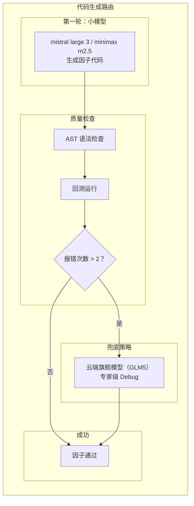

### VNPY 表达式生成优化

LLM 生成的因子代码直接输出为 VNPY 表达式格式：

```python
# vnpy.alpha 表达式系统兼容
from vnpy.alpha import ts_function, cs_function, ta_function

# 时间序列函数: ts_delay, ts_mean, ts_std, ts_rank, ts_corr...
# 截面函数: cs_rank, cs_mean, cs_std...
# 技术分析: ta_rsi, ta_atr, ta_macd...

# LLM 生成的因子代码示例
factor_expression = "ts_delay(close, 5) / close - 1"  # 动量因子
dataset.add_feature("momentum_factor", factor_expression)
```

### 效益分析

| 指标 | 数值 | 说明 |
|------|------|------|
| 疑难杂症处理比例 | < 20% | 仅消耗昂贵的 Token |
| 常规因子生成成本压缩 | 80% | 极低成本完成 |
| 规划阶段成本 | 忽略不计 | 小模型足以生成"动量"、"波动率"等方向 |

---

## 2. 低成本前置质量门控

**可行性评估**：完全可行（架构优化）

这是最直接的"省钱"手段，通过调整代码执行顺序，将昂贵的 LLM 调用延后。

### 实施建议

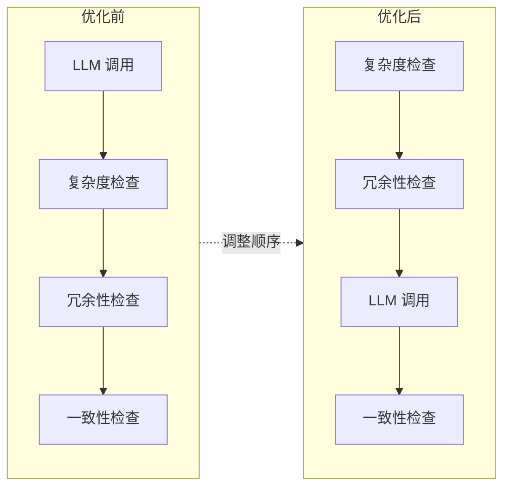

### 硬规则拦截配置

| 拦截类型 | 规则 | 成本 |
|---------|------|------|
| Prompt 长度限制 | 假设文本长度 > 500 字时截断或拒绝 | 零成本 |
| 除零保护 | 正则 / AST 检查 | 零成本 |
| 未来函数检查 | 检查 `shift(-1)` 误用 | 零成本 |

### 效益分析

| 拦截比例 | 节省 API Token |
|---------|---------------|
| 60%-80% 随机生成因子被拦截 | > 50% |

---

## 3. Few-Shot 提示工程

**可行性评估**：完全可行（零成本）

这是提升 LLM 一次通过率（Pass@1）最有效的方法。

### 实施架构

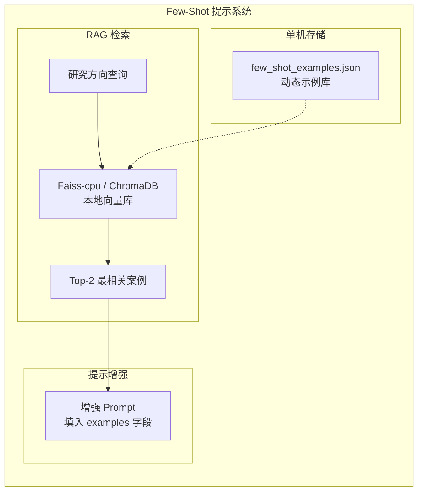

### VNPY 风格示例库

```python
# Few-Shot 示例库 - VNPY 表达式风格
FEW_SHOT_EXAMPLES = [
    {
        "category": "动量因子",
        "factor_name": "Momentum",
        "description": "基于价格动量的因子",
        "code": "ts_delay(close, 5) / close - 1",
        "vnpy_expression": "ts_delay(close, 5) / close - 1"
    },
    {
        "category": "量价因子",
        "factor_name": "Turnover",
        "description": "基于换手率的因子",
        "code": "volume / ts_mean(volume, 20)",
        "vnpy_expression": "volume / ts_mean(volume, 20)"
    },
    {
        "category": "波动率因子",
        "factor_name": "Volatility",
        "description": "基于价格波动的因子",
        "code": "ts_std(close, 20) / ts_mean(close, 20)",
        "vnpy_expression": "ts_std(close, 20) / ts_mean(close, 20)"
    }
]
```

### 单机环境优势

| 优势 | 说明 |
|------|------|
| 零网络延迟 | 本地向量库毫秒级检索 |
| 低成本 | Faiss-cpu / ChromaDB 本地模式 |
| 灵活更新 | 文件系统直接维护示例库 |

---

## 4. Bandit 资源调度与精准修正

**可行性评估**：完全可行（算法优化）

单机算力有限，无法真正"无限并行"。Bandit 算法能将有限的算力用在"最有希望"的轨迹上。

### 调度策略

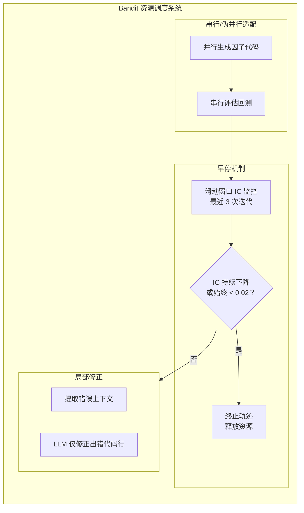

### 早停机制配置

| 参数 | 阈值 | 说明 |
|------|------|------|
| IC 监控窗口 | 3 次迭代 | 滑动窗口大小 |
| IC 低阈值 | 0.02 | 始终低于此值则终止 |
| 终止条件 | IC 持续下降 | 或始终低于阈值 |

### 局部修正效益

| 指标 | 效果 |
|------|------|
| Token 消耗降低 | 一个数量级 |
| 修正精度 | 仅修正出错代码行 |

---

## 5. 三级缓存与经验库

**可行性评估**：完全可行（数据基建）

单机服务器的磁盘 I/O 和内存带宽通常远高于网络带宽，本地缓存收益极高。

### 缓存架构

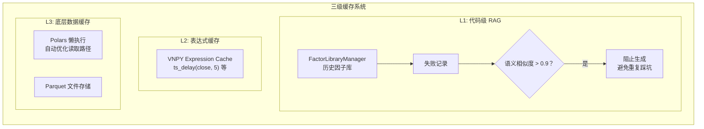

### 缓存层级配置

| 层级 | 类型 | 技术 | 收益 |
|------|------|------|------|
| L1 | 代码级 RAG | FactorLibraryManager | 避免重复失败因子 |
| L2 | 表达式缓存 | VNPY Expression Cache | 中间计算结果复用 |
| L3 | 底层数据 | Polars 懒执行 + Parquet | 内存占用优化 |

---

## 6. 数据层桥接：Parquet → VNPY

**可行性评估**：完全可行（基础设施）

实现 ParquetDatafeed 适配器，将现有数据桥接到 VNPY 数据体系。

### 数据层架构

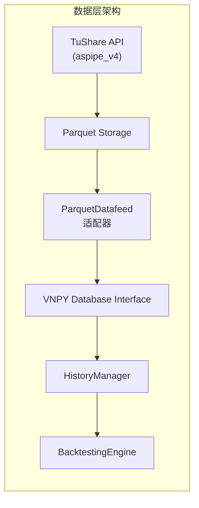

### ParquetDatafeed 实现

```python
# parquet_datafeed.py - VNPY Datafeed 适配器
from vnpy.trader.datafeed import BaseDatafeed
from vnpy.trader.object import BarData, HistoryRequest
from vnpy.trader.constant import Interval
import polars as pl
from datetime import datetime
from pathlib import Path

class ParquetDatafeed(BaseDatafeed):
    """将 aspipe_v4 的 Parquet 数据桥接到 VNPY"""

    def __init__(self, setting: dict):
        self.base_dir = Path(setting.get("base_dir", "../data"))

    def query_bar_history(self, req: HistoryRequest) -> list[BarData]:
        """从 Parquet 加载 K 线数据"""
        interval_map = {
            Interval.DAILY: "daily",
            Interval.MINUTE: "min1",
            Interval.HOUR: "hour1",
        }
        file_path = self.base_dir / f"{interval_map[req.interval]}/{req.symbol}.parquet"

        if not file_path.exists():
            return []

        # 使用 Polars 懒加载
        df = pl.scan_parquet(file_path).filter(
            (pl.col("trade_date") >= req.start.strftime("%Y%m%d")) &
            (pl.col("trade_date") <= req.end.strftime("%Y%m%d"))
        ).collect()

        # 转换为 VNPY BarData 格式
        bars = []
        for row in df.iter_rows(named=True):
            bar = BarData(
                symbol=req.symbol,
                exchange=req.exchange,
                datetime=datetime.strptime(row["trade_date"], "%Y%m%d"),
                interval=req.interval,
                volume=row["vol"],
                turnover=row.get("amount", 0),
                open_interest=row.get("oi", 0),
                open_price=row["open"],
                high_price=row["high"],
                low_price=row["low"],
                close_price=row["close"],
                gateway_name="PARQUET"
            )
            bars.append(bar)

        return bars
```

---

## 7. 事件驱动架构集成

**可行性评估**：完全可行（架构优化）

将异步非阻塞架构直接使用 VNPY 的 EventEngine 实现。

### 事件流架构

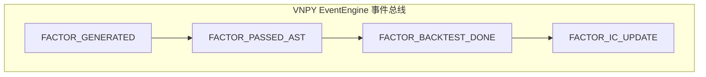

### 事件引擎实现

```python
from vnpy.event import EventEngine, Event
from dataclasses import dataclass
from enum import Enum

class FactorEventType(Enum):
    """因子事件类型"""
    FACTOR_GENERATED = "eFactorGenerated"      # LLM 生成了新因子
    FACTOR_PASSED_AST = "eFactorPassedAST"     # 通过 AST 检查
    FACTOR_BACKTEST_DONE = "eFactorBacktest"   # 回测完成
    FACTOR_IC_UPDATE = "eFactorIC"             # IC 更新
    FACTOR_FAILED = "eFactorFailed"            # 因子失败

@dataclass
class FactorEvent:
    """因子事件数据"""
    factor_code: str
    factor_name: str
    ic_value: float = 0.0
    error_msg: str = ""

class FactorMiningEventEngine:
    """因子挖掘事件引擎"""

    def __init__(self):
        self.event_engine = EventEngine(interval=1)
        self._setup_handlers()

    def _setup_handlers(self):
        """注册事件处理器"""
        self.event_engine.register(
            FactorEventType.FACTOR_GENERATED.value,
            self._on_factor_generated
        )
        self.event_engine.register(
            FactorEventType.FACTOR_PASSED_AST.value,
            self._on_factor_passed_ast
        )
        self.event_engine.register(
            FactorEventType.FACTOR_BACKTEST_DONE.value,
            self._on_factor_backtest_done
        )
        self.event_engine.register(
            FactorEventType.FACTOR_IC_UPDATE.value,
            self._on_ic_update
        )

    def start(self):
        """启动引擎"""
        self.event_engine.start()

    def submit_factor(self, factor_code: str, factor_name: str):
        """提交新因子到流水线"""
        event = Event(
            type=FactorEventType.FACTOR_GENERATED.value,
            data=FactorEvent(factor_code, factor_name)
        )
        self.event_engine.put(event)

    def _on_factor_generated(self, event: Event):
        """处理因子生成事件 - 执行 AST 检查"""
        factor = event.data
        if self._ast_check(factor.factor_code):
            self.event_engine.put(Event(
                type=FactorEventType.FACTOR_PASSED_AST.value,
                data=factor
            ))
        else:
            factor.error_msg = "AST check failed"
            self.event_engine.put(Event(
                type=FactorEventType.FACTOR_FAILED.value,
                data=factor
            ))
```

---

## 8. 因子回测引擎桥接

**可行性评估**：完全可行（核心功能）

将因子计算与 VNPY 回测引擎集成，实现因子→策略→实盘的闭环。

### 回测引擎实现

```python
from vnpy.trader.object import Interval
from vnpy_ctastrategy import CtaTemplate
from datetime import datetime
import polars as pl

class FactorBacktestEngine:
    """因子回测引擎 - 桥接因子计算与 VNPY 回测"""

    def __init__(self, datafeed: ParquetDatafeed):
        self.datafeed = datafeed
        self.engine = BacktestingEngine()

    def backtest_factor(
        self,
        factor_code: str,
        symbol: str,
        exchange: str,
        start: datetime,
        end: datetime,
        initial_capital: float = 1_000_000
    ) -> dict:
        """对单个因子进行回测"""
        # 1. 设置回测参数
        self.engine.set_parameters(
            vt_symbol=f"{symbol}.{exchange}",
            interval=Interval.DAILY,
            start=start,
            end=end,
            rate=0.0003,
            slippage=0.01,
            size=1,
            pricetick=0.01,
            capital=initial_capital
        )

        # 2. 创建因子策略
        strategy_class = self._create_factor_strategy(factor_code)
        self.engine.add_strategy(strategy_class, {})

        # 3. 运行回测
        self.engine.load_data()
        self.engine.run_backtesting()

        # 4. 计算结果
        df_result = self.engine.calculate_result()
        stats = self.engine.calculate_statistics()

        return {
            "sharpe_ratio": stats.get("sharpe_ratio", 0),
            "max_drawdown": stats.get("max_drawdown", 0),
            "annual_return": stats.get("annual_return", 0),
            "daily_results": df_result
        }

    def _create_factor_strategy(self, factor_code: str):
        """根据因子代码动态创建 VNPY 策略类"""

        class FactorStrategy(CtaTemplate):
            """因子驱动策略"""
            author = "FactorMining"

            # 因子参数
            factor_code = factor_code
            stop_loss = 0.05
            take_profit = 0.10

            def __init__(self, cta_engine, strategy_name, vt_symbol, setting):
                super().__init__(cta_engine, strategy_name, vt_symbol, setting)
                self.factor_value = 0
                self.close_array = []

            def on_bar(self, bar):
                """K 线回调 - 计算因子并交易"""
                self.close_array.append(bar.close_price)
                if len(self.close_array) < 20:
                    return

                # 计算因子信号
                signal = self._evaluate_factor(bar)

                if signal > 0.02 and self.pos == 0:
                    self.buy(bar.close_price * 1.01, 100)
                elif signal < -0.02 and self.pos > 0:
                    self.sell(bar.close_price * 0.99, abs(self.pos))

            def _evaluate_factor(self, bar):
                """评估因子值"""
                # 根据 factor_code 解析并计算
                # 示例：动量因子
                if len(self.close_array) >= 5:
                    return self.close_array[-5] / bar.close_price - 1
                return 0.0

        return FactorStrategy
```

---

## 9. 完整集成架构

### 9.1 组件层级架构图

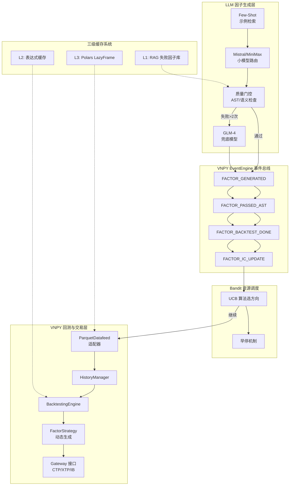

### 9.2 端到端完整流程图（时序视角）

以下流程图展示了从**研究方向输入**到**实盘交易信号**的完整数据流：

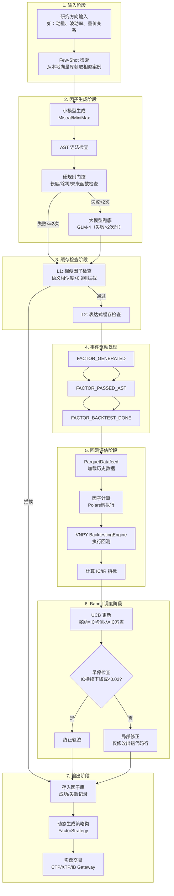

---

## 10. 异步非阻塞架构（补充建议）

针对单机环境"CPU 计算（回测）"和"GPU 推理/网络请求（LLM）"串行等待的问题。

### 架构设计

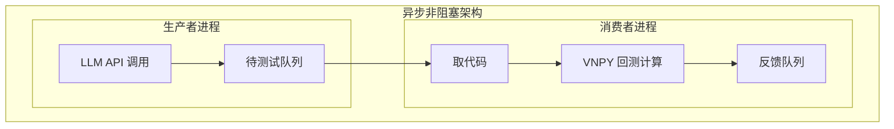

### 效果分析

| 指标 | 提升效果 |
|------|---------|
| 系统吞吐量 | 提升近 2 倍 |
| 资源利用率 | LLM 生成与回测计算时间重叠 |

---

## 11. 内存溢出保护（补充建议）

因子挖掘极易发生内存泄漏（如生成无限大的中间变量）。

### 保护机制

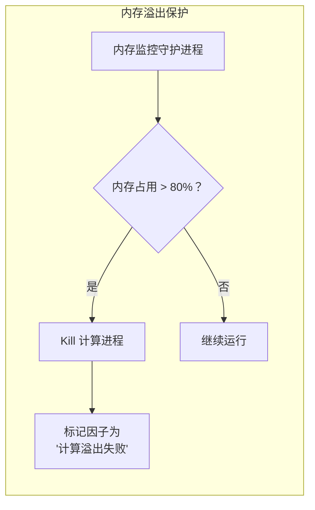

### 配置参数

| 参数 | 建议值 | 说明 |
|------|--------|------|
| 内存阈值 | 单机总内存 80% | 触发保护阈值 |
| 处理方式 | Kill + 标记 | 防止系统崩溃 |

---

## 优化策略总览

| 策略 | 可行性 | 核心收益 | 实施难度 |
|------|--------|---------|---------|
| 云端大小模型协同 | 完全可行 | 减少昂贵模型调用频次 | 中 |
| 低成本前置门控 | 完全可行 | 拦截无效计算，节省 >50% Token | 低 |
| Few-Shot 提示工程 | 完全可行 | 提高单次成功率 | 低 |
| Bandit 资源调度 | 完全可行 | 集中资源于高潜力方向 | 中 |
| 三级缓存与经验库 | 完全可行 | 避免重复造轮子 | 中 |
| 数据层桥接 | 完全可行 | 复用现有 Parquet 数据 | 低 |
| 事件驱动架构 | 完全可行 | 代码量减少 50% | 中 |
| 因子回测桥接 | 完全可行 | 因子→策略→实盘闭环 | 中 |
| 异步非阻塞架构 | 完全可行 | 吞吐量提升 2 倍 | 中 |
| 内存溢出保护 | 完全可行 | 防止系统崩溃 | 低 |

---

## 总结

以上优化策略在单机环境下**均切实可行**，且构成了一个完整的成本控制闭环：

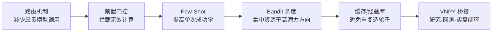

### 预期效益

| 指标 | 效果 |
|------|------|
| 因子挖掘效率 | 逼近多卡集群 |
| API 成本降低 | > 70% |
| 系统稳定性 | 内存溢出保护 |
| 实盘化效率 | 因子验证通过后可立即上线 |

### 推荐实施路径

1. **第一阶段**: 实现 ParquetDatafeed 适配器，打通数据层
2. **第二阶段**: 集成 EventEngine 替换自建事件系统
3. **第三阶段**: 实现因子→VNPY 策略的动态转换
4. **第四阶段**: 接入 VNPY Gateway 实现实盘交易

---

## 关键依赖仓库

| 仓库 | 用途 | 部署方式 | GitHub URL |
|------|------|----------|------------|
| QuantaAlpha | LLM 驱动的因子挖掘系统 | 本地部署 | https://github.com/QuantaAlpha/QuantaAlpha |
| VNPY | 量化交易框架 | 本地部署 | https://github.com/vnpy/vnpy |
| vnpy_ctastrategy | VNPY CTA策略回测模块 | 本地部署 | https://github.com/vnpy/vnpy_ctastrategy |
| Qlib | 量化投资平台，提供因子回测框架 | 本地部署 | https://github.com/microsoft/qlib |
| Faiss | 向量相似度搜索库（CPU版本） | **本地部署** | https://github.com/facebookresearch/faiss |
| ChromaDB | 本地向量数据库 | **本地部署** | https://github.com/chroma-core/chroma |
| Polars | 高性能数据处理库 | 本地部署 | https://github.com/pola-rs/polars |

### 本地部署组件说明

以下组件在**单机本地环境**部署，无需外部网络依赖：

| 组件 | 本地部署理由 | 配置建议 |
|------|-------------|----------|
| **Faiss-cpu** | 零网络延迟，毫秒级向量检索 | 使用CPU版本即可，单机因子库规模无需GPU |
| **ChromaDB** | 本地模式运行，文件系统直接维护 | 持久化存储Few-Shot示例库和失败因子记录 |
| **VNPY** | 核心交易框架必须本地运行 | 配合ParquetDatafeed适配器使用 |
| **Polars** | 本地数据处理，懒执行优化内存 | 替代Pandas处理大规模Parquet文件 |
