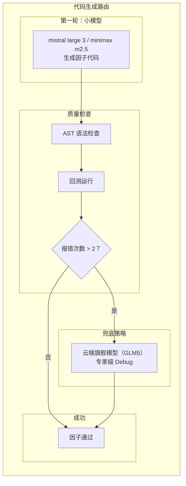
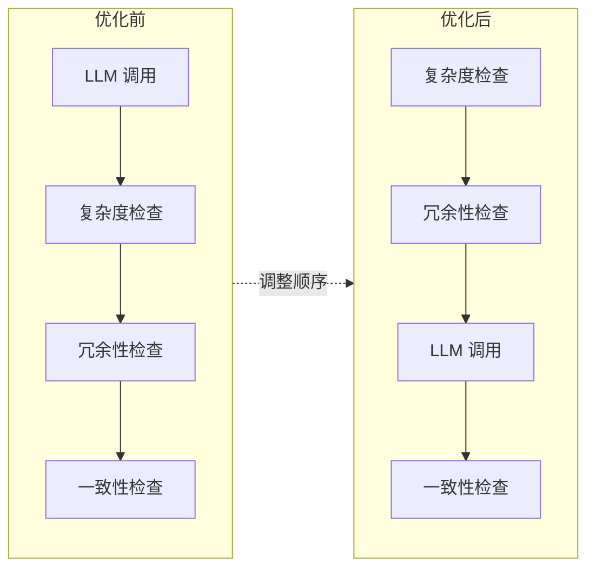
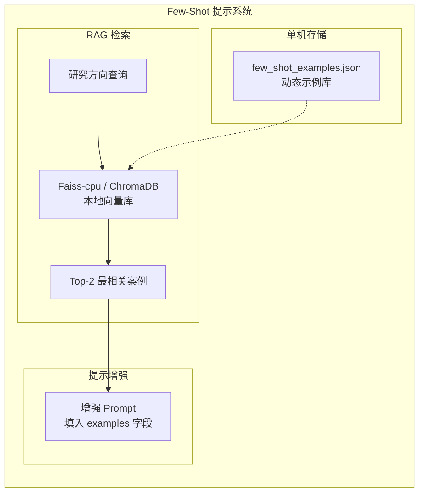
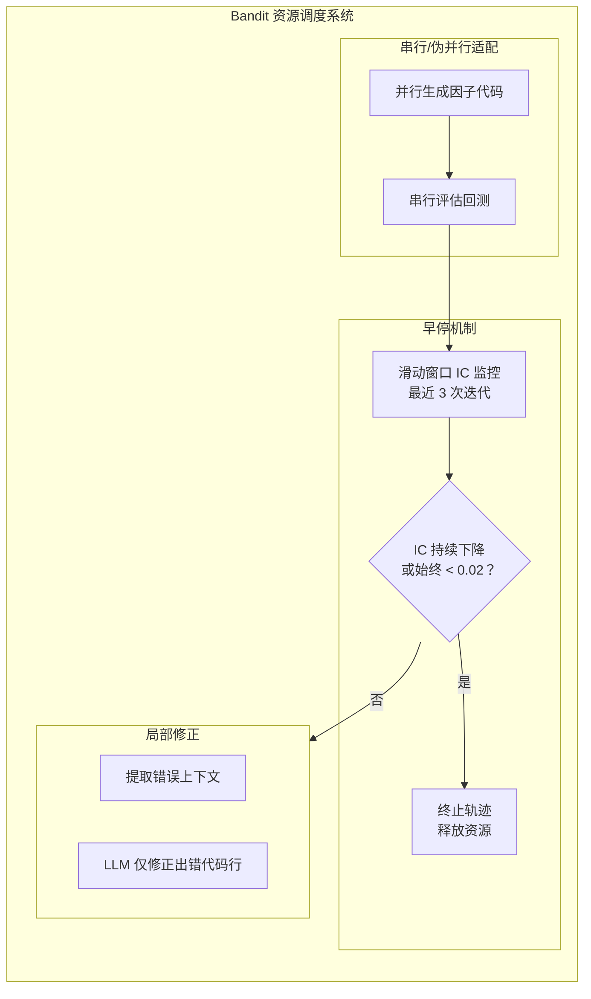
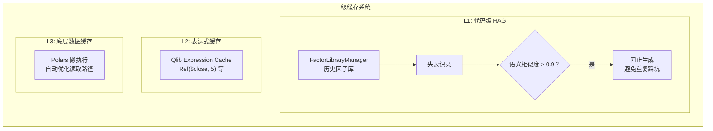
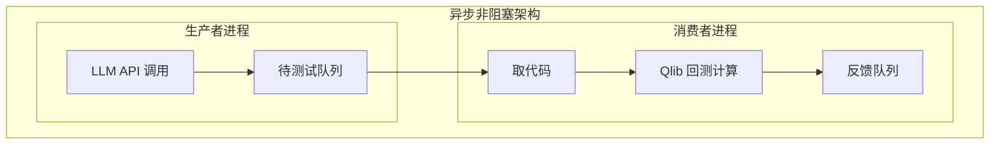
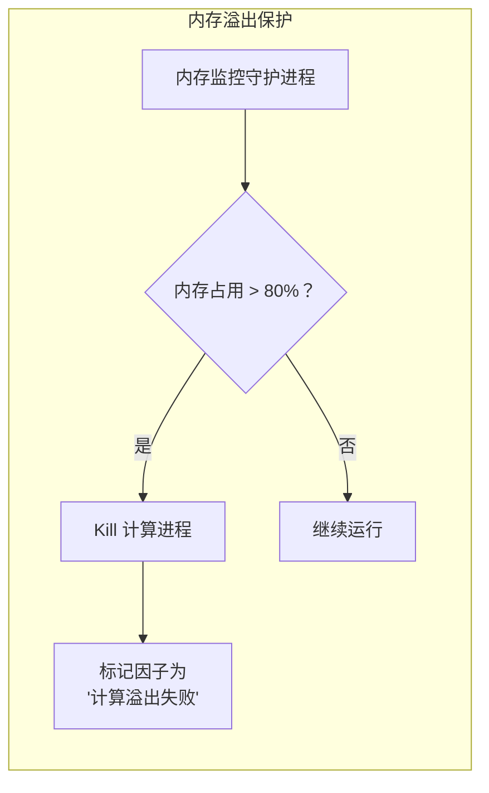
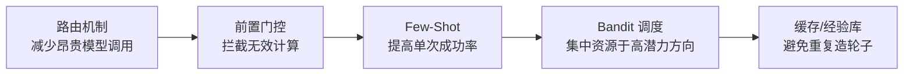

# QuantaAlpha 单机环境优化策略分析

基于 QuantaAlpha 系统架构和量化大模型研究背景，针对**单机服务器 + LLM API 调用**这一资源受限场景，以下五项优化策略不仅**完全可行**，而且是极高性价比的必选项。

---

## 1. 云端大小模型协同路由机制

**可行性评估**：完全可行（极高性价比）

放弃本地部署，利用云端 API 的巨大价格差异构建分层路由。主流厂商的"轻量版"模型价格通常仅为旗舰模型的 1/10 ~ 1/50，非常适合处理海量繁杂的初步任务。

### 分工边界与路由策略

| 阶段 | 模型选择 | 理由 |
|------|---------|------|
| 规划阶段 (PlanningLLM) | 云端小模型（mistral large 3 / minimax m2.5） | 任务分解和方向探索主要依赖常规逻辑推理，不需要顶级的数学推导能力 |
| 代码转换 (factor_construct) | 小模型先行，大模型兜底 | 80% 常规因子生成成本被压缩至极低 |
| 语义检查 (consistency_checker) | 云端小模型 | 语义一致性检查本质是文本比对和简单逻辑校验，属于低创造性任务 |

### 代码转换路由策略



### 效益分析

| 指标 | 数值 | 说明 |
|------|------|------|
| 疑难杂症处理比例 | < 20% | 仅消耗昂贵的 Token |
| 常规因子生成成本压缩 | 80% | 极低成本完成 |
| 规划阶段成本 | 忽略不计 | 小模型足以生成"动量"、"波动率"等方向 |

---

## 2. 低成本前置质量门控

**可行性评估**：完全可行（架构优化）

这是最直接的"省钱"手段，通过调整代码执行顺序，将昂贵的 LLM 调用延后。

### 实施建议



### 硬规则拦截配置

| 拦截类型 | 规则 | 成本 |
|---------|------|------|
| Prompt 长度限制 | 假设文本长度 > 500 字时截断或拒绝 | 零成本 |
| 除零保护 | 正则 / AST 检查 | 零成本 |
| 未来函数检查 | 检查 `shift(-1)` 误用 | 零成本 |

### 效益分析

| 拦截比例 | 节省 API Token |
|---------|---------------|
| 60%-80% 随机生成因子被拦截 | > 50% |

---

## 3. Few-Shot 提示工程

**可行性评估**：完全可行（零成本）

这是提升 LLM 一次通过率（Pass@1）最有效的方法。

### 实施架构



### 示例库结构

```json
{
  "examples": [
    {
      "category": "量价因子",
      "factor_name": "Momentum",
      "description": "基于价格动量的因子",
      "code": "Ref($close, 5) / $close - 1"
    },
    {
      "category": "量价因子",
      "factor_name": "Turnover",
      "description": "基于换手率的因子",
      "code": "$volume / $circulating_market_cap"
    }
  ]
}
```

### 单机环境优势

| 优势 | 说明 |
|------|------|
| 零网络延迟 | 本地向量库毫秒级检索 |
| 低成本 | Faiss-cpu / ChromaDB 本地模式 |
| 灵活更新 | 文件系统直接维护示例库 |

---

## 4. Bandit 资源调度与精准修正

**可行性评估**：完全可行（算法优化）

单机算力有限，无法真正"无限并行"。Bandit 算法能将有限的算力用在"最有希望"的轨迹上。

### 调度策略



### 早停机制配置

| 参数 | 阈值 | 说明 |
|------|------|------|
| IC 监控窗口 | 3 次迭代 | 滑动窗口大小 |
| IC 低阈值 | 0.02 | 始终低于此值则终止 |
| 终止条件 | IC 持续下降 | 或始终低于阈值 |

### 局部修正效益

| 指标 | 效果 |
|------|------|
| Token 消耗降低 | 一个数量级 |
| 修正精度 | 仅修正出错代码行 |

---

## 5. 三级缓存与经验库

**可行性评估**：完全可行（数据基建）

单机服务器的磁盘 I/O 和内存带宽通常远高于网络带宽，本地缓存收益极高。

### 缓存架构



### 缓存层级配置

| 层级 | 类型 | 技术 | 收益 |
|------|------|------|------|
| L1 | 代码级 RAG | FactorLibraryManager | 避免重复失败因子 |
| L2 | 表达式缓存 | Qlib Expression Cache | 中间计算结果复用 |
| L3 | 底层数据 | Polars 懒执行 | 内存占用优化 |

---

## 6. 异步非阻塞架构（补充建议）

针对单机环境"CPU 计算（回测）"和"GPU 推理/网络请求（LLM）"串行等待的问题。

### 架构设计



### 效果分析

| 指标 | 提升效果 |
|------|---------|
| 系统吞吐量 | 提升近 2 倍 |
| 资源利用率 | LLM 生成与回测计算时间重叠 |

---

## 7. 内存溢出保护（补充建议）

因子挖掘极易发生内存泄漏（如生成无限大的中间变量）。

### 保护机制



### 配置参数

| 参数 | 建议值 | 说明 |
|------|--------|------|
| 内存阈值 | 单机总内存 80% | 触发保护阈值 |
| 处理方式 | Kill + 标记 | 防止系统崩溃 |

---

## 优化策略总览

| 策略 | 可行性 | 核心收益 | 实施难度 |
|------|--------|---------|---------|
| 云端大小模型协同 | 完全可行 | 减少昂贵模型调用频次 | 中 |
| 低成本前置门控 | 完全可行 | 拦截无效计算，节省 >50% Token | 低 |
| Few-Shot 提示工程 | 完全可行 | 提高单次成功率 | 低 |
| Bandit 资源调度 | 完全可行 | 集中资源于高潜力方向 | 中 |
| 三级缓存与经验库 | 完全可行 | 避免重复造轮子 | 中 |
| 异步非阻塞架构 | 完全可行 | 吞吐量提升 2 倍 | 中 |
| 内存溢出保护 | 完全可行 | 防止系统崩溃 | 低 |

---

## 总结

以上优化策略在单机环境下**均切实可行**，且构成了一个完整的成本控制闭环：



### 预期效益

| 指标 | 效果 |
|------|------|
| 因子挖掘效率 | 逼近多卡集群 |
| API 成本降低 | > 70% |
| 系统稳定性 | 内存溢出保护 |

---

## 关键依赖仓库

| 仓库 | 用途 | GitHub URL |
|------|------|------------|
| QuantaAlpha | LLM 驱动的因子挖掘系统 | https://github.com/QuantaAlpha/QuantaAlpha |
| Qlib | 量化投资平台，提供因子回测框架 | https://github.com/microsoft/qlib |
| Faiss | 向量相似度搜索库 | https://github.com/facebookresearch/faiss |
| ChromaDB | 本地向量数据库 | https://github.com/chroma-core/chroma |
| Polars | 高性能数据处理库 | https://github.com/pola-rs/polars |
