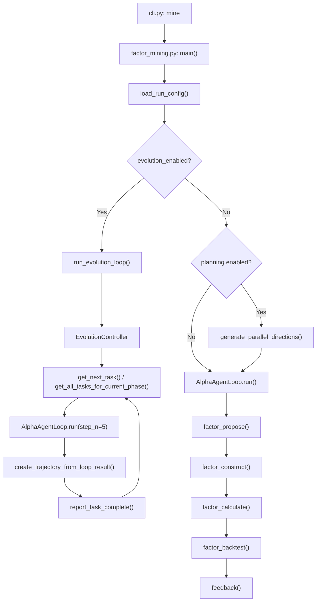
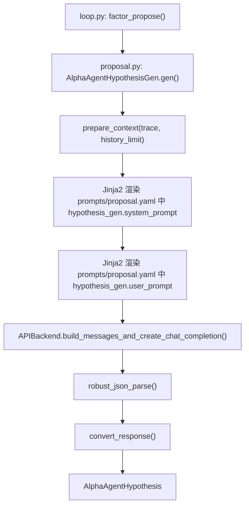
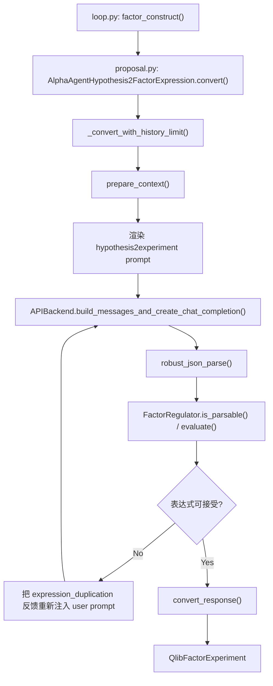
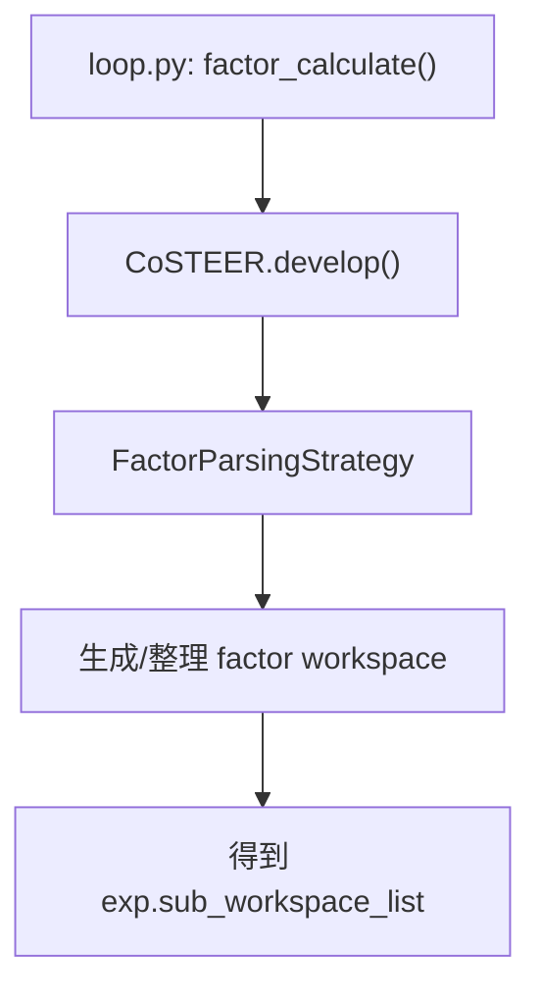
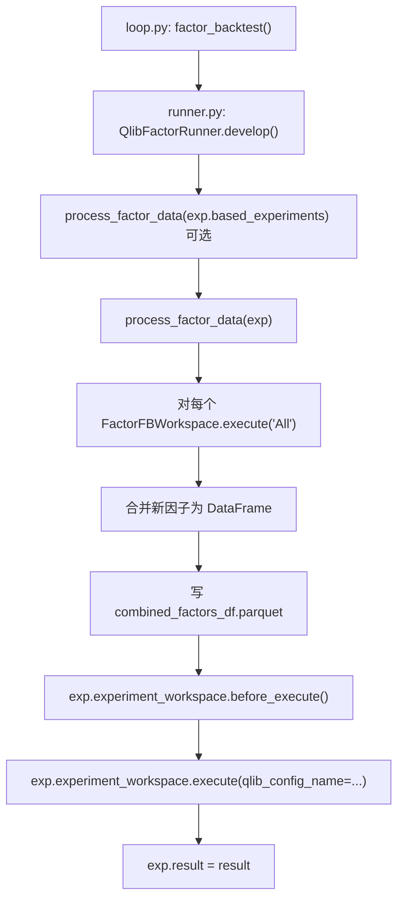
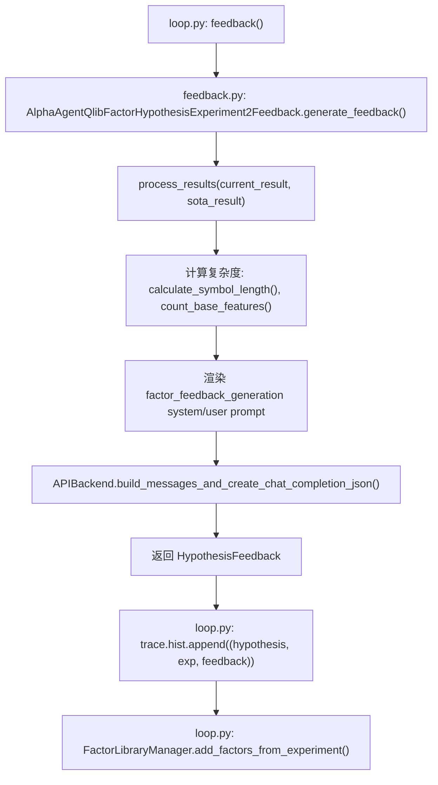
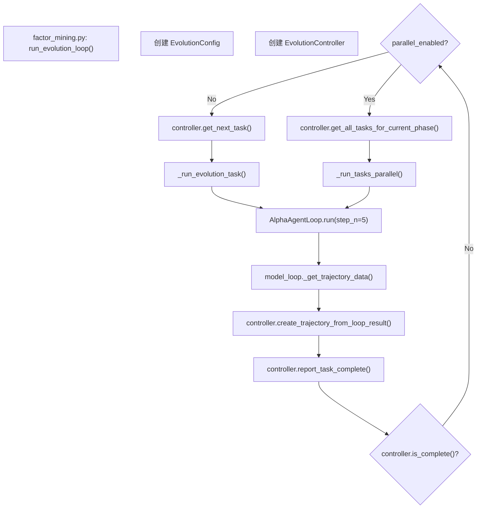

# QuantaAlpha 因子挖掘流程详解（按当前代码实现）

本文档基于当前仓库 `/home/quan/testdata/aspipe_v4/third_party/quantaalpha` 的实际代码整理，描述的是“当前实现”，不是抽象设计稿。

---

## 1. 当前项目中与因子挖掘直接相关的结构

```text
quantaalpha/
├── cli.py
├── pipeline/
│   ├── factor_mining.py              # 主入口
│   ├── loop.py                       # AlphaAgentLoop，5 个步骤
│   ├── planning.py                   # 方向扩展（可选）
│   ├── settings.py                   # 组件类路径配置
│   └── evolution/
│       ├── controller.py             # EvolutionController + EvolutionConfig
│       ├── mutation.py
│       ├── crossover.py
│       └── trajectory.py
├── factors/
│   ├── proposal.py                   # Step 1/2
│   ├── qlib_coder.py                 # coder 别名导出
│   ├── runner.py                     # Step 4
│   ├── feedback.py                   # Step 5 中“生成反馈”的部分
│   ├── workspace.py                  # qlib 回测 workspace 封装
│   ├── library.py                    # 因子库写入
│   ├── factor_template/
│   │   ├── conf_baseline.yaml
│   │   └── conf_combined_factors.yaml
│   ├── prompts/
│   │   ├── prompts.yaml
│   │   └── proposal.yaml
│   ├── regulator/
│   │   ├── factor_regulator.py
│   │   └── consistency_checker.py
│   └── coder/
│       ├── __init__.py               # FactorParser / FactorCoder / FactorCoSTEER
│       ├── factor.py                 # FactorTask / FactorFBWorkspace
│       ├── factor_ast.py
│       ├── evolving_strategy.py
│       └── config.py
├── llm/
│   └── client.py
└── utils/
    └── workflow.py                   # LoopBase.run()
```

说明：

- `pipeline/settings.py` 里没有 `EvolutionConfig`，它在 `pipeline/evolution/controller.py`。
- `factors/qlib_coder.py` 不是核心实现文件，只是把 `QlibFactorParser = FactorParser` 等别名导出。

---

## 2. 总体入口

CLI 入口在 `quantaalpha/cli.py`：

```python
fire.Fire(
    {
        "mine": mine,
        "backtest": backtest,
        "health_check": health_check,
        "collect_info": collect_info,
    }
)
```

其中：

- `mine` 指向 `quantaalpha.pipeline.factor_mining.main`
- 因子挖掘主流程入口是 `quantaalpha/pipeline/factor_mining.py:main()`

---

## 3. 运行模式

`factor_mining.main()` 有两种主模式：

1. 普通模式
   - 直接跑 `AlphaAgentLoop`
   - 可选先做 planning，把一个方向扩成多个方向
   - 可选多进程并行跑多个 branch

2. evolution 模式
   - 调 `run_evolution_loop()`
   - 按 `Original -> Mutation -> Crossover -> ...` 调度多个小 loop

注意：

- planning 不是必经阶段，只有配置 `planning.enabled=true` 时才启用。
- evolution 也不是默认启用，取决于 `evolution.enabled` 或 CLI 的 `evolution_mode`。

---

## 4. 主流程图



---

## 5. `AlphaAgentLoop` 的真实 5 步

`AlphaAgentLoop` 定义在 `quantaalpha/pipeline/loop.py`，5 个步骤由 `LoopMeta` 自动收集，实际运行由 `quantaalpha/utils/workflow.py:LoopBase.run()` 驱动。

真实步骤顺序就是：

1. `factor_propose`
2. `factor_construct`
3. `factor_calculate`
4. `factor_backtest`
5. `feedback`

`LoopBase.run()` 每执行完一步都会：

- 把结果写入 `self.loop_prev_out`
- 更新 `step_idx`
- 每轮结束后清空 `loop_prev_out`
- 持久化 session snapshot

---

## 6. Step 1: 假设生成

### 入口

`AlphaAgentLoop.factor_propose()`：

```python
idea = self.hypothesis_generator.gen(self.trace)
```

这里 `self.hypothesis_generator` 由 `pipeline/settings.py` 的类路径配置注入，当前 AlphaAgent 模式下对应：

```python
quantaalpha.factors.proposal.AlphaAgentHypothesisGen
```

### 实际执行链



### 当前实现特点

- 支持 `history_limit` 递减重试，避免输入过长。
- 第一轮如果有 `potential_direction`，会先把它转成 prompt 上下文。
- 返回类型是 `AlphaAgentHypothesis`。

---

## 7. Step 2: 因子构造

### 入口

`AlphaAgentLoop.factor_construct()`：

```python
factor = self.factor_constructor.convert(prev_out["factor_propose"], self.trace)
```

当前实现绑定类：

```python
quantaalpha.factors.proposal.AlphaAgentHypothesis2FactorExpression
```

### 实际执行链



### 当前实现特点

- 同样支持 `history_limit` 递减重试。
- `FactorRegulator` 会检查：
  - 是否可解析
  - 表达式质量是否可接受
- 如果开启 `consistency_enabled`，还会懒加载 `FactorQualityGate` 做一致性/复杂度/冗余检查。
- 最终返回 `QlibFactorExperiment`，其中包含 `FactorTask` 列表。

---

## 8. Step 3: 因子计算

### 入口

`AlphaAgentLoop.factor_calculate()`：

```python
factor = self.coder.develop(prev_out["factor_construct"])
```

当前 `coder` 配置是：

```python
quantaalpha.factors.qlib_coder.QlibFactorParser
```

但这只是别名，真实组装发生在 `quantaalpha/factors/coder/__init__.py`：

```python
QlibFactorParser = FactorParser
```

`FactorParser` 本质上是一个配置好的 `CoSTEER`：

- evaluator: `FactorEvaluatorForCoder`
- strategy: `FactorParsingStrategy`

### 实际执行链



### 关键说明

- 文档不能写成“`factors/qlib_coder.py` 里实现了解析逻辑”，因为那里只是别名导出。
- `develop()` 不是在 `factors/coder/__init__.py` 里手写定义的，而是继承来的。

---

## 9. Step 4: 因子回测

### 入口

`AlphaAgentLoop.factor_backtest()`：

```python
exp = self.runner.develop(prev_out["factor_calculate"], use_local=self.use_local)
```

当前实现类：

```python
quantaalpha.factors.runner.QlibFactorRunner
```

### 实际执行链



### 当前实现特点

- `process_factor_data()` 内部会通过 `multiprocessing_wrapper()` 执行每个 `FactorFBWorkspace.execute("All")`。
- `FactorFBWorkspace.execute()` 会：
  - 把 `factor.py` 写到 workspace
  - 链接数据文件
  - 运行脚本生成 `result.h5`
  - 读回 DataFrame
- `QlibFBWorkspace` 在 `before_execute()` 中会额外 `git init` 一个空仓库，减少 qlib recorder 的 git 噪音。

### 一个容易误写的点

当前代码里虽然保留了 `deduplicate_new_factors()`，但实际合并 SOTA 因子的分支是关闭的：

```python
if False:
    ...
else:
    combined_factors = new_factors
```

也就是说，当前真实行为是：

- 会尝试处理 `based_experiments`
- 但最终不会把 `SOTA_factor` 真正和 `new_factors` 拼接进入当前回测输入
- 最终写入 parquet 的是 `new_factors`

---

## 10. Step 5: 反馈生成

这一节最容易被写错。需要区分：

1. `feedback.py`
   - 负责“生成反馈内容”
2. `loop.py`
   - 负责“把反馈写回 trace 和因子库”

### 入口

`AlphaAgentLoop.feedback()`：

```python
feedback = self.summarizer.generate_feedback(
    prev_out["factor_backtest"],
    prev_out["factor_propose"],
    self.trace,
)
```

### 实际执行链



### 当前实现特点

- `feedback.py` 负责：
  - 取 `exp.result`
  - 取 `based_experiments[-1].result` 作为对照结果（如果有）
  - 计算复杂度提示
  - 调 LLM 生成 `HypothesisFeedback`
- `trace.hist.append(...)` 不在 `feedback.py`，而在 `pipeline/loop.py`
- `FactorLibraryManager.add_factors_from_experiment(...)` 也不在 `feedback.py`，而在 `pipeline/loop.py`

---

## 11. Planning 的真实作用

`quantaalpha/pipeline/planning.py` 只有两个核心函数：

1. `generate_parallel_directions()`
2. `load_run_config()`

### `generate_parallel_directions()` 的真实行为

- 从 `planning_prompts.yaml` 读 prompt
- 调 LLM 生成 JSON 格式的 `directions`
- 解析失败会重试
- 如果多次失败，且允许 fallback，就返回内置模板方向

### 注意

- planning 不是独立 pipeline 阶段，只是“生成多个方向”的辅助过程。
- 它可能出现在：
  - evolution 模式入口前
  - 非 evolution 模式下的 branch 扩展前

---

## 12. Evolution 模式的真实流程

`run_evolution_loop()` 在 `quantaalpha/pipeline/factor_mining.py` 中定义。

`EvolutionConfig` 和 `EvolutionController` 定义在 `quantaalpha/pipeline/evolution/controller.py`。

### 实际主链



### 任务是怎么生成的

`EvolutionController` 会在不同 phase 下生成 task：

- `ORIGINAL`
  - 每个 planning direction 各跑一条初始轨迹
- `MUTATION`
  - 选择上一阶段轨迹，生成 `strategy_suffix`
- `CROSSOVER`
  - 组合多个 parent trajectory，生成 `strategy_suffix`

### 文档里容易误写的点

- `MutationOperator.generate_mutation()` 和 `CrossoverOperator.generate_crossover()` 这些函数存在，但当前 loop 调度时真正直接用到的是：
  - `generate_mutation_prompt_suffix()`
  - `generate_crossover_prompt_suffix()`
- 这些 suffix 会传给 `AlphaAgentLoop`，并拼到 `potential_direction` 后面，影响假设生成阶段。

---

## 13. 配置绑定关系

`pipeline/settings.py` 中，AlphaAgent 因子挖掘当前绑定如下：

```python
scen = "quantaalpha.factors.experiment.QlibAlphaAgentScenario"
hypothesis_gen = "quantaalpha.factors.proposal.AlphaAgentHypothesisGen"
hypothesis2experiment = "quantaalpha.factors.proposal.AlphaAgentHypothesis2FactorExpression"
coder = "quantaalpha.factors.qlib_coder.QlibFactorParser"
runner = "quantaalpha.factors.runner.QlibFactorRunner"
summarizer = "quantaalpha.factors.feedback.AlphaAgentQlibFactorHypothesisExperiment2Feedback"
```

这决定了 `AlphaAgentLoop` 里 5 个步骤分别落到哪些实现类。

---

## 14. 一版更贴近当前代码的调用摘要

```text
cli.py
  -> pipeline.factor_mining.main()
     -> load_run_config()
     -> [optional] generate_parallel_directions()
     -> [optional] run_evolution_loop()
     -> AlphaAgentLoop.run()
        -> factor_propose()
           -> AlphaAgentHypothesisGen.gen()
        -> factor_construct()
           -> AlphaAgentHypothesis2FactorExpression.convert()
        -> factor_calculate()
           -> QlibFactorParser(FactorParser/CoSTEER).develop()
        -> factor_backtest()
           -> QlibFactorRunner.develop()
        -> feedback()
           -> AlphaAgentQlibFactorHypothesisExperiment2Feedback.generate_feedback()
           -> trace.hist.append(...)
           -> FactorLibraryManager.add_factors_from_experiment(...)
```

---

## 15. 当前版本最重要的事实校正

如果只记 6 条，记这 6 条就够了：

1. `EvolutionConfig` 在 `pipeline/evolution/controller.py`，不在 `pipeline/settings.py`
2. planning 是可选的，不是必经阶段
3. `qlib_coder.py` 只是别名导出，不是核心逻辑实现地
4. Step 5 里“生成反馈”在 `feedback.py`，但“写 trace / 写因子库”在 `loop.py`
5. `QlibFactorRunner` 当前最终实际用的是 `new_factors`，不是 `SOTA_factor + new_factors`
6. `AlphaAgentLoop` 的 5 步实际由 `LoopBase.run()` 驱动

---

## 16. 参考文件

- `/home/quan/testdata/aspipe_v4/third_party/quantaalpha/quantaalpha/cli.py`
- `/home/quan/testdata/aspipe_v4/third_party/quantaalpha/quantaalpha/pipeline/factor_mining.py`
- `/home/quan/testdata/aspipe_v4/third_party/quantaalpha/quantaalpha/pipeline/loop.py`
- `/home/quan/testdata/aspipe_v4/third_party/quantaalpha/quantaalpha/pipeline/planning.py`
- `/home/quan/testdata/aspipe_v4/third_party/quantaalpha/quantaalpha/pipeline/settings.py`
- `/home/quan/testdata/aspipe_v4/third_party/quantaalpha/quantaalpha/pipeline/evolution/controller.py`
- `/home/quan/testdata/aspipe_v4/third_party/quantaalpha/quantaalpha/factors/proposal.py`
- `/home/quan/testdata/aspipe_v4/third_party/quantaalpha/quantaalpha/factors/coder/__init__.py`
- `/home/quan/testdata/aspipe_v4/third_party/quantaalpha/quantaalpha/factors/coder/factor.py`
- `/home/quan/testdata/aspipe_v4/third_party/quantaalpha/quantaalpha/factors/runner.py`
- `/home/quan/testdata/aspipe_v4/third_party/quantaalpha/quantaalpha/factors/feedback.py`
- `/home/quan/testdata/aspipe_v4/third_party/quantaalpha/quantaalpha/factors/workspace.py`
- `/home/quan/testdata/aspipe_v4/third_party/quantaalpha/quantaalpha/utils/workflow.py`
