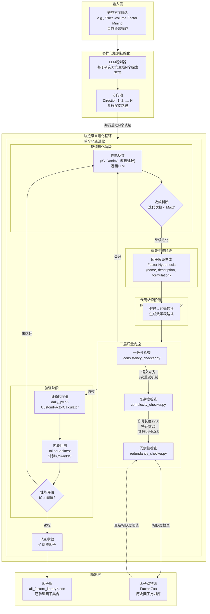
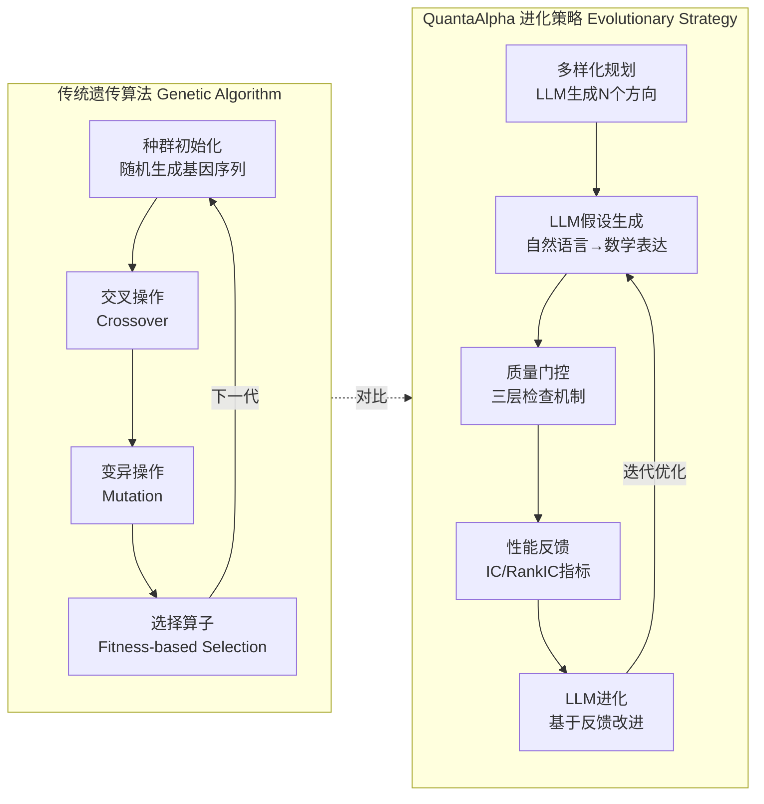
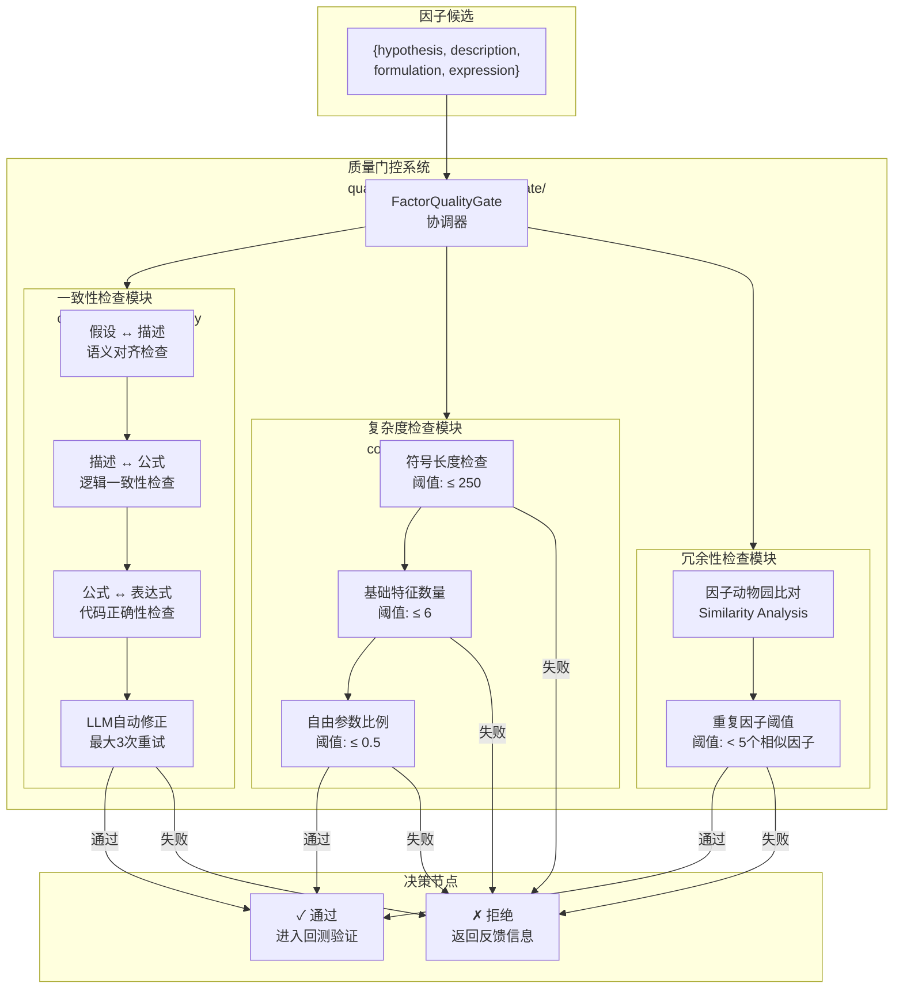
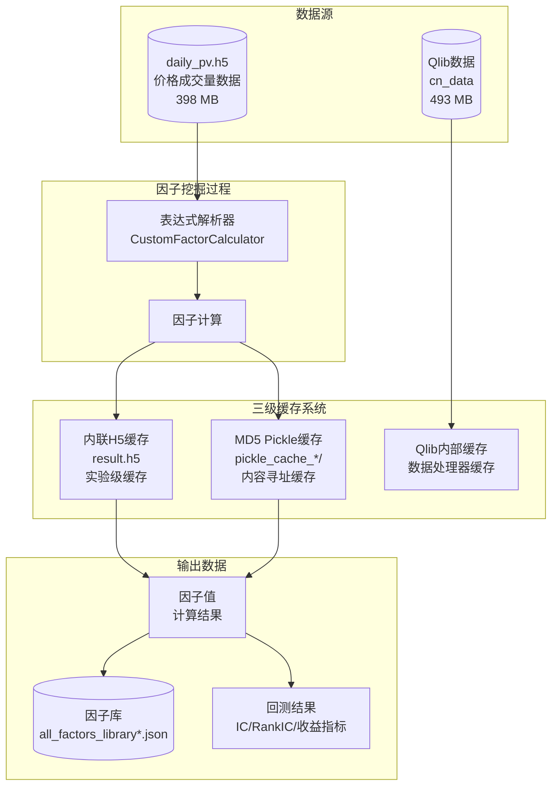

# QuantaAlpha 因子挖掘流程图

## 1. 整体因子挖掘流程（LLM + 进化策略混合架构）

---

## 2. 进化策略 vs 传统遗传算法对比

### 关键差异

| 维度 | 传统遗传算法 | QuantaAlpha进化策略 |
|------|-------------|-------------------|
| **搜索机制** | 随机交叉、变异 | LLM驱动的有针对性改进 |
| **表示方式** | 基因编码（二进制/实数） | 自然语言假设 + 数学表达式 |
| **变异操作** | 随机位翻转/数值扰动 | LLM基于反馈的语义改写 |
| **选择压力** | 适应度函数排序 | 质量门控三层筛选 |
| **并行策略** | 种群并行 | 多轨迹并行进化 |
| **收敛判断** | 代数限制/适应度 plateau | IC阈值 + 迭代次数限制 |

---

## 3. 质量门控详细流程

---

## 4. 数据流与缓存架构

---

## 5. 质量门控阈值说明

| 检查类型 | 指标 | 阈值 | 目的 |
|---------|------|------|------|
| 一致性 | LLM对齐分数 | 通过/失败，3次重试 | 确保语义正确性 |
| 复杂度 | 符号长度 | ≤ 250 | 防止过度复杂的表达式 |
| 复杂度 | 基础特征数量 | ≤ 6 | 限制特征维度 |
| 复杂度 | 自由参数比例 | ≤ 0.5 | 控制参数空间 |
| 冗余性 | 相似因子数量 | < 5 | 避免因子库重复 |

---

## 6. 关键性能指标

| 指标类别 | 指标 | 数值 | 说明 |
|---------|------|------|------|
| 预测能力 | IC (Information Coefficient) | 0.1501 | 与未来收益的相关性 |
| 预测能力 | Rank IC | 0.1465 | 排名IC |
| 策略收益 | 年化超额收益 (ARR) | 27.75% | 相对基准的超额收益 |
| 风险指标 | 最大回撤 (MDD) | 7.98% | 最大资金回撤 |
| 风险调整 | Calmar比率 (CR) | 3.4774 | 收益与风险比率 |

---

## 7. 核心代码映射

| 功能模块 | 文件路径 | 关键类/函数 |
|---------|---------|------------|
| CLI入口 | `run.sh` | 调用 `quantaalpha.cli mine` |
| 挖掘命令 | `quantaalpha/cli.py` | `mine()` 主协调器 |
| 多样化规划 | `quantaalpha/scenario/` | Planning Stage |
| 轨迹进化 | `quantaalpha/` | `evolve_single_trajectory()` |
| 假设生成 | `quantaalpha/` | Factor Hypothesis Generation |
| 代码转换 | `quantaalpha/` | `hypothesis_code_translator()` |
| 质量门控 | `quantaalpha/factor_quality_gate/` | `FactorQualityGate.check()` |
| 一致性检查 | `quantaalpha/factor_quality_gate/consistency_checker.py` | LLM对齐检查 |
| 复杂度检查 | `quantaalpha/factor_quality_gate/complexity_checker.py` | 符号/特征/参数检查 |
| 冗余性检查 | `quantaalpha/factor_quality_gate/redundancy_checker.py` | 相似度分析 |
| 表达式解析 | `quantaalpha/backtest/custom_factor_calculator.py` | 因子表达式求值 |
| 内联回测 | `quantaalpha/backtest/inline_backtest.py` | `InlineBacktest` 类 |
| 完整回测 | `quantaalpha/backtest/run_backtest.py` | `run_backtest.py` |
