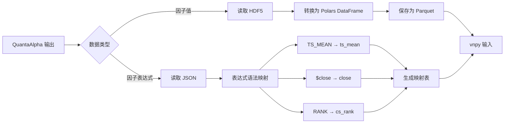
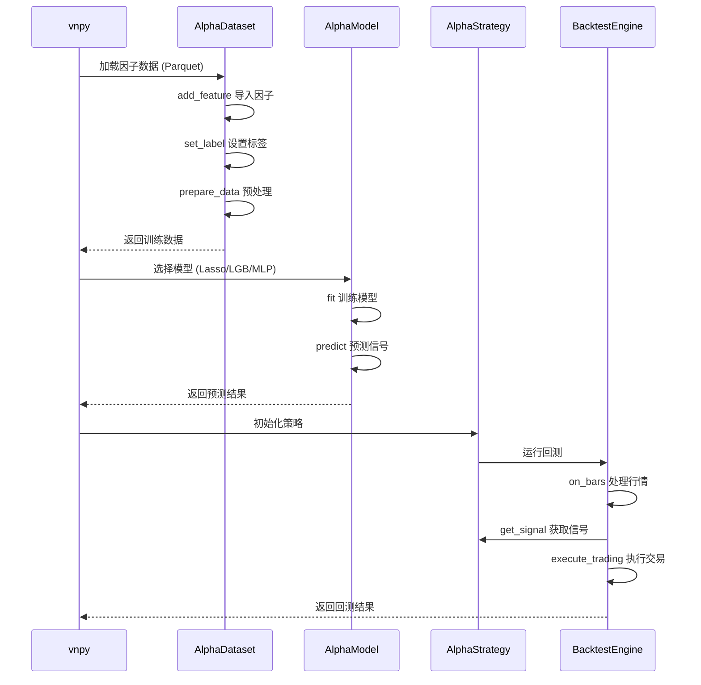
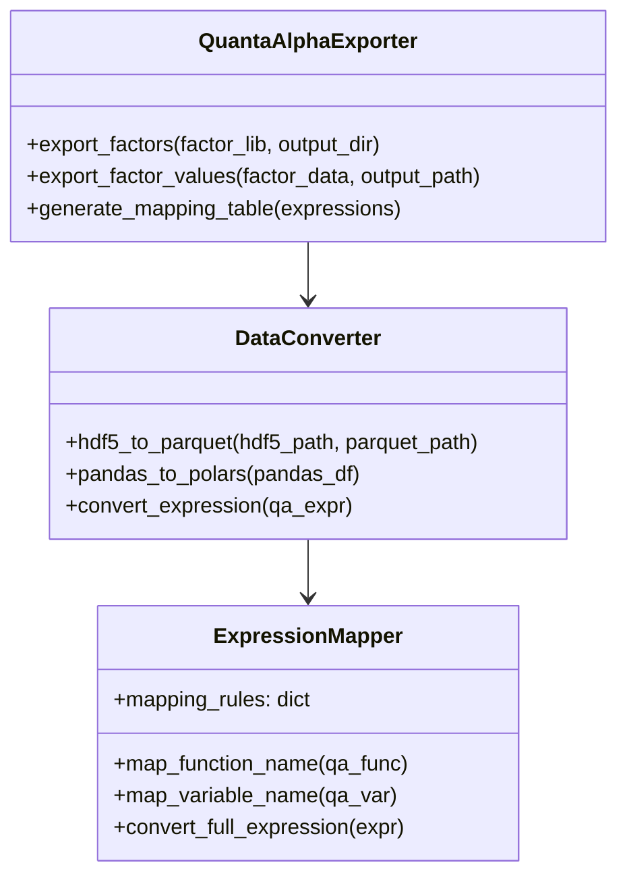
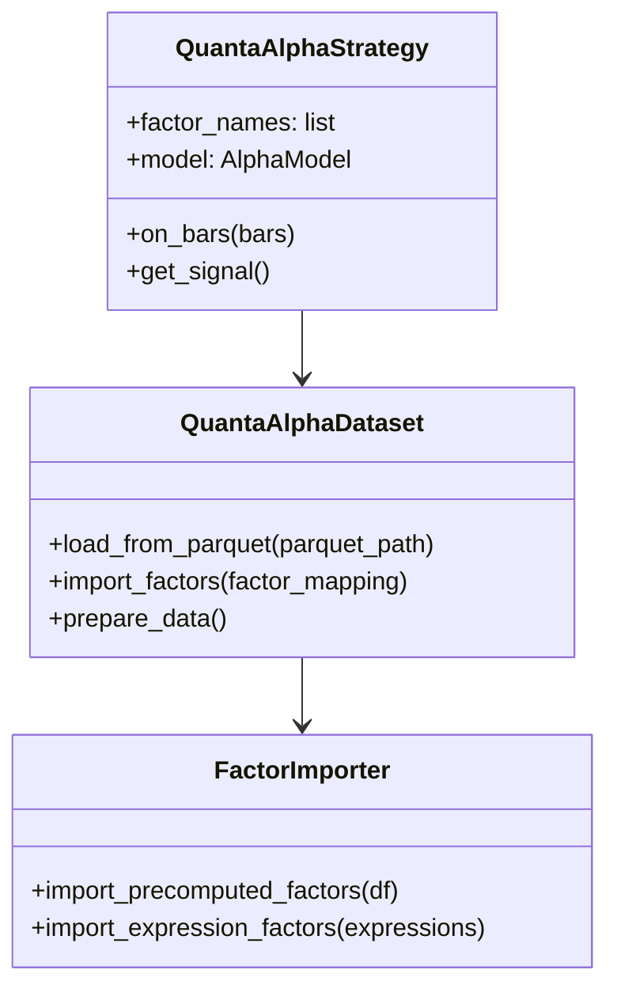
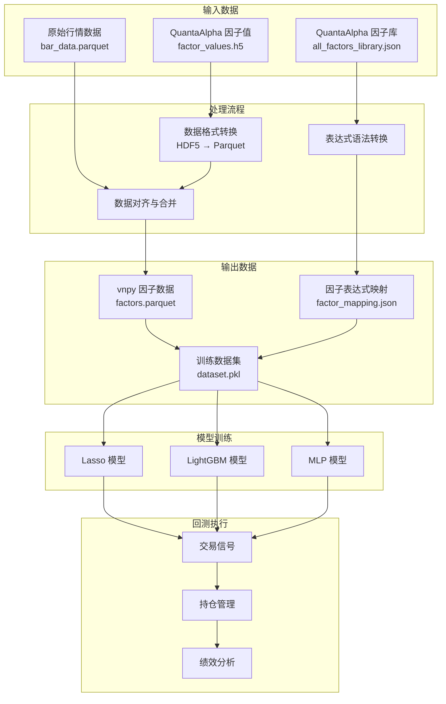
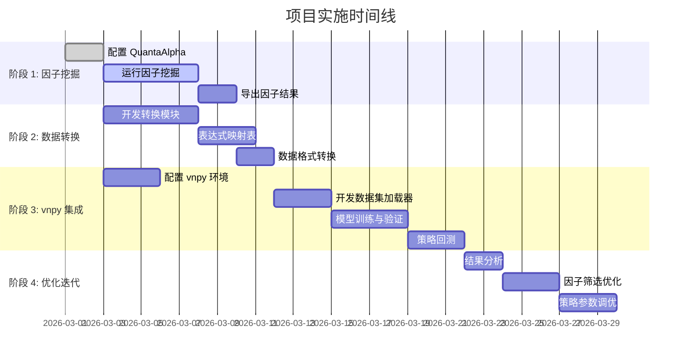

# QuantaAlpha + vnpy 松耦合集成方案

## 方案概述

采用松耦合集成方式，QuantaAlpha 专注于因子挖掘，vnpy 专注于策略回测和机器学习，两者通过标准数据格式（Parquet）进行数据交换。

---

## 整体架构流程图

```mermaid
flowchart TD
    subgraph Phase1["阶段 1: 因子挖掘 (QuantaAlpha)"]
        A[用户输入研究方向] --> B[QuantaAlpha 自动挖掘因子]
        B --> C[生成因子表达式]
        B --> D[计算因子值]
        C --> E[因子库 JSON]
        D --> F[因子值 HDF5/Parquet]
    end

    subgraph Phase2["阶段 2: 数据转换"]
        F --> G[数据转换模块]
        E --> G
        G --> H[转换为 vnpy 格式]
        H --> I[因子值 Parquet]
        H --> J[因子表达式映射表]
    end

    subgraph Phase3["阶段 3: 策略回测 (vnpy)"]
        I --> K[vnpy AlphaDataset]
        J --> K
        K --> L[prepare_data]
        L --> M[AlphaModel 训练]
        M --> N[Lasso/LightGBM/MLP]
        N --> O[生成交易信号]
        O --> P[AlphaStrategy 回测]
        P --> Q[回测结果分析]
    end
    
    %% 删除了错误的 Phase1 -.-> Phase2 连线
    %% 现有的节点连线 (F->G, I/J->K) 已足够表达流程```

---

## 详细流程图

### 1. 因子挖掘阶段

```mermaid
sequenceDiagram
    participant U as 用户
    participant QA as QuantaAlpha
    participant LLM as LLM Engine
    participant FL as 因子库

    U->>QA: 输入研究方向
    QA->>LLM: 生成因子假设
    LLM-->>QA: 返回因子表达式
    QA->>QA: 验证因子质量
    QA->>QA: 计算因子值
    QA->>FL: 保存因子表达式
    QA->>FL: 保存因子值 (HDF5)
    QA-->>U: 返回挖掘结果
```

### 2. 数据转换阶段



### 3. 策略回测阶段



---

## 核心组件设计

### 数据转换模块



### vnpy 集成模块



---

## 数据流图



---

## 实施步骤



---

## 技术栈对比

| 组件 | QuantaAlpha | vnpy | 转换方式 |
|------|-------------|------|----------|
| 数据框架 | Pandas | Polars | `pandas_to_polars()` |
| 存储格式 | HDF5 | Parquet | `hdf5_to_parquet()` |
| 时间序列函数 | `TS_MEAN`, `TS_SUM` | `ts_mean`, `ts_sum` | 字符串替换 |
| 截面函数 | `RANK`, `ZSCORE` | `cs_rank`, `cs_zscore` | 字符串替换 |
| 变量命名 | `$close`, `$volume` | `close`, `volume` | 去除 `$` 符号 |
| 条件表达式 | `(C)?(A):(B)` | `quesval(C, A, B)` | 正则表达式转换 |

---

## 代码示例

### 数据转换示例

```python
# quantaalpha_to_vnpy/converter.py
import pandas as pd
import polars as pl

class FactorConverter:
    """QuantaAlpha 因子数据转换器"""
    
    # 函数名映射表
    FUNCTION_MAPPING = {
        'TS_MEAN': 'ts_mean',
        'TS_SUM': 'ts_sum',
        'TS_STD': 'ts_std',
        'TS_RANK': 'ts_rank',
        'TS_DELTA': 'ts_delta',
        'TS_DELAY': 'ts_delay',
        'RANK': 'cs_rank',
        'ZSCORE': 'cs_zscore',
        'MEAN': 'cs_mean',
        'STD': 'cs_std',
        'MAX': 'cs_max',
        'MIN': 'cs_min',
        'LOG': 'log',
        'ABS': 'abs',
        'SIGN': 'sign',
        'POW': 'pow1',
    }
    
    @staticmethod
    def convert_expression(qa_expression: str) -> str:
        """将 QuantaAlpha 表达式转换为 vnpy 表达式"""
        vnpy_expr = qa_expression
        
        # 替换函数名
        for qa_func, vnpy_func in FactorConverter.FUNCTION_MAPPING.items():
            vnpy_expr = vnpy_expr.replace(qa_func, vnpy_func)
        
        # 替换变量名（去除 $ 符号）
        vnpy_expr = vnpy_expr.replace('$', '')
        
        return vnpy_expr
    
    @staticmethod
    def hdf5_to_parquet(hdf5_path: str, parquet_path: str):
        """将 HDF5 格式的因子数据转换为 Parquet"""
        # 读取 HDF5
        df_pandas = pd.read_hdf(hdf5_path)
        
        # 转换为 Polars
        df_polars = pl.from_pandas(df_pandas)
        
        # 保存为 Parquet
        df_polars.write_parquet(parquet_path)
```

### vnpy 集成示例

```python
# vnpy_integration/strategy.py
from vnpy.alpha.dataset import AlphaDataset
from vnpy.alpha.model import LgbModel
from vnpy.alpha.strategy import AlphaStrategy

class QuantaAlphaStrategy(AlphaStrategy):
    """基于 QuantaAlpha 因子的策略"""
    
    def __init__(self, factor_parquet_path: str, factor_mapping: dict):
        super().__init__()
        
        # 加载 QuantaAlpha 因子
        self.factor_df = pl.read_parquet(factor_parquet_path)
        self.factor_mapping = factor_mapping
        
    def initialize_dataset(self, bar_df: pl.DataFrame):
        """初始化数据集并导入 QuantaAlpha 因子"""
        
        # 创建数据集
        dataset = AlphaDataset(
            bar_df=bar_df,
            train_period=("2020-01-01", "2022-12-31"),
            valid_period=("2023-01-01", "2023-06-30"),
            test_period=("2023-07-01", "2023-12-31")
        )
        
        # 导入预计算的 QuantaAlpha 因子
        for factor_name in self.factor_df.columns:
            if factor_name not in ['date', 'vt_symbol']:
                dataset.add_feature(
                    name=factor_name,
                    result=self.factor_df.select(['date', 'vt_symbol', factor_name])
                )
        
        # 设置标签
        dataset.set_label("(close.shift(-5) / close - 1).over('vt_symbol')")
        
        # 数据预处理
        dataset.add_processor("process_drop_na")
        dataset.add_processor("process_cs_norm")
        
        # 生成数据
        dataset.prepare_data()
        
        return dataset
```

---

## 目录结构

```
quantaalpha-vnpy-integration/
├── quantaalpha_to_vnpy/          # 数据转换模块
│   ├── __init__.py
│   ├── converter.py              # 核心转换器
│   ├── expression_mapper.py      # 表达式映射
│   └── data_loader.py            # 数据加载
├── vnpy_integration/             # vnpy 集成模块
│   ├── __init__.py
│   ├── dataset.py                # 自定义数据集
│   ├── strategy.py               # 策略实现
│   └── model.py                  # 模型封装
├── data/                         # 数据目录
│   ├── quantaalpha_output/       # QuantaAlpha 输出
│   └── vnpy_input/               # vnpy 输入
├── notebooks/                    # Jupyter 笔记本
│   ├── 01_factor_mining.ipynb    # 因子挖掘
│   ├── 02_data_conversion.ipynb  # 数据转换
│   └── 03_backtest.ipynb         # 回测执行
└── config/                       # 配置文件
    ├── factor_mapping.json       # 因子映射表
    └── strategy_config.yaml      # 策略配置
```

---

## 总结

本方案通过松耦合方式集成 QuantaAlpha 和 vnpy，主要优势：

1. **职责分离**：QuantaAlpha 专注因子挖掘，vnpy 专注回测和 ML
2. **技术互补**：结合 QuantaAlpha 的 LLM 能力和 vnpy 的高性能回测
3. **易于维护**：通过标准数据格式交换，降低系统耦合度
4. **可扩展性**：可方便地替换或升级任一组件
