# QuantaAlpha 项目结构图

## 目录结构 Mermaid 图表

```mermaid
flowchart TD
    A["quantaalpha"] --> B["__init__.py"]
    A --> C["cli.py"]
    A --> D["app"]
    A --> E["backtest"]
    A --> F["coder"]
    A --> G["components"]
    A --> H["contrib"]
    A --> I["core"]
    A --> J["docker"]
    A --> K["factors"]
    A --> L["llm"]
    A --> M["log"]
    A --> N["pipeline"]
    A --> O["utils"]

    D --> D1["benchmark"]
    D --> D2["utils"]
    D1 --> D1a["factor"]
    D1 --> D1b["model"]

    E --> E1["__init__.py"]
    E --> E2["custom_factor_calculator.py"]
    E --> E3["factor_calculator.py"]
    E --> E4["factor_loader.py"]
    E --> E5["run_backtest.py"]
    E --> E6["runner.py"]

    F --> F1["costeer"]
    F --> F2["knowledge"]
    F1 --> F1a["costeer_coder.py"]
    F1 --> F1b["utils.py"]
    F2 --> F2a["knowledge_base.py"]
    F2 --> F2b["utils.py"]

    G --> G1["benchmark"]
    G --> G2["proposal"]
    G --> G3["runner"]
    G1 --> G1a["conf.py"]
    G1 --> G1b["eval_method.py"]
    G2 --> G2a["__init__.py"]
    G3 --> G3a["__init__.py"]

    H --> H1["model"]
    H1 --> H1a["coder"]
    H1a --> H1a1["benchmark"]
    H1a --> H1a2["one_shot"]
    H1a1 --> H1a1a["gt_code"]

    I --> I1["__init__.py"]
    I --> I2["conf.py"]
    I --> I3["developer.py"]
    I --> I4["evaluation.py"]
    I --> I5["evolving_agent.py"]
    I --> I6["evolving_framework.py"]
    I --> I7["exception.py"]
    I --> I8["experiment.py"]
    I --> I9["knowledge_base.py"]
    I --> I10["proposal.py"]
    I --> I11["prompts.py"]
    I --> I12["scenario.py"]
    I --> I13["template.py"]
    I --> I14["utils.py"]

    J --> J1["__init__.py"]

    K --> K1["__init__.py"]
    K --> K2["coder"]
    K --> K3["data_template"]
    K --> K4["factor_template"]
    K --> K5["loader"]
    K --> K6["prompts"]
    K --> K7["regulator"]
    K --> K8["workspace.py"]
    K --> K9["experiment.py"]
    K --> K10["feedback.py"]
    K --> K11["library.py"]
    K --> K12["proposal.py"]
    K --> K13["qlib_coder.py"]
    K --> K14["qlib_experiment_init.py"]
    K --> K15["qlib_utils.py"]
    K --> K16["runner.py"]
    K2 --> K2a["config.py"]
    K2 --> K2b["costeer.py"]
    K2 --> K2c["evolving.py"]
    K2 --> K2d["utils.py"]
    K3 --> K3a["__init__.py"]
    K3 --> K3b["generate.py"]
    K4 --> K4a["template.py"]
    K5 --> K5a["__init__.py"]
    K5 --> K5b["json_loader.py"]
    K5 --> K5c["pdf_loader.py"]
    K6 --> K6a["__init__.py"]
    K7 --> K7a["__init__.py"]
    K7 --> K7b["consistency_checker.py"]
    K7 --> K7c["factor_regulator.py"]

    L --> L1["__init__.py"]
    L --> L2["client.py"]
    L --> L3["config.py"]

    M --> M1["__init__.py"]
    M --> M2["time.py"]

    N --> N1["__init__.py"]
    N --> N2["evolution"]
    N --> N3["prompts"]
    N2 --> N2a["evolution.py"]
    N2 --> N2b["utils.py"]

    O --> O1["__init__.py"]
    O --> O2["agent"]
    O --> O3["document_reader"]
    O --> O4["loader"]
    O2 --> O2a["utils.py"]
    O3 --> O3a["utils.py"]
    O4 --> O4a["utils.py"]

    style A fill:#f9f,stroke:#333,stroke-width:2px
    style D fill:#bbf,stroke:#333
    style E fill:#bbf,stroke:#333
    style F fill:#bbf,stroke:#333
    style G fill:#bbf,stroke:#333
    style H fill:#bbf,stroke:#333
    style I fill:#bbf,stroke:#333
    style K fill:#bbf,stroke:#333
    style L fill:#bbf,stroke:#333
    style N fill:#bbf,stroke:#333
```

## 模块说明

| 模块 | 说明 |
|------|------|
| **app** | 应用程序模块，包含benchmark和工具函数 |
| **backtest** | 回测模块，包含因子计算器和回测运行器 |
| **coder** | 代码生成模块，包含costeer和知识库功能 |
| **components** | 组件模块，包含benchmark、proposal和runner |
| **contrib** | 贡献模块，包含模型相关的代码 |
| **core** | 核心模块，包含框架核心功能如evaluation、evolving_framework等 |
| **docker** | Docker相关配置 |
| **factors** | 因子模块，包含因子生成、加载、监管等核心功能 |
| **llm** | 大语言模型客户端配置 |
| **log** | 日志模块 |
| **pipeline** | 流水线模块，包含进化流程 |
| **utils** | 工具模块，包含agent、文档读取器和加载器 |

## 核心文件统计

- Python 文件总数: 132
- 子目录数量: 15个主要模块
