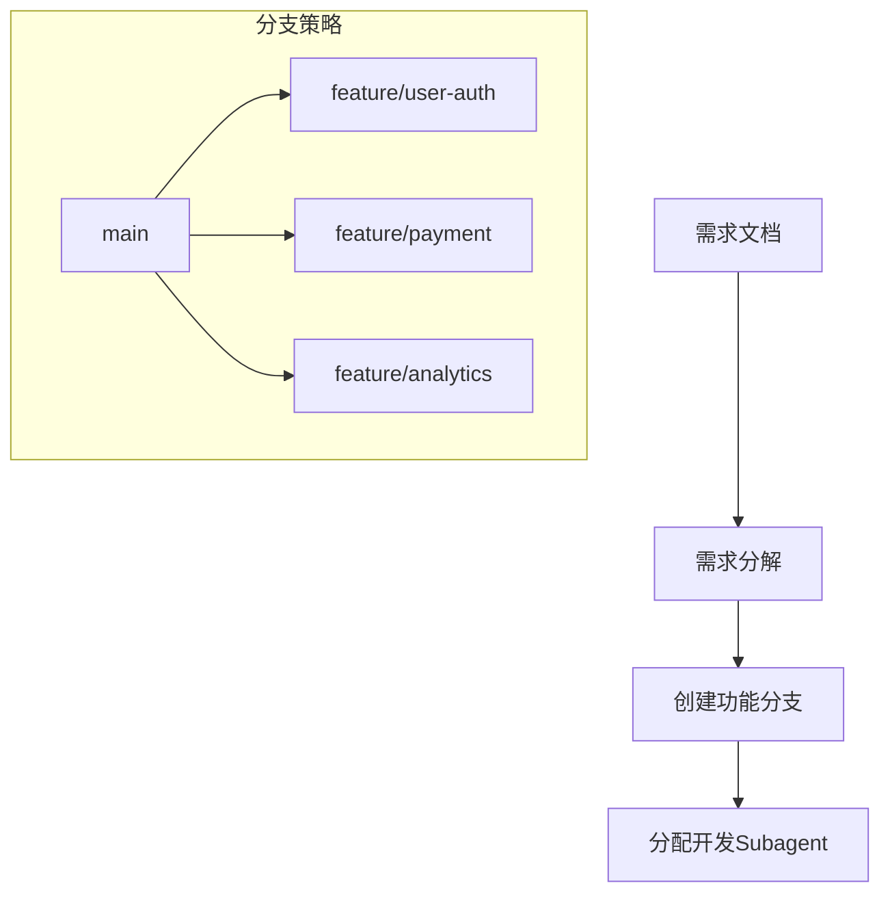
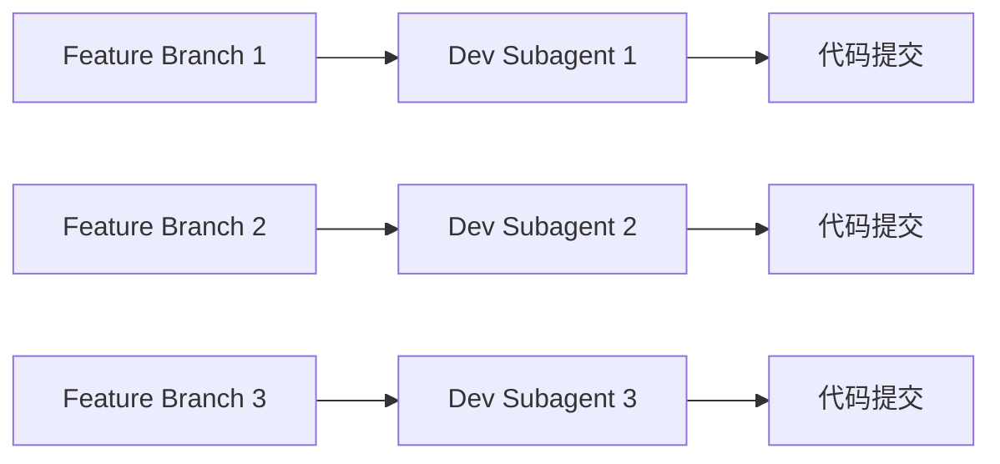
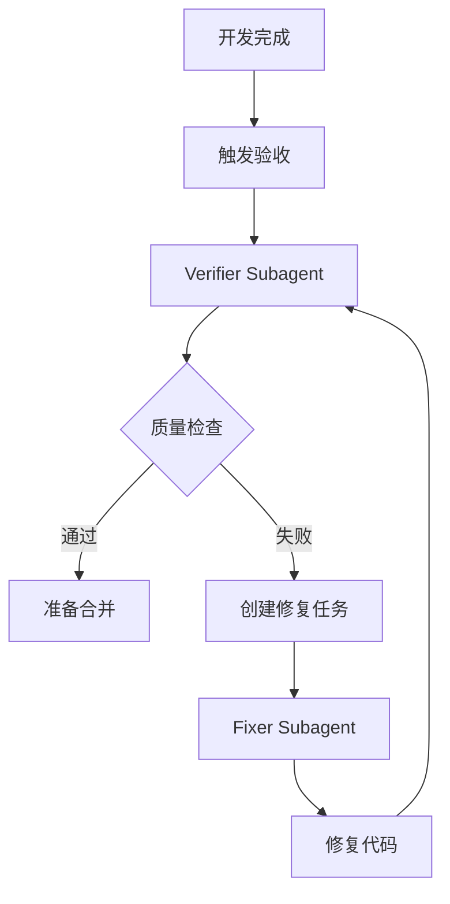
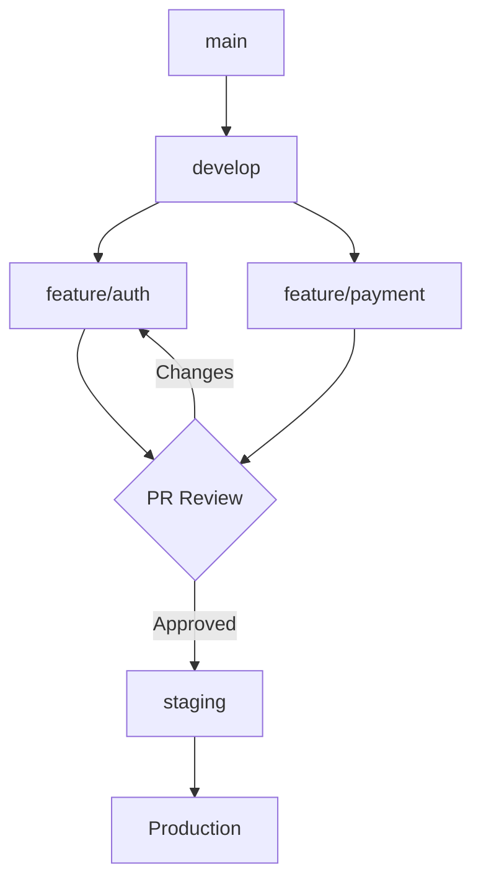

# 多Subagent协作开发工作流程

## 概述

本文档描述了如何使用多个Claude Code subagent实现高效的并行开发、测试、修复和合并工作流程。该流程支持多个功能分支同时开发，通过专门的验收和修复subagent确保代码质量，最终安全合并到主分支。

## 核心概念

### Subagent类型定义

1. **开发Subagent (Developer)**
   - 负责具体功能开发
   - 实现需求规格
   - 编写单元测试

2. **验收Subagent (Verifier)**
   - 验证功能实现
   - 检查代码质量
   - 运行测试套件

3. **修复Subagent (Fixer)**
   - 修复发现的问题
   - 优化代码性能
   - 确保测试通过

4. **合并Subagent (Merger)**
   - 处理分支合并
   - 解决代码冲突
   - 维护主分支稳定性

## 工作流程架构

### 阶段1：需求分析与分支规划



### 阶段2：并行开发



### 阶段3：质量验收



## 具体实施方案

### 1. 环境准备

```bash
# 创建项目工作目录结构
mkdir -p project/{branches,tests,docs,scripts}
cd project
git init

# 初始化主分支保护规则
echo "main protected branch rules" > .gitignore
git add . && git commit -m "Initial commit"
```

### 2. Subagent编排配置

#### 开发Subagent配置

```yaml
# config/developer_agents.yaml
developers:
  - name: "dev_auth"
    type: "general-purpose"
    branch: "feature/user-auth"
    tasks:
      - "实现用户认证模块"
      - "编写OAuth集成"
      - "创建用户会话管理"

  - name: "dev_payment"
    type: "general-purpose"
    branch: "feature/payment"
    tasks:
      - "实现支付网关"
      - "集成第三方支付"
      - "处理支付回调"
```

#### 验收Subagent配置

```yaml
# config/verifier_agents.yaml
verifiers:
  - name: "verify_auth"
    type: "test-runner"
    responsibilities:
      - "运行认证模块测试"
      - "检查代码覆盖率"
      - "验证安全规范"
      - "性能基准测试"

  - name: "verify_payment"
    type: "test-runner"
    responsibilities:
      - "测试支付流程"
      - "验证交易安全"
      - "检查异常处理"
```

#### 修复Subagent配置

```yaml
# config/fixer_agents.yaml
fixers:
  - name: "fix_auth"
    type: "code-simplifier"
    capabilities:
      - "修复测试失败"
      - "优化代码结构"
      - "解决安全漏洞"
      - "提升性能"
```

### 3. 工作流程执行

#### 步骤1：创建功能分支

```bash
# 使用Task工具创建功能分支
Task.create({
    "subagent_type": "Bash",
    "description": "创建功能分支",
    "prompt": """
    创建以下功能分支：
    1. feature/user-auth - 用户认证功能
    2. feature/payment - 支付功能
    3. feature/analytics - 分析功能

    每个分支基于main分支创建
    """
})
```

#### 步骤2：分配开发Subagent

```bash
# 启动开发Subagent
Task.create({
    "subagent_type": "general-purpose",
    "description": "开发用户认证",
    "prompt": """
    你负责开发用户认证模块，工作分支：feature/user-auth

    需求：
    1. 实现JWT token认证
    2. 集成OAuth2.0 (Google, GitHub)
    3. 用户注册/登录API
    4. 密码加密和验证
    5. 会话管理

    完成后：
    1. 提交代码到分支
    2. 运行所有测试
    3. 生成测试报告
    """
})
```

#### 步骤3：并行验收

```bash
# 启动验收Subagent
Task.create({
    "subagent_type": "test-runner",
    "description": "验收用户认证",
    "prompt": """
    验收feature/user-auth分支的代码质量：

    检查清单：
    1. 所有测试通过 (pytest)
    2. 代码覆盖率 > 90%
    3. 没有安全漏洞 (bandit扫描)
    4. 代码符合PEP8规范
    5. 性能测试通过

    生成验收报告，标记通过/失败状态
    """
})
```

#### 步骤4：问题修复

```bash
# 如果验收失败，启动修复Subagent
Task.create({
    "subagent_type": "code-simplifier",
    "description": "修复认证模块问题",
    "prompt": """
    修复feature/user-auth分支的问题：

    验收报告指出的问题：
    1. 测试覆盖率不足 (75% < 90%)
    2. 存在SQL注入风险
    3. 密码加密强度不够

    修复要求：
    1. 增加边界测试用例
    2. 使用参数化查询
    3. 升级到bcrypt加密

    修复后重新运行测试
    """
})
```

### 4. 分支合并策略

#### Git Flow工作流



#### 自动化合并检查

```bash
# 合并Subagent执行流程
Task.create({
    "subagent_type": "Bash",
    "description": "分支合并检查",
    "prompt": """
    执行以下合并前检查：

    1. 检查分支是否最新
    git fetch origin
    git checkout main
    git pull origin main

    2. 检查是否有冲突
    git checkout feature/user-auth
    git merge main --no-commit --no-ff

    3. 运行集成测试
    pytest tests/integration/

    4. 检查代码质量
    sonarqube-scanner

    生成合并报告
    """
})
```

## 最佳实践

### 1. 分支命名规范

```
feature/功能名称     - 新功能开发
bugfix/问题描述     - 问题修复
hotfix/紧急修复     - 紧急修复
release/版本号      - 版本发布
```

### 2. 提交信息规范

```
type(scope): subject

body

footer
```

类型说明：
- feat: 新功能
- fix: 修复
- docs: 文档
- style: 格式
- refactor: 重构
- test: 测试
- chore: 构建

### 3. 质量门禁

```yaml
# .quality-gate.yaml
quality_gates:
  test_coverage: 90
  security_issues: 0
  code_smells: 10
  duplications: 3%
  complexity: 10
```

### 4. 自动化脚本

#### 启动完整工作流

```bash
#!/bin/bash
# scripts/start_workflow.sh

echo "启动多Subagent协作开发流程"

# 1. 创建分支
python scripts/create_branches.py

# 2. 启动开发Subagent
python scripts/start_developers.py

# 3. 等待开发完成，启动验收
python scripts/start_verifiers.py

# 4. 如有需要，启动修复
python scripts/start_fixers.py

# 5. 合并分支
python scripts/merge_branches.py

echo "工作流程完成"
```

#### 状态监控

```python
# scripts/monitor.py
import time
from datetime import datetime

class WorkflowMonitor:
    def __init__(self):
        self.agents = {}
        self.status = {}

    def track_agent(self, agent_id, task_type):
        self.agents[agent_id] = {
            'type': task_type,
            'start_time': datetime.now(),
            'status': 'running'
        }

    def update_status(self, agent_id, status, result=None):
        if agent_id in self.agents:
            self.agents[agent_id]['status'] = status
            self.agents[agent_id]['end_time'] = datetime.now()
            self.agents[agent_id]['result'] = result

    def generate_report(self):
        print("=== 工作流程状态报告 ===")
        for agent_id, info in self.agents.items():
            duration = info['end_time'] - info['start_time']
            print(f"Agent: {agent_id}")
            print(f"Type: {info['type']}")
            print(f"Status: {info['status']}")
            print(f"Duration: {duration}")
            print(f"Result: {info.get('result', 'N/A')}")
            print("-" * 40)
```

## 故障处理

### 常见问题

#### 1. Subagent无响应

```python
def check_agent_health(agent_id, timeout=300):
    """检查Subagent健康状态"""
    try:
        # 检查最后心跳时间
        last_heartbeat = get_agent_heartbeat(agent_id)
        if time.time() - last_heartbeat > timeout:
            # 重启Subagent
            restart_agent(agent_id)
    except Exception as e:
        log_error(f"Agent {agent_id} health check failed: {e}")
```

#### 2. 分支冲突

```bash
# 自动解决简单冲突
auto_resolve_conflicts() {
    git checkout --theirs path/to/file  # 使用目标分支版本
    git add path/to/file

    # 复杂冲突需要人工介入
    if has_complex_conflicts; then
        notify_team "需要人工解决冲突"
        pause_workflow
    fi
}
```

#### 3. 测试失败

```python
def analyze_test_failure(test_output):
    """分析测试失败原因"""
    patterns = {
        'timeout': r'TimeoutError|timeout',
        'assertion': r'AssertionError|assert',
        'import': r'ImportError|ModuleNotFoundError',
        'network': r'ConnectionError|NetworkError'
    }

    for error_type, pattern in patterns.items():
        if re.search(pattern, test_output):
            return error_type

    return 'unknown'
```

## 性能优化

### 1. 并行度控制

```yaml
# config/performance.yaml
concurrency:
  max_developers: 5      # 最大并行开发数
  max_verifiers: 3       # 最大并行验收数
  max_fixers: 2          # 最大并行修复数

resources:
  cpu_limit: 80%         # CPU使用率限制
  memory_limit: 16GB     # 内存限制
  timeout: 3600          # 任务超时时间(秒)
```

### 2. 缓存策略

```python
# 缓存Subagent结果避免重复工作
@lru_cache(maxsize=128)
def get_agent_result(agent_type, task_hash):
    """缓存Subagent执行结果"""
    return execute_agent(agent_type, task_hash)
```

### 3. 智能调度

```python
class SmartScheduler:
    def __init__(self):
        self.resource_tracker = ResourceTracker()
        self.task_queue = PriorityQueue()

    def schedule_task(self, task):
        # 根据资源使用情况智能调度
        if self.resource_tracker.is_available(task.resources):
            self.assign_to_agent(task)
        else:
            # 加入等待队列
            self.task_queue.put(task, priority=task.priority)
```

## 安全考虑

### 1. 权限控制

```yaml
# config/security.yaml
permissions:
  developers:
    - read: code
    - write: branches
    - deny: main

  verifiers:
    - read: all
    - execute: tests

  mergers:
    - read: all
    - write: all
    - execute: merge
```

### 2. 代码扫描

```bash
# 集成安全扫描
security_scan() {
    # 静态分析
    bandit -r src/ -f json -o security_report.json

    # 依赖检查
    safety check --json > dependency_report.json

    # 合并报告
    merge_security_reports()
}
```

## 监控和报告

### 1. 实时监控

```python
# 集成Prometheus监控
from prometheus_client import Counter, Histogram, Gauge

# 指标定义
task_counter = Counter('subagent_tasks_total', 'Total tasks', ['type', 'status'])
task_duration = Histogram('subagent_task_duration_seconds', 'Task duration')
active_agents = Gauge('subagent_active_agents', 'Active agents', ['type'])
```

### 2. 报告生成

```python
def generate_workflow_report():
    """生成工作流程报告"""
    report = {
        'summary': {
            'total_tasks': get_total_tasks(),
            'completed_tasks': get_completed_tasks(),
            'failed_tasks': get_failed_tasks(),
            'success_rate': calculate_success_rate()
        },
        'agents': get_agent_statistics(),
        'timeline': get_timeline_events(),
        'quality_metrics': get_quality_metrics()
    }

    # 生成HTML报告
    render_html_report(report)
```

## 扩展性考虑

### 1. 插件架构

```python
# 支持自定义Subagent类型
class PluginManager:
    def load_plugin(self, plugin_path):
        """动态加载插件"""
        spec = importlib.util.spec_from_file_location("plugin", plugin_path)
        plugin = importlib.util.module_from_spec(spec)
        spec.loader.exec_module(plugin)

        # 注册插件
        self.plugins[plugin.name] = plugin
```

### 2. 云原生支持

```yaml
# k8s部署配置
apiVersion: batch/v1
kind: Job
metadata:
  name: subagent-worker
spec:
  parallelism: 5
  template:
    spec:
      containers:
      - name: subagent
        image: subagent:latest
        env:
        - name: AGENT_TYPE
          value: "developer"
```

## 总结

多Subagent协作开发工作流程通过专业化分工和并行处理，显著提高了开发效率和代码质量。关键在于：

1. **明确的职责划分**：每个Subagent专注于特定任务
2. **标准化的接口**：统一的通信协议和数据格式
3. **自动化流程**：减少人工干预，提高效率
4. **实时监控**：及时发现问题并处理
5. **持续优化**：基于数据不断改进流程

通过合理配置和优化，该流程可以支持大规模团队的并行开发，同时保证代码质量和项目进度的可控性。