# 单接口完整下载流程图

## 概述
本文档展示了 app4 系统中单接口从开始下载到下载结束的完整流程，包括重复检查、并发控制、数据处理等所有环节。

## 完整流程图

```mermaid

flowchart TD

    Start([开始下载]) --> Init

    subgraph Init [初始化阶段]
        direction TB
        ParseArgs[解析命令行参数]
        LoadConfig[加载配置文件<br/>全局配置 + 接口配置]
        InitComponents[初始化组件<br/>Scheduler, StorageManager,<br/>Processor, Downloader]
        PreloadTradeCal[预加载交易日历<br/>三级缓存: 内存 → 磁盘 → API]
        
        ParseArgs --> LoadConfig
        LoadConfig --> InitComponents
        InitComponents --> PreloadTradeCal
    end

    PreloadTradeCal --> ConcurrencyCheck

    subgraph Concurrency [并发控制机制]
        direction TB
        ConcurrencyCheck{并发控制}
        GetToken[获取令牌<br/>RateLimiter 令牌桶]
        WaitQueue[等待队列空闲]
        RandomDelay[随机延迟<br/>0.05-0.1秒]
        
        ConcurrencyCheck -->|有可用槽位| GetToken
        ConcurrencyCheck -->|队列已满| WaitQueue
        WaitQueue --> ConcurrencyCheck
        GetToken --> RandomDelay
    end

    RandomDelay --> DeterminePagination

    subgraph Pagination [分页处理逻辑]
        direction TB
        DeterminePagination{分页模式判断}
        OffsetPagination[偏移分页<br/>offset/limit]
        DateRangePagination[日期范围分页<br/>基于交易日历]
        StockLoopPagination[股票循环分页<br/>遍历股票列表]
        PeriodRangePagination[报告期范围分页<br/>季度末日期]
        QuarterlyPagination[季度周期分页<br/>按季度边界]
        PeriodicPagination[周期性分页<br/>周/月/季度/年]
        
        DeterminePagination -->|offset| OffsetPagination
        DeterminePagination -->|date_range| DateRangePagination
        DeterminePagination -->|stock_loop| StockLoopPagination
        DeterminePagination -->|period_range| PeriodRangePagination
        DeterminePagination -->|quarterly_range| QuarterlyPagination
        DeterminePagination -->|periodic_range| PeriodicPagination
    end

    OffsetPagination --> CheckPoint1
    DateRangePagination --> CheckPoint1
    StockLoopPagination --> CheckPoint1
    PeriodRangePagination --> CheckPoint1
    QuarterlyPagination --> CheckPoint1
    PeriodicPagination --> CheckPoint1

    subgraph DuplicateChecks [重复检查机制 - 7个检查点]
        direction TB
        CheckPoint1{检查点1:<br/>内存缓存检查}
        ReturnCached[返回缓存数据]
        CheckPoint2{检查点2:<br/>股票级别检查<br/>stock_loop模式}
        SkipStock[跳过该股票]
        CheckPoint3{检查点3:<br/>日期范围覆盖率检查<br/>date_range模式}
        SkipRange[跳过该日期范围]
        CheckPoint4{检查点4:<br/>报告期检查<br/>period_range模式}
        SkipPeriod[跳过该报告期]
        CheckPoint5{检查点5:<br/>增量下载决策}
        SkipDownload[跳过下载]
        DownloadPartial[下载缺失部分]
        DownloadFull[下载完整范围]
        
        CheckPoint1 -->|命中| ReturnCached
        CheckPoint1 -->|未命中| CheckPoint2
        CheckPoint2 -->|已存在| SkipStock
        CheckPoint2 -->|不存在| CheckPoint3
        CheckPoint3 -->|覆盖率≥95%| SkipRange
        CheckPoint3 -->|覆盖率<95%| CheckPoint4
        CheckPoint4 -->|已存在| SkipPeriod
        CheckPoint4 -->|不存在| CheckPoint5
        CheckPoint5 -->|skip| SkipDownload
        CheckPoint5 -->|download_partial| DownloadPartial
        CheckPoint5 -->|download_full| DownloadFull
    end

    DownloadPartial --> MakeAPIRequest
    DownloadFull --> MakeAPIRequest

    subgraph APIRequest [API请求阶段]
        direction TB
        MakeAPIRequest[构造API请求<br/>添加参数和token]
        SendRequest[发送HTTP请求]
        CheckResponse{检查响应}
        ParseData[解析响应数据]
        RateLimitRetry[频率限制重试<br/>指数退避]
        APIRetry[API重试<br/>最多3次]
        
        MakeAPIRequest --> SendRequest
        SendRequest --> CheckResponse
        CheckResponse -->|成功| ParseData
        CheckResponse -->|频率限制| RateLimitRetry
        CheckResponse -->|其他错误| APIRetry
        RateLimitRetry --> SendRequest
        APIRetry --> SendRequest
    end

    ParseData --> CheckPoint6

    subgraph Processing [数据处理阶段]
        direction TB
        CheckPoint6{检查点6:<br/>批次内去重检查}
        SkipBatch[跳过该批次]
        DataTransform[数据转换<br/>JSON → Dict List → DataFrame]
        TypeConversion[类型转换<br/>日期/数值/字符串]
        PrimaryKeyCheck[主键字段检查]
        BatchDedup[批次内去重<br/>基于主键]
        DataCleaning[数据清洗<br/>处理缺失值/空行空列]
        DataValidation[数据验证<br/>必填字段/重复统计]
        
        CheckPoint6 -->|全部重复| SkipBatch
        CheckPoint6 -->|有新数据| DataTransform
        DataTransform --> TypeConversion
        TypeConversion --> PrimaryKeyCheck
        PrimaryKeyCheck --> BatchDedup
        BatchDedup --> DataCleaning
        DataCleaning --> DataValidation
    end

    DataValidation --> CheckPoint7

    subgraph DedupAndSave [去重和保存阶段]
        direction TB
        CheckPoint7{检查点7:<br/>基于接口配置的去重}
        SkipSave[跳过保存]
        ReadExisting[读取现有数据]
        FilterNewRecords[过滤新记录<br/>基于主键]
        CheckBatchSize{检查批次大小}
        SaveBatch[保存批次<br/>异步写入]
        Accumulate[累积数据]
        
        CheckPoint7 -->|全部重复| SkipSave
        CheckPoint7 -->|有新数据| ReadExisting
        ReadExisting --> FilterNewRecords
        FilterNewRecords --> CheckBatchSize
        CheckBatchSize -->|≥10000条| SaveBatch
        CheckBatchSize -->|<10000条| Accumulate
        Accumulate --> CheckBatchSize
    end

    SaveBatch --> AsyncWrite

    subgraph AsyncStorage [异步存储机制]
        direction TB
        AsyncWrite[放入写入队列]
        BackgroundThread[后台线程处理]
        TempFile[写入临时文件]
        AtomicRename[原子重命名<br/>确保完整性]
        FileFormat["文件名格式:<br/>{interface}_{start}_{end}<br/>{timestamp}_{uuid}.parquet"]
        
        AsyncWrite --> BackgroundThread
        BackgroundThread --> TempFile
        TempFile --> AtomicRename
        AtomicRename --> FileFormat
    end

    FileFormat --> CheckMorePages{还有更多页?}

    CheckMorePages -->|是| DeterminePagination
    CheckMorePages -->|否| UpdateCoverage[更新覆盖率缓存]

    UpdateCoverage --> ReleaseToken[释放令牌]
    ReleaseToken --> CheckMoreTasks{还有更多任务?}

    CheckMoreTasks -->|是| ConcurrencyCheck
    CheckMoreTasks -->|否| End([下载结束])

    ReturnCached --> End
    SkipStock --> CheckMorePages
    SkipRange --> CheckMorePages
    SkipPeriod --> CheckMorePages
    SkipDownload --> CheckMorePages
    SkipBatch --> CheckMorePages
    SkipSave --> UpdateCoverage

    classDef init fill:#e1f5fe,stroke:#01579b,stroke-width:2px
    classDef concurrency fill:#fff3e0,stroke:#e65100,stroke-width:2px
    classDef pagination fill:#f3e5f5,stroke:#4a148c,stroke-width:2px
    classDef duplicate fill:#e8f5e9,stroke:#1b5e20,stroke-width:2px
    classDef api fill:#fce4ec,stroke:#880e4f,stroke-width:2px
    classDef processing fill:#fff8e1,stroke:#ff6f00,stroke-width:2px
    classDef storage fill:#e0f2f1,stroke:#00695c,stroke-width:2px

    class Init,ParseArgs,LoadConfig,InitComponents,PreloadTradeCal init
    class ConcurrencyCheck,GetToken,WaitQueue,RandomDelay concurrency
    class DeterminePagination,OffsetPagination,DateRangePagination,StockLoopPagination,PeriodRangePagination,QuarterlyPagination,PeriodicPagination pagination
    class CheckPoint1,CheckPoint2,CheckPoint3,CheckPoint4,CheckPoint5,CheckPoint6,CheckPoint7,ReturnCached,CheckPoint1 duplicate
    class MakeAPIRequest,SendRequest,CheckResponse,ParseData,RateLimitRetry,APIRetry api
    class DataTransform,TypeConversion,PrimaryKeyCheck,BatchDedup,DataCleaning,DataValidation processing
    class ReadExisting,FilterNewRecords,SaveBatch,Accumulate,AsyncWrite,BackgroundThread,TempFile,AtomicRename,FileFormat storage

```



## 关键组件说明

### 1. 初始化阶段
- **ParseArgs**: 解析命令行参数（接口名称、日期范围等）
- **LoadConfig**: 加载全局配置和接口配置
- **InitComponents**: 初始化调度器、存储管理器、处理器、下载器
- **PreloadTradeCal**: 预加载交易日历，使用三级缓存策略

### 2. 并发控制机制
- **TaskScheduler**: 基于 ThreadPoolExecutor，默认最大工作线程数 1
- **RateLimiter**: 令牌桶算法，默认速率限制 500 请求/分钟
- **随机延迟**: 0.05-0.1 秒，避免所有线程同时唤醒
- **任务分批**: 每批 100 个任务，避免内存溢出

### 3. 重复检查机制（7个检查点）

| 检查点 | 检查内容 | 触发条件 | 处理方式 |
|--------|----------|----------|----------|
| 检查点1 | 内存缓存 | 所有请求 | 命中则返回缓存数据 |
| 检查点2 | 股票级别 | stock_loop 模式 | 已存在则跳过该股票 |
| 检查点3 | 日期范围覆盖率 | date_range 模式 | 覆盖率≥95% 则跳过 |
| 检查点4 | 报告期 | period_range 模式 | 已存在则跳过 |
| 检查点5 | 增量下载决策 | date_range 模式 | 返回 skip/partial/full |
| 检查点6 | 批次内去重 | 数据处理后 | 全部重复则跳过批次 |
| 检查点7 | 接口配置去重 | 保存前 | 基于主键过滤新记录 |

### 4. 分页处理逻辑（6种模式）

| 模式 | 适用场景 | 参数 | 特点 |
|------|----------|------|------|
| offset | 通用分页 | offset/limit | 简单直接，支持大部分 API |
| date_range | 日线数据 | start_date/end_date | 支持增量下载，基于交易日历 |
| stock_loop | 股票数据 | ts_code | 遍历股票列表，支持股票级别去重 |
| period_range | 财报数据 | start_period/end_period | 按季度末日期循环 |
| quarterly_range | 季度数据 | start_date/end_date | 按季度边界分割 |
| periodic_range | 周期数据 | start_date/end_date | 支持周/月/季度/年 |

### 5. 数据处理和保存流程

**数据转换**:
- JSON → Dict List → DataFrame (Polars)

**类型转换**:
- 日期字段转换为日期类型
- 数值字段转换为浮点数
- 字符串字段保持原样

**数据清洗**:
- 处理缺失值
- 移除空行和空列
- 统一数据格式

**数据验证**:
- 检查必填字段
- 统计重复记录数量
- 验证主键完整性

**异步保存**:
- 批次大小：10000 条
- 文件格式：Parquet
- 文件名：`{interface}_{start}_{end}_{timestamp}_{uuid}.parquet`
- 原子写入：临时文件 + 重命名

### 6. 错误处理和重试机制

**HTTP 重试**:
- 基于 urllib3.Retry
- 最多重试 3 次
- 指数退避策略
- 初始延迟 2 秒，退避因子 2

**API 重试**:
- 检测频率限制错误
- 执行退避重试
- 捕获异常不影响其他任务

**异常处理**:
- 单股票下载异常不影响其他股票
- 单批次异常不影响其他批次
- 记录详细错误日志

## 性能优化特性

1. **多级缓存**: 内存 + 磁盘 + API，减少重复请求
2. **智能增量下载**: 根据覆盖率自动决策下载策略
3. **文件名过滤**: 根据日期范围过滤文件，减少读取量
4. **确定性去重**: 基于 `_update_time` 排序，保留最新数据
5. **异步存储**: 后台线程写入，不阻塞下载流程
6. **批处理**: 每 10000 条数据保存一次，避免小文件爆炸
7. **原子写入**: 临时文件 + 重命名，确保数据完整性

## 配置示例

### 全局配置
```yaml
# app4/config/settings.yaml
concurrency:
  max_workers: 1
  max_queue_size: 50

request:
  retries: 3
  retry_delay: 2
  retry_backoff: 2
  jitter_min: 0.05
  jitter_max: 0.1
  rate_limit: 500

storage:
  base_dir: "./data"
  format: "parquet"
  batch_size: 20
```

### 接口配置
```yaml
# app4/config/interfaces/daily.yaml
pagination:
  enabled: true
  mode: "date_range"
  window_size_days: 365

duplicate_detection:
  enabled: true
  mode: "range"
  date_column: trade_date
  threshold: 0.95

output:
  primary_key: ["ts_code", "trade_date"]

dedup:
  enabled: true
  strategy: "primary_key"
  columns: ["ts_code", "trade_date"]
```

## 关键代码位置

| 组件 | 文件路径 | 主要方法 |
|------|----------|----------|
| 主入口 | `app4/main.py` | `main()`, `download_interface()` |
| 下载器 | `app4/core/downloader.py` | `download_single_stock()`, `_execute_date_range_pagination()` |
| 覆盖率管理 | `app4/core/coverage_manager.py` | `should_skip()`, `get_missing_date_ranges()` |
| 存储管理 | `app4/core/storage.py` | `read_interface_data()`, `save_data()` |
| 数据处理 | `app4/core/processor.py` | `process_data()` |
| 调度器 | `app4/core/scheduler.py` | `schedule()`, `submit_task()` |

## 总结

app4 系统的单接口下载流程具有以下特点：

1. **配置驱动**: 基于 YAML 配置，灵活可扩展
2. **多层防护**: 7 个重复检查点，确保数据唯一性
3. **智能决策**: 自动选择最佳下载策略（完整/部分/跳过）
4. **高性能**: 多级缓存、异步存储、批处理优化
5. **高可靠**: 原子写入、错误重试、异常隔离
6. **易维护**: 模块化设计、清晰的职责分离

这种设计确保了系统在高并发、大数据量场景下的稳定性和性能。