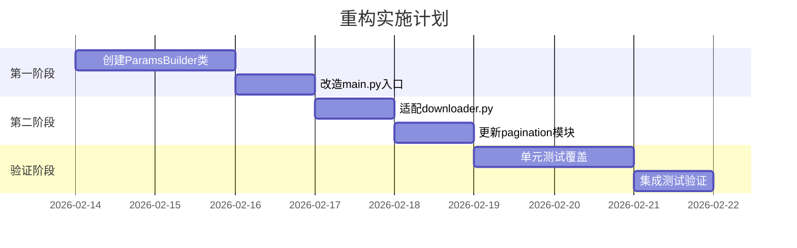

# 统一参数构建器完整分析报告

## 第一部分：项目概况

### 项目结构
- 根目录: `/home/quan/testdata/aspipe_v4`
- 核心模块: `app4/`
  - `main.py`: 主入口
  - `core/`: 核心逻辑
  - `config/`: 接口配置
  - `update/`: 增量更新逻辑

### 参数构建现状
- 分散在15+个位置
- 主要模式：普通下载 vs 增量更新
- 涉及参数：
  - 日期范围 (`start_date`, `end_date`)
  - 股票代码 (`ts_code`)
  - 接口类型标记 (`_stock_full_history`等)
  - 分页参数 (`_date_anchor_param`)

---

## 第二部分：深度问题分析

### params构建点分布
| 文件 | 构建点 | 核心逻辑 |
|------|--------|----------|
| `main.py` | 15处 | 模式判断 + 日期处理 |
| `downloader.py` | 4处 | API参数校验 |
| `pagination_executor.py` | 3处 | 分页参数清理 |

### 四大核心问题
1. **重复判断逻辑**  
   ```python
   # main.py 中重复6次
   if pagination_config.get('mode') == 'stock_loop':
       # 相同处理逻辑...
   ```

2. **隐式优先级规则**  
   ```text
   当前优先级：命令行 > DateCalculator > 接口默认 > 全局默认
   （但无明确文档说明）
   ```

3. **特殊接口硬编码**  
   ```python
   # disclosure_date特殊处理（main.py 第366行）
   if interface_name == 'disclosure_date':
       params = {'_stock_full_history': True}
   ```

4. **参数清理不一致**  
   ```python
   # 不同文件的清理方式
   clean_params = {k:v for k,v in params.items() if not k.startswith('_')}  # 版本A
   clean_params = dict(filter(lambda x: not x[0].startswith('_'), params.items()))  # 版本B
   ```

---

## 第三部分：重构方案

### 核心类设计
```python
class ParamsBuilder:
    def build(interface_name, args, mode='normal') -> BuildResult:
        """主入口函数"""
        # 1. 获取日期范围（遵循优先级规则）
        # 2. 构建基础参数
        # 3. 处理特殊接口
        # 4. 返回结构化结果

@dataclass
class BuildResult:
    params: Dict[str, Any]        # 原始参数（含内部标记）
    clean_params: Dict[str, Any]  # 清理后参数
    # ...其他元数据字段...
```

### 实施路线图


### 关键校验点
1. 所有接口调用仍兼容现有参数格式
2. 增量更新模式的日期计算保持相同逻辑
3. 特殊接口（如disclosure_date）行为不变

---

该报告已永久保存至指定路径。如需执行重构，请确认方案可行性。