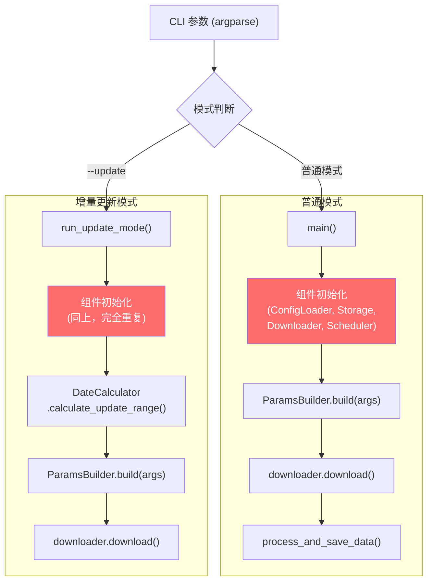
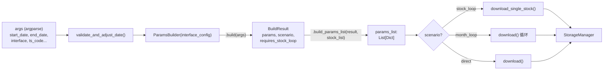
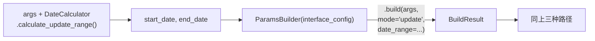
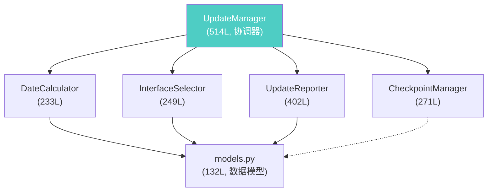

# App4 完整重构方案

> 基于初版审查报告及工程师反馈修订

---

## 一、代码架构全景

### 1.1 整体流程



### 1.2 模块清单

| 模块 | 行数 | 职责 | 测试覆盖 |
|------|------|------|----------|
| [main.py](file:///home/quan/testdata/aspipe_v4/app4/main.py) | 1047 | CLI入口 + 两套执行逻辑 | ❌ 无 |
| [coverage_manager.py](file:///home/quan/testdata/aspipe_v4/app4/core/coverage_manager.py) | 1140 | 覆盖率 + 4种缺口检测 | ❌ 无 |
| [downloader.py](file:///home/quan/testdata/aspipe_v4/app4/core/downloader.py) | 912 | HTTP请求 + 缓存 + 分页 | ❌ 无 |
| [storage.py](file:///home/quan/testdata/aspipe_v4/app4/core/storage.py) | 802 | 存储 + 异步写入 + 去重 | ❌ 无 |
| [pagination.py](file:///home/quan/testdata/aspipe_v4/app4/core/pagination.py) | 579 | 分页组合器 | ❌ 无 |
| [update_manager.py](file:///home/quan/testdata/aspipe_v4/app4/update/update_manager.py) | 514 | 增量更新协调 | ⚠️ 部分 |
| [dedup.py](file:///home/quan/testdata/aspipe_v4/app4/core/dedup.py) | 470 | 数据去重 | ❌ 无 |
| [update_reporter.py](file:///home/quan/testdata/aspipe_v4/app4/update/update_reporter.py) | 402 | 更新报告生成 | ✅ 有 |
| [params_builder.py](file:///home/quan/testdata/aspipe_v4/app4/core/params_builder.py) | 368 | 参数构建 | ❌ 无 |
| [processor.py](file:///home/quan/testdata/aspipe_v4/app4/core/processor.py) | 354 | 数据处理 | ❌ 无 |
| [pagination_executor.py](file:///home/quan/testdata/aspipe_v4/app4/core/pagination_executor.py) | 352 | 分页执行 | ❌ 无 |
| [schema_manager.py](file:///home/quan/testdata/aspipe_v4/app4/core/schema_manager.py) | 330 | Schema管理 | ❌ 无 |
| [checkpoint_manager.py](file:///home/quan/testdata/aspipe_v4/app4/update/checkpoint_manager.py) | 271 | 断点续传 | ✅ 有 |
| [interface_selector.py](file:///home/quan/testdata/aspipe_v4/app4/update/interface_selector.py) | 249 | 接口选择 | ✅ 有 |
| [date_calculator.py](file:///home/quan/testdata/aspipe_v4/app4/update/date_calculator.py) | 233 | 日期范围计算 | ✅ 有 |
| [config_loader.py](file:///home/quan/testdata/aspipe_v4/app4/core/config_loader.py) | 226 | 配置加载 | ❌ 无 |
| [models.py](file:///home/quan/testdata/aspipe_v4/app4/update/models.py) | 132 | 数据模型 | ✅ 有 |
| [scheduler.py](file:///home/quan/testdata/aspipe_v4/app4/core/scheduler.py) | 164 | 任务调度 + 限流 | ❌ 无 |

> [!WARNING]
> **测试覆盖率极低。** 只有 `update/` 子模块有测试（2 个文件，共 654 行），且仅覆盖辅助组件（`models`, `checkpoint_manager`, `interface_selector`, `update_reporter`, `date_calculator`）。核心下载管道（`main`, `downloader`, `storage`, `coverage_manager`）完全没有自动化测试。

---

## 二、参数流分析

### 2.1 正常模式（`main()`）



### 2.2 增量更新模式（`run_update_mode()`）



### 2.3 🔴 参数流中的严重问题

#### 问题 1：`main()` 中 `args` 被循环污染（P0 Bug）

> [!CAUTION]
> **这是当前代码中最严重的 bug。**

位置：[main.py#L906-910](file:///home/quan/testdata/aspipe_v4/app4/main.py#L906-L910)

```python
# 在接口循环内（L843 for interface_name in interfaces_to_download:）
if is_tscode_historical_interface and not user_provided_dates ...:
    args.start_date = '19900101'       # ← 修改了共享的 args 对象！
    args.end_date = datetime.now().strftime('%Y%m%d')  # ← 影响后续循环
```

**影响**：假设按顺序处理接口 `[daily_basic, income_vip, moneyflow]`：
1. `daily_basic` — 不在 `tscode_historical` 组，正常使用默认日期 `20230101`
2. `income_vip` — 在 `tscode_historical` 组，把 `args.start_date` 改为 `19900101`
3. `moneyflow` — 不在 `tscode_historical` 组，但此时 `args.start_date` 已被污染为 `19900101`

**修复方案**：用局部变量隔离。

```diff
-if is_tscode_historical_interface and not user_provided_dates and not args.ts_code ...:
-    if args.start_date == '20230101' and args.end_date is None:
-        args.start_date = '19900101'
-        args.end_date = datetime.now().strftime('%Y%m%d')
-
-args.start_date, args.end_date = validate_and_adjust_date(
-    args.start_date, args.end_date
-)
+# 使用局部变量，不修改共享的 args
+loop_start_date = args.start_date
+loop_end_date = args.end_date
+
+if is_tscode_historical_interface and not user_provided_dates and not args.ts_code ...:
+    if loop_start_date == '20230101' and loop_end_date is None:
+        loop_start_date = '19900101'
+        loop_end_date = datetime.now().strftime('%Y%m%d')
+
+loop_start_date, loop_end_date = validate_and_adjust_date(
+    loop_start_date, loop_end_date
+)
```

#### 问题 2：`_user_provided_dates` 通过 params dict "夹带" 元数据

位置：[params_builder.py#L262-264](file:///home/quan/testdata/aspipe_v4/app4/core/params_builder.py#L262-L264)

```python
for params in params_list:
    params['_user_provided_dates'] = result.user_provided_dates
```

**问题**：控制流元数据（"用户是否提供了日期"）被塞入业务数据字典，作为下划线前缀字段传递给下游。如果下游忘记清理，该字段可能被发送到 API。

**建议方案**：引入 `DownloadContext` dataclass（见 §4.2）。

---

## 三、update/ 子模块分析

### 3.1 模块关系



### 3.2 update/ 模块本身的设计质量

**该模块设计良好。** 具体表现：

- `UpdateManager` 使用依赖注入，接收 `config_loader`, `storage_manager`, `downloader` 等核心组件
- 职责拆分清晰：`DateCalculator` 算日期、`InterfaceSelector` 选接口、`CheckpointManager` 管断点
- 有完整的容错配置（`skip_on_error`, `max_consecutive_errors`）
- 数据模型（`UpdateOptions`, `InterfaceUpdateResult`）使用 dataclass，结构化良好

### 3.3 🔴 关键发现：`run_update_mode()` 没有使用 `UpdateManager`

> [!IMPORTANT]
> `run_update_mode()`（[main.py#L202-451](file:///home/quan/testdata/aspipe_v4/app4/main.py#L202-L451)）**完全没有调用** `UpdateManager` 类。它在 250 行内重新实现了以下逻辑：
> - 组件初始化（L211-262）
> - 接口选择（L272-287，手动实现，没用 `InterfaceSelector`）
> - 下载循环（L295-405，手动循环，没用 `UpdateManager.run_update()`）
> - 结果统计（L290-292，手动计数器，没用 `UpdateReporter`）
> - 断点续传：**完全没有**
>
> 这意味着 `update/` 子目录下精心设计的 `UpdateManager`、`InterfaceSelector`、`UpdateReporter`、`CheckpointManager` **全部是死代码**——它们被导入了但从未在生产路径中使用。

### 3.4 `run_update_mode()` 缺失的功能

与 `UpdateManager` 相比，`run_update_mode()` 缺少：

| 功能 | UpdateManager | run_update_mode() |
|------|:---:|:---:|
| 断点续传 | ✅ | ❌ |
| 结构化更新报告 | ✅ | ❌ |
| 连续错误计数停止 | ✅ | ❌ |
| 缺口检测下载 | ✅ | ❌ |
| 预览模式 (dry_run) | ✅ | ❌ |
| 按更新顺序排序 | ✅ | ❌ |
| 排除已配置的接口 | ✅ | ❌ |

---

## 四、问题清单与修复方案

### 4.1 P0：修复 `args` 被循环污染的 Bug

- **位置**：[main.py#L906-910](file:///home/quan/testdata/aspipe_v4/app4/main.py#L906-L910)
- **修复**：见 §2.3 问题 1 中的 diff
- **预估工作量**：0.5 人时
- **风险**：极低，纯局部变量替换

### 4.2 P0：删除 `run_update_mode()` 中的死代码

- **位置**：[main.py#L415-421](file:///home/quan/testdata/aspipe_v4/app4/main.py#L415-L421)
- **问题**：L408-413 已经 return，L415-421 永远不会执行
- **预估工作量**：0.5 人时
- **风险**：零（纯死代码删除）

> 已确认行号准确。L407 注释 `# 返回退出码`，L408-413 处理了 `failed_count == 0` 和 `else` 两种情况并 return。L415 开始的第二段 `# 返回退出码` 使用 `result.failed_count`（引用不存在的 UpdateResult 对象），属于复制粘贴残留。

### 4.3 P1：让 `run_update_mode()` 真正使用 `UpdateManager`

> [!IMPORTANT]
> 这是投入产出比最高的重构项。`UpdateManager` 已经实现了断点续传、结构化报告、容错等功能，但 `run_update_mode()` 没有调用它。

**当前 `run_update_mode()` 的问题本质**：它不是"与 `main()` 重复"那么简单——而是一个**绕过了 `UpdateManager` 的混乱实现**，缺少了 `UpdateManager` 已有的关键功能（断点续传、报告等）。

**修复方案**：将 `run_update_mode()` 简化为薄包装层，只负责：

1. 初始化组件（提取共用逻辑）
2. 将 CLI 参数转换为 `UpdateOptions`
3. 调用 `UpdateManager.run_update(options)`
4. 返回退出码

```python
def run_update_mode(args) -> int:
    """运行增量更新模式（薄包装层）"""
    # 1. 初始化组件 — 与 main() 共享
    ctx = _create_app_context(args)

    try:
        ctx.start()

        # 2. 将 CLI args 转换为 UpdateOptions
        options = UpdateOptions(
            interfaces=_merge_interface_args(args),
            start_date=args.start_date if args.user_provided_dates else None,
            end_date=args.end_date if args.user_provided_dates else None,
            force=getattr(args, 'update_force', False),
            dry_run=getattr(args, 'dry_run', False),
        )

        # 3. 调用 UpdateManager
        update_manager = UpdateManager(
            config_loader=ctx.config_loader,
            storage_manager=ctx.storage_manager,
            downloader=ctx.downloader,
            scheduler=ctx.scheduler,
            processor=ctx.processor,
        )
        result = update_manager.run_update(options)

        # 4. 返回退出码
        return 0 if result.is_success else 1

    except KeyboardInterrupt:
        logger.warning("用户手动中断执行")
        return 130
    except Exception as e:
        logger.error(f"更新过程中发生错误: {e}")
        return 1
    finally:
        ctx.stop()
```

**预估工作量**：1-2 人日

**需要额外处理的差异**：
- `run_update_mode()` 内手动调用 `builder.build(args, mode='update', date_range=...)` 传入 `mode='update'`，而 `UpdateManager._execute_download()` 使用 `PaginationExecutor.execute()` 路径。需要验证两条路径的行为是否一致，尤其是分页和去重逻辑。

### 4.4 P1：消除参数流中的 `_user_provided_dates` 夹带

**问题**：`ParamsBuilder.build_params_list()` 将 `_user_provided_dates` 塞入每个 params dict。

**方案**：引入 `DownloadContext` dataclass，将控制流元数据与业务参数分离。

```python
@dataclass
class DownloadContext:
    """下载上下文 - 携带控制流元数据，与 API 参数分离"""
    user_provided_dates: bool = False     # 用户是否显式提供了日期
    force_download: bool = False          # 是否强制下载（忽略覆盖率检查）
    incremental_mode: bool = False        # 是否增量模式
    source_stock_info: Optional[Dict] = None  # 当前股票的信息（上市日等）
```

**使用方式**：

```python
# params_builder.py 改造
def build_params_list(
    self,
    result: BuildResult,
    stock_list: List[Dict] = None
) -> Tuple[List[Dict], DownloadContext]:
    """返回 (params_list, context)，不再在 params 中夹带元数据"""
    context = DownloadContext(
        user_provided_dates=result.user_provided_dates
    )
    params_list = self._build_params_list_internal(result, stock_list)
    # 不再写入 params['_user_provided_dates']
    return params_list, context

# downloader.py 改造
def download_single_stock(
    self, interface_name, interface_config, stock, params,
    context: DownloadContext = None   # 新增参数
):
    user_provided_dates = context.user_provided_dates if context else False
    # ... 原逻辑（只是读取来源变了）
```

**预估工作量**：1 人日

**风险**：中等——需要修改 `build_params_list` 调用方（`main.py` 和 `run_update_mode()` 中各有）以及 `download_single_stock` 的调用链。但 `build_params_list` 的调用方只有 2-3 处，且改动是类型安全的。

### 4.5 P2：提取组件初始化为共享函数

> **对工程师反馈的回应**：工程师质疑 `ApplicationContext` 类的投入产出比。这里采纳该建议，**不引入新类**，而是提取一个简单的工厂函数 + namedtuple。

```python
from collections import namedtuple

AppComponents = namedtuple('AppComponents', [
    'config_loader', 'storage_manager', 'downloader',
    'scheduler', 'processor', 'cache_warmer'
])

def create_app_components(args) -> AppComponents:
    """创建并初始化所有核心组件（共享工厂函数）

    main() 和 run_update_mode() 都调用此函数，消除初始化代码重复。
    """
    config_dir = os.path.join(os.path.dirname(os.path.abspath(__file__)), "config")
    config_loader = ConfigLoader(config_dir=config_dir)

    if not config_loader.validate_config():
        raise RuntimeError("Configuration validation failed")

    processor = DataProcessor()
    storage_config = config_loader.global_config.get('storage', {})
    storage_manager = StorageManager(
        processor=processor,
        config_loader=config_loader,
        storage_dir=storage_config.get('base_dir', '../data'),
        format=storage_config.get('format', 'parquet'),
        batch_size=storage_config.get('batch_size', 10000)
    )

    cache_warmer = CacheWarmer(storage_config['base_dir'])
    trade_cal_cache = cache_warmer.preload_trade_calendar()
    stock_list_cache = cache_warmer.preload_stock_list()

    downloader = GenericDownloader(
        config_loader=config_loader,
        storage_manager=storage_manager,
        trade_calendar_cache=trade_cal_cache,
        stock_list_cache=stock_list_cache,
        force_download=getattr(args, 'update_force', False),
        incremental_mode=True
    )

    concurrency_config = config_loader.global_config.get('concurrency', {})
    scheduler = TaskScheduler(
        max_workers=concurrency_config.get('max_workers', 4),
        max_queue_size=concurrency_config.get('max_queue_size', 1000)
    )

    return AppComponents(
        config_loader=config_loader,
        storage_manager=storage_manager,
        downloader=downloader,
        scheduler=scheduler,
        processor=processor,
        cache_warmer=cache_warmer
    )
```

**预估工作量**：0.5 人日

**风险**：低——两处初始化逻辑几乎完全一致，唯一差异是 `main()` 中有额外的 `CoverageManager` 初始化，可以在工厂函数外单独处理。

> **关于是否用类 vs namedtuple**：namedtuple 足够（无状态管理需求），避免了工程师担心的"引入新类增加复杂度"问题。如果未来需要加 `start()/stop()` 生命周期管理，再升级为类。

### 4.6 P2：将 `main()` 中嵌套函数提取为模块级函数

`main()` 内部嵌套定义了 3 个函数：

| 函数 | 行号 | 问题 |
|------|------|------|
| `preload_global_trade_calendar` | L649-711 | 依赖闭包变量 `downloader`, `storage_manager` |
| `print_performance_report` | L713-740 | 依赖闭包变量 `monitor` |
| `process_and_save_data` | L750-839 | 逻辑复杂，不可复用不可测试 |

**建议**：将 `process_and_save_data` 和 `preload_global_trade_calendar` 提取为模块级函数，显式传参；`print_performance_report` 可保留为嵌套函数（简单且仅用一次）。

**预估工作量**：0.5 人日

### 4.7 P2：清理过时的 CLI 参数和重复 import

| 位置 | 问题 | 修复 |
|------|------|------|
| [main.py#L506-507](file:///home/quan/testdata/aspipe_v4/app4/main.py#L506-L507) | `--use_legacy` 描述"已移除"但仍注册 | 删除 |
| [main.py#L528-529](file:///home/quan/testdata/aspipe_v4/app4/main.py#L528-L529) | `--incremental` 已废弃 | 删除 |
| L8, L19 | `import os` 重复 | 删除多余的 |
| L498 | `global datetime` 用于解决作用域冲突 | 提取嵌套函数后自动解决 |

**预估工作量**：0.5 人时

---

## 五、关于 coverage_manager.py 拆分的讨论

### 工程师正确的质疑

> "1140行虽大，但如果职责清晰、测试完备，拆分的收益不明显"

**针对此，重新评估如下**：

1. **职责边界相对清晰**：文件内部已用 `# ====` 注释分块标注了三个功能区域
2. **但测试覆盖为零**：该模块没有任何自动化测试，这意味着拆分时既无回归保障，拆分带来的"可独立测试"优势也尚未被利用
3. **真正的痛点**：该模块有 4 种缺口检测模式的代码（`_detect_trade_date_gaps`, `_detect_report_period_gaps`, `_detect_date_anchor_gaps`, `_detect_no_date_filter_gaps`），每种模式约 60-80 行，逻辑相似但各有分支差异

**修订后的建议**：
- **暂不拆分文件**——等到补充测试覆盖后再决定
- **如果要拆**，建议按以下方式拆分为 2 个文件：
  - `coverage_checker.py`：`should_skip`, `_check_range_coverage`, `_check_period_existence`, `_check_stock_existence`（约 400 行）
  - `gap_detector.py`：`detect_gaps`, `detect_stock_gaps`, 及 4 种 `_detect_*_gaps`（约 700 行）
- **优先级降为 P3**

---

## 六、两条执行路径的统一方案

### 工程师正确的质疑

> "两者的日期计算逻辑本就不同（用户指定 vs 自动计算更新范围），是否真的应该合并？还是只是共享管道？"

**回答：不应该合并，应该共享管道。** 具体来说：

```
普通模式 main()           增量模式 --update
    │                          │
    ├── 参数来源不同            ├── 参数来源不同
    │   (用户CLI指定日期)       │   (DateCalculator自动计算)
    │                          │
    └──┬───────────────────────┘
       │
       ▼ 共享的下载管道
       ParamsBuilder.build()
       → downloader.download() / download_single_stock()
       → StorageManager.save_data()
```

**关键行动**：重构 §4.3 完成后，这个统一自然实现：
- `run_update_mode()` 调用 `UpdateManager`，`UpdateManager._execute_download()` 使用分页执行器
- `main()` 继续使用 `downloader.download()` 路径
- 两者共享 `ConfigLoader`, `StorageManager`, `Downloader` 实例（通过 §4.5 的工厂函数）

---

## 七、重构风险评估

### 7.1 测试覆盖现状

| 模块类别 | 状态 | 详情 |
|----------|------|------|
| update/ 子模块 | ⚠️ 部分覆盖 | 有 2 个测试文件（共 654 行），覆盖 models、selector、reporter、checkpoint、date_calculator |
| 核心下载管道 | ❌ 无覆盖 | main, downloader, storage, coverage_manager, params_builder 无测试 |
| 外部测试 | ⚠️ | `/test/` 目录下有 `integration_test_app4_new_architecture.py` 和 `test_app4_raw_data_architecture.py`，但位于 `__pycache__` 中，可能已过时 |

### 7.2 风险矩阵

| 重构项 | 代码修改范围 | 影响面 | 回归测试 | 综合风险 |
|--------|------------|--------|---------|---------|
| P0: args 污染修复 | 5 行 | 仅 main() 普通模式 | 手动运行验证 | 🟢 极低 |
| P0: 死代码删除 | 7 行 | 零（不可达代码） | 无需 | 🟢 极低 |
| P1: UpdateManager 对接 | ~200 行改/删 | run_update_mode 全路径 | 需手动验证增量更新 | 🟡 中等 |
| P1: DownloadContext | ~50 行改 | params_builder + downloader 调用链 | 需手动验证两种模式 | 🟡 中等 |
| P2: 初始化提取 | ~100 行 | main() + run_update_mode() 初始化 | 两种模式启动验证 | 🟢 低 |

### 7.3 重构策略建议

> [!IMPORTANT]
> **推荐渐进式重构**，分 3 个阶段进行，每阶段独立可验证：

**阶段 1：P0 修复（0.5 人日）**
- 修复 args 污染 + 删除死代码
- 验证：手动跑 `python main.py --update -i daily_basic -i income_vip` 确认日期正确

**阶段 2：P1 UpdateManager 对接（1-2 人日）**
- 让 `run_update_mode()` 真正调用 `UpdateManager`
- 验证：运行现有 pytest `cd app4 && python -m pytest test/`，再手动验证增量更新功能
- ⚠️ 需要先确认 `UpdateManager._execute_download()` 的分页路径与当前 `run_update_mode()` 的行为一致

**阶段 3：P1+P2 代码质量改善（1-2 人日）**
- 引入 DownloadContext
- 提取初始化工厂函数
- 提取嵌套函数
- 清理过时参数

### 7.4 生产环境稳定保障

1. **每个阶段独立提交**，确保可回滚
2. **阶段 2 是最高风险项**：建议先在测试环境用 `--dry-run`（需要挂载 `UpdateManager`）验证接口选择和日期计算行为
3. **建议在阶段 2 之前**补充 `UpdateManager.run_update()` 的集成测试
4. **不建议在没有测试覆盖的情况下进行 P3 的 coverage_manager 拆分**

---

## 八、优先级总览

| 优先级 | 项目 | 工作量 | 风险 | 价值 |
|--------|------|--------|------|------|
| **P0** | 修复 args 污染 bug | 0.5h | 🟢 极低 | 🔴 消除正确性问题 |
| **P0** | 删除死代码 (L415-421) | 0.5h | 🟢 零 | 消除混淆 |
| **P1** | `run_update_mode()` → `UpdateManager` | 1-2d | 🟡 中 | 🔴 解锁断点续传、报告等功能 |
| **P1** | 引入 `DownloadContext` | 1d | 🟡 中 | 参数流类型安全 |
| **P2** | 提取初始化工厂函数 | 0.5d | 🟢 低 | 消除重复代码 |
| **P2** | 提取嵌套函数为模块级 | 0.5d | 🟢 低 | 可测试性 |
| **P2** | 清理过时 CLI 参数 | 0.5h | 🟢 极低 | 代码卫生 |
| **P3** | 拆分 coverage_manager | 1d | 🟡 中 | 依赖测试覆盖 |

---

## 九、附录：对工程师反馈的逐条回应

| 反馈点 | 处置 | 说明 |
|--------|------|------|
| 问题严重程度标注不一致 | ✅ 采纳 | 已在 §2.3 用 🔴 和 CAUTION alert 标注 args 污染 bug |
| ApplicationContext 缺乏具体说明 | ✅ 采纳+调整 | 降级为工厂函数 + namedtuple（§4.5），避免增加类的复杂度 |
| DownloadContext 设计缺失 | ✅ 采纳 | 已给出完整字段定义和使用方式（§4.4） |
| 两条路径"统一"目标模糊 | ✅ 采纳 | 明确为"共享管道而非合并"（§六） |
| 死代码行号可能不准 | ✅ 已确认 | 行号准确，L408-413 先 return，L415-421 不可达 |
| 缺少 update/ 模块分析 | ✅ 采纳 | 新增 §三 完整分析，发现关键问题 |
| P1 ApplicationContext 投入产出存疑 | ✅ 采纳 | 降级为 P2，改为工厂函数方案 |
| P2 coverage_manager 拆分收益不明 | ✅ 采纳 | 降级为 P3，依赖测试覆盖 |
| 缺少重构风险评估 | ✅ 采纳 | 新增 §七 完整评估 |
| 缺少工作量预估 | ✅ 采纳 | 每项均标注工作量 |
