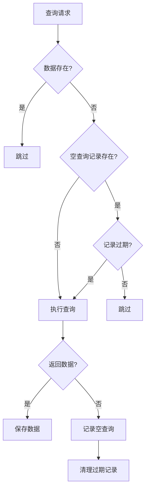

# 查询历史记录方案评审报告

## 一、原方案评估

### 问题分析准确性

原方案准确识别了问题：
- ✅ 正确指出 `detect_gaps()` 只检查"已有数据的日期"
- ✅ 正确分析了空查询被误判为缺口的原因
- ✅ 影响范围分析全面，涵盖了主要分页模式

### 方案优点

1. **解决核心问题**：通过记录所有查询（包括空查询），避免重复请求
2. **设计完整**：支持多种分页模式（date、date_range、anchor、period、stock_date、stock_period）
3. **侵入性小**：采用依赖注入方式，不大幅改变现有架构
4. **有清理策略**：自动清理过期记录，避免无限增长
5. **线程安全**：使用 `threading.RLock()` 保护并发访问

---

## 二、原方案问题分析

### 问题 1：查询键生成逻辑有缺陷

```python
# 原方案第 369 行
elif query_type == "date_range":
    # 日期范围，需要展开
    start, end = parts[1], parts[2]
    # 简单处理：只记录起始和结束  ← 问题！
    dates.add(start)
    dates.add(end)
```

**问题**：`date_range:20260101:20260107` 只返回起始和结束日期，中间的 5 天被遗漏，导致误判。

**正确做法**：应该展开日期范围，记录范围内所有日期：

```python
elif query_type == "date_range":
    start, end = parts[1], parts[2]
    # 展开日期范围
    current = datetime.strptime(start, "%Y%m%d")
    end_dt = datetime.strptime(end, "%Y%m%d")
    while current <= end_dt:
        dates.add(current.strftime("%Y%m%d"))
        current += timedelta(days=1)
```

---

### 问题 2：与现有 CoverageManager 职责重叠

现有 `CoverageManager` 已有：
- `should_skip()` - 跳过逻辑
- `detect_gaps()` - 缺口检测
- `_check_*_existence()` - 各种存在性检查

新增 `QueryHistoryManager` 后，两者职责边界不清，可能造成：
- 调用链复杂化
- 维护困难
- 潜在的竞态条件

**建议**：将空查询追踪作为 `CoverageManager` 的内部功能，而非独立模块。

---

### 问题 3：存储性能瓶颈

```python
# 原方案第 315 行
data["records"][query_key] = record
self._save_history(interface_name, data)  # 每次都写文件
```

**问题**：
- 每次请求都触发 JSON 文件写入
- 高并发时 I/O 成为瓶颈
- 文件损坏风险（并发写入）

**建议**：采用批量写入 + 内存缓存机制。

---

### 问题 4：缺少数据更新机制

原方案假设"已查询 = 无需再查"，但实际场景中：
- API 数据可能补发（如公司补发公告）
- 用户可能需要强制刷新特定日期
- 方案没有"重新检查"机制

**建议**：添加过期检查机制，超过一定天数的空查询记录会被重新验证。

---

### 问题 5：查询键生成过于复杂

`generate_query_key()` 方法有 60+ 行，包含多个条件分支：
- 日期锚点模式
- 股票+日期模式
- 报告期模式
- 日期范围模式

**风险**：维护成本高，边界条件容易遗漏

---

## 三、推荐的改进方案

### 方案概述：只记录"空查询" + 过期检查

核心思路：**不记录所有查询，只记录"空查询"**，并添加过期检查机制。



---

## 四、具体实现方案

### 1. 创建 EmptyQueryTracker 类

```python
# app4/core/empty_query_tracker.py

import json
import logging
from datetime import datetime, timedelta
from pathlib import Path
from typing import Dict, Set, Any, Optional
import threading

logger = logging.getLogger(__name__)


class EmptyQueryTracker:
    """
    空查询追踪器 - 只记录返回0条记录的查询
    
    设计原则：
    1. 只记录空查询，减少存储开销
    2. 支持过期检查，处理数据更新场景
    3. 批量写入，优化 I/O 性能
    4. 线程安全
    """
    
    def __init__(
        self, 
        data_dir: str = "data",
        ttl_days: int = 30,
        batch_size: int = 50
    ):
        self.data_dir = Path(data_dir)
        self.ttl_days = ttl_days
        self.batch_size = batch_size
        
        # 内存缓存: {interface_name: {query_key: queried_at}}
        self._cache: Dict[str, Dict[str, str]] = {}
        self._pending: Dict[str, Set[str]] = {}  # 待写入的空查询
        self._lock = threading.RLock()
        self._dirty: Dict[str, bool] = {}
    
    def _get_file_path(self, interface_name: str) -> Path:
        """获取空查询记录文件路径"""
        return self.data_dir / interface_name / ".empty_queries.json"
    
    def _load(self, interface_name: str) -> Dict[str, str]:
        """从文件加载空查询记录"""
        with self._lock:
            if interface_name in self._cache:
                return self._cache[interface_name]
            
            file_path = self._get_file_path(interface_name)
            if file_path.exists():
                try:
                    with open(file_path, 'r', encoding='utf-8') as f:
                        data = json.load(f)
                        self._cache[interface_name] = data
                        return data
                except Exception as e:
                    logger.warning(f"Failed to load empty queries for {interface_name}: {e}")
            
            self._cache[interface_name] = {}
            return self._cache[interface_name]
    
    def _save(self, interface_name: str):
        """保存到文件"""
        with self._lock:
            file_path = self._get_file_path(interface_name)
            file_path.parent.mkdir(parents=True, exist_ok=True)
            
            try:
                with open(file_path, 'w', encoding='utf-8') as f:
                    json.dump(self._cache[interface_name], f, ensure_ascii=False, indent=2)
                self._dirty[interface_name] = False
            except Exception as e:
                logger.warning(f"Failed to save empty queries for {interface_name}: {e}")
    
    def _flush_pending(self, interface_name: str):
        """刷新待写入记录到缓存"""
        with self._lock:
            if interface_name not in self._pending:
                return
            
            pending = self._pending[interface_name]
            if not pending:
                return
            
            # 确保缓存已加载
            self._load(interface_name)
            
            # 添加到缓存
            now = datetime.now().isoformat()
            for query_key in pending:
                self._cache[interface_name][query_key] = now
            
            # 清空待写入
            self._pending[interface_name].clear()
            self._dirty[interface_name] = True
            
            # 批量写入时才保存文件
            if len(self._cache[interface_name]) % self.batch_size == 0:
                self._save(interface_name)
    
    def generate_query_key(
        self, 
        params: Dict[str, Any], 
        interface_config: Dict[str, Any]
    ) -> Optional[str]:
        """
        根据请求参数生成查询键
        
        简化版本：只处理核心场景
        """
        # 1. 检查日期锚点接口
        param_defs = interface_config.get("parameters", {})
        for param_name, param_def in param_defs.items():
            if param_def.get("is_date_anchor", False) and param_name in params:
                anchor_value = params.get(param_name)
                if anchor_value:
                    return f"anchor:{param_name}:{anchor_value}"
        
        # 2. 处理股票 + 日期/报告期组合
        ts_code = params.get("ts_code")
        if ts_code:
            # 报告期模式
            period_field = params.get("_period_field", "period")
            period_value = params.get(period_field) or params.get("period")
            if period_value:
                return f"stock_period:{ts_code}:{period_value}"
            
            # 日期模式
            start_date = params.get("start_date")
            end_date = params.get("end_date")
            if start_date and end_date:
                if start_date == end_date:
                    return f"stock_date:{ts_code}:{start_date}"
                else:
                    # 多日范围：不记录，避免复杂度
                    return None
        
        # 3. 处理报告期模式（无股票维度）
        period_field = params.get("_period_field", "period")
        period_value = params.get(period_field) or params.get("period")
        if period_value and not ts_code:
            return f"period:{period_field}:{period_value}"
        
        # 4. 处理日期范围模式（无股票维度）
        start_date = params.get("start_date")
        end_date = params.get("end_date")
        if start_date and end_date and start_date == end_date:
            return f"date:{start_date}"
        
        # 5. 其他场景不记录
        return None
    
    def record_empty(
        self, 
        interface_name: str, 
        params: Dict[str, Any], 
        interface_config: Dict[str, Any]
    ):
        """记录空查询"""
        query_key = self.generate_query_key(params, interface_config)
        if not query_key:
            return
        
        with self._lock:
            if interface_name not in self._pending:
                self._pending[interface_name] = set()
            self._pending[interface_name].add(query_key)
            
            # 刷新到缓存
            self._flush_pending(interface_name)
        
        logger.debug(f"Recorded empty query for {interface_name}: {query_key}")
    
    def is_empty_queried(
        self, 
        interface_name: str, 
        params: Dict[str, Any], 
        interface_config: Dict[str, Any]
    ) -> bool:
        """
        检查是否已查询过且为空（未过期）
        
        Returns:
            True 表示已查询且为空，应跳过
            False 表示未查询或已过期，应重新查询
        """
        query_key = self.generate_query_key(params, interface_config)
        if not query_key:
            return False
        
        with self._lock:
            records = self._load(interface_name)
            queried_at = records.get(query_key)
            
            if not queried_at:
                return False
            
            # 检查是否过期
            try:
                queried_time = datetime.fromisoformat(queried_at)
                age_days = (datetime.now() - queried_time).days
                
                if age_days > self.ttl_days:
                    logger.info(
                        f"Empty query record expired ({age_days} days), "
                        f"will recheck: {query_key}"
                    )
                    # 删除过期记录
                    del records[query_key]
                    self._dirty[interface_name] = True
                    self._save(interface_name)
                    return False
                
                return True
            except Exception:
                return False
    
    def get_empty_queried_dates(self, interface_name: str) -> Set[str]:
        """获取已查询过且为空的日期集合（未过期）"""
        with self._lock:
            records = self._load(interface_name)
            dates = set()
            cutoff = datetime.now() - timedelta(days=self.ttl_days)
            
            for key, queried_at in records.items():
                try:
                    queried_time = datetime.fromisoformat(queried_at)
                    if queried_time >= cutoff:
                        # 解析日期
                        parts = key.split(":")
                        query_type = parts[0]
                        
                        if query_type == "date":
                            dates.add(parts[1])
                        elif query_type == "anchor":
                            dates.add(parts[2])
                        elif query_type == "stock_date":
                            dates.add(parts[2])
                        # period 和 stock_period 不包含日期，跳过
                except Exception:
                    continue
            
            return dates
    
    def clear(self, interface_name: str):
        """清除接口的空查询记录"""
        with self._lock:
            self._cache.pop(interface_name, None)
            self._pending.pop(interface_name, None)
            self._dirty.pop(interface_name, None)
            
            file_path = self._get_file_path(interface_name)
            if file_path.exists():
                file_path.unlink()
    
    def flush_all(self):
        """刷新所有待写入记录"""
        with self._lock:
            for interface_name in list(self._pending.keys()):
                self._flush_pending(interface_name)
                if self._dirty.get(interface_name):
                    self._save(interface_name)
    
    def prune_expired(self, interface_name: str = None) -> int:
        """清理过期记录"""
        cutoff = datetime.now() - timedelta(days=self.ttl_days)
        total_pruned = 0
        
        with self._lock:
            interfaces = [interface_name] if interface_name else list(self._cache.keys())
            
            for iface in interfaces:
                if iface not in self._cache:
                    continue
                
                records = self._cache[iface]
                original_count = len(records)
                
                self._cache[iface] = {
                    k: v for k, v in records.items()
                    if datetime.fromisoformat(v) >= cutoff
                }
                
                pruned = original_count - len(self._cache[iface])
                if pruned > 0:
                    self._dirty[iface] = True
                    self._save(iface)
                    total_pruned += pruned
                    logger.info(f"Pruned {pruned} expired empty queries for {iface}")
        
        return total_pruned
```

---

### 2. 集成到 CoverageManager

```python
# app4/core/coverage_manager.py 修改

from .empty_query_tracker import EmptyQueryTracker

class CoverageManager:
    def __init__(
        self,
        storage_manager: StorageManager,
        config_loader: ConfigLoader,
        downloader=None,
        cache_size: int = 128,
        empty_query_tracker: Optional[EmptyQueryTracker] = None,  # 新增
    ):
        # ... 现有初始化 ...
        self.empty_query_tracker = empty_query_tracker
    
    def detect_gaps(
        self,
        interface_name: str,
        target_range: DateRange,
        trade_calendar: List[Dict[str, Any]],
        min_gap_days: int = 1,
        max_gaps: int = 50,
    ) -> List[DateRange]:
        """检测缺失的日期段 - 增强版"""
        logger.info(f"检测缺口: {interface_name} ({target_range})")
        
        # 1. 获取已有数据的日期
        existing_dates = self._get_existing_dates_cached(interface_name)
        logger.info(f"已有数据: {len(existing_dates)} 天")
        
        # 2. 【新增】获取已查询过但无数据的日期
        empty_queried_dates = set()
        if self.empty_query_tracker:
            empty_queried_dates = self.empty_query_tracker.get_empty_queried_dates(
                interface_name
            )
            logger.info(f"已查询（空结果）: {len(empty_queried_dates)} 天")
        
        # 3. 合并：已有数据日期 + 已查询空结果日期
        covered_dates = existing_dates | empty_queried_dates
        
        # 4. 计算期望日期集合（只包含交易日）
        expected_dates = set()
        for day in trade_calendar:
            cal_date = day.get("cal_date")
            is_open = day.get("is_open", 0)
            if cal_date and is_open == 1:
                if target_range.start_date <= cal_date <= target_range.end_date:
                    expected_dates.add(cal_date)
        
        logger.info(f"期望交易日: {len(expected_dates)} 天")
        
        # 5. 快速路径检查
        if covered_dates >= expected_dates:
            logger.info("数据已完整覆盖（含空查询记录），无需下载")
            return []
        
        # 6. 找出缺失日期
        missing_dates = expected_dates - covered_dates
        # ... 后续逻辑不变 ...
```

---

### 3. 集成到 Downloader

```python
# app4/core/downloader.py 修改

from .empty_query_tracker import EmptyQueryTracker

class GenericDownloader:
    def __init__(self, ...):
        # ... 现有初始化 ...
        
        # 初始化空查询追踪器
        self.empty_query_tracker = EmptyQueryTracker(
            data_dir=self.global_config.get("storage", {}).get("base_dir", "data"),
            ttl_days=self.global_config.get("coverage", {}).get("empty_query_ttl_days", 30),
            batch_size=self.global_config.get("coverage", {}).get("batch_size", 50)
        )
        
        # 注入到 CoverageManager
        if self.coverage_manager:
            self.coverage_manager.empty_query_tracker = self.empty_query_tracker
    
    def _make_request(
        self, interface_config: Dict[str, Any], params: Dict[str, Any]
    ) -> List[Dict[str, Any]]:
        """发起实际的 API 请求 - 增强版"""
        # ... 现有请求逻辑 ...
        
        # 获取结果
        converted_data = [...]
        
        # 【新增】记录空查询
        if self.empty_query_tracker and len(converted_data) == 0:
            interface_name = interface_config.get("name", interface_config.get("api_name"))
            self.empty_query_tracker.record_empty(
                interface_name,
                params,
                interface_config
            )
        
        return converted_data
```

---

### 4. 配置文件支持

```yaml
# app4/config/settings.yaml 新增配置

coverage:
  # 空查询记录有效期（天）
  # 超过此天数的空查询记录会被重新检查
  empty_query_ttl_days: 30
  
  # 批量写入阈值
  batch_size: 50
  
  # 是否启用空查询追踪
  empty_query_tracking_enabled: true
```

---

### 5. CLI 支持

```python
# app4/main.py 新增命令

def main():
    parser = argparse.ArgumentParser()
    # ... 现有参数 ...
    
    # 新增：清除空查询记录
    parser.add_argument(
        "--clear-empty-queries",
        action="store_true",
        help="清除指定接口的空查询记录"
    )
    
    # 新增：清理过期记录
    parser.add_argument(
        "--prune-empty-queries",
        action="store_true",
        help="清理过期的空查询记录"
    )
    
    args = parser.parse_args()
    
    # ... 处理逻辑 ...
```

```bash
# 使用示例
python app4/main.py --clear-empty-queries --interface dividend
python app4/main.py --prune-empty-queries
```

---

## 五、方案对比总结

| 对比项 | 原方案 | 推荐方案 |
|--------|--------|----------|
| 存储内容 | 所有查询 | 仅空查询 |
| 存储量 | 大 | 小 |
| I/O 性能 | 每次写入 | 批量写入 |
| 处理数据更新 | ❌ | ✅ 过期检查 |
| 复杂度 | 高 | 低 |
| 职责边界 | 模糊 | 清晰 |
| 查询键生成 | 60+ 行 | 30 行 |

---

## 六、实施步骤

### 阶段 1：核心模块（1 天）

1. 创建 `app4/core/empty_query_tracker.py`
2. 添加配置到 `app4/config/settings.yaml`

### 阶段 2：集成修改（1 天）

3. 修改 `app4/core/coverage_manager.py` - 集成到 `detect_gaps()`
4. 修改 `app4/core/downloader.py` - 在 `_make_request()` 记录空查询

### 阶段 3：测试验证（1 天）

5. 编写单元测试
6. 进行集成测试
7. 性能测试

---

## 七、测试用例

```python
# test/test_empty_query_tracker.py

import pytest
from datetime import datetime, timedelta
from app4.core.empty_query_tracker import EmptyQueryTracker

def test_record_and_check_empty_query():
    """测试记录和检查空查询"""
    tracker = EmptyQueryTracker(data_dir="test_data")
    
    interface_config = {"parameters": {"ann_date": {"is_date_anchor": True}}}
    params = {"ann_date": "20260112"}
    
    # 初始状态：未查询
    assert not tracker.is_empty_queried("test_interface", params, interface_config)
    
    # 记录空查询
    tracker.record_empty("test_interface", params, interface_config)
    
    # 查询后：已查询
    assert tracker.is_empty_queried("test_interface", params, interface_config)
    
    tracker.clear("test_interface")

def test_expired_empty_query():
    """测试过期检查"""
    tracker = EmptyQueryTracker(data_dir="test_data", ttl_days=1)
    
    interface_config = {"parameters": {"ann_date": {"is_date_anchor": True}}}
    params = {"ann_date": "20260112"}
    
    # 手动设置过期记录
    tracker._load("test_interface")
    old_time = (datetime.now() - timedelta(days=2)).isoformat()
    tracker._cache["test_interface"]["anchor:ann_date:20260112"] = old_time
    
    # 过期记录应返回 False
    assert not tracker.is_empty_queried("test_interface", params, interface_config)
    
    tracker.clear("test_interface")

def test_get_empty_queried_dates():
    """测试获取空查询日期集合"""
    tracker = EmptyQueryTracker(data_dir="test_data")
    
    interface_config = {"parameters": {"trade_date": {}}}
    
    # 记录多个空查询
    for date in ["20260101", "20260102", "20260103"]:
        tracker.record_empty("test_interface", {"start_date": date, "end_date": date}, interface_config)
    
    dates = tracker.get_empty_queried_dates("test_interface")
    assert "20260101" in dates
    assert "20260102" in dates
    assert "20260103" in dates
    
    tracker.clear("test_interface")
```

---

## 八、总结

原方案思路正确，能够解决"已查询但返回0条记录"的重复请求问题。但存在以下改进空间：

1. **简化存储**：只记录空查询，减少存储开销
2. **优化性能**：批量写入替代每次写入
3. **处理更新**：添加过期检查机制
4. **简化逻辑**：简化查询键生成逻辑
5. **明确职责**：将空查询追踪作为 CoverageManager 的内部功能

推荐采用本文档描述的改进方案，在保证功能完整性的同时，降低复杂度并提升性能。
