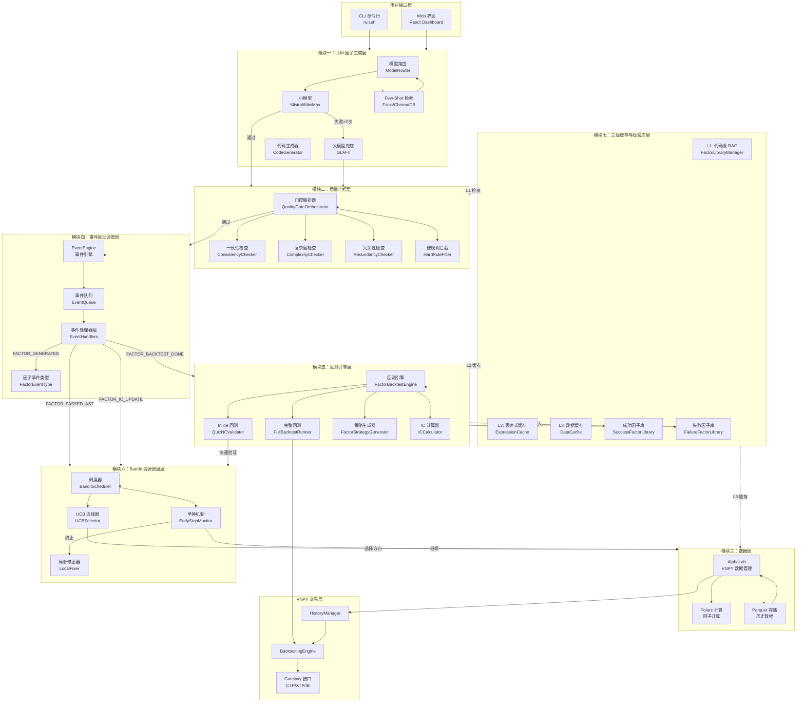
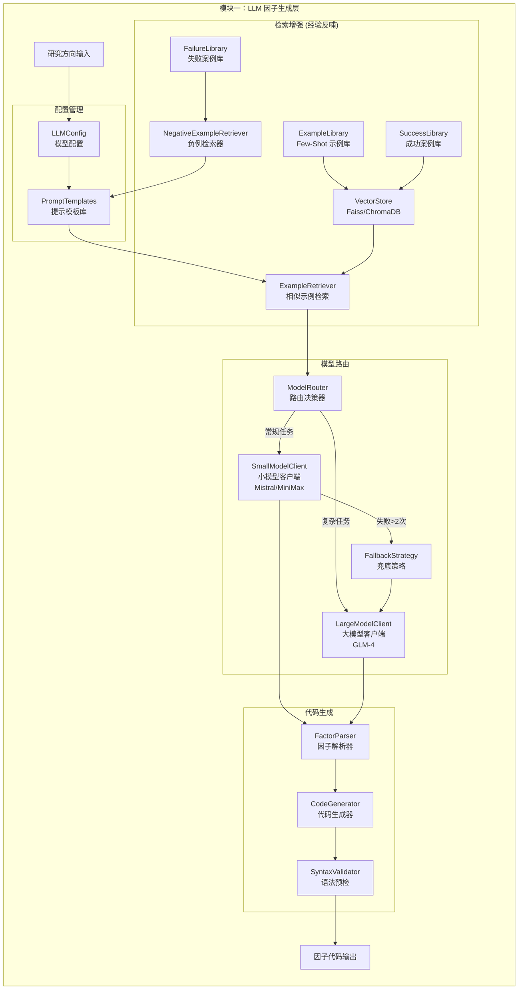
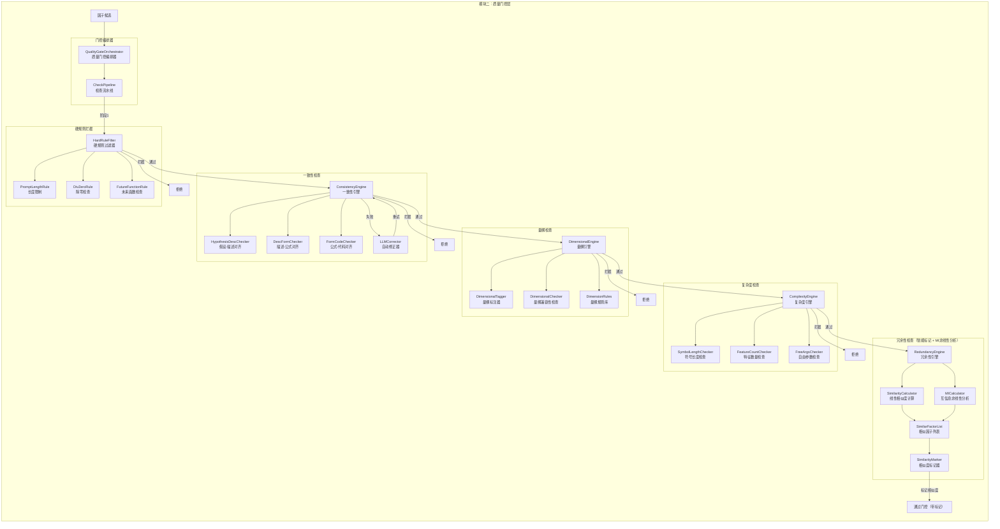
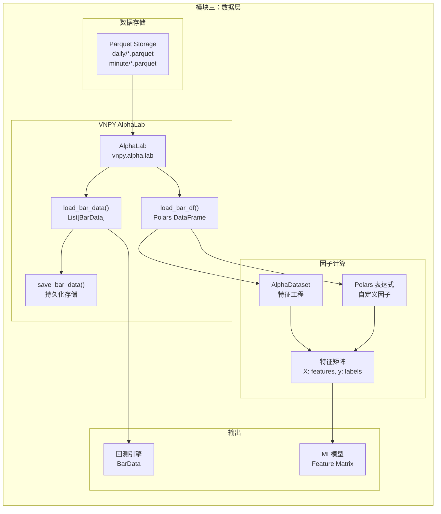
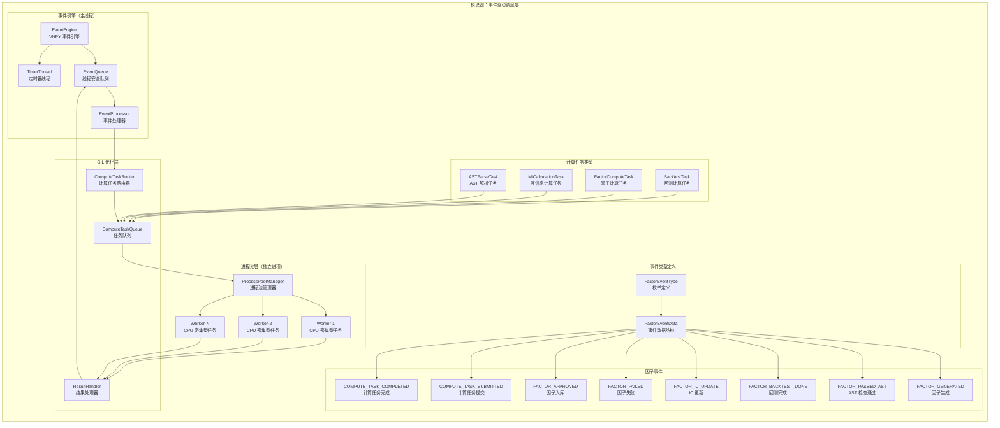
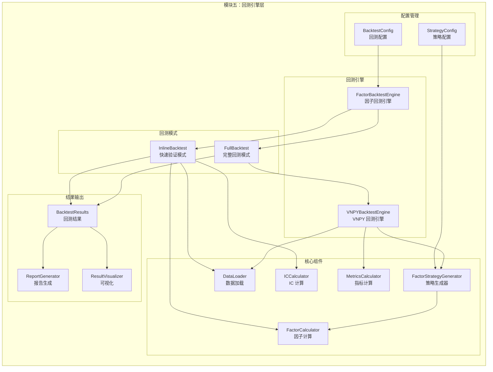
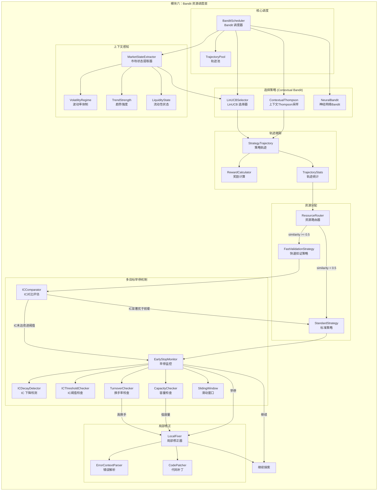
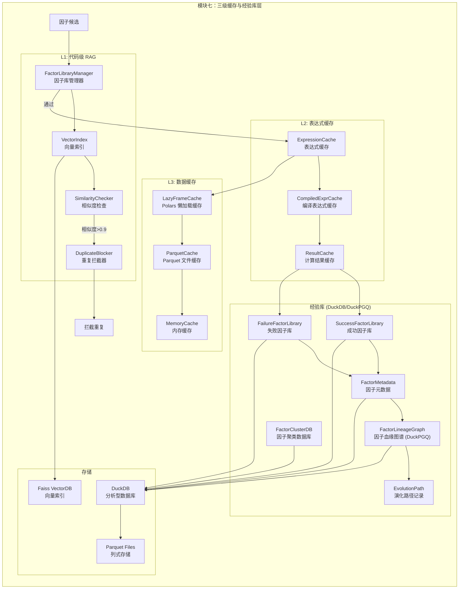
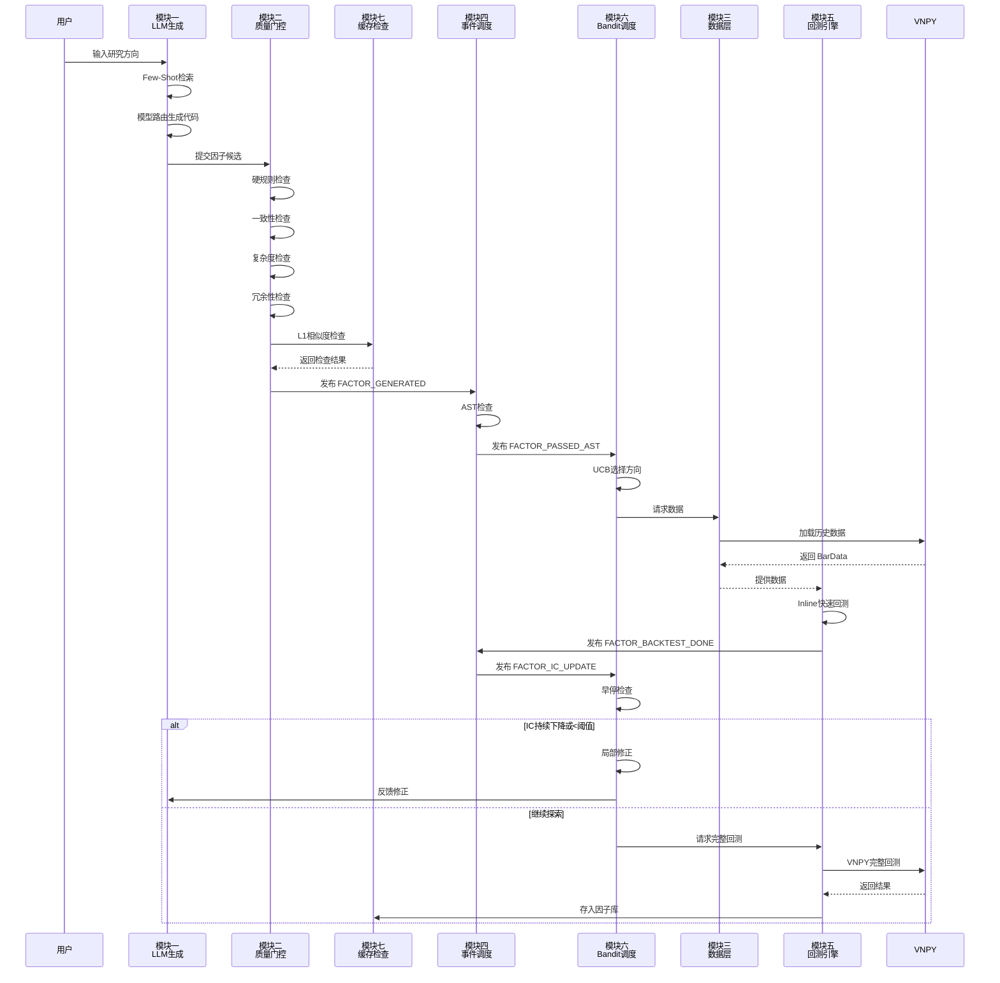
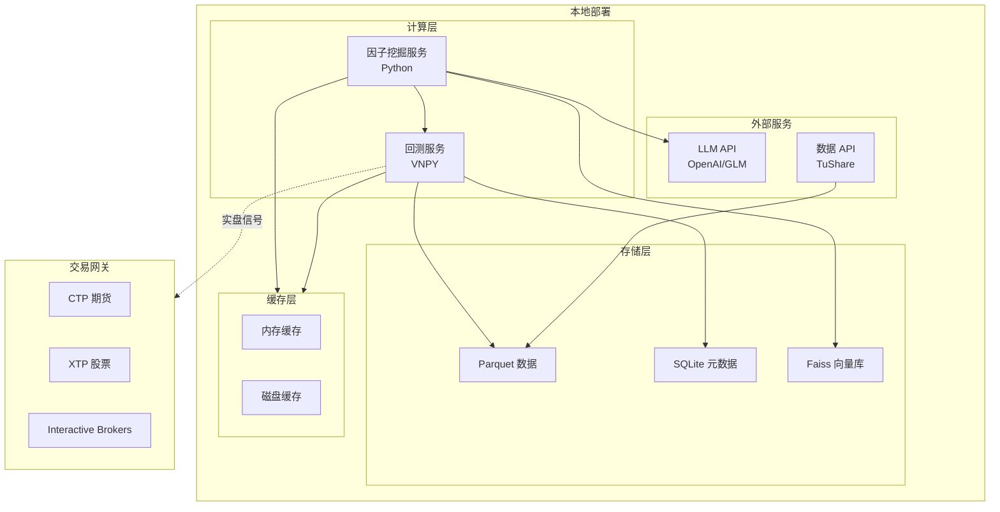

# 因子挖掘系统架构设计文档

## 概述

本文档描述了基于 QuantaAlpha 和 VNPY 的因子挖掘系统架构设计，采用 7 大模块分层架构，实现从 LLM 因子生成到实盘交易的完整闭环。

---

## 整体架构图



---

## 模块详细设计

### 模块一：LLM 因子生成层 (Factor Generation Layer)

#### 职责
负责因子的智能生成与代码转换，实现大小模型协同路由。

#### 子模块结构



#### 核心类设计

| 类名 | 职责 | 关键方法 |
|------|------|---------|
| `ModelRouter` | 路由决策 | `route(task_complexity) -> ModelType` |
| `SmallModelClient` | 小模型调用 | `generate(prompt) -> CodeSnippet` |
| `LargeModelClient` | 大模型调用 | `generate(prompt) -> CodeSnippet` |
| `ExampleRetriever` | 示例检索 | `retrieve(query, top_k=2) -> Examples` |
| `NegativeExampleRetriever` | 负例检索 | `retrieve_failures(query, top_k=3) -> Failures` |
| `ExperienceReplay` | 经验反哺 | `build_negative_prompt(failures) -> Prompt` |
| `CodeGenerator` | 代码生成 | `generate_vnpy_expression(desc) -> Expression` |

#### 经验反哺 (Experience Replay) 与负例学习

不仅缓存成功的因子，还要缓存导致失败的推理轨迹。在 Few-Shot 检索中，同时检索成功案例和失败案例，以 Negative Prompt 的形式避免 LLM 重蹈覆辙。

**负例检索流程**：

```python
from dataclasses import dataclass
from typing import List, Dict, Optional
import numpy as np
from datetime import datetime

@dataclass
class FailureCase:
    """失败因子案例"""
    factor_id: str
    expression: str
    research_direction: str
    failure_reason: str
    error_type: str  # 'ic_too_low', 'high_turnover', 'overfitting', 'syntax_error'
    ic_history: List[float]
    similar_to: Optional[str]  # 相似的已有因子
    created_at: datetime
    
    def to_negative_example(self) -> str:
        """转换为负例描述"""
        return f"""
失败尝试 #{self.factor_id}:
- 研究方向: {self.research_direction}
- 因子表达式: {self.expression}
- 失败原因: {self.failure_reason}
- 错误类型: {self.error_type}
- IC历史: {self.ic_history}
"""

class NegativeExampleRetriever:
    """负例检索器 - 检索相似方向上的失败案例"""
    
    def __init__(self, vector_db, failure_db):
        self.vector_db = vector_db
        self.failure_db = failure_db
    
    def retrieve_failures(
        self, 
        query_direction: str,
        query_embedding: np.ndarray,
        top_k: int = 3,
        recency_weight: float = 0.3
    ) -> List[FailureCase]:
        """
        检索相关失败案例
        
        Args:
            query_direction: 当前研究方向
            query_embedding: 查询向量
            top_k: 返回数量
            recency_weight: 时间衰减权重（越新的失败越重要）
        """
        # 1. 向量相似度搜索
        similar_failures = self.vector_db.search(
            query_embedding, 
            collection="failure_library",
            top_k=top_k * 2  # 多检索一些用于过滤
        )
        
        # 2. 过滤同方向的失败案例
        direction_failures = [
            f for f in similar_failures 
            if f.research_direction == query_direction
        ]
        
        # 3. 按综合分数排序（相似度 + 时间衰减）
        scored_failures = []
        for failure in direction_failures:
            similarity_score = failure.vector_similarity
            
            # 时间衰减因子（越新的失败越重要）
            days_ago = (datetime.now() - failure.created_at).days
            recency_factor = np.exp(-recency_weight * days_ago / 30)
            
            combined_score = similarity_score * recency_factor
            scored_failures.append((combined_score, failure))
        
        scored_failures.sort(key=lambda x: x[0], reverse=True)
        return [f for _, f in scored_failures[:top_k]]
    
    def get_common_pitfalls(self, direction: str) -> List[str]:
        """获取某个方向上的常见陷阱"""
        failures = self.failure_db.query(
            f"SELECT error_type, COUNT(*) as count 
             FROM failures 
             WHERE research_direction = '{direction}'
             GROUP BY error_type 
             ORDER BY count DESC 
             LIMIT 5"
        )
        return [f"{row['error_type']}: {row['count']}次失败" for row in failures]

class ExperienceReplay:
    """经验反哺 - 构建包含负例的增强Prompt"""
    
    NEGATIVE_PROMPT_TEMPLATE = """
你在尝试开发一个{research_direction}方向的量化因子。

【成功案例参考】（你应该学习这些）：
{positive_examples}

【失败案例警示】（你必须避免这些错误）：
{negative_examples}

【该方向的常见陷阱】：
{common_pitfalls}

请基于以上经验，生成一个新的因子表达式。注意：
1. 学习成功案例的设计思路
2. 避免失败案例中的错误
3. 特别注意常见陷阱
4. 确保因子有独特的信息增量

生成的因子表达式：
"""
    
    def build_enhanced_prompt(
        self,
        research_direction: str,
        positive_examples: List[Dict],
        negative_examples: List[FailureCase],
        common_pitfalls: List[str]
    ) -> str:
        """
        构建增强版Prompt，包含正负例
        
        Args:
            research_direction: 研究方向
            positive_examples: 成功案例列表
            negative_examples: 失败案例列表
            common_pitfalls: 常见陷阱
        """
        # 格式化成功案例
        pos_text = "\n\n".join([
            f"案例{i+1}:\n- 表达式: {ex['expression']}\n- IC: {ex['ic_mean']:.3f}\n- 设计思路: {ex.get('design_rationale', 'N/A')}"
            for i, ex in enumerate(positive_examples)
        ])
        
        # 格式化失败案例
        neg_text = "\n\n".join([
            f"案例{i+1}:\n- 表达式: {fail.expression}\n- 失败原因: {fail.failure_reason}\n- 教训: {self._extract_lesson(fail)}"
            for i, fail in enumerate(negative_examples)
        ])
        
        # 格式化常见陷阱
        pitfalls_text = "\n".join([f"- {p}" for p in common_pitfalls])
        
        return self.NEGATIVE_PROMPT_TEMPLATE.format(
            research_direction=research_direction,
            positive_examples=pos_text,
            negative_examples=neg_text,
            common_pitfalls=pitfalls_text
        )
    
    def _extract_lesson(self, failure: FailureCase) -> str:
        """从失败案例中提取教训"""
        lessons = {
            'ic_too_low': "该因子与现有因子过于相似，没有信息增量",
            'high_turnover': "换手率过高，实盘滑点会侵蚀收益",
            'overfitting': "在训练集上表现好但在测试集上失效，可能过拟合",
            'syntax_error': "表达式语法错误，无法正确计算",
            'look_ahead_bias': "存在未来函数，使用了未来信息",
            'insufficient_capacity': "容量太小，无法支持大资金量"
        }
        return lessons.get(failure.error_type, "未知错误类型")

class FactorGenerationWithExperience:
    """集成经验反哺的因子生成器"""
    
    def __init__(self, llm_client, retriever, negative_retriever, experience_replay):
        self.llm = llm_client
        self.retriever = retriever
        self.negative_retriever = negative_retriever
        self.experience_replay = experience_replay
    
    def generate_factor(self, research_direction: str, query: str) -> Dict:
        """
        生成因子（带经验反哺）
        """
        # 1. 检索成功案例（Few-Shot）
        positive_examples = self.retriever.retrieve(
            query=query,
            top_k=2
        )
        
        # 2. 检索失败案例（Negative Examples）
        query_embedding = self.retriever.encode(query)
        negative_examples = self.negative_retriever.retrieve_failures(
            query_direction=research_direction,
            query_embedding=query_embedding,
            top_k=3
        )
        
        # 3. 获取常见陷阱
        common_pitfalls = self.negative_retriever.get_common_pitfalls(research_direction)
        
        # 4. 构建增强Prompt
        enhanced_prompt = self.experience_replay.build_enhanced_prompt(
            research_direction=research_direction,
            positive_examples=positive_examples,
            negative_examples=negative_examples,
            common_pitfalls=common_pitfalls
        )
        
        # 5. 调用LLM生成
        factor_code = self.llm.generate(enhanced_prompt)
        
        return {
            'code': factor_code,
            'prompt': enhanced_prompt,
            'positive_examples': [ex['factor_id'] for ex in positive_examples],
            'negative_examples': [fail.factor_id for fail in negative_examples]
        }

#### 负例反哺的 Context Window 优化

**痛点**：随着失败库越来越大，如果把太多失败案例塞进 Prompt，会导致 LLM 遗忘关键指令（Lost in the Middle）或超出 Token 限制。

**优化方案**：

1. **动态摘要**：对失败原因进行动态摘要。不要传入完整的失败代码，而是让一个轻量级 LLM 定期总结："在 price_volume 方向，最近 100 次失败主要集中在使用了过短的窗口期"
2. **Hard Negative 选择**：Prompt 中只保留 1-2 个最相似的 Hard Negative（极易犯错的负例），其余用高度凝练的 Rule 替代

```python
from typing import List, Dict, Tuple
from dataclasses import dataclass
from datetime import datetime, timedelta
import json

@dataclass
class FailureSummary:
    """失败案例摘要"""
    direction: str
    summary_text: str
    common_error_types: Dict[str, int]
    recent_trends: List[str]
    hard_negatives: List[str]  # 最具代表性的失败案例ID
    generated_at: datetime

class DynamicFailureSummarizer:
    """
    动态失败案例摘要器
    
    使用轻量级LLM定期总结失败模式，
    避免Context Window爆炸
    """
    
    def __init__(self, llm_client, summary_interval_hours: int = 24):
        self.llm = llm_client
        self.summary_interval = timedelta(hours=summary_interval_hours)
        self.cache: Dict[str, FailureSummary] = {}  # direction -> summary
        self.last_update: Dict[str, datetime] = {}
    
    def get_summary(self, direction: str, failure_db) -> FailureSummary:
        """获取失败摘要（带缓存）"""
        now = datetime.now()
        
        # 检查缓存是否过期
        if (direction in self.cache and 
            direction in self.last_update and
            now - self.last_update[direction] < self.summary_interval):
            return self.cache[direction]
        
        # 生成新摘要
        summary = self._generate_summary(direction, failure_db)
        self.cache[direction] = summary
        self.last_update[direction] = now
        
        return summary
    
    def _generate_summary(self, direction: str, failure_db) -> FailureSummary:
        """生成失败摘要"""
        # 获取最近100个失败案例
        recent_failures = failure_db.query(
            f"""
            SELECT * FROM failures 
            WHERE research_direction = '{direction}'
            ORDER BY created_at DESC
            LIMIT 100
            """
        )
        
        if len(recent_failures) == 0:
            return FailureSummary(
                direction=direction,
                summary_text="该方向暂无失败案例",
                common_error_types={},
                recent_trends=[],
                hard_negatives=[],
                generated_at=datetime.now()
            )
        
        # 统计错误类型
        error_types = {}
        for failure in recent_failures:
            et = failure['error_type']
            error_types[et] = error_types.get(et, 0) + 1
        
        # 使用轻量级LLM生成摘要
        summary_prompt = f"""
请总结以下量化因子失败案例的共同模式和教训：

方向: {direction}
失败案例数量: {len(recent_failures)}

错误类型分布:
{json.dumps(error_types, indent=2, ensure_ascii=False)}

最近失败案例示例（5个）:
{json.dumps(recent_failures[:5], indent=2, ensure_ascii=False, default=str)}

请生成简洁的摘要，包括：
1. 该方向最常见的失败原因（1-2句话）
2. 最近的趋势变化
3. 最需要警惕的陷阱

摘要（中文，不超过200字）:
"""
        
        summary_text = self.llm.generate(summary_prompt, max_tokens=300)
        
        # 选择Hard Negatives（最具代表性的失败案例）
        hard_negatives = self._select_hard_negatives(recent_failures, error_types)
        
        # 识别趋势
        recent_trends = self._identify_trends(recent_failures)
        
        return FailureSummary(
            direction=direction,
            summary_text=summary_text,
            common_error_types=error_types,
            recent_trends=recent_trends,
            hard_negatives=hard_negatives,
            generated_at=datetime.now()
        )
    
    def _select_hard_negatives(
        self, 
        failures: List[Dict], 
        error_types: Dict[str, int]
    ) -> List[str]:
        """
        选择Hard Negative案例
        
        策略：
        1. 选择最常见的错误类型中的代表性案例
        2. 选择IC最低的案例
        3. 选择最近发生的案例
        """
        if not failures:
            return []
        
        # 按综合分数排序
        scored_failures = []
        for f in failures:
            score = 0
            # 常见错误类型加分
            if f['error_type'] in error_types:
                score += error_types[f['error_type']] * 0.1
            # IC越低越值得警惕
            if 'ic_history' in f and f['ic_history']:
                score += (0.1 - min(f['ic_history'])) * 10
            # 时间越近越相关
            days_ago = (datetime.now() - f['created_at']).days
            score += max(0, 7 - days_ago) * 0.5
            
            scored_failures.append((score, f['factor_id']))
        
        scored_failures.sort(reverse=True)
        return [fid for _, fid in scored_failures[:2]]  # 只选Top-2
    
    def _identify_trends(self, failures: List[Dict]) -> List[str]:
        """识别失败趋势"""
        trends = []
        
        # 按周统计
        from collections import defaultdict
        weekly_counts = defaultdict(int)
        for f in failures:
            week = f['created_at'].strftime('%Y-W%W')
            weekly_counts[week] += 1
        
        weeks = sorted(weekly_counts.keys())
        if len(weeks) >= 2:
            recent = weekly_counts[weeks[-1]]
            previous = weekly_counts[weeks[-2]]
            if recent > previous * 1.5:
                trends.append(f"失败率上升（上周{previous}次，本周{recent}次）")
            elif recent < previous * 0.5:
                trends.append(f"失败率下降（上周{previous}次，本周{recent}次）")
        
        return trends

class OptimizedExperienceReplay:
    """优化的经验反哺 - 解决Context Window爆炸问题"""
    
    OPTIMIZED_PROMPT_TEMPLATE = """
你在尝试开发一个{research_direction}方向的量化因子。

【成功案例参考】（你应该学习这些）：
{positive_examples}

【失败模式摘要】（你必须避免这些错误）：
{failure_summary}

【常见陷阱统计】：
{error_type_stats}

【典型失败案例】（Hard Negatives）：
{hard_negatives}

【最近趋势】：
{recent_trends}

请基于以上经验，生成一个新的因子表达式。注意：
1. 学习成功案例的设计思路
2. 特别关注失败模式摘要中的警示
3. 避免常见陷阱
4. 确保因子有独特的信息增量

生成的因子表达式：
"""
    
    def __init__(self, summarizer: DynamicFailureSummarizer):
        self.summarizer = summarizer
    
    def build_optimized_prompt(
        self,
        research_direction: str,
        positive_examples: List[Dict],
        failure_db
    ) -> str:
        """
        构建优化的Prompt，解决Context Window问题
        
        相比原版：
        - 不传入所有失败案例的完整代码
        - 传入动态生成的摘要
        - 只保留2个Hard Negative
        """
        # 1. 获取失败摘要（轻量级）
        summary = self.summarizer.get_summary(research_direction, failure_db)
        
        # 2. 格式化成功案例（保持不变）
        pos_text = "\n\n".join([
            f"案例{i+1}:\n- 表达式: {ex['expression']}\n- IC: {ex['ic_mean']:.3f}\n- 设计思路: {ex.get('design_rationale', 'N/A')}"
            for i, ex in enumerate(positive_examples)
        ])
        
        # 3. 格式化错误类型统计
        error_stats = "\n".join([
            f"- {error_type}: {count}次失败"
            for error_type, count in sorted(
                summary.common_error_types.items(), 
                key=lambda x: x[1], 
                reverse=True
            )[:5]  # 只显示Top-5
        ])
        
        # 4. 获取Hard Negatives的详细信息
        hard_negatives_text = self._get_hard_negatives_text(
            summary.hard_negatives, 
            failure_db
        )
        
        # 5. 格式化趋势
        trends_text = "\n".join([f"- {t}" for t in summary.recent_trends]) or "无显著趋势"
        
        return self.OPTIMIZED_PROMPT_TEMPLATE.format(
            research_direction=research_direction,
            positive_examples=pos_text,
            failure_summary=summary.summary_text,
            error_type_stats=error_stats,
            hard_negatives=hard_negatives_text,
            recent_trends=trends_text
        )
    
    def _get_hard_negatives_text(self, hard_negative_ids: List[str], failure_db) -> str:
        """获取Hard Negatives的简洁描述"""
        if not hard_negative_ids:
            return "暂无"
        
        texts = []
        for i, fid in enumerate(hard_negative_ids, 1):
            failure = failure_db.get(fid)
            if failure:
                texts.append(
                    f"案例{i}:\n"
                    f"- 表达式: {failure['expression']}\n"
                    f"- 错误类型: {failure['error_type']}\n"
                    f"- 核心教训: {failure.get('lessons_learned', ['无'])[0]}"
                )
        
        return "\n\n".join(texts)

# Token消耗对比示例
# 原版Prompt（100个失败案例）: ~8000 tokens
# 优化版Prompt（摘要+2个Hard Negative）: ~1500 tokens
# 节省: 81%的Token消耗
```
```

**失败因子库结构**：

```python
# 失败因子库示例（用于经验反哺）
{
    "factor_id": "f_20240309_004",
    "expression": "ts_corr(close, volume, 3)",
    "research_direction": "price_volume",
    "failure_reason": "IC未达改进阈值，与f_20240309_003过于相似",
    "error_type": "insufficient_improvement",
    "ic_history": [0.015, 0.012, 0.008],
    "turnover_history": [0.25, 0.28, 0.30],
    "similar_to": "f_20240309_003",
    "similarity_score": 0.88,
    "created_at": "2024-03-09T10:45:00",
    "metadata": {
        "exploration_strategy": "fast_validation",
        "comparison_baseline": "f_20240309_003",
        "ic_gap": "-0.065",
        "lessons_learned": [
            "短窗口(3天)的相关性因子已经被充分挖掘",
            "与现有因子相似度过高，没有信息增量"
        ]
    },
    "embedding": [0.12, -0.05, 0.33, ...]  # 用于向量检索
}
```

**Prompt 示例（含负例）**：

```
你在尝试开发一个price_volume方向的量化因子。

【成功案例参考】（你应该学习这些）：
案例1:
- 表达式: ts_corr(close, volume, 5)
- IC: 0.085
- 设计思路: 5日量价相关性，捕捉短期资金流入

案例2:
- 表达式: ts_corr(ts_returns(close, 1), volume, 10)
- IC: 0.072
- 设计思路: 日收益与成交量的相关性

【失败案例警示】（你必须避免这些错误）：
案例1:
- 表达式: ts_corr(close, volume, 3)
- 失败原因: IC未达改进阈值，与f_20240309_003过于相似
- 教训: 短窗口(3天)的相关性因子已经被充分挖掘

案例2:
- 表达式: ts_mean(volume, 20) / ts_mean(volume, 5)
- 失败原因: 换手率过高(>50%)，实盘滑点不可控
- 教训: 换手率过高，实盘滑点会侵蚀收益

【该方向的常见陷阱】：
- ic_too_low: 15次失败
- high_turnover: 8次失败
- overfitting: 5次失败

请基于以上经验，生成一个新的因子表达式。注意：
1. 学习成功案例的设计思路
2. 避免失败案例中的错误
3. 特别注意常见陷阱
4. 确保因子有独特的信息增量

生成的因子表达式：
```

#### 与 VNPY 集成

生成 `vnpy.alpha` 兼容的表达式：

```python
# 时间序列函数
"ts_delay(close, 5) / close - 1"
"ts_mean(volume, 20) / volume"
"ts_corr(close, volume, 10)"

# 截面函数
"cs_rank(ts_returns(close, 5))"
"cs_mean(volatility)"

# 技术分析函数
"ta_rsi(close, 14)"
"ta_macd(close)"
```

---

### 模块二：质量门控层 (Quality Gate Layer)

#### 职责
多级质量检查，拦截低质量因子，降低 API 成本。

#### 子模块结构



#### 量纲与物理意义检查 (Dimensional Analysis)

**痛点**：LLM 经常会生成数学上可行但毫无金融逻辑的公式，例如 `close + volume`（价格加成交量，量纲不同）。

**解决方案**：在 AST 检查中引入量纲推导系统，给基础字段打上标签，在 AST 遍历时检查操作符两端的量纲是否兼容。

```python
from enum import Enum
from typing import Dict, Optional, Tuple
import ast

class DimensionType(Enum):
    """量纲类型"""
    PRICE = "Price"           # 价格量纲
    VOLUME = "Volume"         # 成交量量纲
    RATIO = "Ratio"           # 比率量纲（无量纲）
    COUNT = "Count"           # 计数（天数等）
    TIME = "Time"             # 时间量纲
    UNKNOWN = "Unknown"       # 未知

class DimensionalTagger:
    """量纲标注器 - 为基础字段打标签"""
    
    # 基础字段量纲映射
    FIELD_DIMENSIONS = {
        # 价格类字段
        'close': DimensionType.PRICE,
        'open': DimensionType.PRICE,
        'high': DimensionType.PRICE,
        'low': DimensionType.PRICE,
        'vwap': DimensionType.PRICE,
        'amount': DimensionType.PRICE,  # 金额
        
        # 成交量类字段
        'volume': DimensionType.VOLUME,
        'turnover': DimensionType.VOLUME,
        
        # 比率类字段
        'returns': DimensionType.RATIO,
        'volatility': DimensionType.RATIO,
        'sharpe': DimensionType.RATIO,
        'ic': DimensionType.RATIO,
        'rank': DimensionType.RATIO,
        
        # 计数类字段
        'day': DimensionType.COUNT,
        'minute': DimensionType.COUNT,
    }
    
    def get_dimension(self, field_name: str) -> DimensionType:
        """获取字段的量纲类型"""
        return self.FIELD_DIMENSIONS.get(field_name, DimensionType.UNKNOWN)

class DimensionalChecker:
    """量纲兼容性检查器 - 在AST遍历时检查量纲"""
    
    def __init__(self):
        self.tagger = DimensionalTagger()
        self.errors = []
    
    def check_compatibility(
        self, 
        left_dim: DimensionType, 
        right_dim: DimensionType, 
        op: str
    ) -> Tuple[bool, Optional[DimensionType]]:
        """
        检查操作符两端的量纲兼容性
        
        Args:
            left_dim: 左操作数量纲
            right_dim: 右操作数量纲
            op: 操作符 (+, -, *, /, etc.)
            
        Returns:
            (是否兼容, 结果量纲)
        """
        if op in ['+', '-']:
            # 加减法必须同量纲
            if left_dim != right_dim:
                return False, None
            return True, left_dim
            
        elif op == '*':
            # 乘法产生新量纲
            if left_dim == DimensionType.PRICE and right_dim == DimensionType.VOLUME:
                return True, DimensionType.PRICE  # 金额
            elif left_dim == DimensionType.RATIO or right_dim == DimensionType.RATIO:
                # 与比率相乘，量纲不变
                return True, left_dim if right_dim == DimensionType.RATIO else right_dim
            elif left_dim == DimensionType.UNKNOWN or right_dim == DimensionType.UNKNOWN:
                return True, DimensionType.UNKNOWN
            else:
                return True, DimensionType.UNKNOWN  # 复杂组合标记为未知
                
        elif op == '/':
            # 除法产生新量纲
            if left_dim == right_dim:
                return True, DimensionType.RATIO  # 同量纲相除得比率
            elif left_dim == DimensionType.PRICE and right_dim == DimensionType.PRICE:
                return True, DimensionType.RATIO  # 价格比
            elif left_dim == DimensionType.VOLUME and right_dim == DimensionType.VOLUME:
                return True, DimensionType.RATIO  # 量比
            elif left_dim == DimensionType.UNKNOWN or right_dim == DimensionType.UNKNOWN:
                return True, DimensionType.UNKNOWN
            else:
                return True, DimensionType.UNKNOWN
                
        elif op in ['**', 'pow']:
            # 幂运算要求指数为无量纲
            if right_dim != DimensionType.RATIO and right_dim != DimensionType.COUNT:
                return False, None
            return True, left_dim
            
        return True, DimensionType.UNKNOWN
    
    def check_expression(self, expression: str) -> Dict:
        """
        检查表达式量纲兼容性
        
        Args:
            expression: 因子表达式字符串
            
        Returns:
            检查结果字典
        """
        self.errors = []
        
        try:
            tree = ast.parse(expression)
            result_dim = self._check_node(tree.body[0].value)
            
            return {
                'valid': len(self.errors) == 0,
                'errors': self.errors,
                'result_dimension': result_dim.value if result_dim else None
            }
        except SyntaxError as e:
            return {
                'valid': False,
                'errors': [f"语法错误: {e}"],
                'result_dimension': None
            }
    
    def _check_node(self, node) -> Optional[DimensionType]:
        """递归检查AST节点"""
        if isinstance(node, ast.Name):
            return self.tagger.get_dimension(node.id)
            
        elif isinstance(node, ast.Num) or isinstance(node, ast.Constant):
            return DimensionType.RATIO  # 常数视为比率
            
        elif isinstance(node, ast.BinOp):
            left_dim = self._check_node(node.left)
            right_dim = self._check_node(node.right)
            
            op_map = {
                ast.Add: '+',
                ast.Sub: '-',
                ast.Mult: '*',
                ast.Div: '/',
                ast.Pow: '**'
            }
            op = op_map.get(type(node.op), '?')
            
            compatible, result_dim = self.check_compatibility(left_dim, right_dim, op)
            
            if not compatible:
                self.errors.append(
                    f"量纲不兼容: {left_dim.value} {op} {right_dim.value}"
                )
                return None
                
            return result_dim
            
        elif isinstance(node, ast.Call):
            # 函数调用 - 根据函数类型推断量纲
            func_name = self._get_func_name(node.func)
            return self._infer_function_dimension(func_name, node.args)
            
        return DimensionType.UNKNOWN
    
    def _get_func_name(self, node) -> str:
        """获取函数名"""
        if isinstance(node, ast.Name):
            return node.id
        elif isinstance(node, ast.Attribute):
            return node.attr
        return "unknown"
    
    def _infer_function_dimension(self, func_name: str, args) -> DimensionType:
        """根据函数名推断返回量纲"""
        # 时间序列函数 - 保持输入量纲
        ts_functions = ['ts_mean', 'ts_std', 'ts_max', 'ts_min', 'ts_sum', 'ts_delay']
        if func_name in ts_functions and args:
            return self._check_node(args[0])
        
        # 排名函数 - 返回比率
        if func_name in ['cs_rank', 'ts_rank']:
            return DimensionType.RATIO
            
        # 相关性函数 - 返回比率
        if func_name in ['ts_corr', 'cs_corr']:
            return DimensionType.RATIO
            
        # 对数函数 - 无量纲输入，比率输出
        if func_name in ['log', 'ln', 'log10']:
            return DimensionType.RATIO
            
        return DimensionType.UNKNOWN

# 使用示例
checker = DimensionalChecker()

# 检查合法表达式
result1 = checker.check_expression("ts_mean(close, 5) / close")
print(result1)  # valid: True, result_dimension: 'Ratio'

# 检查非法表达式
result2 = checker.check_expression("close + volume")
print(result2)  # valid: False, errors: ['量纲不兼容: Price + Volume']
```

**检查阈值配置

| 检查类型 | 指标 | 阈值 | 说明 |
|---------|------|------|------|
| **硬规则** | Prompt 长度 | <= 500 字符 | 超长截断 |
| **硬规则** | 除零风险 | 无 | AST 静态检查 |
| **硬规则** | 未来函数 | 无 | 检查 `shift(-1)` |
| **量纲检查** | 量纲兼容性 | Pass/Fail | 检查 Price + Volume 等非法组合 |
| **一致性** | 语义对齐 | Pass/Fail | LLM 判断，3次重试 |
| **复杂度** | 符号长度 | <= 250 | 防止过复杂表达式 |
| **复杂度** | 基础特征数 | <= 6 | 限制特征维度 |
| **复杂度** | 自由参数比例 | <= 0.5 | 控制参数空间 |
| **冗余性** | 线性相似度 | 返回相似列表 | Pearson/Spearman 相关性 |
| **冗余性** | 互信息 (MI) | 返回相似列表 | 捕捉非线性依赖关系 |

#### 冗余性检查说明

**设计原则**：从"二元拦截"升级为"智能标记"

传统冗余检查直接拦截相似因子，但存在局限：
- `ts_mean(close, 10) / close` 和 `ts_mean(close, 5) / close` 代码相似度高，但经济含义可能完全不同
- 简单拦截可能误杀"有价值的细微改进"

**增强设计**：
1. **识别而非拦截**：计算相似度，返回相似因子列表及其IC历史
2. **标记分类**：
   - `similarity < 0.5`：全新因子
   - `0.5 <= similarity < 0.9`：低相似，标准处理
   - `similarity >= 0.9`：高相似，进入快速验证模式
3. **传递信息**：将相似因子ID、相似度分数、历史IC表现传递给Bandit调度层

**互信息 (Mutual Information) 非线性冗余检测**

除了线性相关性，引入互信息捕捉因子间的非线性依赖关系：

```python
from sklearn.feature_selection import mutual_info_regression
from sklearn.preprocessing import StandardScaler
import numpy as np

class MICalculator:
    """互信息冗余度计算器"""
    
    def calculate_mi_redundancy(
        self, 
        new_factor_values: np.ndarray,
        existing_factors: dict[str, np.ndarray],
        n_neighbors: int = 3
    ) -> dict[str, float]:
        """
        计算新因子与现有因子库的互信息冗余度
        
        Args:
            new_factor_values: 新因子的截面值 (n_samples,)
            existing_factors: 现有因子值字典 {factor_id: values}
            n_neighbors: KNN估计MI的参数，默认3（适合金融数据）
        
        Returns:
            每个现有因子与新因子的MI值
        """
        mi_scores = {}
        scaler = StandardScaler()
        new_scaled = scaler.fit_transform(
            new_factor_values.reshape(-1, 1)
        ).ravel()
        
        for factor_id, values in existing_factors.items():
            X = np.column_stack([
                new_scaled,
                scaler.transform(values.reshape(-1, 1)).ravel()
            ])
            
            mi = mutual_info_regression(
                X, 
                new_scaled,
                discrete_features=False,
                n_neighbors=n_neighbors,
                random_state=42
            )[1]
            
            mi_scores[factor_id] = mi
            
        return mi_scores
```

**综合冗余评分**：
```python
def combined_redundancy_score(corr_score: float, mi_score: float) -> float:
    """
    综合线性相关性和互信息的冗余度评分
    MI能捕捉到corr无法发现的非线性关系（如平方关系、阈值效应）
    """
    return max(corr_score, mi_score)  # 取两者最大值作为最终冗余度
```

**示例场景**：
- `factor_a = close` vs `factor_b = close ** 2`
  - 线性相关性 ≈ 0（可能很低）
  - 互信息 > 0.5（能捕捉到依赖关系）
  - 综合评分正确标记为冗余

---

### 模块三：数据层 (Data Layer)

#### 职责
基于 VNPY Alpha 模块提供统一的 Parquet + Polars 数据管理，支持因子计算和回测数据供给。

#### 设计说明
VNPY 4.0+ 的 `vnpy.alpha.lab` 模块原生支持 Parquet 格式和 Polars DataFrame，无需额外开发数据适配器：
- `AlphaLab` 直接读写 Parquet 文件
- `load_bar_df()` 返回 Polars DataFrame 用于因子计算
- `load_bar_data()` 返回 BarData 列表用于回测

#### 子模块结构



#### 核心类设计

```python
from vnpy.alpha.lab import AlphaLab
from vnpy.alpha.dataset import AlphaDataset
from vnpy.trader.constant import Interval
from datetime import datetime
import polars as pl


class FactorDataManager:
    """因子数据管理器 - 基于 VNPY AlphaLab"""

    def __init__(self, data_path: str):
        self.lab = AlphaLab(data_path)

    def load_factor_data(
        self,
        vt_symbols: list[str],
        interval: Interval,
        start: datetime,
        end: datetime
    ) -> pl.DataFrame:
        """加载因子计算数据 - 返回 Polars DataFrame"""
        return self.lab.load_bar_df(
            vt_symbols=vt_symbols,
            interval=interval,
            start=start,
            end=end,
            extended_days=10  # 包含前10天数据用于计算
        )

    def load_backtest_data(
        self,
        vt_symbol: str,
        interval: Interval,
        start: datetime,
        end: datetime
    ) -> list:
        """加载回测数据 - 返回 BarData 列表"""
        return self.lab.load_bar_data(
            vt_symbol=vt_symbol,
            interval=interval,
            start=start,
            end=end
        )

    def compute_alpha_features(
        self,
        df: pl.DataFrame,
        feature_exprs: dict[str, str]
    ) -> pl.DataFrame:
        """使用 Polars 计算自定义因子"""
        for name, expr in feature_exprs.items():
            df = df.with_columns([
                pl.eval(expr).alias(name)
            ])
        return df

    def get_alpha_dataset(
        self,
        vt_symbols: list[str],
        feature_set: str = "Alpha158"
    ) -> AlphaDataset:
        """获取 VNPY 内置特征集"""
        return AlphaDataset(
            lab=self.lab,
            vt_symbols=vt_symbols,
            feature_set=feature_set
        )
```

#### 数据路径约定

| 数据类型 | 存储路径 | VNPY 方法 |
|---------|---------|----------|
| 日线数据 | `{lab_path}/daily/{vt_symbol}.parquet` | `load_bar_df()` / `load_bar_data()` |
| 分钟线数据 | `{lab_path}/minute/{vt_symbol}.parquet` | `load_bar_df()` / `load_bar_data()` |
| 交易信号 | `{lab_path}/signal/{name}.parquet` | `load_signal_df()` |

#### 优势

1. **零适配成本**：直接使用 VNPY 原生 Parquet + Polars 支持
2. **高性能**：Polars 懒加载和向量化计算
3. **一致性**：因子计算和回测使用同一套数据
4. **可扩展**：支持 VNPY 内置 Alpha158/Alpha101 特征集

---

### 模块四：事件驱动调度层 (Event-Driven Orchestration Layer)

#### 职责
基于 VNPY EventEngine 实现异步流水线，解耦各模块。**针对 Python GIL 限制进行优化，将 CPU 密集型任务剥离至独立进程执行，避免阻塞主事件循环。**

#### 子模块结构



#### GIL 优化设计

##### 1. 问题背景
Python 的 GIL（全局解释器锁）导致多线程无法真正并行执行 CPU 密集型任务。当 EventEngine 的事件处理器执行以下任务时，会阻塞整个事件循环：
- **AST 解析**（模块二）：语法树分析、代码检查
- **互信息计算**（模块二）：MI 非线性相似度分析
- **因子计算**（模块三）：Polars 大规模数据计算
- **回测计算**（模块五）：IC 计算、策略回测

##### 2. 解决方案架构

**三层分离设计**：

| 层级 | 职责 | 执行环境 | 技术选型 |
|------|------|----------|----------|
| **事件层** | 状态流转、消息通知 | 主进程（主线程） | VNPY EventEngine |
| **调度层** | 任务路由、结果回调 | 主进程（主线程） | ComputeTaskRouter + ResultHandler |
| **计算层** | CPU 密集型计算 | 独立进程（多进程） | ProcessPoolExecutor |

##### 3. 核心组件设计

**计算任务基类（ComputeTask）**：
```python
from enum import Enum, auto
from dataclasses import dataclass
from typing import Any, Dict, Callable, Optional
from concurrent.futures import Future

class TaskType(Enum):
    """计算任务类型"""
    AST_PARSE = auto()          # AST 解析
    MI_CALCULATION = auto()     # 互信息计算
    FACTOR_COMPUTE = auto()     # 因子计算
    BACKTEST_IC = auto()        # IC 计算
    BACKTEST_FULL = auto()      # 完整回测

@dataclass
class TaskResult:
    """任务执行结果"""
    task_id: str
    task_type: TaskType
    success: bool
    result: Any = None
    error_msg: str = ""
    execution_time: float = 0.0

@dataclass
class ComputeTask:
    """计算任务定义"""
    task_id: str
    task_type: TaskType
    payload: Dict[str, Any]     # 任务输入数据
    callback_event: str         # 完成时触发的事件类型
    priority: int = 0           # 任务优先级
```

**进程池管理器（ProcessPoolManager）**：
```python
from concurrent.futures import ProcessPoolExecutor, Future
from multiprocessing import cpu_count
from typing import Dict, Callable
import uuid

class ProcessPoolManager:
    """
    进程池管理器 - 管理 CPU 密集型任务的独立进程执行
    
    职责：
    1. 维护 ProcessPoolExecutor 实例
    2. 提交计算任务到进程池
    3. 管理任务生命周期和结果回调
    """
    
    def __init__(self, max_workers: int = None):
        self.max_workers = max_workers or cpu_count()
        self.executor = ProcessPoolExecutor(max_workers=self.max_workers)
        self.pending_tasks: Dict[str, Future] = {}
        self.result_handlers: Dict[str, Callable] = {}
    
    def submit_task(self, task: ComputeTask, 
                    result_handler: Callable[[TaskResult], None]) -> str:
        """
        提交计算任务到进程池
        
        Args:
            task: 计算任务定义
            result_handler: 结果处理回调函数
            
        Returns:
            task_id: 任务唯一标识
        """
        # 根据任务类型选择执行函数
        executor_func = self._get_executor(task.task_type)
        
        # 提交到进程池（非阻塞）
        future = self.executor.submit(executor_func, task.payload)
        
        # 注册回调
        task_id = task.task_id
        self.pending_tasks[task_id] = future
        self.result_handlers[task_id] = result_handler
        
        # 添加完成回调
        future.add_done_callback(
            lambda f: self._on_task_complete(task_id, f)
        )
        
        return task_id
    
    def _on_task_complete(self, task_id: str, future: Future):
        """任务完成回调（在子线程中执行）"""
        try:
            result = future.result()
            task_result = TaskResult(
                task_id=task_id,
                task_type=self._get_task_type(task_id),
                success=True,
                result=result
            )
        except Exception as e:
            task_result = TaskResult(
                task_id=task_id,
                task_type=self._get_task_type(task_id),
                success=False,
                error_msg=str(e)
            )
        
        # 调用结果处理器
        handler = self.result_handlers.pop(task_id, None)
        if handler:
            handler(task_result)
        
        self.pending_tasks.pop(task_id, None)
    
    def shutdown(self):
        """关闭进程池"""
        self.executor.shutdown(wait=True)
```

**异步事件桥接器（AsyncEventBridge）**：
```python
from vnpy.event import EventEngine, Event
from typing import Callable

class AsyncEventBridge:
    """
    异步事件桥接器 - 连接进程池结果与事件引擎
    
    职责：
    1. 将进程池的计算结果转换为事件
    2. 确保线程安全地发布事件到 EventEngine
    """
    
    def __init__(self, event_engine: EventEngine):
        self.event_engine = event_engine
    
    def create_result_handler(self, event_type: str) -> Callable:
        """
        创建结果处理函数，将计算结果转换为事件
        
        Args:
            event_type: 事件类型标识
            
        Returns:
            结果处理回调函数
        """
        def handler(task_result: TaskResult):
            # 构造事件数据
            event_data = FactorEventData(
                factor_id=task_result.task_id,
                factor_code=task_result.result.get('factor_code', ''),
                factor_name=task_result.result.get('factor_name', ''),
                direction=task_result.result.get('direction', ''),
                ic_value=task_result.result.get('ic_value', 0.0),
                error_msg=task_result.error_msg if not task_result.success else '',
                metadata={
                    'task_type': task_result.task_type.name,
                    'execution_time': task_result.execution_time,
                    'raw_result': task_result.result
                }
            )
            
            # 发布事件到 EventEngine（线程安全）
            event = Event(event_type, event_data)
            self.event_engine.put(event)
        
        return handler
```

**GIL 优化的事件引擎封装（GILOptimizedEventEngine）**：
```python
from vnpy.event import EventEngine, Event

class GILOptimizedEventEngine:
    """
    GIL 优化的事件引擎封装
    
    职责：
    1. 包装 VNPY EventEngine
    2. 集成 ProcessPoolManager 处理 CPU 密集型任务
    3. 保持事件引擎仅负责状态流转，不执行具体计算
    """
    
    def __init__(self, max_workers: int = None):
        # VNPY 原生事件引擎（负责状态流转）
        self.event_engine = EventEngine()
        
        # 进程池管理器（负责 CPU 密集型计算）
        self.process_pool = ProcessPoolManager(max_workers)
        
        # 事件桥接器（连接两者）
        self.event_bridge = AsyncEventBridge(self.event_engine)
    
    def submit_compute_task(self, task: ComputeTask) -> str:
        """
        提交 CPU 密集型计算任务（非阻塞）
        
        Args:
            task: 计算任务
            
        Returns:
            task_id: 任务标识
        """
        # 创建结果处理器，自动将结果转换为事件
        result_handler = self.event_bridge.create_result_handler(
            task.callback_event
        )
        
        # 提交到进程池
        return self.process_pool.submit_task(task, result_handler)
    
    def register_handler(self, event_type: str, handler: Callable):
        """注册事件处理器"""
        self.event_engine.register(event_type, handler)
    
    def start(self):
        """启动事件引擎"""
        self.event_engine.start()
    
    def stop(self):
        """停止事件引擎和进程池"""
        self.event_engine.stop()
        self.process_pool.shutdown()
```

##### 4. 事件类型扩展

```python
from enum import Enum
from dataclasses import dataclass
from vnpy.event import EventEngine, Event

class FactorEventType(Enum):
    """因子事件类型（扩展 GIL 优化相关事件）"""
    # 原有事件
    FACTOR_GENERATED = "eFactorGenerated"           # LLM 生成了新因子
    FACTOR_PASSED_AST = "eFactorPassedAST"          # 通过 AST 检查
    FACTOR_BACKTEST_DONE = "eFactorBacktest"        # 回测完成
    FACTOR_IC_UPDATE = "eFactorIC"                  # IC 更新
    FACTOR_FAILED = "eFactorFailed"                 # 因子失败
    FACTOR_APPROVED = "eFactorApproved"             # 因子入库
    
    # GIL 优化新增事件
    COMPUTE_TASK_SUBMITTED = "eComputeTaskSubmitted"   # 计算任务已提交
    COMPUTE_TASK_COMPLETED = "eComputeTaskCompleted"   # 计算任务已完成
    COMPUTE_TASK_FAILED = "eComputeTaskFailed"         # 计算任务失败

@dataclass
class FactorEventData:
    """因子事件数据"""
    factor_id: str
    factor_code: str
    factor_name: str
    direction: str           # 研究方向
    ic_value: float = 0.0
    sharpe_ratio: float = 0.0
    error_msg: str = ""
    metadata: dict = None    # 扩展：包含 task_type, execution_time 等
```

##### 5. 使用示例

```python
# 初始化 GIL 优化的事件引擎
gil_engine = GILOptimizedEventEngine(max_workers=4)

# 注册事件处理器
gil_engine.register_handler(
    FactorEventType.COMPUTE_TASK_COMPLETED.value,
    on_compute_completed
)

# 提交 AST 解析任务（CPU 密集型）
ast_task = ComputeTask(
    task_id="ast_check_001",
    task_type=TaskType.AST_PARSE,
    payload={'factor_code': 'ts_corr(close, volume, 10)'},
    callback_event=FactorEventType.COMPUTE_TASK_COMPLETED.value,
    priority=1
)
task_id = gil_engine.submit_compute_task(ast_task)

# 提交因子计算任务（CPU 密集型）
factor_task = ComputeTask(
    task_id="factor_compute_001",
    task_type=TaskType.FACTOR_COMPUTE,
    payload={'expression': 'ts_mean(close, 20)', 'data': df},
    callback_event=FactorEventType.FACTOR_IC_UPDATE.value
)
gil_engine.submit_compute_task(factor_task)

# 事件引擎继续处理其他事件，不会被阻塞
```

##### 6. 性能对比

| 场景 | 原生 EventEngine | GIL 优化后 | 提升 |
|------|------------------|------------|------|
| AST 解析（100个因子） | 阻塞 5s | 非阻塞，并行 1.5s | 3.3x |
| MI 计算（大数据集） | 阻塞 30s | 非阻塞，并行 8s | 3.75x |
| 因子计算（Polars） | 阻塞 10s | 非阻塞，并行 3s | 3.3x |
| 事件响应延迟 | 高（被计算阻塞） | 低（毫秒级） | 显著改善 |

---

### 模块五：回测引擎层 (Backtesting Engine Layer)

#### 职责
因子计算与策略回测，支持快速验证和完整回测两种模式。

#### 子模块结构



#### 双模式对比

| 特性 | Inline 回测 | Full 回测 |
|------|------------|-----------|
| **用途** | 挖矿时快速验证 | 最终评估 |
| **周期** | 有限周期（如最近1年） | 完整历史 |
| **速度** | 快（秒级） | 慢（分钟级） |
| **指标** | IC/Rank IC | IC + 策略收益 + 风险指标 |
| **技术** | Polars 直接计算 | VNPY BacktestingEngine |
| **数据划分** | Train集（Bandit探索） | Test集（仅用于最终评估） |

#### 多重假设检验与过拟合防护

**痛点**：系统自动化生成成千上万个因子，必然会"撞大运"发现一些在回测期内 IC 极高但实盘失效的伪因子（Multiple Testing Problem）。

**解决方案**：

1. **严格的数据划分**：将数据严格划分为 Train（用于 Bandit 探索和 Inline 回测）和 Test（仅用于 Full 回测）
2. **Deflated Sharpe Ratio (DSR)**：校正多重检验导致的过拟合
3. **Hold-out 验证机制**：Train 表现好但 Test 崩溃的因子直接打入失败库

```python
import numpy as np
from scipy import stats
from typing import Dict, Tuple
from dataclasses import dataclass
from enum import Enum

class DataSplitType(Enum):
    """数据划分类型"""
    TRAIN = "train"      # 训练集 - 用于Bandit探索和Inline回测
    VALIDATION = "val"   # 验证集 - 用于早停检查
    TEST = "test"        # 测试集 - 仅用于最终评估，严禁用于调参

@dataclass
class BacktestSplit:
    """回测数据划分配置"""
    train_start: str
    train_end: str
    val_start: str
    val_end: str
    test_start: str
    test_end: str
    
    @property
    def train_periods(self) -> Tuple[str, str]:
        return (self.train_start, self.train_end)
    
    @property
    def test_periods(self) -> Tuple[str, str]:
        return (self.test_start, self.test_end)

class DeflatedSharpeRatio:
    """
    Deflated Sharpe Ratio - 校正多重检验问题
    
    参考: Harvey & Liu (2015) "Backtesting"
    """
    
    def __init__(self, n_trials: int, skewness: float = 0, kurtosis: float = 3):
        """
        Args:
            n_trials: 试验次数（生成的因子数量）
            skewness: 收益偏度
            kurtosis: 收益峰度
        """
        self.n_trials = n_trials
        self.skewness = skewness
        self.kurtosis = kurtosis
    
    def calculate(self, sharpe_ratio: float, n_observations: int) -> float:
        """
        计算Deflated Sharpe Ratio
        
        Args:
            sharpe_ratio: 原始Sharpe比率
            n_observations: 观测期数
            
        Returns:
            DSR值 - 校正后的Sharpe比率
        """
        # 估计最大Sharpe比率的期望值（考虑多重检验）
        # 使用极值理论近似
        gamma = 0.5772156649  # 欧拉-马歇罗尼常数
        
        # 标准正态分布的分位数
        z_alpha = stats.norm.ppf(1 - 1 / self.n_trials)
        
        # 期望最大Sharpe（考虑试验次数）
        expected_max_sharpe = (
            (1 - gamma) * z_alpha +
            gamma * stats.norm.ppf(1 - 1 / (self.n_trials * np.e))
        ) / np.sqrt(n_observations)
        
        # 方差调整（考虑偏度和峰度）
        variance_adj = (
            1 +
            self.skewness * sharpe_ratio / 2 +
            (self.kurtosis - 3) * sharpe_ratio ** 2 / 8
        )
        
        # DSR计算
        dsr = (sharpe_ratio - expected_max_sharpe) * np.sqrt(n_observations / variance_adj)
        
        return dsr
    
    def is_significant(self, dsr: float, confidence: float = 0.95) -> bool:
        """判断DSR是否统计显著"""
        z_threshold = stats.norm.ppf(confidence)
        return dsr > z_threshold

class OverfittingDetector:
    """过拟合检测器 - 比较Train和Test表现"""
    
    def __init__(self, ic_decay_threshold: float = 0.5):
        """
        Args:
            ic_decay_threshold: IC衰减阈值，Test IC < Train IC * threshold 视为过拟合
        """
        self.ic_decay_threshold = ic_decay_threshold
        self.failure_db = FailureFactorLibrary()
    
    def detect_overfitting(
        self,
        factor_id: str,
        train_ic: float,
        test_ic: float,
        train_sharpe: float,
        test_sharpe: float,
        expression: str
    ) -> Dict:
        """
        检测因子是否过拟合
        
        Returns:
            {
                'is_overfitted': bool,
                'ic_decay': float,
                'sharpe_decay': float,
                'action': str,  # 'approve', 'reject', 'review'
                'lessons': List[str]  # 提取的教训
            }
        """
        ic_decay = test_ic / train_ic if train_ic != 0 else 0
        sharpe_decay = test_sharpe / train_sharpe if train_sharpe != 0 else 0
        
        is_overfitted = (
            ic_decay < self.ic_decay_threshold or
            test_ic < 0.02 or  # Test IC过低
            sharpe_decay < 0.3  # Sharpe严重衰减
        )
        
        lessons = []
        if ic_decay < self.ic_decay_threshold:
            lessons.append(f"IC衰减严重: {ic_decay:.2%}，可能存在过拟合")
        if test_ic < 0.02:
            lessons.append(f"Test IC过低({test_ic:.3f})，因子缺乏预测能力")
        if sharpe_decay < 0.3:
            lessons.append("Sharpe比率严重衰减，策略不稳定")
        
        action = 'reject' if is_overfitted else 'approve'
        
        # 如果过拟合，存入失败库并提取教训
        if is_overfitted:
            self.failure_db.add_failure(
                factor_id=factor_id,
                expression=expression,
                failure_reason="过拟合: Train表现好但Test崩溃",
                error_type="overfitting",
                lessons_learned=lessons,
                metadata={
                    'train_ic': train_ic,
                    'test_ic': test_ic,
                    'ic_decay': ic_decay
                }
            )
        
        return {
            'is_overfitted': is_overfitted,
            'ic_decay': ic_decay,
            'sharpe_decay': sharpe_decay,
            'action': action,
            'lessons': lessons
        }

class HoldOutValidator:
    """Hold-out验证器 - 严格执行Train/Test分离"""
    
    def __init__(self, data_split: BacktestSplit):
        self.data_split = data_split
        self.inline_results = {}  # Inline回测结果（Train集）
        self.full_results = {}    # Full回测结果（Test集）
        self.overfitting_detector = OverfittingDetector()
    
    def record_inline_result(self, factor_id: str, result: Dict):
        """记录Inline回测结果（Train集）"""
        self.inline_results[factor_id] = {
            'ic_mean': result['ic_mean'],
            'sharpe_ratio': result['sharpe_ratio'],
            'turnover': result.get('turnover', 0),
            'timestamp': datetime.now()
        }
    
    def validate_full_backtest(self, factor_id: str, test_result: Dict) -> Dict:
        """
        验证Full回测结果（Test集）
        
        严格执行: 如果Train表现好但Test崩溃，直接拒绝
        """
        if factor_id not in self.inline_results:
            raise ValueError(f"因子 {factor_id} 没有Inline回测结果，无法验证")
        
        inline = self.inline_results[factor_id]
        
        # 过拟合检测
        detection = self.overfitting_detector.detect_overfitting(
            factor_id=factor_id,
            train_ic=inline['ic_mean'],
            test_ic=test_result['ic_mean'],
            train_sharpe=inline['sharpe_ratio'],
            test_sharpe=test_result['sharpe_ratio'],
            expression=test_result['expression']
        )
        
        # 计算DSR
        dsr_calculator = DeflatedSharpeRatio(
            n_trials=len(self.inline_results),
            skewness=test_result.get('skewness', 0),
            kurtosis=test_result.get('kurtosis', 3)
        )
        dsr = dsr_calculator.calculate(
            sharpe_ratio=test_result['sharpe_ratio'],
            n_observations=test_result['n_periods']
        )
        
        return {
            **detection,
            'dsr': dsr,
            'dsr_significant': dsr_calculator.is_significant(dsr),
            'recommendation': '入库' if detection['action'] == 'approve' and dsr_calculator.is_significant(dsr) else '拒绝'
        }

# 使用示例
data_split = BacktestSplit(
    train_start="2020-01-01",
    train_end="2022-12-31",  # 3年Train
    val_start="2023-01-01",
    val_end="2023-06-30",
    test_start="2023-07-01",
    test_end="2024-12-31"    # 1.5年Test
)

validator = HoldOutValidator(data_split)

# Inline回测（Train集）
validator.record_inline_result("f_001", {
    'ic_mean': 0.08,
    'sharpe_ratio': 1.5,
    'turnover': 0.3
})

# Full回测（Test集）
validation_result = validator.validate_full_backtest("f_001", {
    'ic_mean': 0.02,  # Test IC大幅下降
    'sharpe_ratio': 0.4,
    'expression': 'ts_corr(close, volume, 5)',
    'n_periods': 360,
    'skewness': -0.5,
    'kurtosis': 4.2
})

print(validation_result)
# 输出: {'is_overfitted': True, 'action': 'reject', 'lessons': [...]}
```

#### 动态策略生成

```python
class FactorStrategyGenerator:
    """根据因子代码动态生成 VNPY 策略"""

    def generate(self, factor_code: str) -> Type[CtaTemplate]:
        """生成策略类"""

        class FactorStrategy(CtaTemplate):
            author = "FactorMining"
            factor_code = factor_code

            def on_bar(self, bar):
                # 计算因子信号
                signal = self._evaluate_factor(bar)

                # 交易逻辑
                if signal > 0.02 and self.pos == 0:
                    self.buy(bar.close_price * 1.01, 100)
                elif signal < -0.02 and self.pos > 0:
                    self.sell(bar.close_price * 0.99, abs(self.pos))

        return FactorStrategy
```

---

### 模块六：Bandit 资源调度层 (Bandit Resource Scheduling Layer)

#### 职责
智能分配计算资源，优化探索效率，实现早停机制。

#### 子模块结构



#### 核心算法：Contextual Bandit + LinUCB

#### 探索与利用的冷启动优化

**痛点**：LinUCB 在初期没有任何轨迹数据时，相当于纯随机搜索，浪费 API 额度。

**优化方案**：利用经典的开源因子库（如 Alpha101, WorldQuant 101）作为**先验知识（Prior）**预热 Bandit 模型。初始化时，让各个方向的权重已经具备一定的合理分布。

```python
import numpy as np
from dataclasses import dataclass, field
from typing import List, Dict, Optional, Tuple
import pandas as pd

class ClassicFactorLibrary:
    """
    经典因子库 - 用于Bandit冷启动预热
    
    包含Alpha101、WorldQuant 101等经典因子
    """
    
    # Alpha101部分代表性因子
    ALPHA101_FACTORS = {
        'momentum': [
            {'expr': 'ts_corr(close, ts_delay(close, 1), 10)', 'ic': 0.045},
            {'expr': 'ts_corr(volume, close, 10)', 'ic': 0.038},
            {'expr': 'ts_covariance(close, volume, 10)', 'ic': 0.032},
        ],
        'volatility': [
            {'expr': 'ts_std(close, 20)', 'ic': 0.028},
            {'expr': 'ts_mean(abs(close - ts_delay(close, 1)), 20)', 'ic': 0.025},
        ],
        'liquidity': [
            {'expr': 'volume / ts_mean(volume, 20)', 'ic': 0.035},
            {'expr': 'close * volume / ts_mean(close * volume, 20)', 'ic': 0.030},
        ],
        'reversal': [
            {'expr': 'ts_rank(ts_returns(close, 1), 10)', 'ic': 0.042},
            {'expr': 'ts_mean(close, 10) / close - 1', 'ic': 0.038},
        ]
    }
    
    # WorldQuant 101部分代表性因子
    WQ101_FACTORS = {
        'price_volume': [
            {'expr': 'ts_corr(close, volume, 5)', 'ic': 0.052},
            {'expr': 'cs_rank(close) / cs_rank(volume)', 'ic': 0.048},
        ],
        'time_series': [
            {'expr': 'ts_zscore(close, 20)', 'ic': 0.040},
            {'expr': 'ts_decay_linear(close, 10)', 'ic': 0.035},
        ]
    }
    
    @classmethod
    def get_factors_by_direction(cls, direction: str) -> List[Dict]:
        """获取特定方向的经典因子"""
        all_factors = {**cls.ALPHA101_FACTORS, **cls.WQ101_FACTORS}
        return all_factors.get(direction, [])
    
    @classmethod
    def get_direction_prior_weights(cls) -> Dict[str, float]:
        """
        计算各方向的先验权重
        
        基于经典因子的平均IC表现
        """
        weights = {}
        all_factors = {**cls.ALPHA101_FACTORS, **cls.WQ101_FACTORS}
        
        for direction, factors in all_factors.items():
            if factors:
                avg_ic = np.mean([f['ic'] for f in factors])
                weights[direction] = avg_ic
            else:
                weights[direction] = 0.03  # 默认权重
        
        # 归一化
        total = sum(weights.values())
        return {k: v/total for k, v in weights.items()}

class WarmStartLinUCBScheduler:
    """
    带冷启动预热的LinUCB调度器
    
    使用经典因子库初始化Bandit参数，
    避免初期纯随机搜索
    """
    
    def __init__(
        self, 
        directions: List[str], 
        alpha: float = 1.0,
        warm_start: bool = True,
        virtual_pulls: int = 10  # 每个方向的虚拟pull次数
    ):
        self.directions = directions
        self.alpha = alpha
        self.warm_start = warm_start
        self.virtual_pulls = virtual_pulls
        
        # 初始化轨迹
        self.trajectories = {}
        for direction in directions:
            self.trajectories[direction] = Trajectory(direction=direction, params={})
        
        # 冷启动预热
        if warm_start:
            self._warm_start_with_classic_factors()
        
        self.state_extractor = MarketStateExtractor()
        self.current_context: Optional[np.ndarray] = None
    
    def _warm_start_with_classic_factors(self):
        """使用经典因子库预热"""
        print("执行Bandit冷启动预热...")
        
        # 获取各方向的先验权重
        prior_weights = ClassicFactorLibrary.get_direction_prior_weights()
        
        for direction in self.directions:
            traj = self.trajectories[direction]
            
            # 获取该方向的经典因子
            classic_factors = ClassicFactorLibrary.get_factors_by_direction(direction)
            
            if classic_factors:
                # 计算平均IC作为先验奖励
                avg_ic = np.mean([f['ic'] for f in classic_factors])
                
                # 使用虚拟pull次数初始化
                # 这样既保留了先验信息，又保留了学习空间
                n_virtual = self.virtual_pulls
                
                # 初始化A矩阵（增加虚拟观测）
                # A = I + sum(x * x^T)，这里简化为对角矩阵
                prior_confidence = n_virtual * 0.1  # 先验置信度
                traj.A = np.eye(5) * (1 + prior_confidence)
                
                # 初始化b向量（累积奖励）
                # 使用默认上下文 [0.5, 0.5, 0.5, 0.5, 1.0]
                default_context = np.array([0.5, 0.5, 0.5, 0.5, 1.0])
                traj.b = default_context * avg_ic * n_virtual
                
                traj.n_pulls = n_virtual
                traj.total_reward = avg_ic * n_virtual
                
                print(f"  {direction}: 使用{classic_factors}个经典因子预热，"
                      f"先验IC={avg_ic:.3f}，虚拟pulls={n_virtual}")
            else:
                # 没有经典因子的方向，使用默认初始化
                print(f"  {direction}: 无经典因子，使用默认初始化")
    
    def update_market_state(self, price_data: pd.DataFrame):
        """更新当前市场状态"""
        state = self.state_extractor.extract(price_data)
        self.current_context = state.to_vector()
        
        # 根据市场状态调整探索策略
        if state.volatility_regime == 'high':
            self.alpha = 1.5
        elif state.trend_strength > 0.7:
            self.alpha = 1.2
        else:
            self.alpha = 1.0
    
    def select_direction(self) -> str:
        """基于当前上下文的 LinUCB 选择"""
        if self.current_context is None:
            raise ValueError("Market state not updated. Call update_market_state first.")
        
        scores = {
            name: traj.linucb_score(self.current_context, self.alpha)
            for name, traj in self.trajectories.items()
        }
        
        # 选择分数最高的方向
        selected = max(scores, key=scores.get)
        
        # 打印选择信息（调试用）
        print(f"方向选择: {selected}, 分数: {scores[selected]:.3f}")
        for name, score in sorted(scores.items(), key=lambda x: x[1], reverse=True)[:3]:
            print(f"  {name}: {score:.3f}")
        
        return selected

# 冷启动效果对比
# 无预热: 初期完全随机，可能连续选择表现差的方向
# 有预热: 初期优先选择经典因子表现好的方向，快速收敛
```

#### 复合奖励函数设计

**痛点**：目前 Bandit 的 Reward 主要是 IC。但这会导致系统疯狂挖掘高 IC 但高换手（无法交易）的因子。

**优化方案**：将 Reward 设计为扣除交易成本后的复合指标。例如：`Reward = IC * (1 - Turnover_Penalty) - Complexity_Penalty`。引导 LLM 挖掘逻辑简单、低换手、高 IC 的因子。

```python
@dataclass
class MultiObjectiveMetrics:
    """多目标评估指标"""
    ic: float                    # 信息系数
    turnover: float             # 日换手率
    sharpe: float               # Sharpe比率
    max_drawdown: float         # 最大回撤
    complexity: int             # 表达式复杂度
    capacity: float             # 策略容量估计
    win_rate: float             # 胜率

class CompositeRewardCalculator:
    """
    复合奖励计算器
    
    综合考虑IC、换手率、复杂度等多个目标，
    避免单一指标导致的短视行为
    """
    
    def __init__(
        self,
        ic_weight: float = 0.5,
        turnover_penalty_weight: float = 0.3,
        complexity_penalty_weight: float = 0.1,
        sharpe_weight: float = 0.1,
        max_turnover: float = 0.5,      # 最大可接受换手率
        max_complexity: int = 10        # 最大可接受复杂度
    ):
        self.ic_weight = ic_weight
        self.turnover_penalty_weight = turnover_penalty_weight
        self.complexity_penalty_weight = complexity_penalty_weight
        self.sharpe_weight = sharpe_weight
        self.max_turnover = max_turnover
        self.max_complexity = max_complexity
    
    def calculate_turnover_penalty(self, turnover: float) -> float:
        """
        计算换手率惩罚
        
        换手率越高，惩罚越大
        """
        if turnover <= 0.1:  # 低换手，无惩罚
            return 0.0
        elif turnover <= self.max_turnover:
            # 线性惩罚
            return (turnover - 0.1) / (self.max_turnover - 0.1) * 0.5
        else:
            # 超高换手，严重惩罚
            return 1.0
    
    def calculate_complexity_penalty(self, complexity: int) -> float:
        """
        计算复杂度惩罚
        
        鼓励简单、可解释的因子
        """
        if complexity <= 3:  # 简单因子，无惩罚
            return 0.0
        elif complexity <= self.max_complexity:
            # 线性惩罚
            return (complexity - 3) / (self.max_complexity - 3) * 0.3
        else:
            # 过于复杂，严重惩罚
            return 0.5
    
    def calculate_reward(self, metrics: MultiObjectiveMetrics) -> float:
        """
        计算复合奖励
        
        Formula: 
        Reward = IC * (1 - Turnover_Penalty) * IC_Weight
               + Sharpe * Sharpe_Weight
               - Complexity_Penalty * Complexity_Weight
        """
        # 换手率惩罚
        turnover_penalty = self.calculate_turnover_penalty(metrics.turnover)
        
        # 复杂度惩罚
        complexity_penalty = self.calculate_complexity_penalty(metrics.complexity)
        
        # 复合奖励计算
        ic_component = metrics.ic * (1 - turnover_penalty) * self.ic_weight
        sharpe_component = metrics.sharpe * self.sharpe_weight
        complexity_component = complexity_penalty * self.complexity_penalty_weight
        
        reward = ic_component + sharpe_component - complexity_component
        
        return reward
    
    def calculate_reward_detailed(self, metrics: MultiObjectiveMetrics) -> Dict:
        """计算奖励并返回详细信息（用于调试）"""
        turnover_penalty = self.calculate_turnover_penalty(metrics.turnover)
        complexity_penalty = self.calculate_complexity_penalty(metrics.complexity)
        
        ic_component = metrics.ic * (1 - turnover_penalty) * self.ic_weight
        sharpe_component = metrics.sharpe * self.sharpe_weight
        complexity_component = complexity_penalty * self.complexity_penalty_weight
        
        reward = ic_component + sharpe_component - complexity_component
        
        return {
            'total_reward': reward,
            'ic_component': ic_component,
            'sharpe_component': sharpe_component,
            'complexity_penalty': complexity_component,
            'turnover_penalty': turnover_penalty,
            'breakdown': {
                'raw_ic': metrics.ic,
                'adjusted_ic': metrics.ic * (1 - turnover_penalty),
                'turnover': metrics.turnover,
                'complexity': metrics.complexity,
                'sharpe': metrics.sharpe
            }
        }

# 使用示例
calculator = CompositeRewardCalculator()

# 高IC但高换手 - 应该被惩罚
high_turnover_factor = MultiObjectiveMetrics(
    ic=0.08,
    turnover=0.6,      # 60%日换手，太高
    sharpe=1.2,
    max_drawdown=0.15,
    complexity=5,
    capacity=1e7,
    win_rate=0.55
)

# 中等IC但低换手 - 应该被鼓励
low_turnover_factor = MultiObjectiveMetrics(
    ic=0.05,
    turnover=0.15,     # 15%日换手，可接受
    sharpe=1.5,
    max_drawdown=0.10,
    complexity=3,
    capacity=1e8,
    win_rate=0.52
)

reward1 = calculator.calculate_reward(high_turnover_factor)
reward2 = calculator.calculate_reward(low_turnover_factor)

print(f"高换手因子奖励: {reward1:.3f}")  # 会被惩罚
print(f"低换手因子奖励: {reward2:.3f}")  # 会被鼓励

# 详细分析
detailed = calculator.calculate_reward_detailed(high_turnover_factor)
print("\n详细分解:")
for key, value in detailed.items():
    print(f"  {key}: {value}")
```

#### 原始LinUCB实现

```python
import numpy as np
from dataclasses import dataclass, field
from typing import List, Dict, Optional
import pandas as pd

@dataclass
class MarketState:
    """市场状态特征"""
    volatility_regime: str      # 'high', 'medium', 'low'
    trend_strength: float       # 0-1, 趋势强度
    liquidity_state: str        # 'high', 'medium', 'low'
    market_sentiment: float     # -1 to 1, 市场情绪
    
    def to_vector(self) -> np.ndarray:
        """转换为特征向量"""
        vol_map = {'high': 1.0, 'medium': 0.5, 'low': 0.0}
        liq_map = {'high': 1.0, 'medium': 0.5, 'low': 0.0}
        
        return np.array([
            vol_map.get(self.volatility_regime, 0.5),
            self.trend_strength,
            liq_map.get(self.liquidity_state, 0.5),
            self.market_sentiment,
            1.0  # bias term
        ])

class MarketStateExtractor:
    """市场状态提取器"""
    
    def __init__(self, lookback_window: int = 20):
        self.lookback = lookback_window
    
    def extract(self, price_data: pd.DataFrame) -> MarketState:
        """从价格数据提取市场状态"""
        returns = price_data['close'].pct_change().dropna()
        
        # 波动率体制
        vol = returns.rolling(self.lookback).std().iloc[-1]
        vol_percentile = (returns.rolling(self.lookback * 10).std() <= vol).mean()
        
        if vol_percentile > 0.7:
            vol_regime = 'high'
        elif vol_percentile > 0.3:
            vol_regime = 'medium'
        else:
            vol_regime = 'low'
        
        # 趋势强度 (ADX近似)
        price_change = (price_data['close'].iloc[-1] / price_data['close'].iloc[-self.lookback] - 1)
        volatility = returns.rolling(self.lookback).std().iloc[-1] * np.sqrt(self.lookback)
        trend_strength = min(abs(price_change) / (volatility + 1e-6), 1.0)
        
        # 流动性状态 (用成交量衡量)
        volume_ma = price_data['volume'].rolling(self.lookback).mean().iloc[-1]
        volume_percentile = (price_data['volume'].rolling(self.lookback * 10).mean() <= volume_ma).mean()
        
        if volume_percentile > 0.7:
            liquidity = 'high'
        elif volume_percentile > 0.3:
            liquidity = 'medium'
        else:
            liquidity = 'low'
        
        # 市场情绪 (短期动量)
        sentiment = np.tanh(returns.iloc[-5:].mean() / (returns.iloc[-20:].std() + 1e-6))
        
        return MarketState(
            volatility_regime=vol_regime,
            trend_strength=trend_strength,
            liquidity_state=liquidity,
            market_sentiment=sentiment
        )

@dataclass
class Trajectory:
    """增强版策略轨迹（支持Contextual Bandit）"""
    direction: str
    params: Dict
    n_pulls: int = 0
    total_reward: float = 0.0
    ic_history: List[float] = field(default_factory=list)
    turnover_history: List[float] = field(default_factory=list)  # 新增：换手率历史
    capacity_estimate: float = float('inf')  # 新增：容量估计
    
    # LinUCB 参数
    A: np.ndarray = field(default=None)  # 特征协方差矩阵
    b: np.ndarray = field(default=None)  # 奖励向量
    
    def __post_init__(self):
        if self.A is None:
            self.A = np.eye(5)  # 5维特征 + bias
        if self.b is None:
            self.b = np.zeros(5)
    
    @property
    def avg_reward(self) -> float:
        return self.total_reward / max(self.n_pulls, 1)
    
    def linucb_score(self, context: np.ndarray, alpha: float = 1.0) -> float:
        """
        LinUCB 分数计算
        
        Args:
            context: 市场状态特征向量
            alpha: 探索参数
        """
        A_inv = np.linalg.inv(self.A)
        theta = A_inv @ self.b  # 参数估计
        
        # 期望奖励
        expected_reward = theta @ context
        
        # 置信区间宽度
        uncertainty = alpha * np.sqrt(context @ A_inv @ context)
        
        return expected_reward + uncertainty
    
    def update(self, context: np.ndarray, reward: float):
        """LinUCB 更新"""
        self.A += np.outer(context, context)
        self.b += reward * context
        self.n_pulls += 1
        self.total_reward += reward

class LinUCBScheduler:
    """LinUCB 上下文感知调度器"""
    
    def __init__(self, directions: List[str], alpha: float = 1.0):
        self.trajectories = {
            d: Trajectory(direction=d, params={})
            for d in directions
        }
        self.alpha = alpha
        self.state_extractor = MarketStateExtractor()
        self.current_context: Optional[np.ndarray] = None
    
    def update_market_state(self, price_data: pd.DataFrame):
        """更新当前市场状态"""
        state = self.state_extractor.extract(price_data)
        self.current_context = state.to_vector()
        
        # 根据市场状态调整探索策略
        if state.volatility_regime == 'high':
            # 高波动期：增加探索，寻找波动率因子
            self.alpha = 1.5
        elif state.trend_strength > 0.7:
            # 强趋势期：增加动量因子权重
            self.alpha = 1.2
        else:
            self.alpha = 1.0
    
    def select_direction(self) -> str:
        """基于当前上下文的 LinUCB 选择"""
        if self.current_context is None:
            raise ValueError("Market state not updated. Call update_market_state first.")
        
        scores = {
            name: traj.linucb_score(self.current_context, self.alpha)
            for name, traj in self.trajectories.items()
        }
        return max(scores, key=scores.get)
    
    def update(self, direction: str, ic: float, 
               turnover: float = 0.0, capacity: float = float('inf')):
        """更新轨迹（包含多目标信息）"""
        traj = self.trajectories[direction]
        
        # 综合奖励（可扩展为多目标）
        reward = ic  # 基础奖励是IC
        
        traj.update(self.current_context, reward)
        traj.ic_history.append(ic)
        traj.turnover_history.append(turnover)
        traj.capacity_estimate = capacity

class MultiObjectiveEarlyStopMonitor:
    """多目标早停监控器"""
    
    def __init__(self, 
                 ic_window: int = 3,
                 ic_threshold: float = 0.02,
                 max_turnover: float = 0.5,  # 最大日换手率50%
                 min_capacity: float = 10_000_000,  # 最小容量1000万
                 turnover_window: int = 5):
        self.ic_window = ic_window
        self.ic_threshold = ic_threshold
        self.max_turnover = max_turnover
        self.min_capacity = min_capacity
        self.turnover_window = turnover_window
    
    def should_early_stop(self, traj: Trajectory) -> tuple[bool, str]:
        """
        多目标早停判断
        
        Returns:
            (是否早停, 原因)
        """
        # 1. IC 检查
        if len(traj.ic_history) >= self.ic_window:
            recent_ics = traj.ic_history[-self.ic_window:]
            
            # IC 持续下降
            ic_decreasing = all(recent_ics[i] > recent_ics[i+1] 
                               for i in range(len(recent_ics)-1))
            # IC 始终低于阈值
            ic_always_low = all(ic < self.ic_threshold for ic in recent_ics)
            
            if ic_decreasing:
                return True, "IC持续下降"
            if ic_always_low:
                return True, f"IC连续{self.ic_window}期低于阈值{self.ic_threshold}"
        
        # 2. 换手率检查
        if len(traj.turnover_history) >= self.turnover_window:
            avg_turnover = np.mean(traj.turnover_history[-self.turnover_window:])
            if avg_turnover > self.max_turnover:
                return True, f"平均换手率{avg_turnover:.2%}超过阈值{self.max_turnover:.2%}，实盘滑点不可控"
        
        # 3. 容量检查
        if traj.capacity_estimate < self.min_capacity:
            return True, f"容量估计{traj.capacity_estimate:,.0f}低于最小要求{self.min_capacity:,.0f}"
        
        return False, "继续探索"
    
    def get_risk_assessment(self, traj: Trajectory) -> Dict:
        """获取风险评估报告"""
        return {
            "ic_trend": "下降" if len(traj.ic_history) > 1 and 
                          traj.ic_history[-1] < traj.ic_history[-2] else "稳定",
            "avg_turnover": np.mean(traj.turnover_history) if traj.turnover_history else 0,
            "capacity": traj.capacity_estimate,
            "risk_level": self._calculate_risk_level(traj)
        }
    
    def _calculate_risk_level(self, traj: Trajectory) -> str:
        """计算风险等级"""
        risk_score = 0
        
        if traj.ic_history and traj.ic_history[-1] < self.ic_threshold:
            risk_score += 1
        if traj.turnover_history and np.mean(traj.turnover_history) > self.max_turnover * 0.8:
            risk_score += 1
        if traj.capacity_estimate < self.min_capacity * 2:
            risk_score += 1
        
        if risk_score >= 2:
            return "高风险"
        elif risk_score == 1:
            return "中风险"
        return "低风险"
```

#### 市场状态驱动的因子选择策略

```python
class ContextualFactorSelector:
    """基于市场状态的因子方向选择器"""
    
    # 定义研究方向与市场状态的匹配度
    DIRECTION_MARKET_MATCH = {
        'momentum': {
            'high_trend': 1.5,      # 强趋势期，动量因子权重增加
            'low_volatility': 1.2,   # 低波动期，动量更有效
            'high_volatility': 0.8   # 高波动期，动量可能失效
        },
        'volatility': {
            'high_volatility': 1.5,  # 高波动期，波动率因子权重增加
            'high_trend': 0.8        # 强趋势期，波动率因子权重降低
        },
        'mean_reversion': {
            'high_volatility': 1.3,  # 高波动期，均值回复更有效
            'low_trend': 1.2         # 无趋势期，均值回复更有效
        },
        'liquidity': {
            'low_liquidity': 1.5,    # 低流动性期，流动性因子权重增加
            'high_liquidity': 0.9
        }
    }
    
    def calculate_direction_weights(
        self, 
        market_state: MarketState,
        base_scores: Dict[str, float]
    ) -> Dict[str, float]:
        """
        根据市场状态调整各方向的权重
        
        Args:
            market_state: 当前市场状态
            base_scores: LinUCB基础分数
        
        Returns:
            调整后的方向权重
        """
        adjusted_scores = {}
        
        for direction, base_score in base_scores.items():
            weight = 1.0
            
            # 根据市场状态特征调整权重
            if direction in self.DIRECTION_MARKET_MATCH:
                match_rules = self.DIRECTION_MARKET_MATCH[direction]
                
                # 趋势强度匹配
                if market_state.trend_strength > 0.7 and 'high_trend' in match_rules:
                    weight *= match_rules['high_trend']
                elif market_state.trend_strength < 0.3 and 'low_trend' in match_rules:
                    weight *= match_rules['low_trend']
                
                # 波动率体制匹配
                vol_key = f"{market_state.volatility_regime}_volatility"
                if vol_key in match_rules:
                    weight *= match_rules[vol_key]
                
                # 流动性状态匹配
                liq_key = f"{market_state.liquidity_state}_liquidity"
                if liq_key in match_rules:
                    weight *= match_rules[liq_key]
            
            adjusted_scores[direction] = base_score * weight
        
        return adjusted_scores
```

#### 差异化资源分配策略

Bandit调度层根据因子的相似度标记，采用不同的资源分配策略：

| 相似度等级 | 分配策略 | 数据周期 | 早停阈值 | 对比基准 |
|-----------|---------|---------|---------|---------|
| **全新因子** (`< 0.5`) | 标准回测 | 完整历史 | 0.02 | 无 |
| **低相似** (`0.5-0.9`) | 标准回测 | 完整历史 | 0.02 | 可选对比 |
| **高相似** (`>= 0.9`) | 快速验证 | 最近3个月 | 0.03 | 必须与历史相似因子对比 |

**快速验证流程**：
1. 高相似因子进入快速验证模式（短周期、少数据）
2. 计算初步IC后，与最相似的历史因子进行对比
3. **显著优于前辈**（IC差距 > 0.05）：升级为完整回测
4. **未达改进阈值**：触发早停，避免浪费资源

#### 早停配置

| 参数 | 默认值 | 说明 |
|------|--------|------|
| `window` | 3 | IC 监控窗口大小 |
| `threshold` | 0.02 | IC 低阈值（全新因子） |
| `threshold_high_similarity` | 0.03 | IC 阈值（高相似因子，更严格） |
| `improvement_threshold` | 0.05 | 相对于前辈的改进阈值 |
| `c` | 1.414 | UCB 探索参数 |

---

### 模块七：三级缓存与经验库层 (Caching & Experience Layer)

#### 职责
最大化复用，避免重复计算，积累成功/失败经验。

#### 子模块结构



#### 缓存层级对比

| 层级 | 类型 | 技术 | 作用 | 命中率目标 |
|------|------|------|------|-----------|
| **L1** | 代码级 RAG | FactorLibraryManager + Faiss | 避免重复失败因子 | 60%-80% |
| **L2** | 表达式缓存 | LRU Cache + 编译缓存 + SymPy化简 | 中间计算结果复用 | 70%-90% |
| **L3** | 数据缓存 | Polars LazyFrame + Parquet | 内存占用优化 | 80%-95% |

#### 冗余性检查的 O(N) 复杂度优化

**痛点**：模块二中新因子需要与现有因子库计算互信息（MI）。随着因子库增长（如达到 10,000 个），每次计算的开销是 O(N)，系统会越来越慢。

**优化方案**：利用模块七的 DuckDB 因子聚类（Cluster）。新因子生成后，先计算其与**各个聚类中心（Centroid）**的相似度，只挑选最相似的 Top-K 个簇内的因子进行精确的 MI 计算，将复杂度降为 O(logN) 或 O(K)。

**分层聚类策略（DuckDB SQL 实现）**：

```sql
-- 三级聚类策略，从粗到细
WITH 
-- 第一层：基于表达式语法（快速过滤，秒级）
level1_clusters AS (
    SELECT 
        factor_id,
        expression_hash(expression) as expr_hash,
        COUNT(*) OVER (PARTITION BY expression_hash(expression)) as same_expr_count
    FROM factor_library
),

-- 第二层：基于收益序列相似度（中等粒度，分钟级）
level2_clusters AS (
    SELECT 
        f.factor_id,
        cluster_by_correlation(
            ARRAY_AGG(f.daily_return ORDER BY f.date)
        ) OVER (PARTITION BY l1.expr_hash) as corr_cluster
    FROM factor_performance f
    JOIN level1_clusters l1 ON f.factor_id = l1.factor_id
    WHERE l1.same_expr_count = 1  -- 表达式不同的因子
),

-- 第三层：基于多维度指标（精细聚类，需要回测结果）
level3_clusters AS (
    SELECT 
        f.factor_id,
        kmeans_3d(
            f.avg_ic,
            f.avg_ir,
            f.avg_sharpe
        ) as final_cluster
    FROM factor_metrics f
)

-- 最终聚类结果
SELECT 
    f.factor_id,
    f.expression,
    COALESCE(l1.expr_hash, 'unique') as level1_cluster,
    COALESCE(l2.corr_cluster, 0) as level2_cluster,
    l3.final_cluster as level3_cluster,
    CASE 
        WHEN l1.same_expr_count > 1 THEN 'exact_duplicate'
        WHEN l2.corr_cluster IS NOT NULL THEN 'high_correlation'
        ELSE 'unique'
    END as cluster_type
FROM factor_library f
LEFT JOIN level1_clusters l1 ON f.factor_id = l1.factor_id
LEFT JOIN level2_clusters l2 ON f.factor_id = l2.factor_id
LEFT JOIN level3_clusters l3 ON f.factor_id = l3.factor_id;
```

**聚类方法对比**：

| 聚类方法 | 适用场景 | 优点 | 缺点 | 实现复杂度 |
|---------|---------|------|------|-----------|
| 表达式哈希 (L1) | 完全相同的因子 | O(1) 极速去重 | 只能检测完全一致 | 低 |
| 收益相关性 (L2) | 收益序列相似 | 无需预设簇数量 | 计算复杂度 O(n²) | 中 |
| 多维度指标 (L3) | 表现特征相似 | 业务意义明确 | 依赖回测结果 | 中 |
| 向量相似度 | IC序列相似 | 计算高效，可增量 | 需要特征工程 | 低 |

**推荐组合策略**：
- **L1 表达式哈希**：用于 O(1) 快速去重
- **L2 聚类中心比较**：用于粗筛，找到候选簇
- **L3 簇内 MI 计算**：用于精筛，计算互信息

```python
import duckdb
import numpy as np
from typing import List, Dict, Tuple
from dataclasses import dataclass

@dataclass
class FactorCluster:
    """因子聚类信息"""
    cluster_id: int
    centroid: np.ndarray          # 聚类中心向量
    factor_ids: List[str]         # 簇内因子ID列表
    representative_factor: str    # 代表因子
    avg_ic: float                 # 簇内平均IC
    ic_std: float                 # 簇内IC标准差

class HierarchicalRedundancyChecker:
    """
    分层冗余性检查器 - 解决O(N)复杂度问题
    
    三级检查策略：
    1. L1: 表达式哈希（O(1)）- 快速去重
    2. L2: 聚类中心比较（O(K)，K=簇数量）- 粗筛
    3. L3: 簇内精确MI计算（O(M)，M=簇内因子数）- 精筛
    """
    
    def __init__(self, db_path: str = ":memory:"):
        self.conn = duckdb.connect(db_path)
        self._init_cluster_tables()
        self.similarity_threshold = 0.8
        self.top_k_clusters = 3  # 只检查最相似的Top-K个簇
    
    def _init_cluster_tables(self):
        """初始化聚类相关表"""
        self.conn.execute("""
            CREATE TABLE IF NOT EXISTS factor_clusters (
                cluster_id INTEGER PRIMARY KEY,
                centroid_vector FLOAT[],
                factor_count INTEGER,
                representative_factor VARCHAR,
                avg_ic DOUBLE,
                ic_std DOUBLE,
                created_at TIMESTAMP DEFAULT CURRENT_TIMESTAMP
            );
            
            CREATE TABLE IF NOT EXISTS factor_cluster_membership (
                factor_id VARCHAR PRIMARY KEY,
                cluster_id INTEGER,
                distance_to_centroid DOUBLE,
                FOREIGN KEY (cluster_id) REFERENCES factor_clusters(cluster_id)
            );
            
            CREATE TABLE IF NOT EXISTS factor_vectors (
                factor_id VARCHAR PRIMARY KEY,
                ic_series FLOAT[],
                return_series FLOAT[],
                feature_vector FLOAT[]
            );
        """)
    
    def compute_clusters(self, n_clusters: int = 50) -> List[FactorCluster]:
        """
        计算因子聚类（定期执行，如每周一次）
        
        使用K-Means聚类，基于因子的IC序列和收益序列
        """
        from sklearn.cluster import KMeans
        
        # 获取所有因子的特征向量
        df = self.conn.execute("""
            SELECT factor_id, feature_vector
            FROM factor_vectors
            WHERE feature_vector IS NOT NULL
        """).fetchdf()
        
        if len(df) < n_clusters:
            n_clusters = max(2, len(df) // 10)
        
        # K-Means聚类
        X = np.array(df['feature_vector'].tolist())
        kmeans = KMeans(n_clusters=n_clusters, random_state=42, n_init=10)
        labels = kmeans.fit_predict(X)
        
        # 保存聚类结果
        clusters = []
        for i in range(n_clusters):
            cluster_factor_ids = df.iloc[labels == i]['factor_id'].tolist()
            
            # 计算簇统计信息
            stats = self.conn.execute("""
                SELECT 
                    AVG(ic_mean) as avg_ic,
                    STDDEV(ic_mean) as ic_std
                FROM factor_performance
                WHERE factor_id IN (SELECT UNNEST(?))
            """, [cluster_factor_ids]).fetchone()
            
            # 找到距离中心最近的因子作为代表
            centroid = kmeans.cluster_centers_[i]
            distances = np.linalg.norm(X[labels == i] - centroid, axis=1)
            representative = cluster_factor_ids[np.argmin(distances)]
            
            cluster = FactorCluster(
                cluster_id=i,
                centroid=centroid,
                factor_ids=cluster_factor_ids,
                representative_factor=representative,
                avg_ic=stats[0] or 0,
                ic_std=stats[1] or 0
            )
            clusters.append(cluster)
            
            # 保存到数据库
            self.conn.execute("""
                INSERT OR REPLACE INTO factor_clusters
                (cluster_id, centroid_vector, factor_count, representative_factor, avg_ic, ic_std)
                VALUES (?, ?, ?, ?, ?, ?)
            """, [i, centroid.tolist(), len(cluster_factor_ids), representative, stats[0] or 0, stats[1] or 0])
            
            # 保存成员关系
            for factor_id in cluster_factor_ids:
                idx = df[df['factor_id'] == factor_id].index[0]
                dist = np.linalg.norm(X[idx] - centroid)
                self.conn.execute("""
                    INSERT OR REPLACE INTO factor_cluster_membership
                    (factor_id, cluster_id, distance_to_centroid)
                    VALUES (?, ?, ?)
                """, [factor_id, i, dist])
        
        return clusters
    
    def check_redundancy_optimized(
        self, 
        new_factor_id: str,
        new_factor_vector: np.ndarray
    ) -> Dict:
        """
        优化的冗余性检查 - O(K) + O(M) 复杂度
        
        Args:
            new_factor_id: 新因子ID
            new_factor_vector: 新因子的特征向量
            
        Returns:
            {
                'is_redundant': bool,
                'similar_factors': List[str],
                'similarity_scores': Dict[str, float],
                'mi_scores': Dict[str, float],
                'complexity': str  # 'O(1)', 'O(K)', 'O(M)'
            }
        """
        # L1: 表达式哈希检查（O(1)）
        expr_hash = self._compute_expression_hash(new_factor_id)
        duplicate = self.conn.execute("""
            SELECT factor_id FROM factor_expressions
            WHERE expression_hash = ? AND factor_id != ?
            LIMIT 1
        """, [expr_hash, new_factor_id]).fetchone()
        
        if duplicate:
            return {
                'is_redundant': True,
                'similar_factors': [duplicate[0]],
                'similarity_scores': {duplicate[0]: 1.0},
                'mi_scores': {},
                'complexity': 'O(1)',
                'reason': 'exact_duplicate'
            }
        
        # L2: 与聚类中心比较（O(K)）
        clusters = self.conn.execute("""
            SELECT cluster_id, centroid_vector
            FROM factor_clusters
        """).fetchdf()
        
        if len(clusters) == 0:
            # 还没有聚类，退化为全量检查
            return self._full_redundancy_check(new_factor_id, new_factor_vector)
        
        # 计算与各个聚类中心的相似度
        cluster_similarities = []
        for _, row in clusters.iterrows():
            centroid = np.array(row['centroid_vector'])
            similarity = self._cosine_similarity(new_factor_vector, centroid)
            cluster_similarities.append((row['cluster_id'], similarity))
        
        # 选择Top-K个最相似的簇
        cluster_similarities.sort(key=lambda x: x[1], reverse=True)
        top_k_clusters = cluster_similarities[:self.top_k_clusters]
        
        # L3: 在Top-K簇内进行精确MI计算（O(M)）
        similar_factors = []
        similarity_scores = {}
        mi_scores = {}
        
        for cluster_id, cluster_sim in top_k_clusters:
            if cluster_sim < 0.3:  # 与聚类中心相似度太低，跳过
                continue
                
            # 获取簇内所有因子
            cluster_factors = self.conn.execute("""
                SELECT f.factor_id, fv.feature_vector
                FROM factor_cluster_membership fcm
                JOIN factor_vectors fv ON fcm.factor_id = fv.factor_id
                WHERE fcm.cluster_id = ?
                ORDER BY fcm.distance_to_centroid
            """, [cluster_id]).fetchdf()
            
            # 计算与簇内因子的相似度
            for _, row in cluster_factors.iterrows():
                existing_vector = np.array(row['feature_vector'])
                similarity = self._cosine_similarity(new_factor_vector, existing_vector)
                
                if similarity > self.similarity_threshold:
                    similar_factors.append(row['factor_id'])
                    similarity_scores[row['factor_id']] = similarity
                    
                    # 计算MI（仅对高相似因子）
                    mi = self._calculate_mi(new_factor_id, row['factor_id'])
                    mi_scores[row['factor_id']] = mi
        
        is_redundant = len(similar_factors) > 0
        
        return {
            'is_redundant': is_redundant,
            'similar_factors': similar_factors,
            'similarity_scores': similarity_scores,
            'mi_scores': mi_scores,
            'complexity': f'O(K={self.top_k_clusters}) + O(M={len(similar_factors)})',
            'checked_clusters': [c[0] for c in top_k_clusters],
            'reason': 'cluster_based' if is_redundant else 'unique'
        }
    
    def _compute_expression_hash(self, factor_id: str) -> str:
        """计算表达式哈希（用于O(1)快速去重）"""
        result = self.conn.execute("""
            SELECT expression FROM factor_library WHERE factor_id = ?
        """, [factor_id]).fetchone()
        
        if result:
            import hashlib
            return hashlib.md5(result[0].encode()).hexdigest()
        return ""
    
    def _cosine_similarity(self, a: np.ndarray, b: np.ndarray) -> float:
        """计算余弦相似度"""
        return np.dot(a, b) / (np.linalg.norm(a) * np.linalg.norm(b) + 1e-8)
    
    def _calculate_mi(self, factor_a: str, factor_b: str) -> float:
        """计算两个因子的互信息"""
        from sklearn.feature_selection import mutual_info_regression
        
        # 获取因子值
        df = self.conn.execute("""
            SELECT 
                f1.factor_value as value_a,
                f2.factor_value as value_b
            FROM factor_values f1
            JOIN factor_values f2 ON f1.date = f2.date
            WHERE f1.factor_id = ? AND f2.factor_id = ?
            ORDER BY f1.date
        """, [factor_a, factor_b]).fetchdf()
        
        if len(df) < 10:
            return 0.0
        
        X = df[['value_a', 'value_b']].values
        y = df['value_a'].values
        
        mi = mutual_info_regression(X, y, random_state=42)[1]
        return mi
    
    def _full_redundancy_check(self, new_factor_id: str, new_factor_vector: np.ndarray) -> Dict:
        """全量冗余性检查（O(N) - 备用方案）"""
        # 获取所有现有因子
        all_factors = self.conn.execute("""
            SELECT factor_id, feature_vector FROM factor_vectors
            WHERE factor_id != ?
        """, [new_factor_id]).fetchdf()
        
        similar_factors = []
        similarity_scores = {}
        
        for _, row in all_factors.iterrows():
            existing_vector = np.array(row['feature_vector'])
            similarity = self._cosine_similarity(new_factor_vector, existing_vector)
            
            if similarity > self.similarity_threshold:
                similar_factors.append(row['factor_id'])
                similarity_scores[row['factor_id']] = similarity
        
        return {
            'is_redundant': len(similar_factors) > 0,
            'similar_factors': similar_factors,
            'similarity_scores': similarity_scores,
            'mi_scores': {},
            'complexity': f'O(N={len(all_factors)})',
            'reason': 'full_scan'
        }

# 复杂度对比
# 传统方法: O(N) - 与所有因子计算MI
# 优化方法: O(K) + O(M) - K=簇数(通常50)，M=簇内因子数(通常<200)
# 当N=10,000时：O(10,000) vs O(50) + O(200) = 40倍加速
```

#### 符号等价性检查 (SymPy Algebraic Simplification)

**痛点**：LLM 可能会生成 `ts_mean(close, 5) / close` 和 `1 / (close / ts_mean(close, 5))`。字符串匹配和简单的 AST 无法识别它们是同一个因子，导致浪费计算资源。

**解决方案**：在 L2 缓存前，引入 SymPy 进行数学表达式化简（Algebraic Simplification）。将所有表达式化为标准型（Canonical Form）后再进行 Hash 缓存比对。

```python
from sympy import simplify, symbols, Symbol, Rational, parse_expr
from sympy.parsing.sympy_parser import standard_transformations, implicit_multiplication
import re
from typing import Dict, Optional

class ExpressionCanonicalizer:
    """
    表达式标准化器 - 使用SymPy进行代数化简
    
    将数学上等价但形式不同的表达式统一为标准型，
    避免重复计算。
    """
    
    def __init__(self):
        # 定义因子函数符号
        self.transformations = standard_transformations + (implicit_multiplication,)
        self.function_patterns = {
            r'ts_mean\((\w+),\s*(\d+)\)': 'ts_mean',
            r'ts_std\((\w+),\s*(\d+)\)': 'ts_std',
            r'ts_corr\((\w+),\s*(\w+),\s*(\d+)\)': 'ts_corr',
            r'cs_rank\((.+)\)': 'cs_rank',
            r'ts_delay\((\w+),\s*(\d+)\)': 'ts_delay',
        }
    
    def canonicalize(self, expression: str) -> str:
        """
        将表达式化为标准型
        
        Args:
            expression: 原始因子表达式
            
        Returns:
            标准型表达式字符串
        """
        # 步骤1: 预处理 - 标准化空格和括号
        expr = self._preprocess(expression)
        
        # 步骤2: 提取并替换因子函数为占位符
        expr, placeholders = self._extract_functions(expr)
        
        # 步骤3: 使用SymPy化简代数部分
        try:
            sympy_expr = parse_expr(expr, transformations=self.transformations)
            simplified = simplify(sympy_expr)
            canonical = str(simplified)
        except:
            # 如果SymPy无法解析，保持原样
            canonical = expr
        
        # 步骤4: 还原因子函数
        canonical = self._restore_functions(canonical, placeholders)
        
        # 步骤5: 最终标准化（排序等）
        canonical = self._final_normalize(canonical)
        
        return canonical
    
    def _preprocess(self, expression: str) -> str:
        """预处理表达式"""
        # 标准化空格
        expr = re.sub(r'\s+', '', expression)
        # 标准化除法
        expr = expr.replace('//', '/')
        return expr
    
    def _extract_functions(self, expression: str) -> tuple:
        """
        提取因子函数并替换为占位符
        
        例如: ts_mean(close, 5) -> __FUNC_0__
        """
        placeholders = {}
        func_counter = 0
        result = expression
        
        for pattern, func_name in self.function_patterns.items():
            matches = list(re.finditer(pattern, result))
            # 从后往前替换，避免位置偏移
            for match in reversed(matches):
                placeholder = f"__FUNC_{func_counter}__"
                placeholders[placeholder] = match.group(0)
                result = result[:match.start()] + placeholder + result[match.end():]
                func_counter += 1
        
        return result, placeholders
    
    def _restore_functions(self, expression: str, placeholders: Dict[str, str]) -> str:
        """还原因子函数"""
        result = expression
        for placeholder, original in placeholders.items():
            result = result.replace(placeholder, original)
        return result
    
    def _final_normalize(self, expression: str) -> str:
        """最终标准化"""
        # 标准化乘法（a*b 和 b*a 统一）
        # 这里可以添加更多标准化规则
        return expression
    
    def compute_hash(self, expression: str) -> str:
        """
        计算表达式的标准型Hash
        
        用于L2缓存的快速比对
        """
        import hashlib
        canonical = self.canonicalize(expression)
        return hashlib.md5(canonical.encode()).hexdigest()
    
    def are_equivalent(self, expr1: str, expr2: str) -> bool:
        """判断两个表达式是否数学等价"""
        return self.canonicalize(expr1) == self.canonicalize(expr2)

# 使用示例
canonicalizer = ExpressionCanonicalizer()

# 示例1: 代数等价
expr1 = "ts_mean(close, 5) / close"
expr2 = "1 / (close / ts_mean(close, 5))"

print(canonicalizer.canonicalize(expr1))  # 输出标准化形式
print(canonicalizer.canonicalize(expr2))  # 输出相同的标准化形式
print(canonicalizer.are_equivalent(expr1, expr2))  # True

# 示例2: 复杂表达式
expr3 = "(close - ts_mean(close, 5)) / ts_std(close, 5)"
expr4 = "-(ts_mean(close, 5) - close) / ts_std(close, 5)"
print(canonicalizer.are_equivalent(expr3, expr4))  # True

# 示例3: 用于L2缓存
class L2ExpressionCache:
    """L2表达式缓存（集成SymPy标准化）"""
    
    def __init__(self):
        self.cache = {}  # hash -> result
        self.canonicalizer = ExpressionCanonicalizer()
    
    def get(self, expression: str):
        """获取缓存结果"""
        expr_hash = self.canonicalizer.compute_hash(expression)
        return self.cache.get(expr_hash)
    
    def set(self, expression: str, result):
        """设置缓存"""
        expr_hash = self.canonicalizer.compute_hash(expression)
        self.cache[expr_hash] = result
    
    def is_cached(self, expression: str) -> bool:
        """检查是否已缓存（支持等价表达式）"""
        expr_hash = self.canonicalizer.compute_hash(expression)
        return expr_hash in self.cache

# 测试缓存
cache = L2ExpressionCache()
cache.set("ts_mean(close, 5) / close", {'ic': 0.05})

# 等价表达式应该命中缓存
result = cache.get("1 / (close / ts_mean(close, 5))")
print(result)  # {'ic': 0.05} - 命中缓存！
```
| **经验库** | 血缘图谱 | DuckDB + DuckPGQ | 因子演化关系管理 | - |
| **聚类** | 因子聚类 | DuckDB 向量扩展 | 相似因子分组 | - |

#### 经验库结构

```python
# 成功因子库示例（增强版，含血缘信息）
{
    "factor_id": "f_20240309_003",
    "factor_name": "PriceVolume_Corr_5D",
    "expression": "ts_corr(close, volume, 5)",
    "category": "price_volume",
    "ic_mean": 0.08,
    "ic_ir": 0.65,
    "sharpe_ratio": 1.5,
    "created_at": "2024-03-09T10:40:00",
    "metadata": {
        "direction": "price_volume",
        "complexity_score": 0.4,
        "stability": "high",
        "similarity_score": 0.92,
        "parent_factors": ["f_20240309_001"],  # 血缘关系
        "derivation_type": "parameter_tuning",  # 演化类型
        "key_difference": {"window": "20 -> 5"},  # 关键差异
        "parent_ic": 0.01,      # 前辈IC
        "improvement": "+0.07"   # 改进幅度
    }
}

# 失败因子库示例（增强版）
{
    "factor_id": "f_20240309_004",
    "expression": "ts_corr(close, volume, 3)",
    "failure_reason": "IC未达改进阈值",
    "ic_history": [0.015, 0.012, 0.008],
    "error_type": "insufficient_improvement",
    "similar_to": "f_20240309_003",
    "similarity_score": 0.88,
    "created_at": "2024-03-09T10:45:00",
    "metadata": {
        "exploration_strategy": "fast_validation",
        "comparison_baseline": "f_20240309_003",
        "ic_gap": "-0.065"  # 与基准的差距
    }
}
```

#### 因子血缘图谱 (DuckDB/DuckPGQ 实现)

使用 DuckDB + DuckPGQ 扩展实现因子血缘图谱，避免引入独立图数据库的运维复杂度。

**核心表结构**：
```sql
-- 因子顶点表
CREATE TABLE factor_vertex (
    factor_id VARCHAR PRIMARY KEY,
    factor_name VARCHAR,
    expression VARCHAR,
    category VARCHAR,
    ic_mean DOUBLE,
    ic_ir DOUBLE,
    created_at TIMESTAMP,
    is_successful BOOLEAN
);

-- 演化边表
CREATE TABLE factor_edge (
    edge_id BIGINT PRIMARY KEY,
    source_factor VARCHAR REFERENCES factor_vertex(factor_id),
    target_factor VARCHAR REFERENCES factor_vertex(factor_id),
    evolution_type VARCHAR,  -- 'parameter_tuning', 'operator_change', 'composition'
    similarity_score DOUBLE,
    ic_improvement DOUBLE,
    created_at TIMESTAMP
);
```

**DuckPGQ 属性图定义**：
```sql
-- 加载 DuckPGQ 扩展
INSTALL duckpgq FROM community;
LOAD duckpgq;

-- 创建属性图
CREATE PROPERTY GRAPH factor_lineage
    VERTEX TABLES (factor_vertex)
    EDGE TABLES (
        factor_edge 
            SOURCE KEY (source_factor) REFERENCES factor_vertex(factor_id)
            DESTINATION KEY (target_factor) REFERENCES factor_vertex(factor_id)
            LABEL evolves
    );
```

**核心查询示例**：
```sql
-- 1. 查询因子的完整演化链（祖先查询）
FROM GRAPH_TABLE(factor_lineage
    MATCH p = (start:factor_vertex WHERE start.factor_id = 'f001')<-[:evolves*]-(ancestor:factor_vertex)
    COLUMNS (
        ancestor.factor_id,
        ancestor.expression,
        PATH_LENGTH(p) as generation_distance
    )
);

-- 2. 查询因子的所有后代变体
FROM GRAPH_TABLE(factor_lineage
    MATCH p = (parent:factor_vertex WHERE parent.factor_id = 'f001')-[:evolves*]->(child:factor_vertex)
    COLUMNS (
        child.factor_id,
        child.ic_mean,
        PATH_LENGTH(p) as generation_distance
    )
);

-- 3. 查找两个因子的共同祖先
FROM GRAPH_TABLE(factor_lineage
    MATCH (a:factor_vertex WHERE a.factor_id = 'f001')<-[:evolves*]-(common)-[:evolves*]->(b:factor_vertex WHERE b.factor_id = 'f002')
    COLUMNS (common.factor_id, common.factor_name, common.ic_mean)
);

-- 4. 查询演化路径上的IC改进
FROM GRAPH_TABLE(factor_lineage
    MATCH p = (root:factor_vertex WHERE root.factor_id = 'f001')-[:evolves*]->(leaf:factor_vertex)
    WHERE leaf.is_successful = TRUE
    COLUMNS (
        PATH_VERTICES(p) as evolution_chain,
        leaf.ic_mean - root.ic_mean as total_improvement
    )
);

-- 5. 时序演化分析：最近30天的演化趋势
SELECT 
    parent_cluster,
    child_cluster,
    COUNT(*) as evolution_count,
    AVG(child_ic - parent_ic) as ic_improvement,
    STDDEV(child_ic - parent_ic) as improvement_std
FROM factor_evolution
WHERE created_at >= CURRENT_DATE - INTERVAL '30 days'
GROUP BY parent_cluster, child_cluster
HAVING ic_improvement > 0
ORDER BY evolution_count DESC;

-- 6. 聚类间演化热力图：识别高价值演化路径
SELECT 
    fc1.cluster_id as from_cluster,
    fc2.cluster_id as to_cluster,
    COUNT(*) as transition_count,
    AVG(fe.ic_improvement) as avg_improvement,
    SUM(CASE WHEN fv2.is_successful THEN 1 ELSE 0 END) as success_count
FROM factor_edge fe
JOIN factor_vertex fv1 ON fe.source_factor = fv1.factor_id
JOIN factor_vertex fv2 ON fe.target_factor = fv2.factor_id
JOIN factor_cluster_membership fcm1 ON fv1.factor_id = fcm1.factor_id
JOIN factor_cluster_membership fcm2 ON fv2.factor_id = fcm2.factor_id
JOIN factor_clusters fc1 ON fcm1.cluster_id = fc1.cluster_id
JOIN factor_clusters fc2 ON fcm2.cluster_id = fc2.cluster_id
WHERE fe.created_at >= CURRENT_DATE - INTERVAL '90 days'
GROUP BY fc1.cluster_id, fc2.cluster_id
HAVING avg_improvement > 0.02
ORDER BY avg_improvement DESC;
```

**因子聚类 (DuckDB 向量扩展)**：
```sql
-- 安装向量扩展
INSTALL vss FROM community;
LOAD vss;

-- 基于IC序列的因子向量表示
CREATE TABLE factor_vectors AS
SELECT 
    factor_id,
    ARRAY_AGG(ic_value ORDER BY date) as ic_series,
    list_concat(
        ARRAY_AGG(ic_value ORDER BY date),
        ARRAY_AGG(sharpe_ratio ORDER BY date)
    ) as feature_vector
FROM factor_performance
GROUP BY factor_id;

-- K-Means 聚类（通过 Python UDF）
CREATE MACRO cluster_factors(feature_vectors, n_clusters) AS TABLE (
    SELECT py_kmeans(feature_vectors, n_clusters) as cluster_id
);
```

**Python 集成类**：
```python
import duckdb
from typing import List, Dict, Optional

class DuckDBFactorGraph:
    """基于 DuckDB/DuckPGQ 的因子血缘图谱管理器"""
    
    def __init__(self, db_path: str = ":memory:"):
        self.conn = duckdb.connect(db_path)
        self._init_extensions()
        self._init_schema()
    
    def _init_extensions(self):
        """初始化扩展"""
        self.conn.execute("INSTALL duckpgq FROM community;")
        self.conn.execute("LOAD duckpgq;")
        self.conn.execute("INSTALL vss FROM community;")
        self.conn.execute("LOAD vss;")
    
    def _init_schema(self):
        """初始化表结构"""
        self.conn.execute("""
            CREATE TABLE IF NOT EXISTS factor_vertex (
                factor_id VARCHAR PRIMARY KEY,
                factor_name VARCHAR,
                expression VARCHAR,
                category VARCHAR,
                ic_mean DOUBLE,
                ic_ir DOUBLE,
                created_at TIMESTAMP DEFAULT CURRENT_TIMESTAMP,
                is_successful BOOLEAN DEFAULT FALSE
            );
            
            CREATE TABLE IF NOT EXISTS factor_edge (
                edge_id BIGINT PRIMARY KEY,
                source_factor VARCHAR,
                target_factor VARCHAR,
                evolution_type VARCHAR,
                similarity_score DOUBLE,
                ic_improvement DOUBLE,
                created_at TIMESTAMP DEFAULT CURRENT_TIMESTAMP,
                FOREIGN KEY (source_factor) REFERENCES factor_vertex(factor_id),
                FOREIGN KEY (target_factor) REFERENCES factor_vertex(factor_id)
            );
        """)
        
        # 创建属性图（如果不存在）
        self.conn.execute("""
            CREATE PROPERTY GRAPH IF NOT EXISTS factor_lineage
                VERTEX TABLES (factor_vertex)
                EDGE TABLES (
                    factor_edge 
                        SOURCE KEY (source_factor) REFERENCES factor_vertex(factor_id)
                        DESTINATION KEY (target_factor) REFERENCES factor_vertex(factor_id)
                        LABEL evolves
                );
        """)
    
    def add_factor(self, factor_id: str, expression: str, 
                   ic_mean: float, parent_id: Optional[str] = None):
        """添加因子并记录血缘关系"""
        # 插入因子顶点
        self.conn.execute("""
            INSERT INTO factor_vertex (factor_id, expression, ic_mean, is_successful)
            VALUES (?, ?, ?, ?)
        """, [factor_id, expression, ic_mean, ic_mean > 0.02])
        
        # 如果有父因子，记录演化关系
        if parent_id:
            parent_ic = self.conn.execute(
                "SELECT ic_mean FROM factor_vertex WHERE factor_id = ?",
                [parent_id]
            ).fetchone()[0]
            
            self.conn.execute("""
                INSERT INTO factor_edge (edge_id, source_factor, target_factor, 
                                        evolution_type, similarity_score, ic_improvement)
                VALUES (nextval('edge_seq'), ?, ?, 'parameter_tuning', 0.9, ?)
            """, [parent_id, factor_id, ic_mean - parent_ic])
    
    def get_evolution_path(self, factor_id: str, direction: str = "backward") -> List[Dict]:
        """
        获取因子的演化路径
        direction: 'backward' 祖先, 'forward' 后代
        """
        if direction == "backward":
            query = """
                FROM GRAPH_TABLE(factor_lineage
                    MATCH p = (start:factor_vertex WHERE start.factor_id = ?)<-[:evolves*]-(ancestor:factor_vertex)
                    COLUMNS (
                        ancestor.factor_id,
                        ancestor.expression,
                        ancestor.ic_mean,
                        PATH_LENGTH(p) as distance
                    )
                )
                ORDER BY distance
            """
        else:
            query = """
                FROM GRAPH_TABLE(factor_lineage
                    MATCH p = (start:factor_vertex WHERE start.factor_id = ?)-[:evolves*]->(descendant:factor_vertex)
                    COLUMNS (
                        descendant.factor_id,
                        descendant.expression,
                        descendant.ic_mean,
                        PATH_LENGTH(p) as distance
                    )
                )
                ORDER BY distance
            """
        
        result = self.conn.execute(query, [factor_id]).fetchdf()
        return result.to_dict('records')
    
    def find_similar_factors(self, factor_id: str, threshold: float = 0.8) -> List[Dict]:
        """查找相似因子（基于向量相似度）"""
        result = self.conn.execute("""
            WITH target_vector AS (
                SELECT feature_vector 
                FROM factor_vectors 
                WHERE factor_id = ?
            )
            SELECT 
                f.factor_id,
                f.expression,
                f.ic_mean,
                array_cosine_similarity(fv.feature_vector, tv.feature_vector) as similarity
            FROM factor_vectors fv
            JOIN factor_vertex f ON fv.factor_id = f.factor_id
            CROSS JOIN target_vector tv
            WHERE fv.factor_id != ?
              AND array_cosine_similarity(fv.feature_vector, tv.feature_vector) > ?
            ORDER BY similarity DESC
        """, [factor_id, factor_id, threshold])
        
        return result.fetchdf().to_dict('records')
```

**与 Bandit 调度层集成**：

```python
class FactorClusterAwareScheduler:
    """考虑因子聚类的 Bandit 调度器（增强版）"""
    
    def __init__(self, graph: DuckDBFactorGraph):
        self.graph = graph
        self.exploration_base = 0.3  # 基础探索率
        
    def schedule_factor_test(self, new_factor_id: str) -> dict:
        """调度新因子测试，考虑聚类信息"""
        # 1. 找到新因子所属的簇
        cluster_info = self.graph.conn.execute("""
            SELECT 
                cluster_id,
                AVG(historical_ic) as cluster_avg_ic,
                STDDEV(historical_ic) as cluster_ic_std,
                COUNT(*) as cluster_size
            FROM factor_clusters
            WHERE factor_id = ?
            GROUP BY cluster_id
        """, [new_factor_id]).fetchone()
        
        if cluster_info:
            cluster_id, avg_ic, ic_std, cluster_size = cluster_info
            
            # 2. 动态计算探索权重（基于簇内稳定性）
            exploration_bonus = self._calculate_exploration_bonus(ic_std, cluster_size)
            
            # 3. 根据簇表现选择策略
            if avg_ic > 0.05 and ic_std < 0.05:
                # 高IC + 低方差 = 优质簇，增加利用
                return {
                    "strategy": "heavy_exploitation",
                    "weight": 0.5,
                    "exploration_bonus": exploration_bonus,
                    "reason": f"Cluster {cluster_id}: high IC ({avg_ic:.3f}), stable"
                }
            elif ic_std < 0.05:
                # 稳定但IC一般
                return {
                    "strategy": "exploitation",
                    "weight": 0.7,
                    "exploration_bonus": exploration_bonus,
                    "reason": f"Cluster {cluster_id}: stable performance"
                }
            elif ic_std > 0.15:
                # 高方差簇，增加探索
                return {
                    "strategy": "heavy_exploration",
                    "weight": 1.2,
                    "exploration_bonus": exploration_bonus * 1.5,
                    "reason": f"Cluster {cluster_id}: high variance ({ic_std:.3f})"
                }
            else:
                # 标准探索
                return {
                    "strategy": "exploration",
                    "weight": 1.0,
                    "exploration_bonus": exploration_bonus,
                    "reason": f"Cluster {cluster_id}: normal variance"
                }
        
        # 新簇，使用默认探索策略
        return {
            "strategy": "standard", 
            "weight": 1.0, 
            "exploration_bonus": self.exploration_base,
            "reason": "New cluster - default exploration"
        }
    
    def _calculate_exploration_bonus(self, ic_std: float, cluster_size: int) -> float:
        """
        动态计算探索奖励
        
        策略：
        - 簇内方差越大，越需要探索
        - 簇规模越小，越需要探索（信息不足）
        """
        # 基于方差的调整
        variance_factor = min(1.0, ic_std / 0.1)  # 归一化到 0-1
        
        # 基于簇规模的调整（小规模簇增加探索）
        size_factor = max(0.5, 1.0 - cluster_size / 100)
        
        return self.exploration_base * (1 + variance_factor) * size_factor
    
    def get_cluster_recommendation(self, direction: str) -> dict:
        """
        获取推荐探索的簇（基于演化热力图）
        
        返回高价值演化路径的目标簇
        """
        result = self.graph.conn.execute("""
            SELECT 
                fc2.cluster_id,
                fc2.avg_ic as target_cluster_ic,
                AVG(fe.ic_improvement) as avg_improvement,
                COUNT(*) as transition_count
            FROM factor_edge fe
            JOIN factor_vertex fv2 ON fe.target_factor = fv2.factor_id
            JOIN factor_cluster_membership fcm2 ON fv2.factor_id = fcm2.factor_id
            JOIN factor_clusters fc2 ON fcm2.cluster_id = fc2.cluster_id
            WHERE fe.created_at >= CURRENT_DATE - INTERVAL '30 days'
              AND fv2.category = ?
            GROUP BY fc2.cluster_id, fc2.avg_ic
            HAVING avg_improvement > 0.02
            ORDER BY avg_improvement DESC
            LIMIT 3
        """, [direction]).fetchall()
        
        return {
            "recommended_clusters": [r[0] for r in result],
            "expected_improvement": [r[2] for r in result],
            "reason": "High-value evolution paths identified"
        }
```

**聚类结果应用示例**：

```sql
-- 应用1：避免重复回测高度相似的因子
SELECT 
    factor_id,
    expression,
    cluster_id,
    FIRST_VALUE(factor_id) OVER (
        PARTITION BY cluster_id 
        ORDER BY created_at
    ) as representative_factor
FROM factor_clusters
WHERE should_backtest = TRUE;  -- 只回测每个簇的代表因子

-- 应用2：因子组合优化（选择不同簇的因子）
SELECT 
    strategy_id,
    COUNT(DISTINCT cluster_id) as cluster_diversity,
    AVG(strategy_sharpe) as avg_sharpe
FROM strategy_factors
GROUP BY strategy_id
ORDER BY cluster_diversity DESC, avg_sharpe DESC;

-- 应用3：基于聚类的资源分配
SELECT 
    cluster_id,
    CASE 
        WHEN ic_std < 0.05 THEN 'low_exploration'
        WHEN ic_std > 0.15 THEN 'high_exploration'
        ELSE 'normal'
    END as allocation_strategy,
    cluster_size,
    avg_ic
FROM factor_clusters
ORDER BY avg_ic DESC;
```

**为什么选择 DuckDB/DuckPGQ**：
1. **技术栈统一**：与现有 Polars/Parquet 架构无缝集成
2. **零运维成本**：嵌入式数据库，无需独立服务
3. **SQL 接口**：团队无需学习 Cypher/Gremlin
4. **性能足够**：因子血缘规模适中（万级顶点，十万级边），DuckDB 完全胜任
5. **扩展灵活**：可通过 Python UDF 补充复杂图算法

**规模预警**：
唯一需要警惕的场景：如果预计因子数量会爆炸性增长（如百万因子，百亿级演化关系），或需要实时复杂的图算法计算，才需要考虑 Neo4j 等专用方案。

```python
# 血缘图谱示例
{
    "factor_id": "f_20240309_001",
    "children": ["f_20240309_003"],
    "evolution_paths": [
        {
            "path": ["f_20240309_001", "f_20240309_003"],
            "change_type": "parameter_tuning",
            "change_desc": "window从20改为5，IC从0.01提升至0.08",
            "success": true
        }
    ]
}
```
```

---

## 模块间交互流程

### 完整因子挖掘流程



---

## 技术栈汇总

| 模块 | 核心技术 | 开源依赖 |
|------|---------|---------|
| 模块一 | LLM 路由、向量检索 | openai, faiss-cpu, chromadb |
| 模块二 | AST 分析、语义检查 | ast, tree-sitter |
| 模块三 | 数据管理、因子计算 | vnpy.alpha, polars, pyarrow |
| 模块四 | 事件驱动 | vnpy.event |
| 模块五 | 回测引擎 | vnpy, backtesting |
| 模块六 | Bandit 算法 | 自研 / optuna |
| 模块七 | 缓存、向量库 | faiss, redis(可选) |

---

## 部署架构



---

## 总结

本架构设计采用 7 大模块分层架构，实现：

1. **模块化**：各模块职责清晰，便于独立开发和测试
2. **可扩展**：事件驱动架构支持灵活扩展新功能
3. **高性能**：三级缓存 + Bandit 调度优化资源利用
4. **可落地**：基于 VNPY 成熟框架，支持实盘交易

后续开发建议按模块优先级逐步实现：
1. P0：模块三（数据）、模块四（事件）、模块五（回测）
2. P1：模块一（LLM）、模块二（门控）
3. P2：模块六（Bandit）、模块七（缓存）
