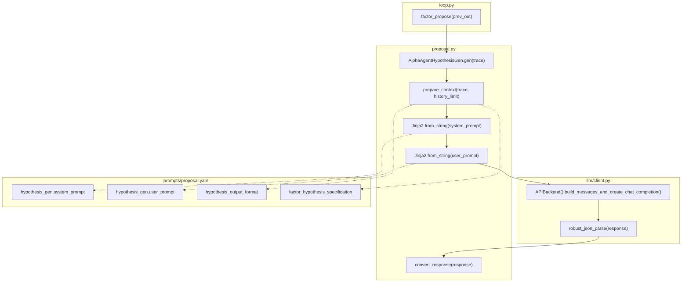
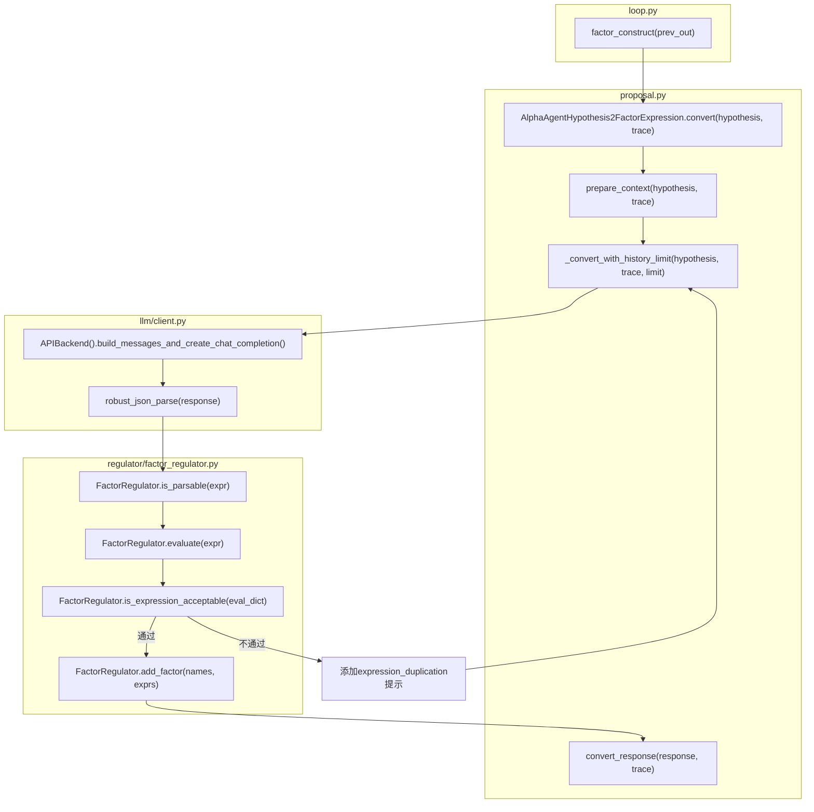
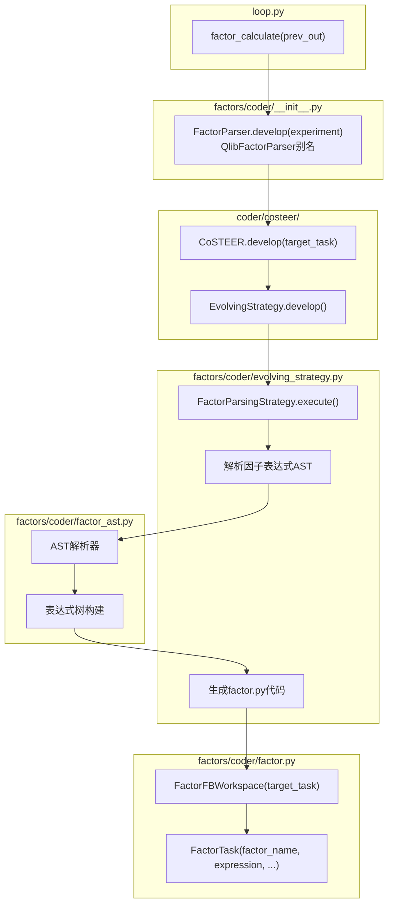
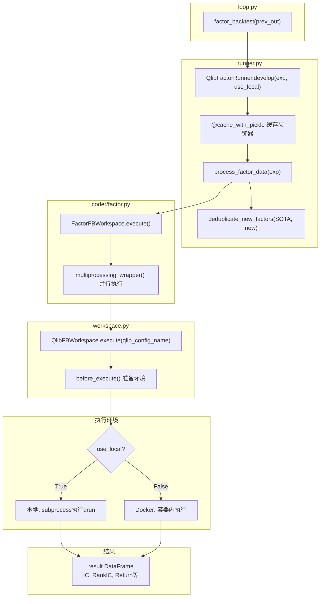
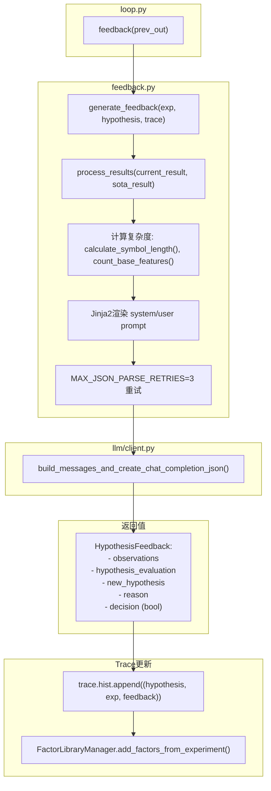
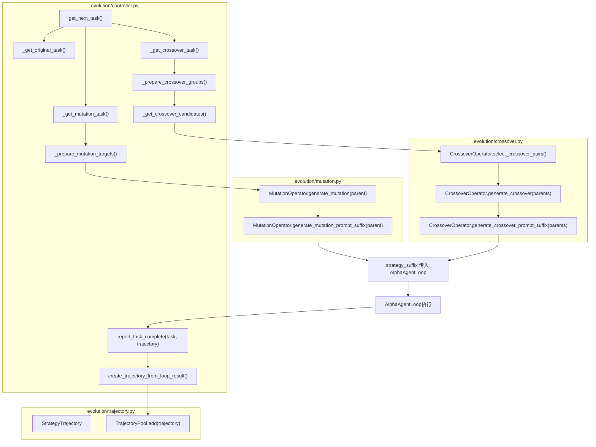
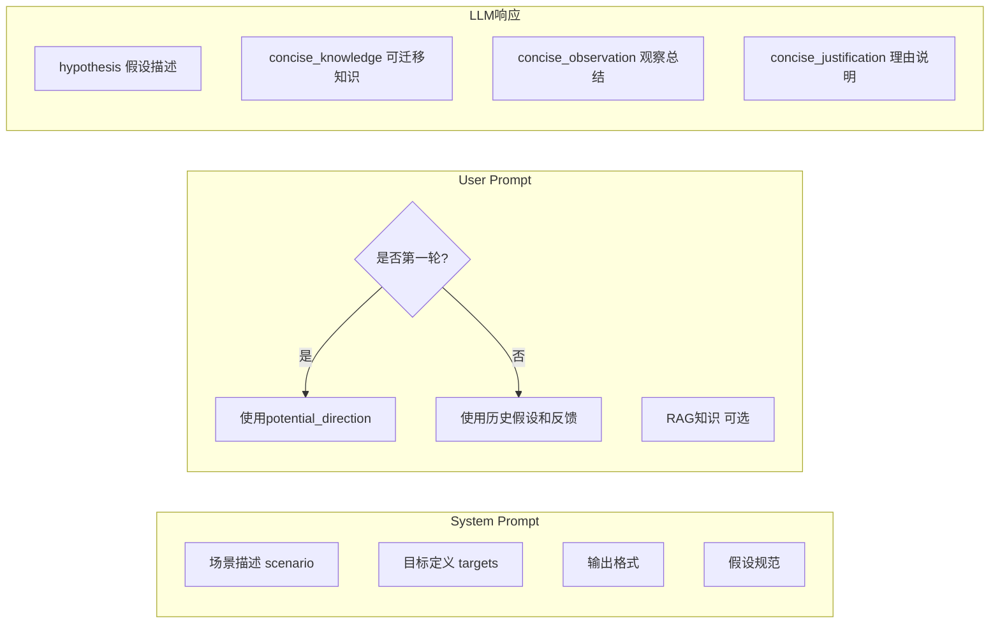
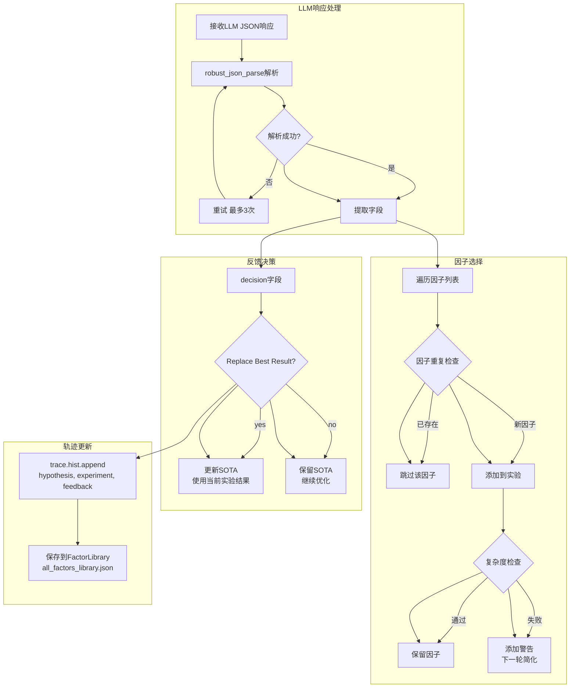
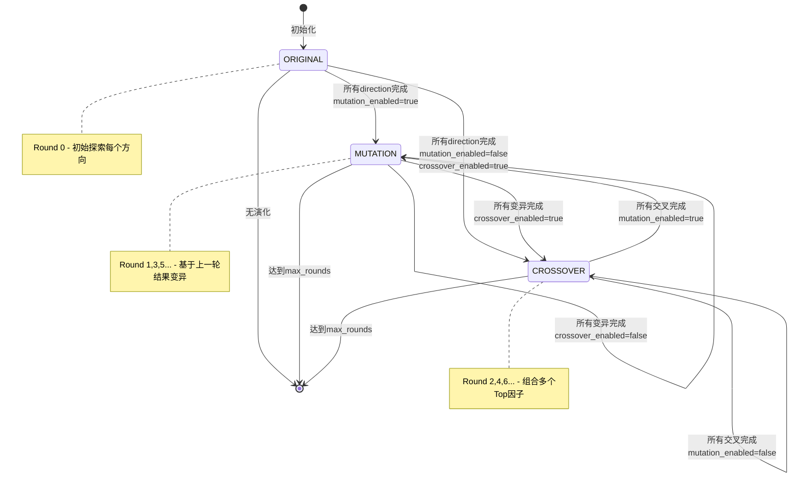

# QuantaAlpha 因子挖掘流程详解

## 项目目录结构

```
quantaalpha/
├── cli.py                          # CLI入口 (app命令)
├── __init__.py
│
├── app/                            # 应用层
│   ├── benchmark/                  # 基准测试
│   │   ├── factor/                 # 因子基准
│   │   │   ├── analysis.py
│   │   │   └── eval.py
│   │   └── model/                  # 模型基准
│   │       └── eval.py
│   └── utils/
│       ├── health_check.py
│       └── info.py
│
├── backtest/                       # 回测模块
│   ├── custom_factor_calculator.py
│   ├── factor_calculator.py
│   ├── factor_loader.py
│   ├── run_backtest.py
│   └── runner.py
│
├── coder/                          # 代码生成核心
│   ├── costeer/                    # CoSTEER框架
│   │   ├── config.py
│   │   ├── evaluators.py
│   │   ├── evolvable_subjects.py
│   │   ├── evolving_agent.py
│   │   ├── evolving_strategy.py
│   │   ├── knowledge_management.py
│   │   ├── scheduler.py
│   │   ├── task.py
│   │   └── prompts.yaml
│   └── knowledge/
│       ├── graph.py
│       └── vector_base.py
│
├── components/                     # 组件
│   ├── benchmark/
│   │   ├── conf.py
│   │   └── eval_method.py
│   ├── proposal/
│   └── runner/
│
├── contrib/                        # 扩展模块
│   └── model/                      # 模型挖掘扩展
│       ├── coder/
│       │   ├── eva_utils.py
│       │   ├── evaluators.py
│       │   ├── evolving_strategy.py
│       │   ├── model.py
│       │   ├── prompts.yaml
│       │   └── benchmark/
│       ├── experiment.py
│       ├── proposal.py
│       └── runner.py
│
├── core/                           # 核心框架
│   ├── conf.py
│   ├── developer.py
│   ├── evaluation.py
│   ├── evolving_agent.py
│   ├── evolving_framework.py
│   ├── exception.py
│   ├── experiment.py               # FBWorkspace基类
│   ├── knowledge_base.py
│   ├── prompts.py
│   ├── proposal.py
│   ├── scenario.py
│   ├── template.py
│   └── utils.py
│
├── docker/
│
├── factors/                        # ★ 因子挖掘核心模块
│   ├── __init__.py
│   ├── experiment.py               # 因子实验
│   ├── feedback.py                 # ★ Step 5: 反馈生成
│   │                              #   AlphaAgentQlibFactorHypothesisExperiment2Feedback
│   ├── library.py                  # 因子库
│   ├── proposal.py                 # ★ Step 1-2: 假设生成+因子构造
│   │                              #   AlphaAgentHypothesisGen
│   │                              #   AlphaAgentHypothesis2FactorExpression
│   ├── qlib_coder.py               # ★ Step 3: 因子解析
│   │                              #   QlibFactorParser
│   ├── qlib_experiment_init.py
│   ├── qlib_utils.py
│   ├── runner.py                   # ★ Step 4: 因子回测
│   │                              #   QlibFactorRunner
│   ├── workspace.py                # QlibFBWorkspace
│   │
│   ├── coder/                      # 因子代码生成
│   │   ├── config.py
│   │   ├── eva_utils.py
│   │   ├── evaluators.py
│   │   ├── evolving_strategy.py
│   │   ├── expr_parser.py
│   │   ├── factor.py               # FactorTask, FactorFBWorkspace
│   │   ├── factor_ast.py           # AST解析
│   │   ├── function_lib.py         # 函数库定义
│   │   ├── prompts.yaml
│   │   └── qa_prompts.yaml
│   │
│   ├── data_template/              # 数据模板
│   │   └── generate.py
│   │
│   ├── factor_template/            # 因子配置模板
│   │   ├── conf_baseline.yaml
│   │   └── conf_combined_factors.yaml
│   │
│   ├── loader/                     # 因子加载器
│   │   ├── json_loader.py
│   │   ├── pdf_loader.py
│   │   └── prompts.yaml
│   │
│   ├── prompts/                    # ★ 提示词模板
│   │   ├── experiment.yaml
│   │   ├── prompts.yaml            # 主提示词
│   │   └── proposal.yaml
│   │
│   └── regulator/                  # 因子校验器
│       ├── consistency_checker.py
│       ├── consistency_prompts.yaml
│       └── factor_regulator.py     # FactorRegulator
│
├── llm/                            # LLM接口
│   ├── client.py                   # APIBackend
│   └── config.py
│
├── log/
│   └── time.py
│
├── pipeline/                       # ★ 流程控制核心
│   ├── __init__.py
│   ├── base.py
│   ├── factor_backtest.py          # 回测入口
│   ├── factor_from_report.py
│   ├── factor_mining.py            # ★ 主入口 main(), run_evolution_loop()
│   ├── loop.py                     # ★ AlphaAgentLoop (5 steps)
│   ├── planning.py                 # Planning阶段
│   ├── settings.py                 # ★ EvolutionConfig配置
│   │
│   ├── evolution/                  # ★ 演化控制
│   │   ├── __init__.py
│   │   ├── controller.py           # ★ EvolutionController
│   │   ├── crossover.py            # ★ CrossoverOperator
│   │   ├── mutation.py             # ★ MutationOperator
│   │   └── trajectory.py           # StrategyTrajectory, TrajectoryPool
│   │
│   └── prompts/
│       ├── evolution_prompts.yaml  # 演化提示词
│       └── planning_prompts.yaml   # Planning提示词
│
└── utils/                          # 工具
    ├── env.py
    ├── workflow.py
    ├── agent/
    │   ├── ret.py
    │   └── tpl.yaml
    ├── document_reader/
    │   └── document_reader.py
    └── loader/
        ├── experiment_loader.py
        └── task_loader.py
```

---

## 完整流程图（函数级详细版）

```mermaid
flowchart TB
    %% ==================== 入口层 ====================
    subgraph ENTRY[入口: cli.py]
        CLI["fire.Fire({'mine': mine})<br/>cli.py:app()"]
    end

    %% ==================== 主入口 ====================
    subgraph MAIN[主入口: factor_mining.py]
        MAIN1["main()<br/>factor_mining.py:main()"]
        LOAD_CFG["load_run_config(config_path)<br/>factor_mining.py"]
        CHECK_EVOLUTION{"evolution_mode?"}
        
        MAIN1 --> LOAD_CFG --> CHECK_EVOLUTION
    end

    %% ==================== Planning阶段 ====================
    subgraph PLANNING[Planning: planning.py]
        PLAN1["generate_parallel_directions()<br/>planning.py:generate_parallel_directions()"]
        PLAN2["APIBackend().build_messages_and_create_chat_completion()<br/>llm/client.py"]
        PLAN3["解析LLM响应生成directions列表"]
        
        PLAN1 --> PLAN2 --> PLAN3
    end

    %% ==================== Evolution Loop ====================
    subgraph EVO_LOOP[演化循环: factor_mining.py]
        EVO1["run_evolution_loop()<br/>factor_mining.py:run_evolution_loop()"]
        EVO2["EvolutionController(config)<br/>evolution/controller.py:EvolutionController.__init__()"]
        EVO_GET["get_next_task()<br/>controller.py:EvolutionController.get_next_task()"]
    end

    %% ==================== EvolutionController ====================
    subgraph CONTROLLER[EvolutionController: evolution/controller.py]
        C_GET_TASK["get_next_task()"]
        C_PREPARE_M["_prepare_mutation_targets()<br/>准备变异目标"]
        C_PREPARE_C["_prepare_crossover_groups()<br/>准备交叉组"]
        C_REPORT["report_task_complete()<br/>记录完成的trajectory"]
        C_CREATE["create_trajectory_from_loop_result()<br/>创建trajectory对象"]
    end

    %% ==================== Mutation ====================
    subgraph MUTATION[Mutation: evolution/mutation.py]
        M1["MutationOperator()<br/>mutation.py:MutationOperator.__init__()"]
        M2["generate_mutation(parent)<br/>mutation.py:MutationOperator.generate_mutation()"]
        M3["generate_mutation_prompt_suffix(parent)<br/>mutation.py"]
        M4["APIBackend().build_messages_and_create_chat_completion()<br/>llm/client.py"]
        
        M1 --> M2 --> M4
        M1 --> M3 --> M4
    end

    %% ==================== Crossover ====================
    subgraph CROSSOVER[Crossover: evolution/crossover.py]
        X1["CrossoverOperator()<br/>crossover.py:CrossoverOperator.__init__()"]
        X2["select_crossover_pairs()<br/>crossover.py:CrossoverOperator.select_crossover_pairs()"]
        X3["generate_crossover(parents)<br/>crossover.py:CrossoverOperator.generate_crossover()"]
        X4["generate_crossover_prompt_suffix(parents)<br/>crossover.py"]
        X5["APIBackend().build_messages_and_create_chat_completion()<br/>llm/client.py"]
        
        X1 --> X2
        X1 --> X3 --> X5
        X1 --> X4 --> X5
    end

    %% ==================== AlphaAgentLoop ====================
    subgraph LOOP[AlphaAgentLoop: loop.py]
        LOOP_INIT["AlphaAgentLoop.__init__()<br/>loop.py:AlphaAgentLoop.__init__()"]
        LOOP_RUN["run(step_n=5)<br/>loop.py:AlphaAgentLoop.run()"]
        
        %% Step 1
        STEP1["factor_propose()<br/>loop.py:AlphaAgentLoop.factor_propose()"]
        
        %% Step 2
        STEP2["factor_construct()<br/>loop.py:AlphaAgentLoop.factor_construct()"]
        
        %% Step 3
        STEP3["factor_calculate()<br/>loop.py:AlphaAgentLoop.factor_calculate()"]
        
        %% Step 4
        STEP4["factor_backtest()<br/>loop.py:AlphaAgentLoop.factor_backtest()"]
        
        %% Step 5
        STEP5["feedback()<br/>loop.py:AlphaAgentLoop.feedback()"]
        
        LOOP_INIT --> LOOP_RUN --> STEP1 --> STEP2 --> STEP3 --> STEP4 --> STEP5
    end

    %% ==================== Step 1: 假设生成 ====================
    subgraph STEP1_DETAIL[Step 1 假设生成: proposal.py]
        S1_GEN["AlphaAgentHypothesisGen.gen(trace)<br/>proposal.py:AlphaAgentHypothesisGen.gen()"]
        S1_PREP["prepare_context(trace, history_limit)<br/>proposal.py:AlphaAgentHypothesisGen.prepare_context()"]
        S1_RENDER_SYS["Jinja2渲染 system_prompt<br/>proposal.yaml:hypothesis_gen.system_prompt"]
        S1_RENDER_USR["Jinja2渲染 user_prompt<br/>proposal.yaml:hypothesis_gen.user_prompt"]
        S1_LLM["APIBackend().build_messages_and_create_chat_completion()<br/>llm/client.py"]
        S1_CONVERT["convert_response(response)<br/>proposal.py:AlphaAgentHypothesisGen.convert_response()"]
        S1_PARSE["robust_json_parse(response)<br/>llm/client.py:robust_json_parse()"]
        S1_RETURN["返回 AlphaAgentHypothesis<br/>{hypothesis, concise_observation, ...}"]
        
        S1_GEN --> S1_PREP --> S1_RENDER_SYS --> S1_RENDER_USR --> S1_LLM --> S1_PARSE --> S1_CONVERT --> S1_RETURN
    end

    %% ==================== Step 2: 因子构造 ====================
    subgraph STEP2_DETAIL[Step 2 因子构造: proposal.py]
        S2_CONV["convert(hypothesis, trace)<br/>proposal.py:AlphaAgentHypothesis2FactorExpression.convert()"]
        S2_PREP["prepare_context(hypothesis, trace)<br/>proposal.py:AlphaAgentHypothesis2FactorExpression.prepare_context()"]
        S2_RENDER["Jinja2渲染 prompts<br/>proposal.yaml:hypothesis2experiment"]
        S2_LLM["APIBackend().build_messages_and_create_chat_completion()<br/>llm/client.py"]
        S2_PARSE["robust_json_parse(response)<br/>llm/client.py"]
        S2_REG["FactorRegulator.evaluate(expr)<br/>regulator/factor_regulator.py:FactorRegulator.evaluate()"]
        S2_PARSABLE["is_parsable(expr)<br/>regulator/factor_regulator.py:FactorRegulator.is_parsable()"]
        S2_CHECK{"表达式有效?"}
        S2_RETRY["添加expression_duplication提示<br/>重新调用LLM"]
        S2_CONVERT["convert_response(response, trace)<br/>proposal.py"]
        S2_RETURN["返回 QlibFactorExperiment<br/>包含List[FactorTask]"]
        
        S2_CONV --> S2_PREP --> S2_RENDER --> S2_LLM --> S2_PARSE --> S2_PARSABLE --> S2_REG --> S2_CHECK
        S2_CHECK -->|否| S2_RETRY --> S2_LLM
        S2_CHECK -->|是| S2_CONVERT --> S2_RETURN
    end

    %% ==================== Step 3: 因子计算 ====================
    subgraph STEP3_DETAIL[Step 3 因子计算: coder/__init__.py]
        S3_DEV["QlibFactorParser.develop(experiment)<br/>coder/__init__.py:FactorParser.develop()"]
        S3_COSTEER["CoSTEER.develop()<br/>coder/costeer/evolving_strategy.py"]
        S3_STRATEGY["FactorParsingStrategy()<br/>coder/evolving_strategy.py:FactorParsingStrategy"]
        S3_CODE["生成 factor.py 代码<br/>AST解析 + 代码模板"]
        S3_WS["返回 List[FactorFBWorkspace]<br/>coder/factor.py:FactorFBWorkspace"]
        
        S3_DEV --> S3_COSTEER --> S3_STRATEGY --> S3_CODE --> S3_WS
    end

    %% ==================== Step 4: 因子回测 ====================
    subgraph STEP4_DETAIL[Step 4 因子回测: runner.py]
        S4_DEV["QlibFactorRunner.develop(exp, use_local)<br/>runner.py:QlibFactorRunner.develop()"]
        S4_PROCESS["process_factor_data(exp)<br/>runner.py:QlibFactorRunner.process_factor_data()"]
        S4_EXEC["FactorFBWorkspace.execute()<br/>coder/factor.py:FactorFBWorkspace.execute()"]
        S4_MERGE["合并因子值到 combined_factors_df.parquet"]
        S4_WS["QlibFBWorkspace.execute()<br/>workspace.py:QlibFBWorkspace.execute()"]
        S4_LOCAL{"use_local?"}
        S4_QLIB_LOCAL["本地执行 qrun conf.yaml<br/>qlib回测"]
        S4_QLIB_DOCKER["Docker执行<br/>容器内qlib回测"]
        S4_RESULT["返回回测结果 DataFrame<br/>IC, RankIC, annualized_return等"]
        
        S4_DEV --> S4_PROCESS --> S4_EXEC --> S4_MERGE --> S4_WS --> S4_LOCAL
        S4_LOCAL -->|True| S4_QLIB_LOCAL --> S4_RESULT
        S4_LOCAL -->|False| S4_QLIB_DOCKER --> S4_RESULT
    end

    %% ==================== Step 5: 反馈生成 ====================
    subgraph STEP5_DETAIL[Step 5 反馈生成: feedback.py]
        S5_GEN["generate_feedback(exp, hypothesis, trace)<br/>feedback.py:AlphaAgentQlibFactorHypothesisExperiment2Feedback.generate_feedback()"]
        S5_PROCESS["process_results(current_result, sota_result)<br/>feedback.py:process_results()"]
        S5_COMPLEX["计算复杂度信息<br/>factor_ast.py:calculate_symbol_length(), count_base_features()"]
        S5_RENDER_SYS["Jinja2渲染 system prompt<br/>prompts.yaml:factor_feedback_generation.system"]
        S5_RENDER_USR["Jinja2渲染 user prompt<br/>prompts.yaml:factor_feedback_generation.user"]
        S5_LLM["APIBackend().build_messages_and_create_chat_completion_json()<br/>llm/client.py"]
        S5_EXTRACT["提取字段: observations, hypothesis_evaluation,<br/>new_hypothesis, reason, decision"]
        S5_TRACE["trace.hist.append((hypothesis, exp, feedback))<br/>core/proposal.py:Trace.hist"]
        S5_LIB["FactorLibraryManager.add_factors_from_experiment()<br/>library.py:FactorLibraryManager"]
        S5_RETURN["返回 HypothesisFeedback"]
        
        S5_GEN --> S5_PROCESS --> S5_COMPLEX --> S5_RENDER_SYS --> S5_RENDER_USR --> S5_LLM --> S5_EXTRACT --> S5_TRACE --> S5_LIB --> S5_RETURN
    end

    %% ==================== LLM Client ====================
    subgraph LLM[LLM客户端: llm/client.py]
        LLM1["APIBackend()<br/>client.py:APIBackend"]
        LLM2["build_messages_and_create_chat_completion()<br/>client.py:APIBackend.build_messages_and_create_chat_completion()"]
        LLM3["build_messages_and_create_chat_completion_json()<br/>client.py"]
        LLM4["robust_json_parse()<br/>client.py:robust_json_parse()"]
    end

    %% ==================== 主流程连接 ====================
    CLI --> MAIN1
    CHECK_EVOLUTION -->|启用| EVO1
    CHECK_EVOLUTION -->|禁用| LOOP_INIT
    EVO1 --> EVO2 --> EVO_GET
    
    EVO_GET --> C_GET_TASK
    C_GET_TASK -->|MUTATION| C_PREPARE_M --> M3
    C_GET_TASK -->|CROSSOVER| C_PREPARE_C --> X4
    C_GET_TASK -->|ORIGINAL| LOOP_INIT
    
    M3 --> LOOP_INIT
    X4 --> LOOP_INIT
    
    STEP1 --> S1_GEN
    STEP2 --> S2_CONV
    STEP3 --> S3_DEV
    STEP4 --> S4_DEV
    STEP5 --> S5_GEN
    
    S5_RETURN --> C_CREATE --> C_REPORT --> EVO_GET
```



---

## 函数调用链详解

### Step 1: factor_propose() 假设生成



**函数签名:**
```python
# loop.py:AlphaAgentLoop
def factor_propose(self, prev_out: dict[str, Any]) -> AlphaAgentHypothesis:
    idea = self.hypothesis_generator.gen(self.trace)
    return idea

# proposal.py:AlphaAgentHypothesisGen  
def gen(self, trace: Trace) -> AlphaAgentHypothesis:
    context_dict, json_flag = self.prepare_context(trace, history_limit)
    system_prompt = Jinja2.render(system_template, ...)
    user_prompt = Jinja2.render(user_template, ...)
    resp = APIBackend().build_messages_and_create_chat_completion(user_prompt, system_prompt, json_mode=True)
    hypothesis = self.convert_response(resp)
    return hypothesis
```

---

### Step 2: factor_construct() 因子构造



**关键函数:**
```python
# proposal.py:AlphaAgentHypothesis2FactorExpression
def convert(self, hypothesis: Hypothesis, trace: Trace) -> Experiment:
    while history_limit >= MIN_HISTORY_LIMIT:
        try:
            return self._convert_with_history_limit(hypothesis, trace, history_limit)
        except InputLengthError:
            history_limit -= 1

def _convert_with_history_limit(self, hypothesis, trace, history_limit):
    context, json_flag = self.prepare_context(hypothesis, trace, history_limit)
    resp = APIBackend().build_messages_and_create_chat_completion(...)
    response_dict = robust_json_parse(resp)
    
    for factor_name, factor_data in response_dict.items():
        expr = factor_data.get("expression")
        # 校验表达式
        if not self.factor_regulator.is_parsable(expr):
            continue
        success, eval_dict = self.factor_regulator.evaluate(expr)
        if not success or not self.factor_regulator.is_expression_acceptable(eval_dict):
            # 添加警告重新生成
            ...
    
    self.factor_regulator.add_factor(proposed_names, proposed_exprs)
    return self.convert_response(resp, trace)
```

---

### Step 3: factor_calculate() 因子计算



**关键类:**
```python
# factors/coder/__init__.py
class FactorParser(CoSTEER):
    def __init__(self, scen: Scenario):
        setting = FACTOR_COSTEER_SETTINGS
        eva = CoSTEERMultiEvaluator(FactorEvaluatorForCoder(scen), scen)
        es = FactorParsingStrategy(scen, settings)  # 关键: 解析策略
        super().__init__(settings=setting, eva=eva, es=es)

# factors/coder/factor.py
class FactorFBWorkspace(FBWorkspace):
    def execute(self, data_type="Debug") -> Tuple[str, pd.DataFrame]:
        # 1. 写入factor.py到workspace
        # 2. 链接数据文件
        # 3. 执行factor.py计算因子值
        # 4. 读取result.h5返回DataFrame
```

---

### Step 4: factor_backtest() 因子回测



**关键函数:**
```python
# runner.py:QlibFactorRunner
@cache_with_pickle(CachedRunner.get_cache_key, CachedRunner.assign_cached_result)
def develop(self, exp: QlibFactorExperiment, use_local: bool = True) -> QlibFactorExperiment:
    # 处理SOTA因子
    if exp.based_experiments:
        SOTA_factor = self.process_factor_data(exp.based_experiments)
    
    # 处理新因子
    new_factors = self.process_factor_data(exp)
    
    # 合并因子
    combined_factors = pd.concat([SOTA_factor, new_factors], axis=1)
    combined_factors.to_parquet("combined_factors_df.parquet")
    
    # 执行回测
    config_name = "conf_baseline.yaml" if len(exp.based_experiments) == 0 else "conf_combined_factors.yaml"
    result = exp.experiment_workspace.execute(qlib_config_name=config_name)
    exp.result = result
    return exp

def process_factor_data(self, exp) -> pd.DataFrame:
    # 多进程执行每个因子的计算
    message_and_df_list = multiprocessing_wrapper(
        [(impl.execute, ("All",)) for impl in exp.sub_workspace_list],
        n=RD_AGENT_SETTINGS.multi_proc_n,
    )
    # 合并所有因子值
    return pd.concat([df for _, df in message_and_df_list if df is not None], axis=1)
```

---

### Step 5: feedback() 反馈生成



**关键函数:**
```python
# feedback.py:AlphaAgentQlibFactorHypothesisExperiment2Feedback
def generate_feedback(self, exp, hypothesis, trace) -> HypothesisFeedback:
    # 获取当前结果和SOTA结果
    current_result = exp.result
    sota_result = exp.based_experiments[-1].result if exp.based_experiments else None
    
    # 计算复杂度信息
    for task in exp.sub_tasks:
        symbol_length = calculate_symbol_length(task.factor_expression)
        num_base_features = count_base_features(task.factor_expression)
        if symbol_length > threshold:
            task_detail["complexity_feedback"] = "表达式过长..."
    
    # 处理结果对比
    combined_result = process_results(current_result, sota_result)
    
    # LLM生成反馈（带重试）
    for attempt in range(MAX_JSON_PARSE_RETRIES):
        try:
            response_json = APIBackend().build_messages_and_create_chat_completion_json(...)
            break
        except json.JSONDecodeError:
            continue
    
    # 返回反馈
    return HypothesisFeedback(
        observations=response_json.get("Observations"),
        hypothesis_evaluation=response_json.get("Feedback for Hypothesis"),
        new_hypothesis=response_json.get("New Hypothesis"),
        reason=response_json.get("Reasoning"),
        decision=convert2bool(response_json.get("Replace Best Result")),
    )
```

---

### Evolution Controller 核心流程



**状态转换逻辑:**
```python
# controller.py:EvolutionController
def get_next_task(self) -> Optional[dict]:
    if self._current_round >= self.config.max_rounds:
        return None  # 结束
    
    if self._current_phase == RoundPhase.ORIGINAL:
        return self._get_original_task()
    elif self._current_phase == RoundPhase.MUTATION:
        return self._get_mutation_task()
    elif self._current_phase == RoundPhase.CROSSOVER:
        return self._get_crossover_task()

def _get_mutation_task(self):
    if not self._mutation_targets:
        self._prepare_mutation_targets()  # 从pool获取上一轮结果
    
    parent = self._mutation_targets[self._mutation_idx]
    suffix = self.mutation_op.generate_mutation_prompt_suffix(parent)
    
    return {
        "phase": RoundPhase.MUTATION,
        "strategy_suffix": suffix,
        "parent_trajectories": [parent],
        ...
    }

def _get_crossover_task(self):
    if not self._crossover_groups:
        self._prepare_crossover_groups()  # 选择交叉组合
    
    parents = self._crossover_groups[self._crossover_idx]
    suffix = self.crossover_op.generate_crossover_prompt_suffix(parents)
    
    return {
        "phase": RoundPhase.CROSSOVER,
        "strategy_suffix": suffix,
        "parent_trajectories": parents,
        ...
    }
```

---

## 一、提示词详解

### 1.1 Step 1: 假设生成提示词



**假设生成 System Prompt 核心内容:**

```
The user is working on generating new hypotheses for factors in a data-driven R&D process.
The factors are used in the following scenario:
{{scenario}}

Your task is to check whether a hypothesis has already been generated.
If one exists, follow it or generate an improved version.

Hypothesis Specification:
1. Data-Driven Hypothesis Formation
   - Ground hypotheses within the scope of available data
   - Align with temporal, cross-sectional properties
   - Avoid overfitting

2. Justification of the Hypothesis
   - Use observed market patterns
   - Build on empirical evidence
   - Propose actionable insights

3. Continuous Optimization and Exploration
   - Refine hypothesis iteratively
   - Incorporate feedback from results
```

**假设生成 User Prompt 核心内容:**

```

It is the first round of hypothesis generation.
You are encouraged to propose an innovative hypothesis.

The former hypothesis and feedbacks are as follows:
{{ hypothesis_and_feedback }}


Generate the hypothesis with:
- hypothesis: A SINGLE LINE OF TEXT
- concise_knowledge: Transferable knowledge using conditional grammar
- concise_observation: Observation of data characteristics
- concise_justification: Justify based on theoretical principles
- concise_specification: Define scope, conditions, constraints
```

### 1.2 Step 2: 因子构造提示词

```mermaid
flowchart TB
    subgraph System Prompt
        S1[场景描述 scenario]
        S2[因子生成规则]
        S3[复杂度约束 CRITICAL]
        S4[函数库说明]
        S5[输出格式]
    end

    subgraph User Prompt
        U1[目标假设 target_hypothesis]
        U2[历史假设和反馈]
        U3[可用变量<br/>$open, $close, $high, $low, $volume]
        U4[函数库 RANK, TS_MEAN等]
        U5{是否有重复警告?}
        U5 -->|是| U6[expression_duplication]
    end

    subgraph LLM响应
        R1["factor_name_1:<br/>{description, variables,<br/>formulation, expression}"]
        R2["factor_name_2: {...}"]
        R3["factor_name_3: {...}"]
    end

    subgraph 校验流程
        V1[表达式解析 is_parsable]
        V2[复杂度检查 evaluate]
        V3{通过?}
        V3 -->|否| V4[添加警告 重新生成]
        V4 --> User Prompt
        V3 -->|是| R1
    end
```

**因子构造关键约束:**

```yaml
Complexity Constraints (CRITICAL - OVERFITTING PREVENTION):
  Symbol Length (SL) Limit: ≤ 250 characters (STRICT LIMIT)
  Base Features (ER) Limit: ≤ 6 distinct raw features
  Free Parameters (PC): ratio < 50%
  
  WARNING: Complex factors with many nested functions,
  conditional branches, and parameters are OVERFITTING indicators.

Key Considerations:
  - Avoid raw prices/volumes directly
  - Use relative changes or standardized data
  - Add small constants (1e-8) to denominators
  - Apply RANK() or ZSCORE() for cross-sectional comparability
```

**可用函数库:**

```yaml
Cross-sectional Functions:
  - RANK(A): 排名
  - ZSCORE(A): Z分数
  - MEAN(A), STD(A), SKEW(A), KURT(A)

Time-Series Functions:
  - DELTA(A, n): n期变化
  - DELAY(A, n): n期延迟
  - TS_MEAN(A, n): n期均值
  - TS_SUM(A, n), TS_RANK(A, n), TS_ZSCORE(A, n)
  - TS_CORR(A, B, n): n期相关系数
  - TS_MIN(A, n), TS_MAX(A, n)

Moving Averages:
  - SMA(A, n, m), WMA(A, n), EMA(A, n)

Technical Indicators:
  - RSI(A, n), MACD(A, short, long), Bollinger Bands
```

### 1.3 Step 5: 反馈生成提示词

```mermaid
flowchart TB
    subgraph 输入
        I1[当前假设 hypothesis]
        I2[因子详情 task_details]
        I3[回测结果 combined_result]
        I4[与SOTA对比]
    end

    subgraph System Prompt
        S1[操作逻辑说明]
        S2[发展方向建议]
        S3[复杂度控制规则]
        S4[输出格式]
    end

    subgraph User Prompt
        U1[Target hypothesis]
        U2[Tasks and Factors<br/>包括复杂度警告]
        U3[Combined Results<br/>IC, RankIC, Return等]
        U4[评价指标说明]
        U5[判断规则]
    end

    subgraph LLM响应
        R1[Observations 观察总结]
        R2[Feedback for Hypothesis]
        R3[New Hypothesis 新假设]
        R4[Reasoning 推理过程]
        R5[Replace Best Result yes/no]
    end

    I1 --> U1
    I2 --> U2
    I3 --> U3
    I4 --> U3
    S1 & S2 & S3 & S4 --> System Prompt
    User Prompt --> R1 & R2 & R3 & R4 & R5
```

**反馈生成判断规则:**

```
When judging the results:
1. Recommendation for Replacement:
   - If new factor shows significant improvement in annualized return
   - If annualized return AND any other metric are better than SOTA
   - Minor variations in other metrics are acceptable

2. Complexity Considerations:
   - If complexity feedback is provided, this is CRITICAL
   - Factors flagged for complexity should be simplified
   - Emphasize simplification to avoid overfitting
```

---

## 二、返回内容选择逻辑



---

## 三、Evolution Controller 状态转换



---

## 四、关键类与文件对应关系

| 组件 | 文件路径 | 核心类/函数 |
|------|---------|------------|
| CLI入口 | `quantaalpha/cli.py` | `app()` |
| 主入口 | `quantaalpha/pipeline/factor_mining.py` | `main()`, `run_evolution_loop()` |
| 循环控制 | `quantaalpha/pipeline/loop.py` | `AlphaAgentLoop` |
| 演化控制器 | `quantaalpha/pipeline/evolution/controller.py` | `EvolutionController` |
| 假设生成 | `quantaalpha/factors/proposal.py` | `AlphaAgentHypothesisGen` |
| 因子构造 | `quantaalpha/factors/proposal.py` | `AlphaAgentHypothesis2FactorExpression` |
| 因子解析 | `quantaalpha/factors/qlib_coder.py` | `QlibFactorParser` |
| 因子回测 | `quantaalpha/factors/runner.py` | `QlibFactorRunner` |
| 反馈生成 | `quantaalpha/factors/feedback.py` | `AlphaAgentQlibFactorHypothesisExperiment2Feedback` |
| 提示词 | `quantaalpha/factors/prompts/prompts.yaml` | 各阶段prompt模板 |
| 配置 | `quantaalpha/pipeline/settings.py` | `AlphaAgentFactorBasePropSetting` |
