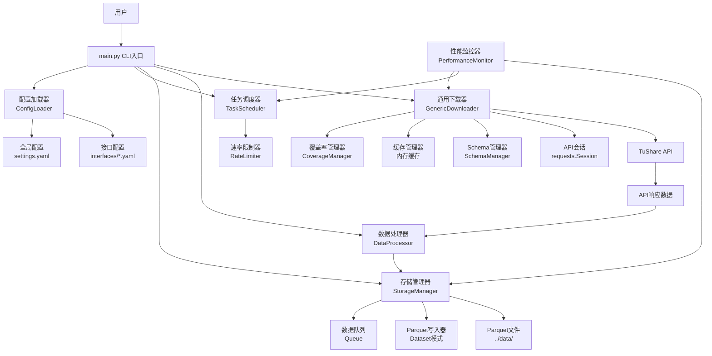
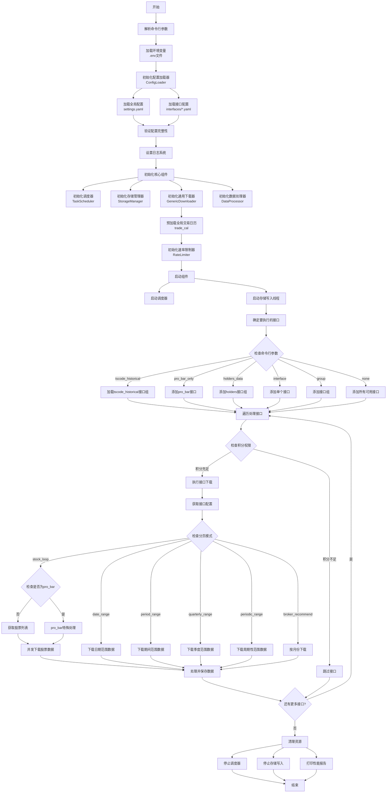
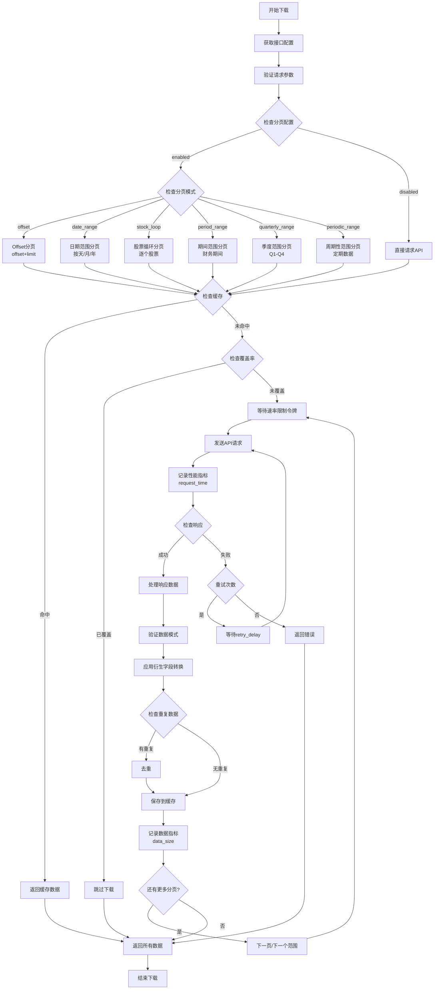
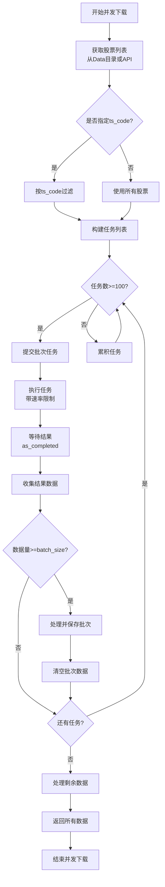
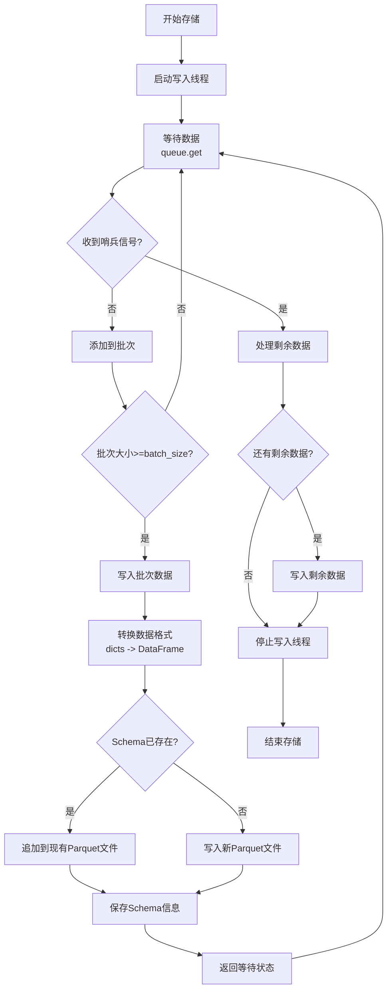
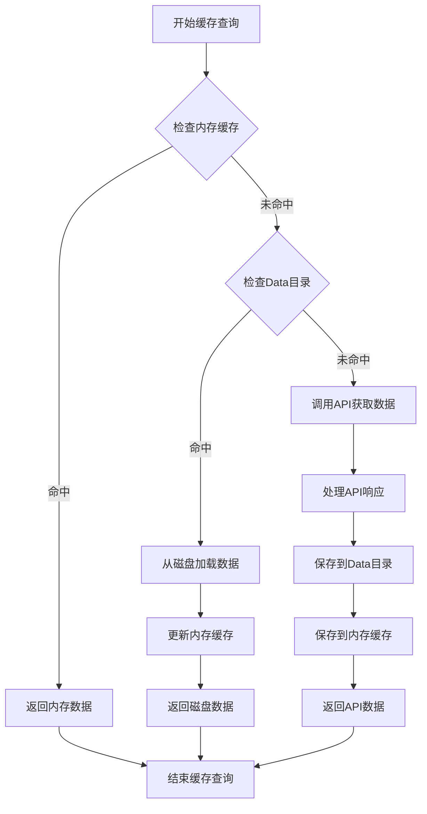
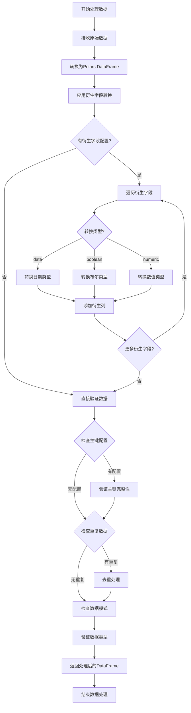
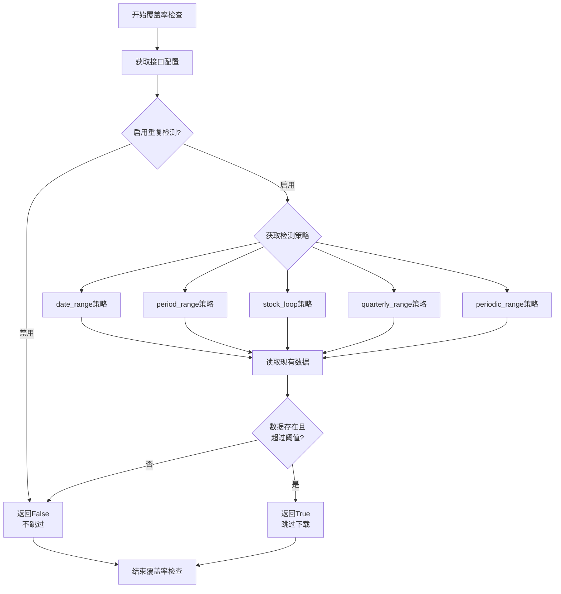

# App4 代码流程图 - aspipe_v4 配置驱动架构

## 1. 整体系统架构图



## 2. 主流程图



## 3. 数据下载流程图



## 4. 并发下载流程图



## 5. 存储管理流程图



## 6. 缓存管理流程图



## 7. 数据处理器流程图



## 8. 覆盖率管理流程图



## 9. 速率限制器流程图

```mermaid
graph TD
    StartRateLimit[开始速率限制] --> InitTokens[初始化令牌桶<br/>tokens = rate_limit]
    
    InitTokens --> WaitRequest[等待请求]
    
    WaitRequest --> CheckTokens{可用令牌数 >= 需要令牌?}
    CheckTokens -->|是| ConsumeTokens[消耗令牌]
    CheckTokens -->|否| CalculateWait[计算等待时间]
    
    CalculateWait --> SleepWait[等待 refill_time]
    SleepWait --> RefillTokens[补充令牌<br/>tokens = min(rate_limit, tokens + 补充值)]
    RefillTokens --> CheckTokens
    
    ConsumeTokens --> UpdateLastRefill[更新最后补充时间]
    UpdateLastRefill --> ProcessRequest[处理请求]
    
    ProcessRequest --> ReturnSuccess[返回成功]
    ReturnSuccess --> WaitRequest
```

## 10. 性能监控流程图

```mermaid
graph TD
    StartMonitor[开始监控] --> RecordMetric[记录指标<br/>request_time/data_size/retry_count]
    
    RecordMetric --> StoreMetric[存储到环形队列<br/>deque(maxlen=100)]
    
    StoreMetric --> CheckThreshold{检查阈值}
    CheckThreshold --> request_time_threshold{request_time > 30s?}
    CheckThreshold --> data_size_threshold{data_size > 6000?}
    CheckThreshold --> retry_count_threshold{retry_count > 2?}
    
    request_time_threshold -->|是| AlertRequestTime[警告: 请求时间过长]
    request_time_threshold -->|否| ContinueMonitor
    data_size_threshold -->|是| AlertDataSize[警告: 数据量接近限制]
    data_size_threshold -->|否| ContinueMonitor
    retry_count_threshold -->|是| AlertRetry[警告: 重试频率过高]
    retry_count_threshold -->|否| ContinueMonitor
    
    AlertRequestTime --> ContinueMonitor
    AlertDataSize --> ContinueMonitor
    AlertRetry --> ContinueMonitor
    
    ContinueMonitor --> GetAverage{需要平均值?}
    GetAverage -->|是| CalculateAverage[计算平均值<br/>sum(values)/len(values)]
    GetAverage -->|否| ContinueRecording[继续记录]
    
    CalculateAverage --> ReturnAverage[返回平均值]
    ReturnAverage --> ContinueRecording
    
    ContinueRecording --> WaitNext[等待下一个指标]
    WaitNext --> RecordMetric
```

## 核心组件说明

### 1. 配置驱动架构
- **零代码扩展**: 通过YAML配置文件添加新接口，无需修改代码
- **声明式配置**: 所有接口行为在配置文件中定义
- **环境变量替换**: 支持`${VAR}`语法，敏感信息通过环境变量管理

### 2. 多策略分页系统
- **Offset分页**: 适用于支持offset和limit参数的接口
- **日期范围分页**: 按天/月/年分割请求
- **股票循环分页**: 逐个股票查询
- **期间范围分页**: 财务数据的期间查询
- **季度范围分页**: 季度财务数据
- **周期性范围分页**: 定期数据查询

### 3. 三层缓存架构
- **内存缓存**: 运行时缓存，线程安全
- **磁盘缓存**: Data目录存储，持久化
- **智能回退**: Mem -> Disk -> API 的自动回退机制

### 4. 异步存储系统
- **生产者-消费者模式**: 数据队列 + 写入线程
- **批次处理**: 批量写入优化性能
- **原子操作**: 防止并发文件损坏
- **Dataset模式**: Parquet数据集格式，支持高效查询

### 5. 智能覆盖率管理
- **重复检测**: 避免冗余下载
- **多种策略**: 日期范围、期间、股票基础检测
- **内存缓存**: 频繁访问数据的运行时缓存
- **阈值控制**: 可配置的覆盖率阈值

### 6. 性能监控与告警
- **实时跟踪**: request_time, data_size, retry_count
- **阈值告警**: 超过阈值时发出警告
- **统计分析**: 计算平均值和趋势
- **环形队列**: 保留最近100个指标

### 7. 异常处理与资源管理
- **Try-Finally结构**: 确保资源正确释放
- **优雅退出**: 处理完当前批次后停止
- **错误重试**: 指数退避重试策略
- **日志记录**: 全面的错误日志和性能日志

## 数据流总结

1. **配置加载**: 启动时加载所有YAML配置
2. **参数验证**: 验证命令行参数和接口参数
3. **缓存检查**: 优先从缓存获取数据
4. **覆盖率检查**: 避免重复下载已覆盖的数据
5. **速率限制**: 令牌桶算法控制请求频率
6. **API请求**: 发送请求到TuShare API
7. **数据处理**: Polars高性能数据处理和转换
8. **数据验证**: 主键验证、类型检查、去重
9. **异步存储**: 队列+线程实现非阻塞存储
10. **性能监控**: 实时跟踪和告警

## 关键设计模式

- **配置驱动**: 所有接口行为通过YAML配置定义
- **策略模式**: 多种分页策略可插拔
- **生产者-消费者**: 异步存储系统
- **缓存模式**: 三层缓存架构
- **令牌桶**: 速率限制算法
- **观察者模式**: 性能监控和告警