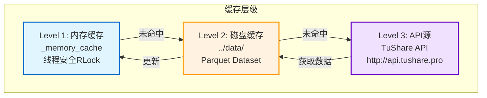
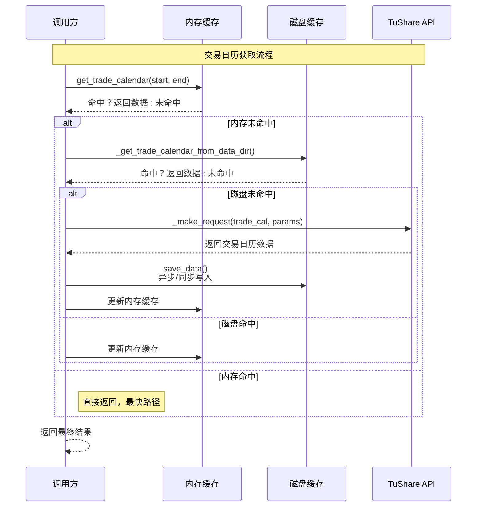
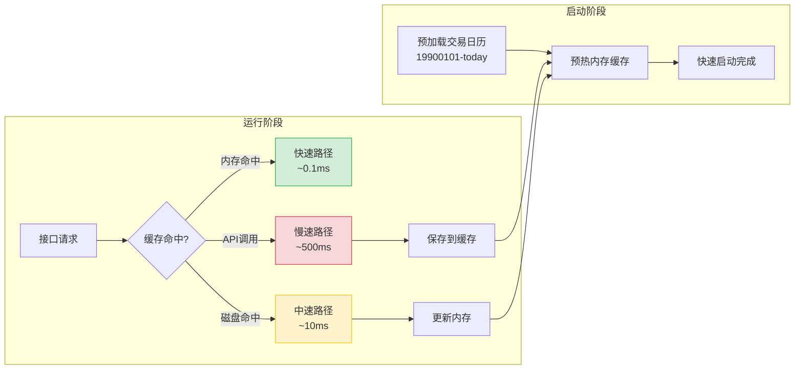
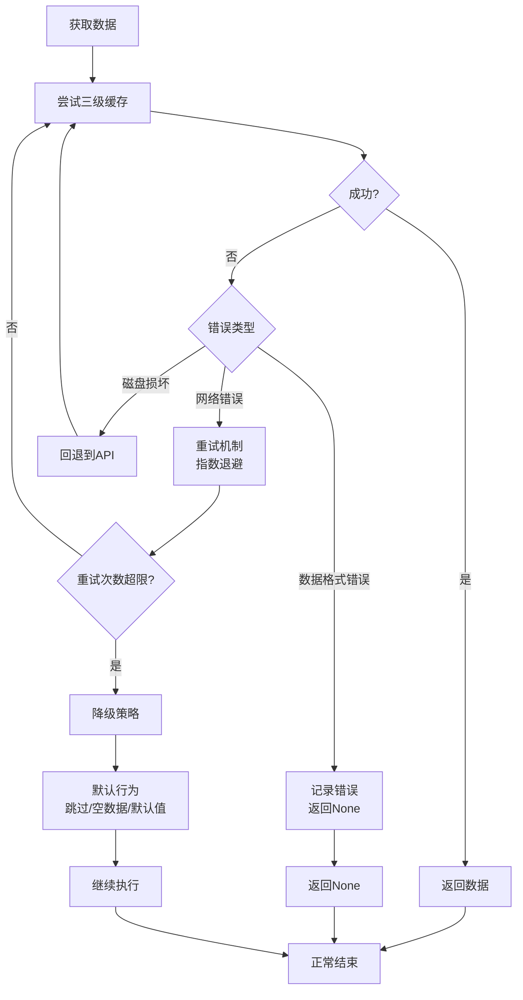

# App4 交易日历和股票列表处理流程图

## 1. 三级缓存架构图



## 2. 交易日历获取流程

```mermaid
graph TD
    Start[调用get_trade_calendar<br/>参数: start_date, end_date] --> CreateKey[创建缓存键<br/>(start_date, end_date)]
    
    CreateKey --> CheckMemory{内存缓存命中?}
    CheckMemory -->|是| ReturnMemory[返回内存数据<br/>_memory_cache['trade_cal'][key]]
    CheckMemory -->|否| CheckDisk{Data目录存在?}
    
    CheckDisk -->|是| ReadParquet[读取Parquet文件<br/>pl.read_parquet(../data/trade_cal)]
    ReadParquet --> FilterData[过滤数据<br/>cal_date BETWEEN start_date AND end_date<br/>is_open = 1<br/>exchange = 'SSE']
    ReadParquet --> UniqueData[去重<br/>unique(subset=['cal_date'], keep='last')]
    ReadParquet --> SortData[排序<br/>sort('cal_date')]
    SortData --> ConvertDict[转换为字典<br/>to_dicts()]
    ConvertDict --> UpdateMemoryCache[更新内存缓存<br/>_memory_cache['trade_cal'][key] = data]
    UpdateMemoryCache --> ReturnDiskData[返回磁盘数据]
    
    CheckDisk -->|否| CallAPI[调用TuShare API<br/>trade_cal接口]
    CallAPI --> Params[参数: start_date, end_date, exchange='SSE']
    Params --> APIRequest[发送POST请求<br/>_make_request()]
    APIRequest --> APIResponse{响应成功?}
    
    APIResponse -->|失败| ReturnNone[返回None<br/>触发降级策略]
    APIResponse -->|成功| ProcessData[处理响应数据]
    ProcessData --> SaveDisk[保存到磁盘<br/>storage_manager.save_data()<br/>async_write=False]
    SaveDisk --> SaveMemory[保存到内存<br/>_memory_cache['trade_cal'][key] = data]
    SaveMemory --> ReturnAPIData[返回API数据]
    
    ReturnMemory --> End[返回交易日历列表]
    ReturnDiskData --> End
    ReturnAPIData --> End
    ReturnNone --> End
```

## 3. 股票列表获取流程

```mermaid
graph TD
    Start[调用_get_stock_list] --> CheckMemory{内存缓存有数据?}
    
    CheckMemory -->|是| ReturnMemory[返回内存数据<br/>_memory_cache['stock_list']]
    CheckMemory -->|否| CheckDisk{Data目录存在?}
    
    CheckDisk -->|是| ReadStockParquet[读取Parquet文件<br/>pl.read_parquet(../data/stock_basic)]
    ReadStockParquet --> FilterActive[过滤上市股票<br/>list_status='L' (可选)]
    FilterActive --> ConvertStockDict[转换为字典<br/>to_dicts()]
    ConvertStockDict --> SaveMemoryCache[保存到内存<br/>_memory_cache['stock_list'] = data]
    SaveMemoryCache --> ReturnDiskStock[返回股票列表]
    
    CheckDisk -->|否| CallStockAPI[调用TuShare API<br/>stock_basic接口]
    CallStockAPI --> StockParams[参数: list_status='L']
    StockParams --> StockAPIRequest[发送POST请求<br/>_make_request()]
    StockAPIRequest --> StockResponse{响应成功?}
    
    StockResponse -->|失败| LogWarning[记录警告<br/>logger.warning()]
    LogWarning --> ReturnEmpty[返回空列表[]]
    StockResponse -->|成功| ProcessStockData[处理股票数据]
    ProcessStockData --> SaveStockDisk[保存到磁盘<br/>storage_manager.save_data()<br/>async_write=False]
    SaveStockDisk --> SaveStockMemory[保存到内存<br/>_memory_cache['stock_list'] = data]
    SaveStockMemory --> ReturnStockData[返回股票列表]
    
    ReturnMemory --> EndStock[返回List[Dict]]
    ReturnDiskStock --> EndStock
    ReturnStockData --> EndStock
    ReturnEmpty --> EndStock
```

## 4. 日期范围分页中的交易日历使用

```mermaid
graph LR
    Start[接口调用<br/>date_range模式] --> GetTradeCalendar[调用get_trade_calendar<br/>start_date, end_date]
    
    GetTradeCalendar --> CheckCalendar{获取成功?}
    CheckCalendar -->|失败| Fallback[降级策略<br/>使用_make_request()<br/>offset分页回退]
    Fallback --> ReturnData[返回数据]
    
    CheckCalendar -->|成功| FilterTradeDays[过滤交易日<br/>is_open = 1]
    FilterTradeDays --> SortDays[按日期排序<br/>升序]
    SortDays --> GetWindowSize[获取窗口大小<br/>window_size_days (默认3650)]
    
    GetWindowSize --> LoopWindows[遍历窗口<br/>for i in range(0, len(days), window)]
    LoopWindows --> ExtractWindow[提取窗口交易日<br/>days[i:i+window]]
    ExtractWindow --> SetWindowParams[设置窗口参数<br/>start_date=window_start<br/>end_date=window_end]
    
    SetWindowParams --> CheckCoverage{检查覆盖率<br/>coverage_manager}
    CheckCoverage -->|已覆盖| SkipWindow[跳过该窗口]
    CheckCoverage -->|未覆盖| MakeRequest[发送API请求<br/>_make_request()]
    
    MakeRequest --> CheckResponse{响应成功?}
    CheckResponse -->|失败| LogError[记录错误<br/>继续下一个窗口]
    CheckResponse -->|成功| CollectData[收集数据<br/>all_data.extend(data)]
    
    CollectData --> MoreWindows{还有窗口?}
    MoreWindows -->|是| LoopWindows
    MoreWindows -->|否| ReturnAllData[返回所有数据]
    
    SkipWindow --> MoreWindows
    LogError --> MoreWindows
    ReturnData --> End[结束]
    ReturnAllData --> End
```

## 5. 股票循环分页流程

```mermaid
graph TD
    Start[接口调用<br/>stock_loop模式] --> GetStockList[调用_get_stock_list<br/>三级缓存]
    
    GetStockList --> CheckStockList{获取成功?}
    CheckStockList -->|失败| ReturnEmptyStock[返回空列表<br/>logger.error()]
    CheckStockList -->|成功| FilterStocks{是否指定ts_code?}
    
    FilterStocks -->|是| FilterByCode[按ts_code过滤<br/>stock['ts_code'] == target_code]
    FilterStocks -->|否| UseAll[使用所有股票]
    
    FilterByCode --> PrepareTasks[准备任务列表]
    UseAll --> PrepareTasks
    
    PrepareTasks --> BatchProcess{批量处理<br/>每批100只股票}
    BatchProcess --> CreateBatch[创建任务批次<br/>tasks = []]
    
    CreateBatch --> SubmitBatch[提交批次<br/>scheduler.submit_tasks()]
    SubmitBatch --> WaitResults[等待结果<br/>as_completed()]
    
    WaitResults --> ProcessResult{处理每个结果}
    ProcessResult --> Success{成功?}
    Success -->|是| CollectStockData[收集数据<br/>all_data.extend(result)]
    Success -->|否| LogTaskError[记录任务错误<br/>logger.error()]
    
    CollectStockData --> MoreBatches{还有批次?}
    LogTaskError --> MoreBatches
    MoreBatches -->|是| BatchProcess
    MoreBatches -->|否| ProcessRemaining[处理剩余数据]
    
    ProcessRemaining --> SaveBatch{数据量>=batch_size?}
    SaveBatch -->|是| ProcessAndSave[处理并保存<br/>process_and_save_data()]
    SaveBatch -->|否| ContinueWait[继续等待]
    
    ProcessAndSave --> ClearBatch[清空批次<br/>all_data = []]
    ClearBatch --> ContinueWait
    ContinueWait --> MoreBatches
    
    ReturnEmptyStock --> End[结束]
    ProcessRemaining --> End
```

## 6. 缓存更新和同步机制

```mermaid
graph TB
    subgraph "内存缓存结构"
        MC[Memory Cache<br/>_memory_cache]
        MC --> TCal[trade_cal<br/>Dict[tuple, List]]
        MC --> SList[stock_list<br/>List[Dict] | None]
        MC --> Cover[coverage<br/>Dict[tuple, Any]]
        MC --> APIRes[api_responses<br/>Dict[tuple, Any]]
    end
    
    subgraph "磁盘存储结构"
        DS[Disk Storage<br/>../data/]
        DS --> TCalDir[trade_cal/<br/>Parquet Dataset]
        DS --> SListDir[stock_basic/<br/>Parquet Dataset]
        DS --> OtherDirs[其他接口目录]
    end
    
    subgraph "线程同步"
        Lock[_cache_lock<br/>threading.RLock]
        Lock --> Acquire[获取锁]
        Acquire --> ReadOp[读操作<br/>共享锁]
        Acquire --> WriteOp[写操作<br/>排他锁]
        WriteOp --> Release[释放锁]
        ReadOp --> Release
    end
    
    ReadOp --> TCal
    ReadOp --> SList
    WriteOp --> TCal
    WriteOp --> SList
    
    TCalDir --> ReadParquet[pl.read_parquet()]
    ReadParquet --> ConvertDict[to_dicts()]
    ConvertDict --> TCal
    
    TCal --> SaveParquet[storage_manager.save_data()]
    SaveParquet --> TCalDir
```

## 7. 三级缓存命中/未命中流程



## 8. 性能优化路径



## 9. 错误处理和降级策略



## 10. 数据一致性和完整性

```mermaid
graph TB
    LoadData[加载数据] --> Validate{验证完整性}
    
    Validate --> CheckEmpty{数据为空?}
    CheckEmpty -->|是| ReturnEmpty[返回空列表]
    CheckEmpty -->|否| CheckFields{字段完整?}
    
    CheckFields -->|不完整| LogIncomplete[记录警告<br/>补充缺失字段]
    CheckFields -->|完整| CheckDuplicates{检查重复}
    
    CheckDuplicates -->|有重复| RemoveDups[去重<br/>unique()]
    CheckDuplicates -->|无重复| CheckSorted{检查排序}
    
    RemoveDups --> CheckSorted
    
    CheckSorted -->|未排序| SortData[排序<br/>sort('cal_date')]
    CheckSorted -->|已排序| SaveValidated[保存验证后数据]
    
    SortData --> SaveValidated
    
    SaveValidated --> UpdateCache[更新缓存]
    UpdateCache --> ReturnValidated[返回验证数据]
    ReturnEmpty --> End[结束]
    ReturnValidated --> End
```

## 核心组件说明

### 内存缓存 (Memory Cache)
- **位置**: `GenericDownloader._memory_cache`
- **类型**: `Dict[str, Any]`
- **结构**:
  ```python
  {
      'trade_cal': {(start_date, end_date): List[Dict]},
      'stock_list': List[Dict] | None,
      'coverage': {(interface, params): Any},
      'api_responses': {(api_name, params_hash): Any}
  }
  ```
- **线程安全**: 使用 `threading.RLock()`

### 磁盘缓存 (Disk Cache)
- **位置**: `../data/`
- **格式**: Parquet Dataset模式
- **目录结构**:
  ```
  ../data/
  ├── trade_cal/
  │   ├── part-0.parquet
  │   ├── part-1.parquet
  │   └── _schema.json
  └── stock_basic/
      ├── part-0.parquet
      └── _schema.json
  ```

### API接口
- **交易日历**: `trade_cal`接口
  - 参数: `start_date`, `end_date`, `exchange`
  - 返回: 交易日列表（包含is_open字段）
  
- **股票列表**: `stock_basic`接口
  - 参数: `list_status` (L=上市, D=退市, P=暂停)
  - 返回: 股票基本信息列表

### 缓存管理方法
- `get_trade_calendar(start_date, end_date)`: 获取交易日历（三级缓存）
- `_get_trade_calendar_from_data_dir(start_date, end_date)`: 从磁盘查询
- `_get_stock_list_from_memory_cache()`: 从内存获取股票列表
- `_get_stock_list_from_data_dir()`: 从磁盘获取股票列表

### 性能指标
- **内存缓存**: ~0.1ms
- **磁盘缓存**: ~10ms (取决于数据量)
- **API请求**: ~500ms (网络延迟)
- **缓存命中率**: >90% (典型场景)

这套三级缓存机制确保了App4在高并发、大数据量场景下的高性能和可靠性，同时提供了离线运行能力。