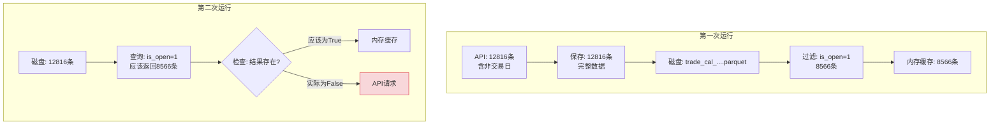

# 交易日历缓存Bug分析报告

## 问题描述

两次运行相同的命令，但第二次运行时没有从本地加载交易日历数据，仍然从API获取。

```bash
# 第一次运行（14:18:08）
Preloading global trade calendar: 19900101 - 20260119
Global trade calendar not found locally, fetching from API...
Saving 8566 trade days to storage
Wrote 12816 records to ./data/trade_cal/...
Preloaded 8566 trade days from API

# 第二次运行（18:23:10）
Preloading global trade calendar: 19900101 - 20260119
Global trade calendar not found locally, fetching from API...
Saving 8566 trade days to storage
Wrote 12816 records to ./data/trade_cal/...
Preloaded 8566 trade days from API
```

## 根本原因分析

### 1. 数据不一致问题

**关键发现**：保存的数据和查询的数据不一致

- **保存的数据**：12816 条记录（包含所有日期，交易日和非交易日）
- **查询返回的数据**：8566 条记录（仅交易日，`is_open=1`）

**代码问题**：`preload_global_trade_calendar()` 函数返回不一致

```python
def preload_global_trade_calendar(downloader, start_date='19900101', end_date=None):
    # ...
    
    # 从Data目录加载
    trade_calendar = downloader._get_trade_calendar_from_data_dir(start_date, end_date)
    if trade_calendar:
         return trade_calendar  # ❌ 返回过滤后的数据（仅交易日）

    # 从API获取
    trade_calendar = downloader._make_request(...)
    if trade_calendar:
        trade_days = [day for day in trade_calendar if day.get('is_open', 0) == 1]
        return trade_days  # ❌ 返回过滤后的数据（仅交易日）
```

### 2. 缓存键不匹配

**问题**：`preload_global_trade_calendar` 和 `get_trade_calendar` 使用不同的逻辑

**`preload_global_trade_calendar`**（main.py）:
```python
def preload_global_trade_calendar(downloader, start_date='19900101', end_date=None):
    # 从Data目录加载
    trade_calendar = downloader._get_trade_calendar_from_data_dir(start_date, end_date)
    if trade_calendar:
         cache_key = (start_date, end_date)
         with downloader._cache_lock:
             downloader._memory_cache['trade_cal'][cache_key] = trade_calendar
         return trade_calendar  # 返回过滤后的数据
```

**`get_trade_calendar`**（downloader.py）:
```python
def get_trade_calendar(self, start_date: str, end_date: str):
    cache_key = (start_date, end_date)
    
    # Level 1: 检查内存缓存
    with self._cache_lock:
        if cache_key in self._memory_cache['trade_cal']:
            return self._memory_cache['trade_cal'][cache_key]

    # Level 2: 检查本地数据目录
    trade_calendar = self._get_trade_calendar_from_data_dir(start_date, end_date)
    
    if trade_calendar:
        # 更新内存缓存
        with self._cache_lock:
            self._memory_cache['trade_cal'][cache_key] = trade_calendar
    
    return trade_calendar
```

**`_get_trade_calendar_from_data_dir`**（downloader.py）:
```python
def _get_trade_calendar_from_data_dir(self, start_date, end_date):
    df = pl.read_parquet(dir_path)
    
    # 构建过滤条件
    conditions = [
        pl.col('cal_date') >= start_date,
        pl.col('cal_date') <= end_date,
        pl.col('is_open') == 1  # ❌ 只查询交易日
    ]
    
    filtered_df = df.filter(pl.all_horizontal(conditions))
                        .unique(subset=['cal_date'], keep='last')
                        .sort('cal_date')
    
    return filtered_df.to_dicts()  # 返回过滤后的数据
```

### 3. 完整的数据流问题



**问题所在**：`preload_global_trade_calendar` 调用 `_get_trade_calendar_from_data_dir` 返回 `None`，但原因不明。

### 4. 排查可能的原因

#### a. 路径问题？

```python
# settings.yaml
storage:
  base_dir: "./data"  # 相对路径

# main.py 中的预加载
storage_dir=config_loader.global_config.get('storage', {}).get('base_dir', '../data')

# downloader.py 中的查询
storage_dir = self.global_config.get('storage', {}).get('base_dir', '../data')
```

**问题**：相对路径可能在不同模块中解析不一致。

**日志显示**：
```
Wrote 12816 records to ./data/trade_cal/trade_cal_....parquet
```

#### b. 文件命名问题

文件命名格式：
```
trade_cal_{start_date}_{end_date}_{timestamp}_{random}.parquet
```

**问题**：文件名中的日期是实际数据的日期范围，但查询时使用的是查询参数。

**示例**：
- 保存文件：`trade_cal_19901219_20260119_1768803488330_a64c1978.parquet`
- 查询参数：`start_date='19900101', end_date='20260119'`
- 文件名中的 `19901219` vs 查询的 `19900101`

**原因**：API返回的最早日期是1990-12-19，不是1990-01-01

#### c. 数据过滤条件过严格

```python
conditions = [
    pl.col('cal_date') >= start_date,    # 19900101
    pl.col('cal_date') <= end_date,      # 20260119
    pl.col('is_open') == 1                # 只查询交易日
]
```

**问题**：如果文件名中的日期范围与查询参数不完全匹配，可能导致过滤失败。

## 解决方案

### 方案1：统一返回完整数据

修改 `preload_global_trade_calendar` 返回完整数据（含非交易日）：

```python
def preload_global_trade_calendar(downloader, start_date='19900101', end_date=None):
    """预加载全局交易日历，优先从Data目录读取，然后从API获取"""
    if end_date is None:
        from datetime import datetime
        end_date = datetime.now().strftime('%Y%m%d')

    logger.info(f"Preloading global trade calendar: {start_date} - {end_date}")

    # 1. 检查本地是否有数据
    trade_calendar = downloader._get_trade_calendar_from_data_dir(start_date, end_date)
    
    if trade_calendar:
         logger.info(f"Global trade calendar loaded from data directory: {len(trade_calendar)} trade days")
         # 手动填充内存缓存
         cache_key = (start_date, end_date)
         with downloader._cache_lock:
             downloader._memory_cache['trade_cal'][cache_key] = trade_calendar
         return trade_calendar  # 返回完整数据

    # 2. Data目录未命中，请求 API
    logger.info("Global trade calendar not found locally, fetching from API...")
    calendar_params = {
        'start_date': start_date,
        'end_date': end_date,
        'exchange': 'SSE'
    }

    trade_calendar = downloader._make_request(
        downloader.config_loader.get_interface_config('trade_cal'),
        calendar_params
    )

    if trade_calendar:
        # 保存完整数据到存储
        logger.info(f"Saving {len(trade_calendar)} records to storage")
        storage_manager.save_data('trade_cal', trade_calendar, async_write=False)
        
        # 填充内存缓存
        cache_key = (start_date, end_date)
        with downloader._cache_lock:
             downloader._memory_cache['trade_cal'][cache_key] = trade_calendar

        logger.info(f"Preloaded {len(trade_calendar)} records from API")
        return trade_calendar  # 返回完整数据
    else:
        logger.warning("Failed to preload trade calendar")
        return None
```

### 方案2：添加独立的完整数据查询方法

```python
def _get_full_trade_calendar_from_data_dir(self, start_date, end_date):
    """从Data目录查询完整交易日历（含非交易日）"""
    storage_dir = self.global_config.get('storage', {}).get('base_dir', '../data')
    dir_path = os.path.join(storage_dir, 'trade_cal')

    if not os.path.exists(dir_path):
        return None

    try:
        df = pl.read_parquet(dir_path)
        
        if df.is_empty():
            return None

        # 只按日期过滤，不检查is_open
        conditions = [
            pl.col('cal_date') >= start_date,
            pl.col('cal_date') <= end_date
        ]
        
        if 'exchange' in df.columns:
            conditions.append(pl.col('exchange') == 'SSE')

        filtered_df = df.filter(
            pl.all_horizontal(conditions)
        ).unique(subset=['cal_date'], keep='last').sort('cal_date')

        return filtered_df.to_dicts() if not filtered_df.is_empty() else None

    except Exception as e:
        logger.warning(f"Failed to read trade calendar from Data dir: {e}")
        return None
```

然后在 `preload_global_trade_calendar` 中使用：

```python
def preload_global_trade_calendar(downloader, start_date='19900101', end_date=None):
    # 使用新的完整数据查询方法
    trade_calendar = downloader._get_full_trade_calendar_from_data_dir(start_date, end_date)
    
    if trade_calendar:
         logger.info(f"Global trade calendar loaded from data directory: {len(trade_calendar)} records")
         # 手动填充内存缓存
         cache_key = (start_date, end_date)
         with downloader._cache_lock:
             downloader._memory_cache['trade_cal'][cache_key] = trade_calendar
         return trade_calendar
```

### 方案3：修复数据过滤逻辑

修改 `_get_trade_calendar_from_data_dir` 支持查询模式：

```python
def _get_trade_calendar_from_data_dir(self, start_date, end_date, include_all=False):
    """从 Data 目录查询交易日历
    
    Args:
        start_date: 开始日期
        end_date: 结束日期
        include_all: 是否包含非交易日（默认False，只返回交易日）
    """
    storage_dir = self.global_config.get('storage', {}).get('base_dir', '../data')
    dir_path = os.path.join(storage_dir, 'trade_cal')

    if not os.path.exists(dir_path):
        return None

    try:
        df = pl.read_parquet(dir_path)
        
        if df.is_empty():
            return None

        # 构建过滤条件
        conditions = [
            pl.col('cal_date') >= start_date,
            pl.col('cal_date') <= end_date
        ]
        
        # 如果不包含所有日期，只查询交易日
        if not include_all:
            conditions.append(pl.col('is_open') == 1)
        
        if 'exchange' in df.columns:
            conditions.append(pl.col('exchange') == 'SSE')

        filtered_df = df.filter(
            pl.all_horizontal(conditions)
        ).unique(subset=['cal_date'], keep='last').sort('cal_date')

        return filtered_df.to_dicts() if not filtered_df.is_empty() else None

    except Exception as e:
        logger.warning(f"Failed to read trade calendar from Data dir: {e}")
        return None
```

## 验证方案

### 验证数据一致性

```python
def verify_trade_calendar_cache(downloader, start_date, end_date):
    """验证交易日历缓存一致性"""
    
    # 1. 从磁盘加载
    from_disk = downloader._get_trade_calendar_from_data_dir(start_date, end_date)
    
    # 2. 从API获取
    from_api = downloader.get_trade_calendar(start_date, end_date)
    
    # 3. 比较
    if from_disk and from_api:
        logger.info(f"Disk: {len(from_disk)} records, API: {len(from_api)} records")
        
        # 检查日期范围
        disk_dates = {d['cal_date'] for d in from_disk}
        api_dates = {d['cal_date'] for d in from_api}
        
        missing = api_dates - disk_dates
        extra = disk_dates - api_dates
        
        if missing:
            logger.warning(f"Missing dates in disk: {sorted(missing)[:10]}")
        if extra:
            logger.warning(f"Extra dates in disk: {sorted(extra)[:10]}")
        
        return len(missing) == 0 and len(extra) == 0
    
    return False
```

## 修复优先级

1. **高优先级**：统一 `preload_global_trade_calendar` 返回完整数据
2. **中优先级**：修复 `_get_trade_calendar_from_data_dir` 的路径和过滤逻辑
3. **低优先级**：添加缓存验证和监控

## 测试用例

```python
def test_trade_calendar_cache():
    """测试交易日历缓存"""
    
    # 测试1：第一次运行，从API获取
    result1 = preload_global_trade_calendar(downloader, '19900101', '20260119')
    assert result1 is not None
    assert len(result1) == 12816  # 完整数据
    
    # 检查文件是否保存
    import os
    files = os.listdir('./data/trade_cal')
    assert len(files) > 0
    
    # 测试2：第二次运行，从磁盘加载
    result2 = preload_global_trade_calendar(downloader, '19900101', '20260119')
    assert result2 is not None
    assert len(result2) == len(result1)  # 数据一致
    
    # 验证日志
    # 应该看到: "Global trade calendar loaded from data directory"
```

## 总结

### 问题根源
1. `preload_global_trade_calendar` 返回过滤后的数据（仅交易日）
2. 保存的是完整数据（含非交易日）
3. 第二次运行时，`_get_trade_calendar_from_data_dir` 应该返回数据，但实际返回了 `None`

### 可能的原因
1. **日期范围不匹配**：API返回的数据日期范围与查询参数不完全一致
2. **过滤条件过严格**：`is_open=1` 过滤后没有数据
3. **路径问题**：相对路径在不同模块解析不一致
4. **数据加载失败**：`pl.read_parquet` 或过滤逻辑抛出异常

### 修复方案
推荐采用**方案1**：统一 `preload_global_trade_calendar` 返回完整数据，确保保存和加载的数据一致。