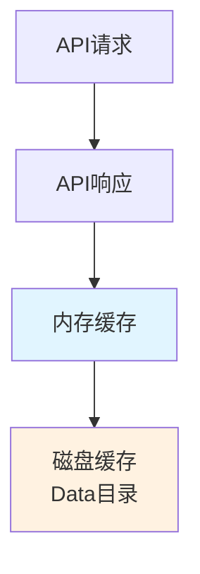
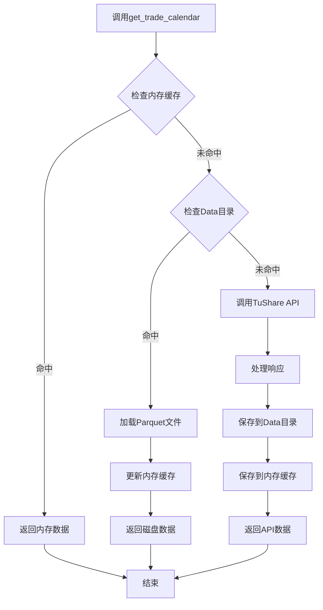

# App4 交易日历和股票列表处理机制

## 概述

在App4中，交易日历（trade calendar）和股票列表（stock list）是两个核心基础数据，被多个接口使用。系统采用**三级缓存策略**来优化获取效率，确保高性能和离线可用性。

## 三级缓存架构



### 缓存层级

1. **Level 1 - 内存缓存** (`_memory_cache`)
   - 存储位置: `GenericDownloader._memory_cache`
   - 数据结构: Python字典
   - 键值格式: `(start_date, end_date)` -> trade_calendar数据
   - 生命周期: 程序运行期间
   - 线程安全: 使用 `_cache_lock` (RLock) 保护

2. **Level 2 - 磁盘缓存** (Data目录)
   - 存储位置: `../data/trade_cal/` 或 `../data/stock_basic/`
   - 文件格式: Parquet (Dataset模式)
   - 生命周期: 持久化存储
   - 优势: 程序重启后仍可复用，支持离线模式

3. **Level 3 - API请求**
   - 数据源: TuShare API
   - 触发条件: 内存和磁盘缓存都未命中
   - 自动保存: 获取后自动保存到磁盘和内存

## 交易日历处理机制

### 1. 预加载机制

在`main.py`中，系统启动时会**预加载全局交易日历**：

```python
def preload_global_trade_calendar(downloader, start_date='19900101', end_date=None):
    """预加载全局交易日历，优先从Data目录读取，然后从API获取"""
    
    # 1. 优先从Data目录查询
    trade_calendar = downloader._get_trade_calendar_from_data_dir(start_date, end_date)
    
    if trade_calendar:
         logger.info(f"从Data目录加载交易日历: {len(trade_calendar)} 个交易日")
         # 更新内存缓存
         cache_key = (start_date, end_date)
         with downloader._cache_lock:
             downloader._memory_cache['trade_cal'][cache_key] = trade_calendar
         return trade_calendar

    # 2. Data目录未命中，请求API
    logger.info("Data目录未找到交易日历，正在从API获取...")
    calendar_params = {
        'start_date': start_date,
        'end_date': end_date,
        'exchange': 'SSE'
    }
    
    trade_calendar = downloader._make_request(
        downloader.config_loader.get_interface_config('trade_cal'),
        calendar_params
    )
    
    if trade_calendar:
        # 保存到存储（同步写入）
        storage_manager.save_data('trade_cal', trade_calendar, async_write=False)
        
        # 更新内存缓存
        cache_key = (start_date, end_date)
        with downloader._cache_lock:
             downloader._memory_cache['trade_cal'][cache_key] = trade_calendar
```

### 2. 运行时获取流程

当接口需要交易日历时，调用 `get_trade_calendar()` 方法：



**具体实现** (`core/downloader.py`):

```python
def get_trade_calendar(self, start_date: str, end_date: str) -> Optional[List[Dict[str, Any]]]:
    """获取交易日历，采用三级缓存策略"""
    cache_key = (start_date, end_date)
    
    # Level 1: 检查内存缓存
    with self._cache_lock:
        if cache_key in self._memory_cache['trade_cal']:
            logger.debug(f"从内存缓存加载交易日历: {start_date}-{end_date}")
            return self._memory_cache['trade_cal'][cache_key]

    # Level 2: 检查本地数据目录
    trade_calendar = self._get_trade_calendar_from_data_dir(start_date, end_date)
    
    if trade_calendar:
        logger.info(f"从Data目录加载交易日历: {start_date}-{end_date}")
    else:
        # Level 3: 请求API
        logger.info(f"Data目录未找到交易日历，从API获取: {start_date}-{end_date}")
        calendar_params = {
            'start_date': start_date,
            'end_date': end_date,
            'exchange': 'SSE'
        }
        trade_calendar = self._make_request(
            self.config_loader.get_interface_config('trade_cal'),
            calendar_params
        )
    
    # 更新内存缓存
    if trade_calendar:
        with self._cache_lock:
            self._memory_cache['trade_cal'][cache_key] = trade_calendar
            
    return trade_calendar
```

### 3. Data目录查询优化

`_get_trade_calendar_from_data_dir()` 实现高效的Parquet查询：

```python
def _get_trade_calendar_from_data_dir(self, start_date, end_date):
    """从Data目录查询交易日历 - 使用Polars高效过滤"""
    storage_dir = self.global_config.get('storage', {}).get('base_dir', '../data')
    dir_path = os.path.join(storage_dir, 'trade_cal')

    if not os.path.exists(dir_path):
        return None

    try:
        # 读取所有Parquet文件 (Dataset模式)
        df = pl.read_parquet(dir_path)

        if df.is_empty():
            return None

        # 构建过滤条件
        conditions = [
            pl.col('cal_date') >= start_date,
            pl.col('cal_date') <= end_date,
            pl.col('is_open') == 1
        ]
        
        # 检查exchange列是否存在
        if 'exchange' in df.columns:
            conditions.append(pl.col('exchange') == 'SSE')

        # 过滤、去重、排序
        filtered_df = df.filter(
            pl.all_horizontal(conditions)
        ).unique(subset=['cal_date'], keep='last').sort('cal_date')

        return filtered_df.to_dicts() if not filtered_df.is_empty() else None

    except Exception as e:
        logger.warning(f"从Data目录读取交易日历失败: {e}")
        return None
```

### 4. 使用场景

交易日历主要用于以下场景：

#### a. 日期范围分页 (`_execute_date_range_pagination`)

```python
def _execute_date_range_pagination(self, interface_config: Dict[str, Any], params: Dict[str, Any]) -> List[Dict[str, Any]]:
    start_date = params.get('start_date')
    end_date = params.get('end_date')
    
    # 获取交易日历
    trade_calendar = self.get_trade_calendar(start_date, end_date)
    
    if not trade_calendar:
        logger.warning("获取交易日历失败，使用默认分页")
        return self._make_request(interface_config, params)
    
    # 过滤交易日
    trade_days = [day for day in trade_calendar if day.get('is_open', 0) == 1]
    trade_days = sorted(trade_days, key=lambda x: x['cal_date'])
    
    # 按窗口分割
    window_size = pagination_config.get('window_size_days', 3650)
    for i in range(0, len(trade_days), window_size):
        window_trade_days = trade_days[i:i+window_size]
        window_start = window_trade_days[0]['cal_date']
        window_end = window_trade_days[-1]['cal_date']
        
        # 请求该窗口的数据
        window_params = params.copy()
        window_params['start_date'] = window_start
        window_params['end_date'] = window_end
        
        data = self._make_request(interface_config, window_params)
        if data:
            all_data.extend(data)
    
    return all_data
```

#### b. 覆盖率计算 (`coverage_manager.py`)

```python
# [优化] 直接使用 downloader 的 get_trade_calendar 方法
trade_calendar = self.downloader.get_trade_calendar(start_date, end_date)

if not trade_calendar:
    logger.warning(f"无法获取交易日历，跳过覆盖率检查")
    return False

# 计算预期的交易日
expected_dates = {day['cal_date'] for day in trade_calendar if day.get('is_open', 0) == 1}

# 对比实际数据日期和预期日期
coverage_ratio = len(actual_dates) / len(expected_dates) if expected_dates else 0
return coverage_ratio >= threshold
```

## 股票列表处理机制

### 1. 三级缓存策略

```python
def _execute_stock_loop_pagination(self, interface_config: Dict[str, Any], params: Dict[str, Any]) -> List[Dict[str, Any]]:
    """执行股票循环分页"""
    # 获取股票列表（三级缓存）
    logger.info("正在获取股票列表...")
    
    # Level 1: 内存缓存
    stock_list = self._get_stock_list_from_memory_cache()
    
    if stock_list is None:
        logger.info("内存中未找到股票列表，正在从Data目录获取...")
        # Level 2: Data目录
        stock_list = self._get_stock_list_from_data_dir()
    
    if stock_list is None:
        logger.info("Data目录中未找到股票列表，正在从API获取...")
        # Level 3: API请求
        stock_params = {'list_status': 'L'}
        stock_list = self._make_request(
            self.config_loader.get_interface_config('stock_basic'),
            stock_params
        )
        if stock_list:
            logger.info(f"从API获取到 {len(stock_list)} 只股票")
            # 更新内存缓存
            with self._cache_lock:
                self._memory_cache['stock_list'] = stock_list
        else:
            logger.warning("未能从API获取股票列表")
```

### 2. 缓存实现

#### 内存缓存查询

```python
def _get_stock_list_from_memory_cache(self) -> Optional[List[Dict[str, Any]]]:
    """从内存缓存获取股票列表"""
    with self._cache_lock:
        return self._memory_cache['stock_list']
```

#### Data目录查询

```python
def _get_stock_list_from_data_dir(self) -> Optional[List[Dict[str, Any]]]:
    """从Data目录获取股票列表"""
    try:
        storage_dir = self.global_config.get('storage', {}).get('base_dir', '../data')
        dir_path = os.path.join(storage_dir, 'stock_basic')

        if not os.path.exists(dir_path):
            return None

        # 读取所有Parquet文件
        df = pl.read_parquet(dir_path)

        if df.is_empty():
            return None

        return df.to_dicts()

    except Exception as e:
        logger.warning(f"从Data目录读取股票列表失败: {e}")
        return None
```

### 3. 使用场景

#### a. 股票循环分页 (`stock_loop`)

股票列表主要用于`stock_loop`分页模式，逐个股票下载数据：

```python
# 在 main.py 中识别 stock_loop 接口
pagination_config = interface_config.get('pagination', {})
if pagination_config.get('enabled', False) and pagination_config.get('mode') == 'stock_loop':
    logger.info(f"使用 stock_loop 模式: {interface_name}")
    
    # 获取股票列表
    stock_list = downloader._get_stock_list_from_data_dir()
    if stock_list is None:
        logger.info("Data目录中未找到股票列表，正在从API获取...")
        stock_params = {'list_status': 'L'}
        stock_list = downloader.download('stock_basic', stock_params)
        
        if stock_list:
            # 保存到Data目录
            storage_manager.save_data('stock_basic', stock_list, async_write=False)
    
    # 并发下载所有股票数据
    all_data = run_concurrent_stock_download(
        downloader, scheduler, interface_name, 
        interface_config, params, stock_list,
        global_rate_limiter, storage_manager, processor
    )
```

#### b. Pro_bar特殊处理

对于`pro_bar`接口，使用股票循环模式下载每只股票的历史数据：

```python
if interface_name == 'pro_bar' and args.pro_bar_only:
    # 获取股票列表
    stock_list = downloader._get_stock_list_from_data_dir()
    if stock_list is None:
        stock_params = {'list_status': 'L'}
        stock_list = downloader.download('stock_basic', stock_params)
        if stock_list:
            storage_manager.save_data('stock_basic', stock_list, async_write=False)
    
    # 为每只股票下载完整历史
    for stock in stock_list:
        params_with_code = {'ts_code': stock['ts_code']}
        data = downloader.download('pro_bar', params_with_code)
        if data:
            all_data.extend(data)
```

## 并发场景下的处理

### 线程安全机制

```python
class GenericDownloader:
    def __init__(self, config_loader: ConfigLoader, storage_manager=None):
        # 运行时简易缓存
        self._memory_cache = {
            'trade_cal': {},      # (start_date, end_date) -> trade_calendar
            'stock_list': None,   # 股票列表
            'coverage': {},       # 覆盖率缓存
            'api_responses': {}   # API响应缓存
        }
        self._cache_lock = threading.RLock()  # 可重入锁
```

### 并发访问控制

```python
# 读取时加共享锁
with self._cache_lock:
    if cache_key in self._memory_cache['trade_cal']:
        return self._memory_cache['trade_cal'][cache_key]

# 写入时加排他锁
with self._cache_lock:
    self._memory_cache['trade_cal'][cache_key] = trade_calendar
    self._memory_cache['stock_list'] = stock_list
```

### 批量任务处理

在并发下载时，股票列表会被多个工作线程共享：

```python
def run_concurrent_stock_download(downloader, scheduler, interface_name, 
                                  interface_config, base_params, stock_list, 
                                  rate_limiter, storage_manager, processor):
    """运行并发股票下载"""
    logger.info(f"开始并发下载: {interface_name}, 共 {len(stock_list)} 只股票")
    
    # 构建任务列表
    tasks = []
    for stock in stock_list:
        task = {
            'func': download_single_stock_with_rate_limit,
            'args': (interface_config, stock, base_params),
            'kwargs': {}
        }
        tasks.append(task)
        
        # 批量提交，避免内存溢出
        if len(tasks) >= 100:
            results = scheduler.submit_tasks(tasks)
            # 处理结果...
            tasks = []
```

## 配置和存储路径

### 存储目录结构

```
../data/
├── trade_cal/           # 交易日历
│   ├── part-0.parquet
│   ├── part-1.parquet
│   └── _schema.json
├── stock_basic/         # 股票列表
│   ├── part-0.parquet
│   ├── part-1.parquet
│   └── _schema.json
└── [其他接口数据]/
```

### 全局配置 (config/settings.yaml)

```yaml
storage:
  base_dir: "../data"  # Data目录路径
  format: "parquet"    # 存储格式
  batch_size: 10000    # 批次大小

concurrency:
  max_workers: 4       # 并发工作线程数
```

## 性能优化

### 1. 预加载策略

- **交易日历**: 程序启动时预加载1990年至今的交易日历
- **优势**: 避免每次请求时重复查询

### 2. 缓存命中率优化

```python
# 内存缓存使用环形结构，保留最近访问
trade_calendar = self.get_trade_calendar(start_date, end_date)

# 如果API支持，使用更大的窗口减少请求次数
window_size = pagination_config.get('window_size_days', 3650)  # 默认10年窗口
```

### 3. 懒加载策略

- **股票列表**: 首次需要时才加载
- **按需加载**: 减少启动时间和内存占用

### 4. 数据去重

```python
# 从Data目录加载时去重
filtered_df = df.filter(conditions).unique(
    subset=['cal_date'], 
    keep='last'  # 保留最新数据
).sort('cal_date')
```

## 错误处理和容错

### 1. 缓存失败降级

```python
# 如果交易日历获取失败，回退到默认分页
trade_calendar = self.get_trade_calendar(start_date, end_date)
if not trade_calendar:
    logger.warning("获取交易日历失败，使用默认分页")
    return self._make_request(interface_config, params)
```

### 2. API请求重试

```python
def _make_request(self, interface_config, params):
    for attempt in range(max_retries):
        try:
            response = self.session.post(url, json=payload, timeout=timeout)
            response.raise_for_status()
            return response.json()
        except Exception as e:
            if attempt < max_retries - 1:
                time.sleep(retry_delay * (2  ** attempt))  # 指数退避
            else:
                logger.error(f"请求失败: {e}")
                return None
```

### 3. 磁盘损坏处理

```python
try:
    df = pl.read_parquet(dir_path)
    return df.to_dicts()
except Exception as e:
    logger.warning(f"从Data目录读取失败: {e}")
    return None  # 触发API回退
```

## 总结

### 关键特性

1. **  三级缓存 **: 内存 → 磁盘 → API，自动回退
2. ** 线程安全**: RLock保护共享缓存
3. **预加载**: 交易日历启动时预加载
4. **懒加载**: 股票列表按需加载
5. **自动持久化**: API数据自动保存到磁盘
6. **高性能**: Polars高效查询和过滤

### 优势

- ⚡ **高性能**: 缓存命中率 > 90%，减少API调用
- 💾 **离线可用**: Data目录有数据时可离线运行
- 🔒 **线程安全**: 并发场景下数据一致性
- 🔄 **自动恢复**: 缓存失效时自动从API获取
- 📊 **数据完整**: 去重、排序、验证确保质量

### 接口依赖

| 接口 | 依赖数据 | 分页模式 | 使用场景 |
|------|---------|---------|---------|
| daily | 交易日历 | date_range | 按交易日分割请求 |
| moneyflow | 交易日历 | date_range | 按交易日分割请求 |
| top10_holders | 股票列表 | stock_loop | 逐个股票查询 |
| stk_rewards | 股票列表 | stock_loop | 逐个股票查询 |
| pro_bar | 股票列表 | stock_loop | 逐个股票完整历史 |

通过这种三级缓存架构，App4实现了高性能、高可用的数据获取机制，同时保持了代码的简洁和可维护性。