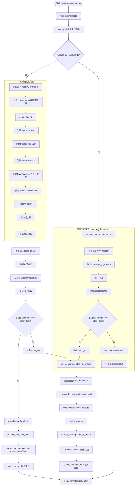
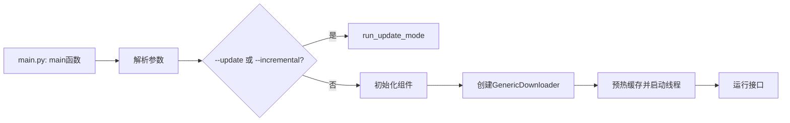
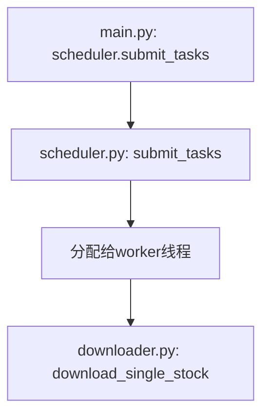
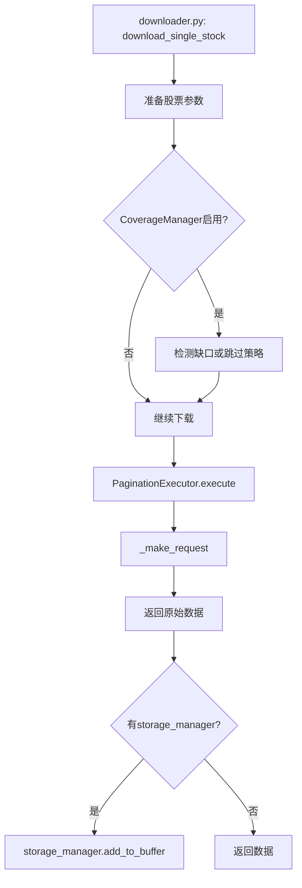
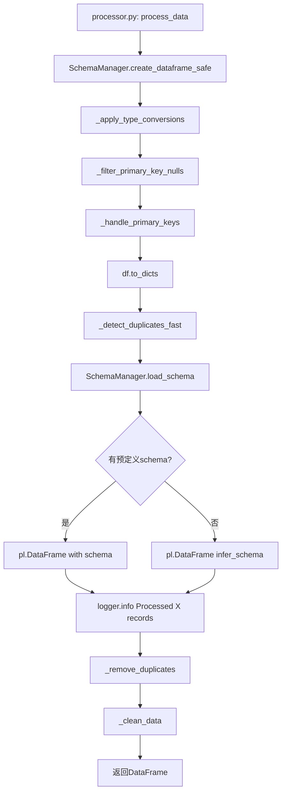
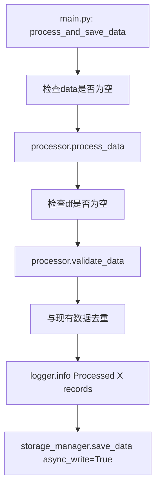
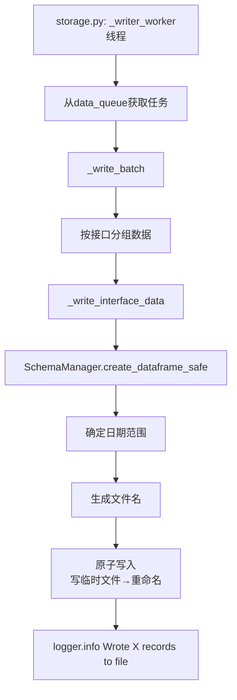
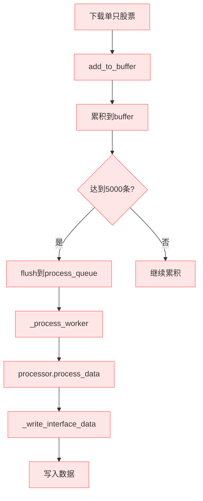
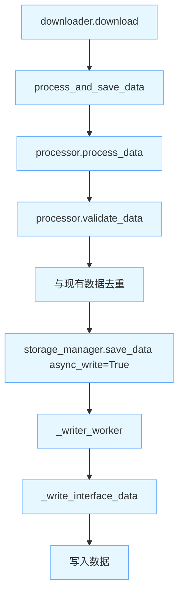

# Main.py 下载到存储的完整流程图（Mermaid版）

**日期**: 2026-02-14
**版本**: 4.0 (基于当前 App4 代码)

---

## 📊 完整数据流程图（Mermaid）



---

## 🔍 关键函数调用链详细说明

### 1. 入口函数：main.py



**文件位置**: `app4/main.py` (第 530 行开始)

---

### 2. 并发股票下载：run_concurrent_stock_download

```mermaid
graph TD
    A[main.py: run_concurrent_stock_download] --> B[初始化tasks=[]]
    B --> C[for stock in stock_list]
    C --> D[创建task并加入tasks]
    D --> E{tasks数量>=100?}
    E -->|否| C
    E -->|是| F[scheduler.submit_tasks]
    F --> G[汇总已完成记录数]
    G --> H[清空tasks]
```

**文件位置**: `app4/main.py` (第 151 行)

---

### 3. 任务提交：scheduler.submit_tasks



**文件位置**: 
- 调用: `app4/main.py` (第 171, 184 行)
- 实现: `app4/core/scheduler.py` (第 35 行)

---

### 4. 下载单只股票：download_single_stock



**文件位置**: `app4/core/downloader.py` (第 416 行)

---

### 5. API请求：_make_request

```mermaid
graph TD
    A[downloader.py: _make_request] --> B[构建请求参数]
    B --> C[调用TuShare API]
    C --> D[返回原始数据List[Dict]]
```

**文件位置**: `app4/core/downloader.py` (第 589 行)

---

### 6. Buffer机制：add_to_buffer

```mermaid
graph TD
    A[downloader.py: add_to_buffer] --> B[storage.py: add_to_buffer]
    B --> C[获取或创建buffer]
    C --> D[buffer['data'].extend data]
    D --> E[buffer['count'] += len data]
    E --> F{>=5000 或 <100?}
    F -->|否| G[返回]
    F -->|是| H[触发flush]
    H --> I[取出buffer['data']]
    I --> J[重置buffer]
    J --> K[process_queue.put task]
```

**文件位置**: 
- 调用: `app4/core/downloader.py` (第 551 行附近)
- 实现: `app4/core/storage.py` (第 441 行)

---

### 7. Process Worker处理：_process_worker

```mermaid
graph TD
    A[storage.py: _process_worker线程] --> B[从process_queue获取任务]
    B --> C{数据已处理?<br/>_update_time in data[0]?}
    C -->|是| D[直接_write_interface_data]
    C -->|否| E[完整处理流程]
    
    E --> F[获取interface_config]
    F --> G[processor.process_data]
    
    G --> H[processor.validate_data]
    H --> I[与现有数据去重]
    I --> J[_write_interface_data]
    
    D --> K[记录日志]
    J --> K
```

**文件位置**: `app4/core/storage.py` (第 532 行)

---

### 8. 数据处理：processor.process_data



**文件位置**: `app4/core/processor.py` (第 16 行)

---

### 9. 批量处理：process_and_save_data



**文件位置**: `app4/main.py` (第 783 行)

---

### 10. 异步保存：save_data

```mermaid
graph TD
    A[storage.py: save_data] --> B{async_write?}
    B -->|否| C[_write_interface_data]
    B -->|是| D{数据已处理?<br/>_update_time in data[0]?}
    D -->|是| E[data_queue.put task]
    D -->|否| F[process_queue.put task]
    
    E --> G[_writer_worker处理]
    F --> H[_process_worker处理]
```

**文件位置**: `app4/core/storage.py` (第 706 行)

---

### 11. Writer Worker处理：_writer_worker



**文件位置**: `app4/core/storage.py` (第 147 行)

---

### 12. 写入接口数据：_write_interface_data

```mermaid
graph TD
    A[storage.py: _write_interface_data] --> B[SchemaManager.create_dataframe_safe]
    B --> C[确定日期范围<br/>优先级: period > trade_date > cal_date > ann_date]
    C --> D[生成文件名<br/>{interface}_{start}_{end}_{timestamp}_{uuid}.parquet]
    D --> E[写入临时文件]
    E --> F[重命名为正式文件]
    F --> G[logger.info Wrote X records to file]
```

**文件位置**: `app4/core/storage.py` (第 252 行)

---

## 📊 执行路径对比

### 路径1: stock_loop + buffer 处理



**特点**:
- 实时处理，边下载边处理
- 内存占用低
- 适合大规模数据下载
- 可能产生较多小文件

---

### 路径2: 非 stock_loop 直接下载



**特点**:
- 简化流程，主线程直接处理与保存
- 适合非 stock_loop 接口
- 复用异步写入线程

---

## 📝 函数索引表

| 函数名 | 文件 | 行号 | 功能 | 路径 |
|--------|------|------|------|------|
| `main` | main.py | 530 | 程序入口 | 通用 |
| `run_concurrent_stock_download` | main.py | 151 | 并发股票下载 | 通用 |
| `download_single_stock` | downloader.py | 416 | 下载单只股票 | 通用 |
| `_make_request` | downloader.py | 589 | API请求 | 通用 |
| `add_to_buffer` | storage.py | 441 | 添加到Buffer | 路径1 |
| `_process_worker` | storage.py | 532 | 处理线程工作 | 路径1 |
| `process_data` | processor.py | 16 | 数据处理 | 路径1, 路径2 |
| `_handle_primary_keys` | processor.py | 210 | 主键处理 | 路径1, 路径2 |
| `process_and_save_data` | main.py | 783 | 处理与保存 | 路径2 |
| `save_data` | storage.py | 706 | 保存数据 | 路径2 |
| `_writer_worker` | storage.py | 147 | 写入线程工作 | 路径2 |
| `_write_interface_data` | storage.py | 252 | 写入接口数据 | 路径1, 路径2 |
| `submit_tasks` | scheduler.py | 35 | 批量提交任务 | 通用 |

---
