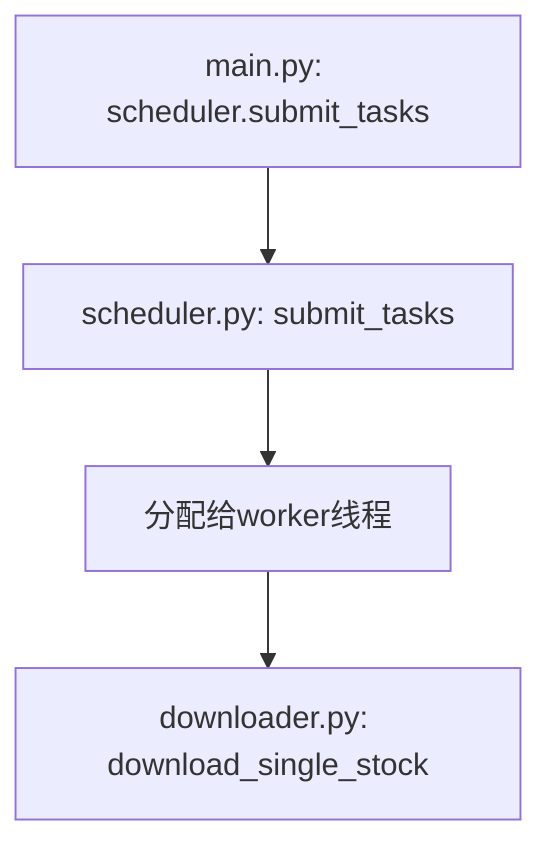
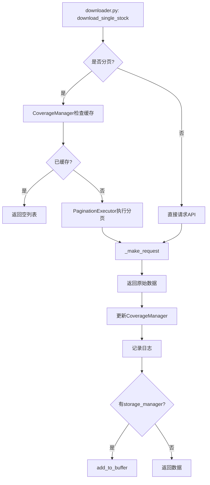
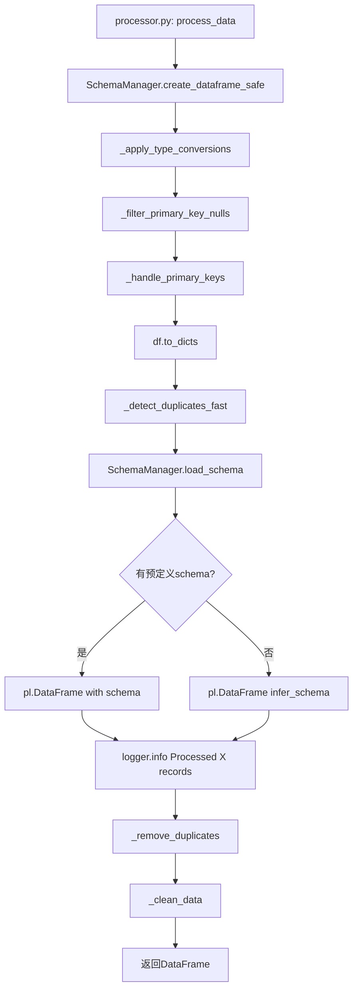
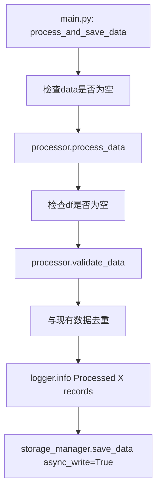
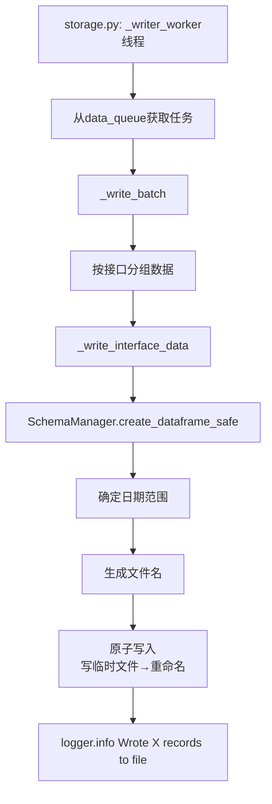
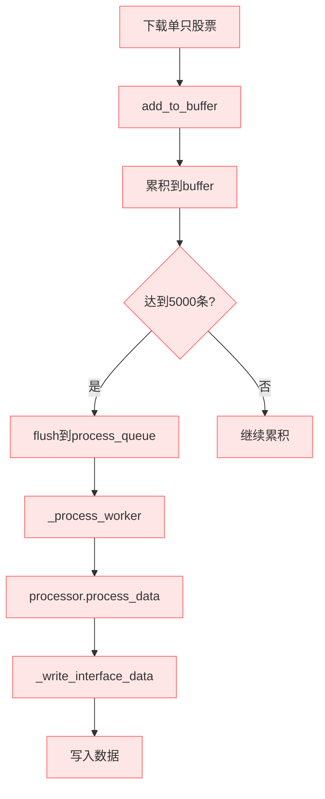
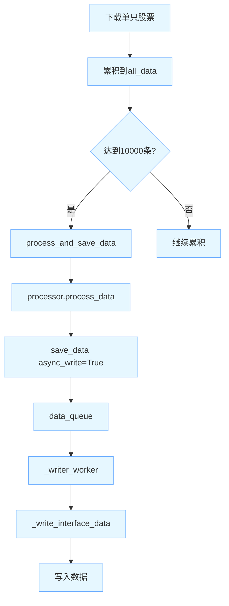
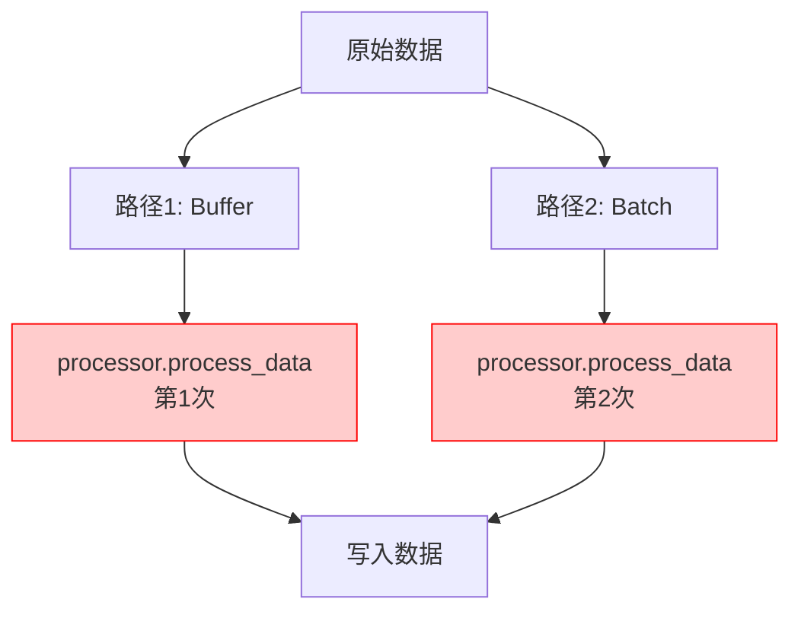
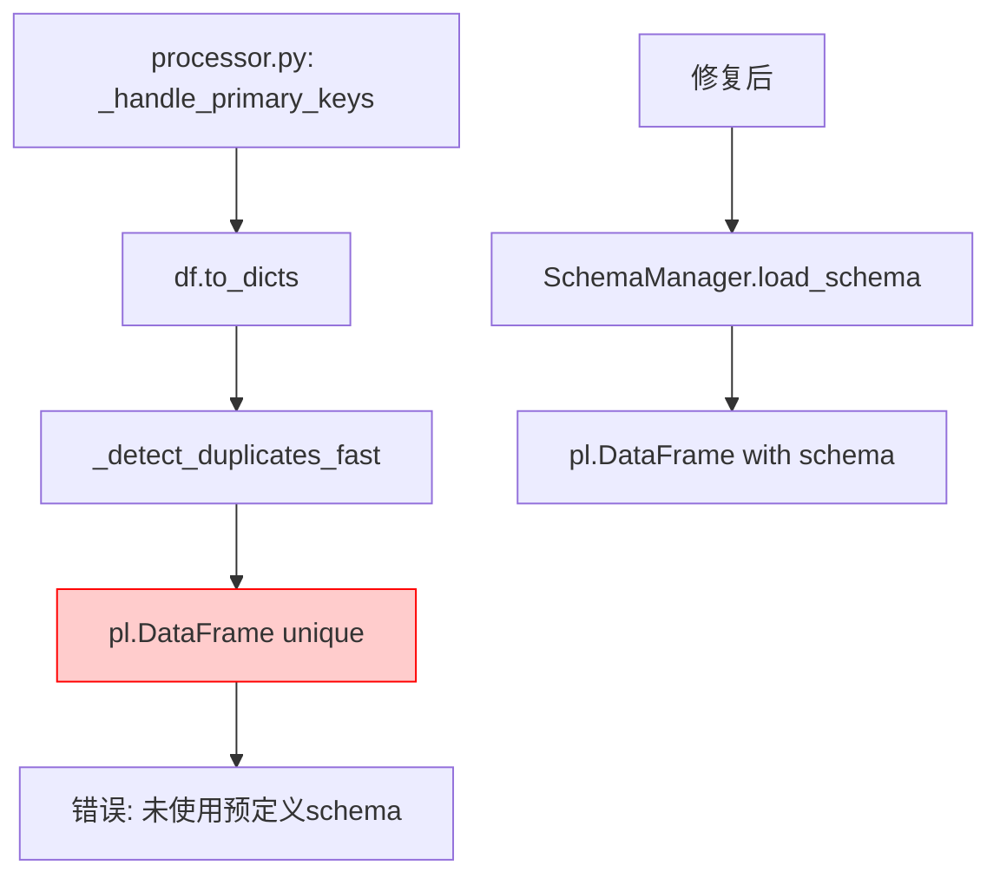

# Main.py 下载到存储的完整流程图（Mermaid版）

**日期**: 2026-01-28
**版本**: 3.0 (超详细版)

---

## 📊 完整数据流程图（Mermaid）

```mermaid
graph TD
    Start([开始: python app4/main.py]) --> Init[main.py: main函数]
    
    subgraph InitSection["初始化阶段"]
        Init --> ConfigLoader[main.py: 创建ConfigLoader]
        ConfigLoader --> Downloader[main.py: 创建GenericDownloader]
        Downloader --> Scheduler[main.py: 创建TaskScheduler]
        Scheduler --> StorageMgr[main.py: 创建StorageManager]
        StorageMgr --> Processor[main.py: 创建DataProcessor]
        Processor --> CacheWarmer[main.py: 创建CacheWarmer]
        CacheWarmer --> WarmCache[main.py: 预热全局缓存]
    end
    
    WarmCache --> StartStorage[main.py: storage_manager.start_writer]
    
    subgraph StorageStart["启动存储管理器"]
        StartStorage --> WriterThread[storage.py: start_writer<br/>启动writer_thread线程]
        WriterThread --> ProcessThread[storage.py: start_writer<br/>启动process_thread线程]
    end
    
    ProcessThread --> RunMode[main.py: 运行接口模式判断]
    
    subgraph ModeSelection["模式选择"]
        RunMode --> StockLoop{是否stock_loop模式?}
        StockLoop -->|是| RunConcurrent[main.py: run_concurrent_stock_download]
        StockLoop -->|否| OtherModes[main.py: 其他模式处理]
    end
    
    subgraph ConcurrentDownload["并发股票下载流程"]
        RunConcurrent --> CreateRateLimiter[main.py: 创建RateLimiter]
        CreateRateLimiter --> SetBatchSize[main.py: 设置batch_size=10000]
        SetBatchSize --> InitAllData[main.py: 初始化all_data=[]]
        InitAllData --> InitTasks[main.py: 初始化tasks=[]]
        
        InitTasks --> StockLoop[main.py: for stock in stock_list]
        
        StockLoop --> CreateTask[main.py: 创建单个任务task]
        CreateTask --> AppendTask[main.py: tasks.append task]
        AppendTask --> CheckBatch{tasks数量>=100?}
        
        CheckBatch -->|否| StockLoop
        CheckBatch -->|是| SubmitTasks[main.py: scheduler.submit_tasks]
        
        subgraph SubmitTasksFlow["提交任务"]
            SubmitTasks --> SchedulerSubmit[scheduler.py: submit_tasks]
            SchedulerSubmit --> WorkerThreads[scheduler.py: 分配给worker线程]
            WorkerThreads --> DownloadSingle[downloader.py: download_single_stock]
        end
        
        DownloadSingle --> DownloadFlow
        
        subgraph DownloadFlow["下载单只股票流程"]
            DownloadSingle --> CheckPagination{是否分页?}
            
            CheckPagination -->|是| CheckCache[downloader.py: CoverageManager检查缓存]
            CheckCache --> HasCached{是否已缓存?}
            
            HasCached -->|是| ReturnEmpty[downloader.py: 返回空列表]
            HasCached -->|否| Paginate[downloader.py: PaginationExecutor执行分页]
            
            CheckPagination -->|否| DirectRequest[downloader.py: 直接请求API]
            
            Paginate --> MakeRequest
            DirectRequest --> MakeRequest
            
            subgraph MakeRequestFlow["API请求"]
                MakeRequest[downloader.py: _make_request]
                MakeRequest --> BuildParams[downloader.py: 构建请求参数]
                BuildParams --> CallAPI[downloader.py: 调用TuShare API]
                CallAPI --> ReturnData[downloader.py: 返回原始数据List[Dict]]
            end
            
            ReturnData --> UpdateCoverage[downloader.py: 更新CoverageManager]
            UpdateCoverage --> LogDownload[downloader.py: 记录日志Downloaded X records]
            
            LogDownload --> CheckBuffer{是否有storage_manager?}
            CheckBuffer -->|是| AddToBuffer[downloader.py: add_to_buffer]
            CheckBuffer -->|否| ReturnToTasks
        end
        
        subgraph AddToBufferFlow["Buffer机制路径"]
            AddToBuffer --> BufferGetBuffer[storage.py: add_to_buffer<br/>获取或创建buffer]
            BufferGetBuffer --> BufferExtend[storage.py: buffer['data'].extend data]
            BufferExtend --> BufferCount[storage.py: buffer['count'] += len data]
            BufferCount --> CheckThreshold{buffer数量>=5000?}
            
            CheckThreshold -->|否| ReturnToTasks
            CheckThreshold -->|是| BufferFlush[storage.py: 触发flush]
            
            BufferFlush --> BufferTakeData[storage.py: 取出buffer['data']]
            BufferTakeData --> BufferReset[storage.py: 重置buffer]
            BufferReset --> PutToProcessQueue[storage.py: process_queue.put task]
            
            PutToProcessQueue --> ProcessWorkerWait[storage.py: _process_worker线程等待]
            ProcessWorkerWait --> ProcessWorkerGet[storage.py: task = process_queue.get]
            
            ProcessWorkerGet --> CheckProcessed{数据已处理?<br/>_update_time in data[0]?}
            
            CheckProcessed -->|是| DirectWrite[storage.py: 直接_write_interface_data]
            CheckProcessed -->|否| ProcessDataFull[storage.py: 完整处理流程]
            
            subgraph ProcessDataFullFlow["完整处理流程"]
                ProcessDataFull --> GetInterfaceConfig[storage.py: 获取interface_config]
                GetInterfaceConfig --> ProcessDataCall[storage.py: processor.process_data]
                
                subgraph ProcessorProcessData["processor.process_data"]
                    ProcessDataCall --> CreateDataFrameSafe[processor.py: SchemaManager.create_dataframe_safe]
                    CreateDataFrameSafe --> ApplyTypeConversions[processor.py: _apply_type_conversions]
                    ApplyTypeConversions --> FilterPrimaryKeys[processor.py: _filter_primary_key_nulls]
                    FilterPrimaryKeys --> HandlePrimaryKeys[processor.py: _handle_primary_keys]
                    
                    subgraph HandlePrimaryKeysFlow["_handle_primary_keys修复"]
                        HandlePrimaryKeys --> ToDicts[processor.py: df.to_dicts]
                        ToDicts --> DetectDuplicates[processor.py: _detect_duplicates_fast]
                        DetectDuplicates --> LoadSchema[processor.py: SchemaManager.load_schema]
                        LoadSchema --> HasSchema{有预定义schema?}
                        
                        HasSchema -->|是| CreateWithSchema[processor.py: pl.DataFrame with schema]
                        HasSchema -->|否| CreateInfer[processor.py: pl.DataFrame infer_schema]
                        
                        CreateWithSchema --> LogProcessed1[processor.py: logger.info Processed X records]
                        CreateInfer --> LogProcessed1
                    end
                    
                    LogProcessed1 --> RemoveDuplicates[processor.py: _remove_duplicates]
                    RemoveDuplicates --> CleanData[processor.py: _clean_data]
                    CleanData --> ReturnDF[processor.py: 返回DataFrame]
                end
                
                ReturnDF --> ValidateData[storage.py: processor.validate_data]
                ValidateData --> DedupExisting[storage.py: 与现有数据去重]
                DedupExisting --> WriteInterfaceData[storage.py: _write_interface_data]
            end
            
            WriteInterfaceData --> LogProcessedQueued[storage.py: logger.info Processed and queued]
            DirectWrite --> LogProcessedQueued
            
            LogProcessedQueued --> ReturnToTasks
        end
        
        ReturnToTasks --> CollectResults[main.py: 收集results]
        CollectResults --> ExtendAllData[main.py: all_data.extend results]
        ExtendAllData --> LogBatch[main.py: logger.info Completed batch]
        
        LogBatch --> CheckBatchSize{all_data数量>=10000?}
        
        CheckBatchSize -->|是| ProcessAndSave[main.py: process_and_save_data]
        CheckBatchSize -->|否| ResetTasks[main.py: tasks=[]]
        
        subgraph ProcessAndSaveFlow["批量处理路径"]
            ProcessAndSave --> CheckEmptyData[main.py: 检查data是否为空]
            CheckEmptyData --> ProcessorProcessData2[main.py: processor.process_data]
            
            subgraph ProcessorProcessData2["processor.process_data (第2次)"]
                ProcessorProcessData2 --> CreateDataFrameSafe2[processor.py: SchemaManager.create_dataframe_safe]
                CreateDataFrameSafe2 --> ApplyTypeConversions2[processor.py: _apply_type_conversions]
                ApplyTypeConversions2 --> FilterPrimaryKeys2[processor.py: _filter_primary_key_nulls]
                FilterPrimaryKeys2 --> HandlePrimaryKeys2[processor.py: _handle_primary_keys]
                
                subgraph HandlePrimaryKeysFlow2["_handle_primarykeys (第2次)"]
                    HandlePrimaryKeys2 --> ToDicts2[processor.py: df.to_dicts]
                    ToDicts2 --> DetectDuplicates2[processor.py: _detect_duplicates_fast]
                    DetectDuplicates2 --> LoadSchema2[processor.py: SchemaManager.load_schema]
                    LoadSchema2 --> HasSchema2{有预定义schema?}
                    
                    HasSchema2 -->|是| CreateWithSchema2[processor.py: pl.DataFrame with schema]
                    HasSchema2 -->|否| CreateInfer2[processor.py: pl.DataFrame infer_schema]
                    
                    CreateWithSchema2 --> LogProcessed2[processor.py: logger.info Processed X records]
                    CreateInfer2 --> LogProcessed2
                end
                
                LogProcessed2 --> RemoveDuplicates2[processor.py: _remove_duplicates]
                RemoveDuplicates2 --> CleanData2[processor.py: _clean_data]
                CleanData2 --> ReturnDF2[processor.py: 返回DataFrame]
            end
            
            ReturnDF2 --> CheckDFEmpty[main.py: 检查df是否为空]
            CheckDFEmpty --> ValidateData2[main.py: processor.validate_data]
            ValidateData2 --> DedupExisting2[main.py: 与现有数据去重]
            DedupExisting2 --> LogProcessed3[main.py: logger.info Processed X records]
            LogProcessed3 --> SaveDataAsync[main.py: storage_manager.save_data async_write=True]
            
            subgraph SaveDataFlow["异步保存流程"]
                SaveDataAsync --> CheckAlreadyProcessed[storage.py: save_data<br/>检查_update_time]
                CheckAlreadyProcessed --> PutToDataQueue[storage.py: data_queue.put task]
                PutToDataQueue --> WriterWorkerWait[storage.py: _writer_worker线程等待]
                WriterWorkerWait --> WriterWorkerGet[storage.py: item = data_queue.get]
                WriterWorkerGet --> WriteBatch[storage.py: _write_batch]
                
                subgraph WriteBatchFlow["批量写入"]
                    WriteBatch --> GroupData[storage.py: 按接口分组数据]
                    GroupData --> WriteInterfaceData2[storage.py: _write_interface_data]
                    
                    subgraph WriteInterfaceDataFlow["写入接口数据"]
                        WriteInterfaceData2 --> CreateDFSafe2[storage.py: SchemaManager.create_dataframe_safe]
                        CreateDFSafe2 --> DetermineDateRange[storage.py: 确定日期范围]
                        DetermineDateRange --> GenerateFileName[storage.py: 生成文件名]
                        GenerateFileName --> AtomicWrite[storage.py: 原子写入<br/>写临时文件→重命名]
                        AtomicWrite --> LogWrote[storage.py: logger.info Wrote X records to file]
                    end
                    
                    LogWrote --> ClearAllData[main.py: all_data = []]
                end
            end
            
            ClearAllData --> ResetTasks
        end
        
        ResetTasks --> StockLoop
    end
    
    InitTasks --> SubmitRemainingTasks{tasks有剩余?}
    
    SubmitRemainingTasks -->|是| SubmitTasks2[main.py: scheduler.submit_tasks<br/>提交剩余任务]
    SubmitTasks2 --> SubmitTasksFlow
    
    SubmitRemainingTasks -->|否| CheckAllData{all_data有剩余?}
    
    CheckAllData -->|是| ProcessAndSave2[main.py: process_and_save_data<br/>处理剩余数据]
    ProcessAndSave2 --> ProcessAndSaveFlow
    
    CheckAllData -->|否| StopScheduler[main.py: 停止调度器]
    
    StopScheduler --> StopStorage[main.py: 停止存储写入]
    
    subgraph StopStorageFlow["停止存储流程"]
        StopStorage --> FlushRemaining[storage.py: flush_remaining_data]
        FlushRemaining --> SendStopSignalProcess[storage.py: process_queue.put None]
        SendStopSignalProcess --> ProcessWorkerJoin[storage.py: process_thread.join]
        ProcessWorkerJoin --> SendStopSignalWriter[storage.py: data_queue.put None]
        SendStopSignalWriter --> WriterWorkerJoin[storage.py: writer_thread.join]
    end
    
    WriterWorkerJoin --> GenerateReport[main.py: 生成性能报告]
    GenerateReport --> End([结束])
    
    classDef path1 fill:#ffe6e6,stroke:#ff6666,stroke-width:2px;
    classDef path2 fill:#e6f7ff,stroke:#66aaff,stroke-width:2px;
    classDef common fill:#f0f0f0,stroke:#999999;
    
    class AddToBuffer,BufferGetBuffer,BufferExtend,BufferCount,CheckThreshold,BufferFlush,BufferTakeData,BufferReset,PutToProcessQueue,ProcessWorkerWait,ProcessWorkerGet,CheckProcessed,ProcessDataFull,ProcessDataFullFlow,WriteInterfaceData,LogProcessedQueued path1;
    
    class ProcessAndSave,ProcessAndSaveFlow,ProcessDataCall,ProcessorProcessData,ProcessorProcessData2,ProcessorProcessData2,SaveDataAsync,SaveDataFlow,PutToDataQueue,WriterWorkerWait,WriterWorkerGet,WriteBatch,WriteBatchFlow,WriteInterfaceData2,WriteInterfaceDataFlow path2;
    
    class Init,WarmCache,StartStorage,RunMode,RunConcurrent,SubmitTasks,SubmitTasksFlow,DownloadSingle,DownloadFlow,MakeRequestFlow,CheckPagination,CheckCache,HasCached,Paginate,DirectRequest,MakeRequest,BuildParams,CallAPI,ReturnData,UpdateCoverage,LogDownload,CheckBuffer,ReturnToTasks,CollectResults,ExtendAllData,LogBatch,CheckBatchSize,ResetTasks,CheckEmptyData,CheckDFEmpty,ValidateData,ValidateData2,DedupExisting,DedupExisting2,LogProcessed2,LogProcessed3,CheckAlreadyProcessed,GroupData,ClearAllData,SubmitRemainingTasks,SubmitTasks2,CheckAllData,ProcessAndSave2,StopScheduler,StopStorage,FlushRemaining,SendStopSignalProcess,ProcessWorkerJoin,SendStopSignalWriter,WriterWorkerJoin,GenerateReport common;
```

---

## 🔍 关键函数调用链详细说明

### 1. 入口函数：main.py


**文件位置**: `app4/main.py` (第 690 行开始)

---

### 2. 并发股票下载：run_concurrent_stock_download

```mermaid
graph TD
    A[main.py: run_concurrent_stock_download] --> B[创建RateLimiter]
    B --> C[设置batch_size=10000]
    C --> D[初始化all_data=[]]
    D --> E[初始化tasks=[]]
    E --> F[for stock in stock_list]
    F --> G[创建task]
    G --> H[tasks.append task]
    H --> I{tasks数量>=100?}
    I -->|否| F
    I -->|是| J[scheduler.submit_tasks]
```

**文件位置**: `app4/main.py` (第 449 行)

---

### 3. 任务提交：scheduler.submit_tasks



**文件位置**: 
- 调用: `app4/main.py` (第 477, 493 行)
- 实现: `app4/core/scheduler.py`

---

### 4. 下载单只股票：download_single_stock



**文件位置**: `app4/core/downloader.py` (第 432 行)

---

### 5. API请求：_make_request

```mermaid
graph TD
    A[downloader.py: _make_request] --> B[构建请求参数]
    B --> C[调用TuShare API]
    C --> D[返回原始数据List[Dict]]
```

**文件位置**: `app4/core/downloader.py` (第 517 行)

---

### 6. Buffer机制：add_to_buffer

```mermaid
graph TD
    A[downloader.py: add_to_buffer] --> B[storage.py: add_to_buffer]
    B --> C[获取或创建buffer]
    C --> D[buffer['data'].extend data]
    D --> E[buffer['count'] += len data]
    E --> F{buffer数量>=5000?}
    F -->|否| G[返回]
    F -->|是| H[触发flush]
    H --> I[取出buffer['data']]
    I --> J[重置buffer]
    J --> K[process_queue.put task]
```

**文件位置**: 
- 调用: `app4/core/downloader.py` (第 497 行)
- 实现: `app4/core/storage.py` (第 380 行)

---

### 7. Process Worker处理：_process_worker

```mermaid
graph TD
    A[storage.py: _process_worker线程] --> B[从process_queue获取任务]
    B --> C{数据已处理?<br/>_update_time in data[0]?}
    C -->|是| D[直接_write_interface_data]
    C -->|否| E[完整处理流程]
    
    E --> F[获取interface_config]
    F --> G[processor.process_data]
    
    G --> H[processor.validate_data]
    H --> I[与现有数据去重]
    I --> J[_write_interface_data]
    
    D --> K[记录日志]
    J --> K
```

**文件位置**: `app4/core/storage.py` (第 454 行)

---

### 8. 数据处理：processor.process_data



**文件位置**: `app4/core/processor.py` (第 16 行)

---

### 9. 批量处理：process_and_save_data



**文件位置**: `app4/main.py` (第 358 行)

---

### 10. 异步保存：save_data

```mermaid
graph TD
    A[storage.py: save_data] --> B{async_write?}
    B -->|否| C[_write_interface_data]
    B -->|是| D{数据已处理?<br/>_update_time in data[0]?}
    D -->|是| E[data_queue.put task]
    D -->|否| F[process_queue.put task]
    
    E --> G[_writer_worker处理]
    F --> H[_process_worker处理]
```

**文件位置**: `app4/core/storage.py` (第 618 行)

---

### 11. Writer Worker处理：_writer_worker



**文件位置**: `app4/core/storage.py` (第 67 行)

---

### 12. 写入接口数据：_write_interface_data

```mermaid
graph TD
    A[storage.py: _write_interface_data] --> B[SchemaManager.create_dataframe_safe]
    B --> C[确定日期范围<br/>优先级: period > trade_date > cal_date > ann_date]
    C --> D[生成文件名<br/>{interface}_{start}_{end}_{timestamp}_{uuid}.parquet]
    D --> E[写入临时文件]
    E --> F[重命名为正式文件]
    F --> G[logger.info Wrote X records to file]
```

**文件位置**: `app4/core/storage.py` (第 207 行)

---

## 📊 两条路径的完整对比

### 路径1: Buffer机制（红色路径）



**特点**:
- 实时处理，边下载边处理
- 内存占用低
- 适合大规模数据下载
- 可能产生较多小文件

---

### 路径2: 批量处理（蓝色路径）



**特点**:
- 批量处理效率高
- 减少文件数量
- 去重效率高
- 内存占用较高

---

## 🎯 关键问题点

### 问题1: 重复处理



**问题**: 同一份数据被处理2次

---

### 问题2: Schema推断错误



**问题**: 重新创建DataFrame时未使用预定义schema

**修复**: 已修复，现在使用预定义schema

---

## 📝 函数索引表

| 函数名 | 文件 | 行号 | 功能 | 路径 |
|--------|------|------|------|------|
| `main` | main.py | 690 | 程序入口 | 通用 |
| `run_concurrent_stock_download` | main.py | 449 | 并发股票下载 | 通用 |
| `download_single_stock` | downloader.py | 432 | 下载单只股票 | 通用 |
| `_make_request` | downloader.py | 517 | API请求 | 通用 |
| `add_to_buffer` | storage.py | 380 | 添加到Buffer | 路径1 |
| `_process_worker` | storage.py | 454 | 处理线程工作 | 路径1 |
| `process_data` | processor.py | 16 | 数据处理 | 路径1, 路径2 |
| `_handle_primary_keys` | processor.py | 198 | 主键处理 | 路径1, 路径2 |
| `process_and_save_data` | main.py | 358 | 批量处理和保存 | 路径2 |
| `save_data` | storage.py | 618 | 保存数据 | 路径2 |
| `_writer_worker` | storage.py | 67 | 写入线程工作 | 路径2 |
| `_write_interface_data` | storage.py | 207 | 写入接口数据 | 路径1, 路径2 |
| `submit_tasks` | scheduler.py | - | 提交任务 | 通用 |

---
