# Main.py 下载到存储的完整流程图（Mermaid版）

**日期**: 2026-03-01
**版本**: 4.3 (基于当前 App4 代码)

---

## 📊 完整数据流程图（Mermaid）

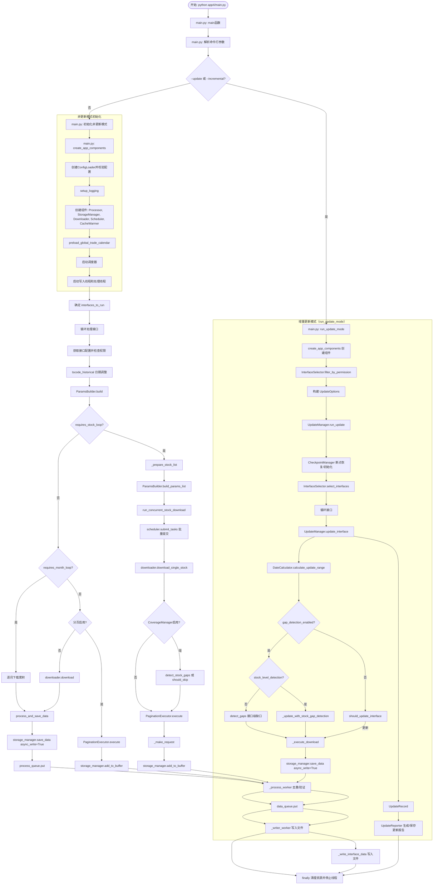

---

## 🔍 关键函数调用链详细说明

### 1. 入口函数：main.py

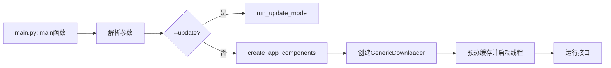

**文件位置**: `app4/main.py` (第 605 行开始)

**关键变更**:
- 新增 `create_app_components()` 工厂函数 (第 94 行)，统一初始化组件
- 新增 `AppComponents` 数据类 (第 82 行)，封装所有组件引用

---

### 2. 组件初始化：create_app_components

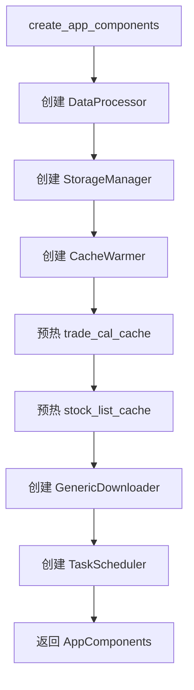

**文件位置**: `app4/main.py` (第 94 行)

**组件说明**:
| 组件 | 作用 | 依赖 |
|------|------|------|
| `DataProcessor` | 数据处理、类型转换、去重 | 无 |
| `StorageManager` | 数据存储、Buffer管理、异步写入 | Processor, ConfigLoader |
| `CacheWarmer` | 预热缓存（交易日历、股票列表） | StorageDir |
| `GenericDownloader` | API请求、分页执行、覆盖率检测 | ConfigLoader, StorageManager |
| `TaskScheduler` | 任务调度、并发控制 | 无 |

---

### 3. 增量更新主流程：run_update_mode → UpdateManager

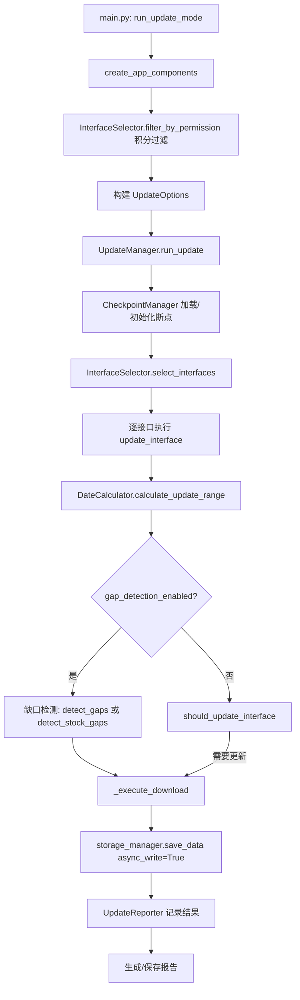

**文件位置**:
- `app4/main.py` (第 434 行)
- `app4/update/update_manager.py` (第 28 行)
- `app4/update/interface_selector.py`
- `app4/update/date_calculator.py`
- `app4/update/checkpoint_manager.py`

---

### 4. 分页执行器：PaginationExecutor（新增核心模块）

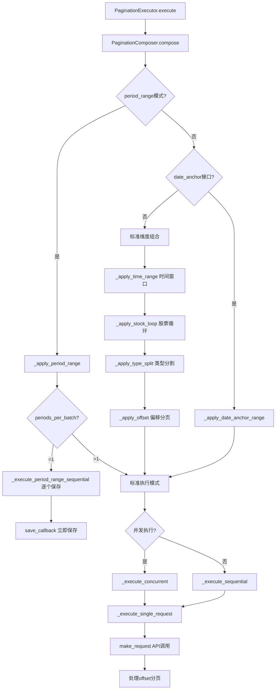

**文件位置**:
- `app4/core/pagination_executor.py` (第 15 行)
- `app4/core/pagination.py` (第 38 行, PaginationComposer 类)

**关键特性**:
- 支持四种分页维度：time_range, stock_loop, type_split, offset
- 新增 period_range 模式支持（财务数据报告期）
- 新增 date_anchor 模式支持（日期锚定接口如 cyq_perf）
- 支持逐批次保存（periods_per_batch=1）

---

### 5. 分页上下文与组合器：PaginationComposer

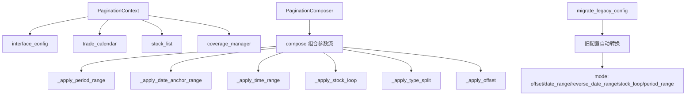

**文件位置**: `app4/core/pagination.py` (第 16 行, PaginationContext 类)

**配置迁移说明**:
| 旧版 mode | 新版配置 |
|-----------|----------|
| `offset` | `offset: {enabled: true, limit: 5000}` |
| `date_range` | `time_range: {enabled: true, window: "365d"}` |
| `reverse_date_range` | `time_range: {enabled: true, reverse: true}` |
| `stock_loop` | `stock_loop: {enabled: true} + time_range` |
| `period_range` | `mode: "period_range" + periods_per_batch` |

---

### 6. 覆盖率管理器：CoverageManager（新增核心模块）

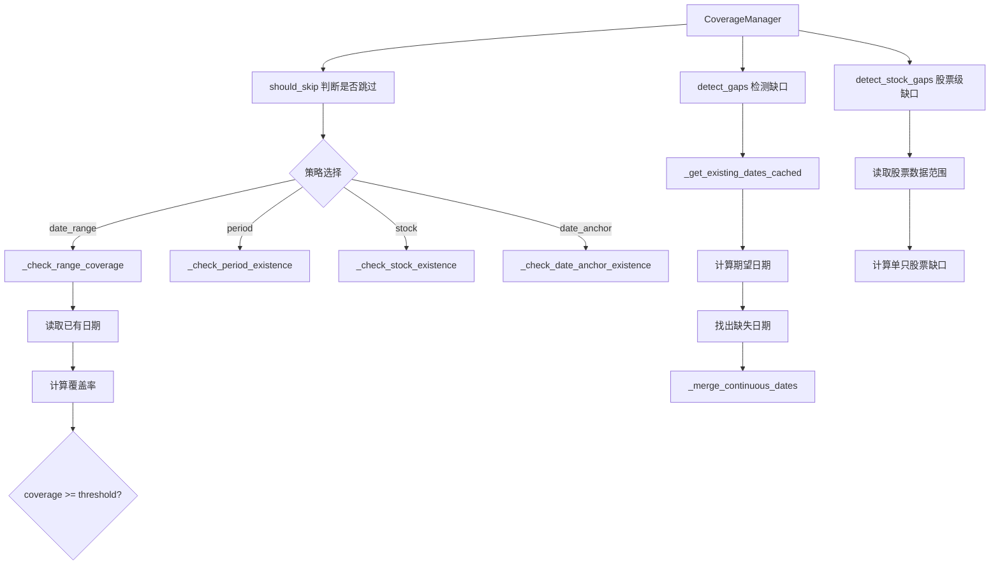

**文件位置**: `app4/core/coverage_manager.py` (第 25 行)

**检测策略说明**:
| 策略 | 适用场景 | 检测内容 |
|------|----------|----------|
| `date_range` | 日期范围模式接口 | 日期覆盖率 |
| `period` | 报告期模式接口 | 报告期是否存在 |
| `stock` | 股票循环模式接口 | 股票数据是否存在 |
| `date_anchor` | 日期锚定接口 | 锚定值是否存在 |

---

### 7. 并发股票下载：run_concurrent_stock_download

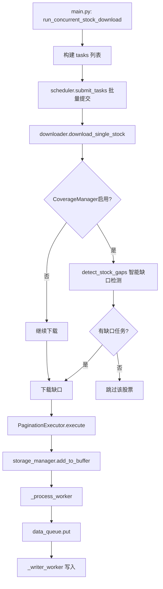

**文件位置**: `app4/main.py` (第 216 行)

---

### 8. 下载单只股票：download_single_stock

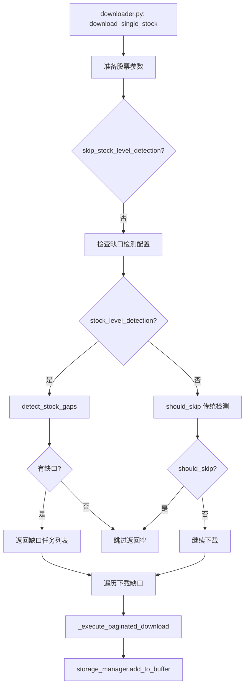

**文件位置**: `app4/core/downloader.py` (第 482 行)

---

### 9. Buffer机制：add_to_buffer

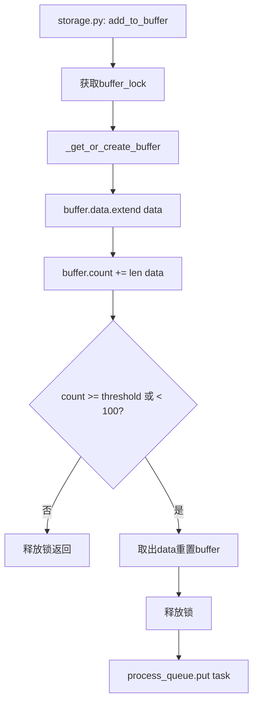

**文件位置**: `app4/core/storage.py` (第 438 行)

**Buffer机制说明**:
- 默认阈值为 5000 条（`STORAGE_BUFFER_THRESHOLD`）
- 小于 100 条时立即处理（小数据量优化）
- 使用线程锁保护并发访问

---

### 10. Process Worker处理：_process_worker

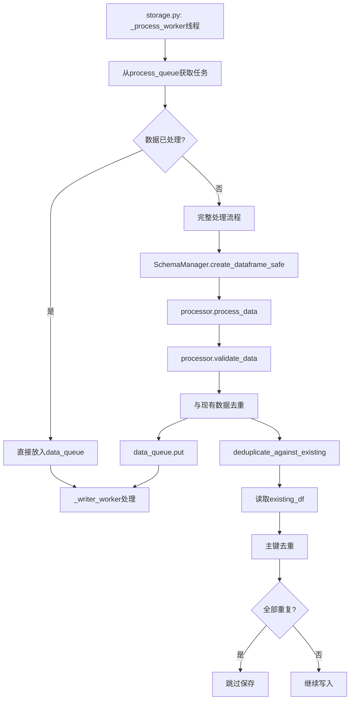

**文件位置**: `app4/core/storage.py` (第 529 行)

---

### 11. 数据处理：processor.process_data

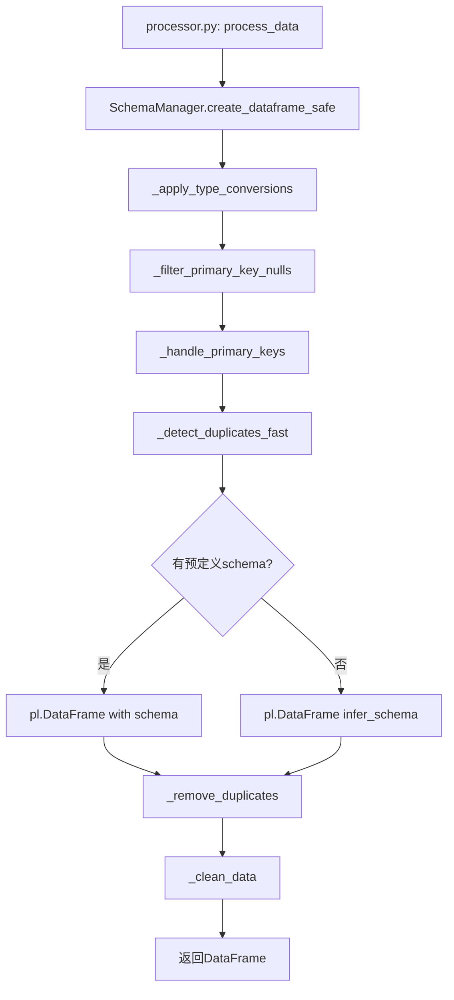

**文件位置**: `app4/core/processor.py` (第 16 行)

---

### 12. Writer Worker处理：_writer_worker

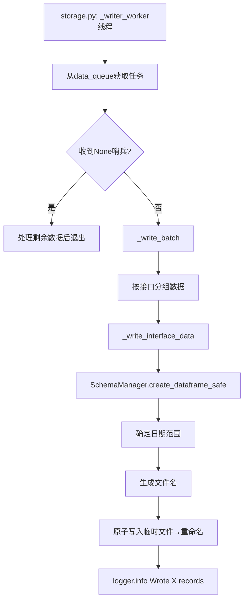

**文件位置**: `app4/core/storage.py` (第 177 行)

---

### 13. 写入接口数据：_write_interface_data

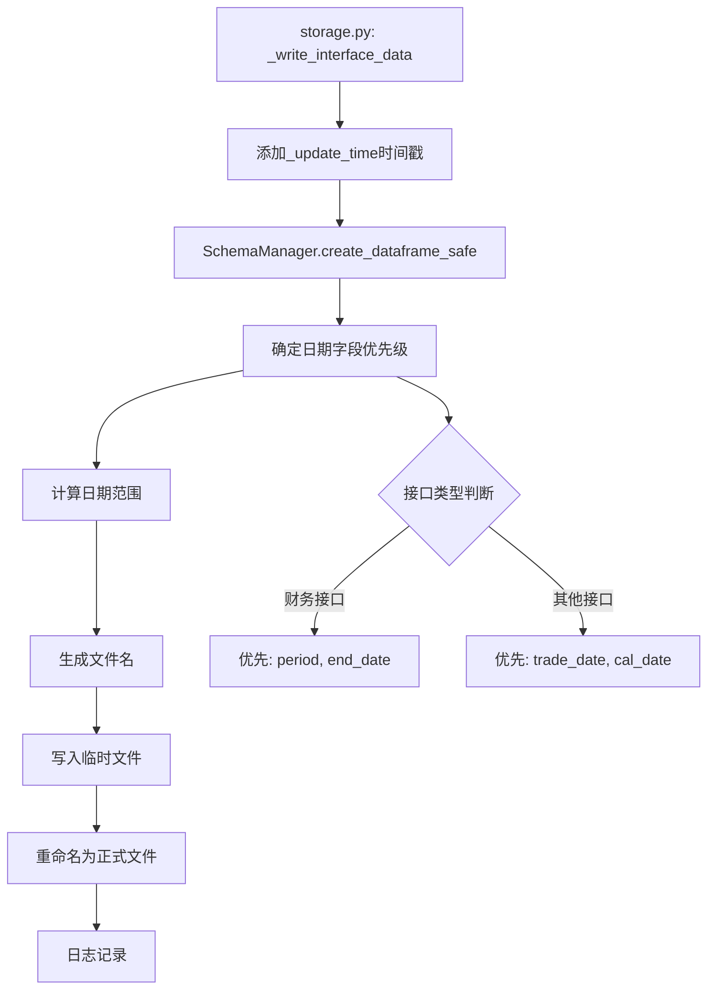

**文件位置**: `app4/core/storage.py` (第 321 行)

**文件命名格式**: `{interface}_{start_date}_{end_date}_{timestamp}_{uuid}.parquet`

---

## 📊 执行路径对比

### 路径1: stock_loop + buffer 处理（推荐）

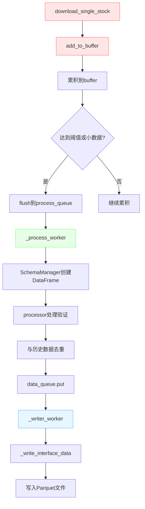

**特点**:
- 实时处理，边下载边处理
- 内存占用低（Buffer机制）
- 支持智能缺口检测
- 去重由 _process_worker 统一处理

---

### 路径2: 非 stock_loop 直接下载

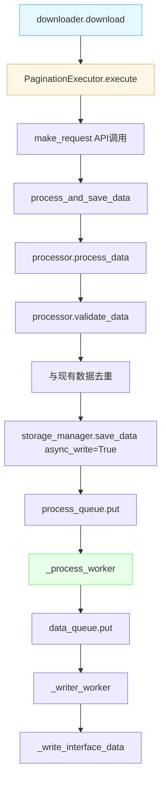

**特点**:
- 主线程直接调用下载
- 复用异步写入线程
- 适合非 stock_loop 接口

---

### 路径3: 增量更新模式

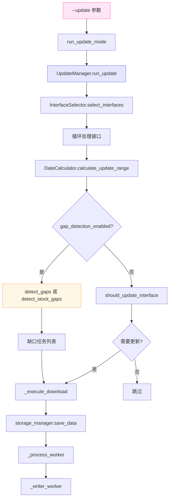

**特点**:
- 支持断点续传
- 智能缺口检测
- 结构化更新报告
- 容错机制

---

## 📝 函数索引表

### main.py 函数索引

| 函数名 | 行号 | 功能 | 路径 |
|--------|------|------|------|
| `main` | 744 | 程序入口 | 通用 |
| `run_update_mode` | 442 | 增量更新入口 | 更新 |
| `create_app_components` | 107 | 组件工厂函数 | 通用 |
| `run_concurrent_stock_download` | 224 | 并发股票下载 | 路径1 |
| `process_and_save_data` | 347 | 处理与保存 | 路径2 |
| `_prepare_stock_list` | 181 | 准备股票列表 | 路径1 |
| `preload_global_trade_calendar` | 273 | 预加载交易日历 | 通用 |
| `setup_logging` | 565 | 设置日志配置 | 通用 |
| `validate_and_adjust_date` | 153 | 日期校验调整 | 通用 |

### core/ 模块函数索引

| 函数名 | 文件 | 行号 | 功能 |
|--------|------|------|------|
| `download_single_stock` | downloader.py | 416 | 下载单只股票 |
| `_make_request` | downloader.py | 602 | API请求 |
| `_execute_pagination` | downloader.py | 221 | 执行分页逻辑 |
| `add_to_buffer` | storage.py | 519 | 添加到Buffer |
| `_process_worker` | storage.py | 610 | 处理线程工作 |
| `_writer_worker` | storage.py | 177 | 写入线程工作 |
| `_write_interface_data` | storage.py | 321 | 写入接口数据 |
| `save_data` | storage.py | 770 | 保存数据 |
| `read_interface_data` | storage.py | 397 | 读取接口数据 |
| `process_data` | processor.py | 16 | 数据处理 |
| `validate_data` | processor.py | 254 | 数据验证 |
| `execute` | pagination_executor.py | 41 | 分页执行入口 |
| `_execute_concurrent` | pagination_executor.py | 220 | 并发执行 |
| `_execute_sequential` | pagination_executor.py | 160 | 顺序执行 |
| `compose` | pagination.py | 72 | 组合参数流 |
| `migrate_legacy_config` | pagination.py | 428 | 配置迁移 |
| `should_skip` | coverage_manager.py | 159 | 跳过检测 |
| `detect_gaps` | coverage_manager.py | 476 | 缺口检测 |
| `detect_stock_gaps` | coverage_manager.py | - | 股票级缺口检测 |

### update/ 模块函数索引

| 函数名 | 文件 | 行号 | 功能 |
|--------|------|------|------|
| `run_update` | update_manager.py | 72 | 更新总控 |
| `update_interface` | update_manager.py | 209 | 更新单接口 |
| `_execute_download` | update_manager.py | 387 | 分页下载与入库 |
| `_update_with_stock_gap_detection` | update_manager.py | 506 | 股票级缺口更新 |
| `select_interfaces` | interface_selector.py | 22 | 更新接口筛选 |
| `calculate_update_range` | date_calculator.py | 49 | 更新日期范围 |
| `generate_report` | update_reporter.py | 71 | 生成更新报告 |

---

## 🔧 核心配置说明

### 分页配置示例

```yaml
pagination:
  enabled: true
  mode: "period_range"  # 支持: offset, date_range, reverse_date_range, stock_loop, period_range
  periods_per_batch: 1  # period_range模式专用
  period_field: "period"  # 自定义period字段名
  
  # 或使用新版多维度配置
  time_range:
    enabled: true
    window: "365d"
    reverse: false
    stop_on_empty: 90
  stock_loop:
    enabled: true
    skip_existing: true
  offset:
    enabled: true
    limit: 5000
```

### 重复检测配置

```yaml
duplicate_detection:
  enabled: true
  date_column: "trade_date"  # 日期列名
  threshold: 0.95  # 覆盖率阈值
  stock_level_detection: false  # 是否启用股票级缺口检测
```

### 更新配置

```yaml
update:
  checkpoint:
    enabled: true
    dir: "log/checkpoints/"
  fault_tolerance:
    skip_on_error: true
    stop_on_storage_error: true
    max_consecutive_errors: 5
  reporting:
    enabled: true
    console_output: true
    save_report: true
    report_dir: "log/update_reports/"
```

---

## 📌 重要变更记录

### v4.2 (2026-02-27)
- 新增 `PaginationExecutor` 分页执行器
- 新增 `PaginationComposer` 参数组合器
- 新增 `CoverageManager` 覆盖率管理器
- 优化 `_process_worker` 去重逻辑
- 支持 `period_range` 模式
- 支持 `date_anchor` 模式
- 支持智能缺口检测

### v4.1 (2026-02-16)
- 初始版本
- 基本下载流程
- Buffer机制
- 异步写入